# UDP — Technical Design Document (v4.0)

**Configurable DevOps Platform with Integrated Feature Flags and Progressive Delivery**
**Khóa luận tốt nghiệp — Khoa Mạng máy tính và Truyền thông, UIT**

---

## Table of Contents

1. [Tổng quan hệ thống](#1-tổng-quan-hệ-thống)
2. [Database Design](#2-database-design)
3. [Backend Module Structure](#3-backend-module-structure)
4. [Cloud Adapter Interface](#4-cloud-adapter-interface)
5. [Domain Adapter](#5-domain-adapter)
6. [Feature Flag Service Design](#6-feature-flag-service-design)
7. [Progressive Delivery Design](#7-progressive-delivery-design)
8. [Business Logic — 6 Luồng nghiệp vụ](#8-business-logic--6-luồng-nghiệp-vụ)
9. [API Endpoints tổng hợp](#9-api-endpoints-tổng-hợp)
10. [Frontend Design](#10-frontend-design)
11. [Golden Path Template](#11-golden-path-template)
12. [Bảo mật và Multi-tenancy](#12-bảo-mật-và-multi-tenancy)
13. [Testing Strategy](#13-testing-strategy)
14. [Kế hoạch đánh giá thực nghiệm](#14-kế-hoạch-đánh-giá-thực-nghiệm)
15. [Chiến lược hạ tầng và chi phí](#15-chiến-lược-hạ-tầng-và-chi-phí)
16. [Giới hạn đã biết](#16-giới-hạn-đã-biết)
17. [Hướng phát triển tương lai](#17-hướng-phát-triển-tương-lai)

---

## 1. Tổng quan hệ thống

### 1.1 Mục tiêu

Xây dựng một nền tảng DevOps-as-a-Service (Configurable DevOps Platform — CDP) cho phép developer:

- Tự chọn cloud triển khai (AWS/GCP/Azure) theo mô hình **BYOC** (Bring Your Own Cloud) hoặc **Managed**
- Tự cấu hình hệ thống DevOps bằng cách **bật/tắt domain** và **chọn tool** qua self-service portal
- Sử dụng **Feature Flags** và **Progressive Delivery** tích hợp sẵn trong portal — không cần tool ngoài

Đề tài giải quyết khoảng trống: các IDP hiện tại (Backstage, Port, Cortex) gắn với 1 bộ công cụ/1 cloud cố định; các feature flag platform (Unleash, LaunchDarkly) tách biệt khỏi IDP. UDP kết hợp cả tính **configurable/pluggable theo domain** và **tích hợp sâu feature flags + progressive delivery**.

#### Ba đóng góp kỹ thuật được tuyên bố

> **Nguyên tắc phát biểu (v4):** không tuyên bố "đầu tiên" hay "chưa nền tảng nào". Mỗi đóng góp được phát biểu dưới dạng *khoảng trống cụ thể còn lại sau khi trừ đi công trình liên quan*, kèm phép đo ở §14 chứng minh khoảng trống đó được lấp. Lý do: LaunchDarkly Guarded Rollouts (ra mắt 05/2024), GrowthBook Safe Rollouts, Statsig Safeguards, Unleash Safeguards và Bucketeer đều đã tự rollback flag theo metric; mô hình `provides / requires / conflicts` đã có trong Debian/RPM và OAM. Một tuyên bố "đầu tiên" sẽ bị bác bằng một slide.

| # | Đóng góp | Công trình liên quan đã làm được gì | Khoảng trống UDP lấp và phép đo |
| - | -------- | ----------------------------------- | ------------------------------- |
| **C1** | **Guarded rollout ở tầng feature flag, hợp nhất với canary mức service trong cùng một control loop** — canary analysis chạy trên *variant của feature flag* (không cần deploy) hoặc trên *version của pod*, do cùng một reconciler, cùng `RolloutSession`, cùng `MetricsProvider`, cùng cơ chế intent/override/audit xử lý (§7) | LaunchDarkly Guarded Rollouts, GrowthBook Safe Rollouts, Statsig Safeguards, Unleash Safeguards (v8), Bucketeer Auto Operation đã đóng vòng lặp metric → rollback ở tầng flag. Tất cả lấy tín hiệu từ **event của SDK hoặc data warehouse của chính vendor**; phần lớn là thương mại; **không nền tảng nào đồng thời điều khiển canary mức pod version**. Flagger/Argo Rollouts chỉ làm mức pod version | (1) Tín hiệu lấy từ **observability sẵn có của hạ tầng** (OpenTelemetry semconv + Prometheus) qua OpenFeature hook vendor-neutral, app không phải gửi event vào nền tảng flag; (2) **một control loop cho hai trục** "version của pod" và "variant của flag" với cùng ngưỡng, cùng intent, cùng audit; (3) mã nguồn mở, self-hosted, nằm trong control plane IDP. Phép đo: **E5** (MTTD/MTTR flag-level vs service-level udp-driven vs tool-driven trên cùng kịch bản lỗi, tham số phân tích cân bằng), **E6**, **E14** (chi phí cardinality theo số flag đang rollout) |
| **C2** | **Capability-based composition cho Domain Adapter** — mỗi adapter khai báo `provides` / `requires` (`anyOf`, `recommends`) / capability độc quyền; validator duyệt đồ thị để chặn tổ hợp không hợp lệ, sinh thứ tự deploy/teardown, truyền và **rebind** `CapabilityBinding` (§5.3) | Mô hình `Provides / Requires / Conflicts / alternatives` là của package manager (Debian Policy ch.7, RPM); OAM/KubeVela có `conflictsWith` cho trait; Kratix có `requiredPromises`; Humanitec suy dependency từ resource graph; Helm có chart dependencies | Áp dụng ngữ nghĩa đó cho **tổ hợp tooling của IDP** với ba điểm khác: (1) capability là ràng buộc *giữa các domain tooling* (mesh, metrics, registry…) chứ không phải giữa workload/resource; (2) cùng một đồ thị vừa chặn cấu hình sai, vừa sinh thứ tự deploy/teardown, vừa truyền **endpoint thật** sang adapter phụ thuộc lúc chạy và **rebind** khi provider đổi (đổi Prometheus sang Datadog thì Flagger được cấu hình lại); (3) lỗi validator ánh xạ thành **hành động trên UI**. Phép đo: **E8** (property-based với oracle độc lập + mutation testing) và **E1** — số file phải sửa **ngoài** thư mục adapter khi thêm một domain hoặc một tool mới, kỳ vọng **0**. Con số này không phải kết quả của một lần thí nghiệm mà là **bất biến được CI cưỡng chế** (I28, §13.3): danh sách domain nằm ở bảng tham chiếu `domain_catalog` đồng bộ từ registry chứ không phải enum trong DDL, nên thêm domain cũng không cần migration |
| **C3** | **Ngữ nghĩa thất bại làm hợp đồng của adapter** — hợp đồng giữa control plane và adapter được định nghĩa bằng **máy trạng thái có điểm khôi phục xác định tại mọi điểm crash**, và bằng nguyên tắc **nguồn sự thật nằm bên ngoài**: tag trên chính tài nguyên cloud với Cloud Adapter, trạng thái thật trên cluster với Domain Adapter. Sổ sách của UDP là *gợi ý về thứ tự*, không phải nguồn sự thật (ADR-08, §4, §5.2) | Terraform và Pulumi giải resume-sau-crash bằng **state file**: một hiện vật ngoài, có khóa, mà chính nó là nguồn lỗi kinh điển (tranh chấp lock, drift, hỏng state, `import` thủ công). Crossplane đặt state trong etcd và reconcile liên tục. Helm giữ release state trong Secret của cluster. Cả bốn đều giả định **ta sở hữu state** | Giả định "ta sở hữu state" vỡ trong control plane multi-tenant: provision vào **tài khoản của người khác**, khách sửa tài nguyên ngoài luồng, không giữ được lock xuyên suốt thao tác 20 phút, một state file **mỗi tenant** là thêm một kho bí mật phải bảo vệ, và một phần tài nguyên **do Kubernetes sinh ra** (ELB, ENI, EBS) không nằm trong bất kỳ state file nào nhưng chặn `DeleteVpc`. UDP đảo nguồn sự thật và **định nghĩa hành vi khôi phục cho từng điểm crash** thay vì cho từng loại tài nguyên. Phép đo: **E15** (ma trận crash, đối chứng trực tiếp Terraform và Pulumi), **E16** (ma trận drift, đối chứng Helm và Argo CD), **E1** (effort, có đóng băng interface bằng git tag) |

> **Ranh giới giữa C2 và C3 — câu hỏi đầu tiên hội đồng sẽ hỏi:** C2 trả lời *"cái gì ghép được với cái gì, theo thứ tự nào"* (composition); C3 trả lời *"chuyện gì xảy ra khi một thao tác bị cắt ngang, áp dụng một nửa, hoặc không xác minh được"* (failure). Hai câu hỏi độc lập: một tổ hợp hợp lệ vẫn có thể hỏng giữa chừng, và một adapter đơn lẻ không có ràng buộc capability nào vẫn cần ngữ nghĩa khôi phục. C2 được kiểm bằng validator và đồ thị; C3 được kiểm bằng cách **giết tiến trình ở từng điểm** rồi xem hệ thống hội tụ về đâu.
>
> **Và cả ba đóng góp là cùng một nguyên tắc:** *hệ thống đúng nhờ trạng thái bền vững nằm ở nơi sự thật vốn đã ở đó, không nhờ một hiện vật điều phối mà ta phải tự duy trì.* C1 lấy tín hiệu từ observability của chính hạ tầng thay vì event gửi về pipeline của vendor; C2 lấy thứ tự deploy từ khai báo trong chính adapter thay vì danh sách cứng trong orchestrator; C3 lấy trạng thái provisioning từ tag trên chính tài nguyên thay vì state file; ADR-05 lấy tính đúng đắn từ hàng trong bảng thay vì từ `NOTIFY`. Đây là luận điểm chung của khóa luận, không phải bốn quyết định rời rạc.

> **So sánh với công trình liên quan** — phần Related Work của khóa luận phải nêu delta với hai nhóm: (a) *IDP / platform orchestrator*: **Backstage**, **Port**, **Humanitec**, **Kratix**, **KubeVela / OAM**, **Radius**, **Otomi (Akamai App Platform)**, **Devtron**, **Qovery / Northflank**, **Score**; (b) *feature flag có guarded rollout*: **LaunchDarkly Guarded Rollouts**, **GrowthBook Safe Rollouts**, **Statsig Safeguards**, **Unleash Safeguards**, **Bucketeer**, **Harness FME**, và **flagd + OFREP** (OpenFeature reference implementation). Bảng đối chiếu ở §14.3 phải ghi ngày tra cứu và tách cột cho từng sản phẩm.

### 1.2 Kiến trúc 3 Service

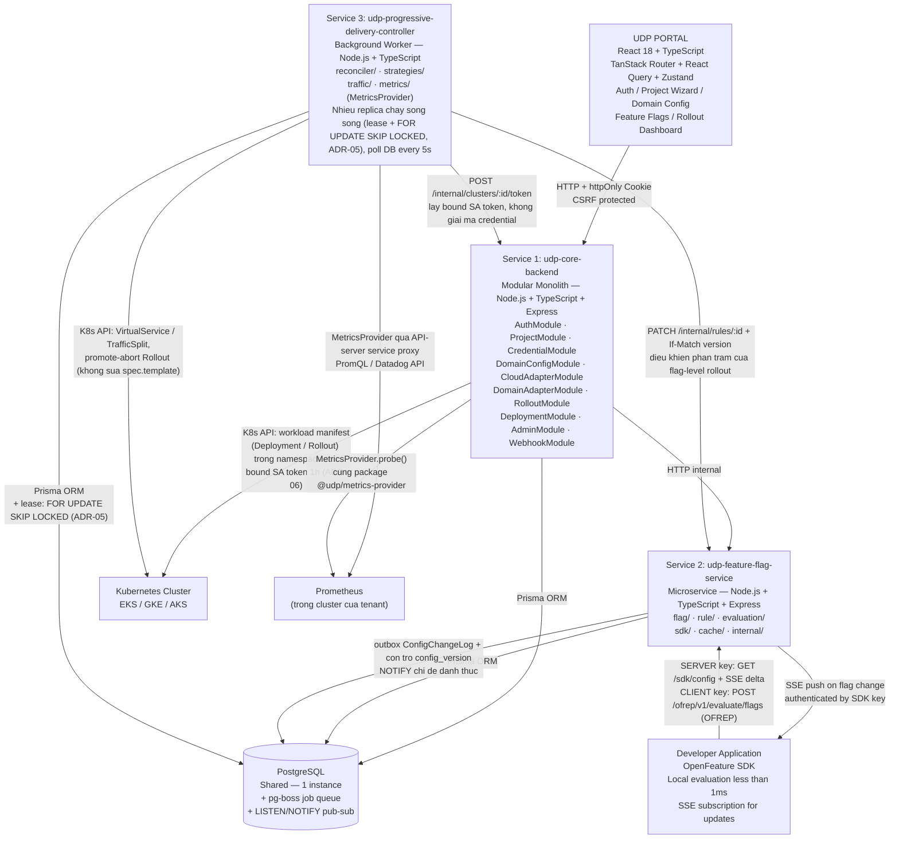

| Service                               | Pattern           | Stack                          | Vai trò                                                  |
| ------------------------------------- | ----------------- | ------------------------------ | -------------------------------------------------------- |
| `udp-core-backend`                    | Modular Monolith  | Node.js + TypeScript + Express | Orchestrator chính, FE chỉ giao tiếp với service này     |
| `udp-feature-flag-service`            | Microservice      | Node.js + TypeScript + Express | Quản lý flag, evaluate targeting rule, latency < 1ms     |
| `udp-progressive-delivery-controller` | Background Worker | Node.js + TypeScript           | Reconciliation loop, poll metrics, auto promote/rollback |

**Database dùng chung:** PostgreSQL (1 instance). Quy tắc writer (v4, làm rõ):

- Bảng **có UPDATE** có **đúng một service được quyền ghi**, hoặc chia theo cột như `RolloutSession`.
- Bảng **append-only** (`AuditLog`, `DeploymentEvent`, `ConfigChangeLog`) cho phép **nhiều service INSERT trực tiếp trong transaction của chính mình**. Lý do: v3 bắt Service 2 ghi audit "qua API của Service 1" — đó là dual-write: thay đổi flag thành công nhưng gọi API thất bại thì mất audit, hoặc gọi trước rồi transaction rollback thì audit sai. Đúng bài toán ADR-02 tránh. **[v4.1]** Append-only nghĩa là không ai SỬA hay XOÁ tuỳ ý; riêng `ConfigChangeLog` được dọn dòng quá 7 ngày (§2.2), và không role nào có `DELETE` trên nó — Service 2 dọn qua hàm `udp_prune_config_change_log` (`SECURITY DEFINER`, retention cố định trong hàm), nên quyền được cấp đúng bằng "xoá dòng quá hạn", không hơn.
- Quy tắc được **cưỡng chế bằng Postgres role** (`udp_s1`, `udp_s2`, `udp_s3`) với `GRANT` theo bảng và **column-level GRANT** cho `RolloutSession`. Mỗi service nối bằng **chuỗi kết nối riêng mang role của chính nó** (`DATABASE_URL_S1`…), và khẳng định `current_user` lúc khởi động rồi mới mở cổng — nếu không, chuỗi kết nối rơi về owner sẽ làm toàn bộ GRANT vô nghĩa mà không có gì báo. Quyền đăng nhập cấp bằng `pnpm db:service-login`, không nằm trong migration, để mật khẩu không vào lịch sử kho mã; bất biến I22 (§13.3) đọc `information_schema.role_table_grants` và so với ma trận dưới đây, thay vì chỉ "kiểm tra trong code review". **[v4.1]** I22 phủ cả **hàm `SECURITY DEFINER`**: hàm như vậy chạy bằng quyền của owner, nên một hàm quên `REVOKE ... FROM PUBLIC` là một đường ghi mà bảng quyền trên bảng không nhìn thấy — đã đo trên Supabase: hàm mới trong schema `public` mặc định cho cả `anon` EXECUTE qua `PUBLIC`.

| Bảng | Writer | Reader |
| ---- | ------ | ------ |
| `User`, `ProjectMember`, `Project`, `CloudCredential`, `DomainConfig`, `CapabilityBinding`, `CapabilityPreference`, `Environment` (trừ hai cột `config_version` và `config_hash`), `ProvisioningJob`, `ProvisionedResource`, `RefreshSession`, `IdempotencyKey` | Service 1 | S2 (`Project`, `Environment`), S3 (`Project`, `DomainConfig`, `CapabilityBinding`). S3 **không** đọc `CloudCredential`: quyền vào cluster được cấp qua endpoint nội bộ của S1 (ADR-06) |
| `Environment.config_version`, `FeatureFlag`, `FlagVariant`, `FlagEnvConfig`, `FlagTargetingRule`, `Segment`, `SdkKey`, `FlagEvaluationStat`, `ConfigChangeLog` | Service 2 | S1 (hiển thị), S3 (đọc rule đang rollout). **Một ngoại lệ có chủ đích:** để dùng làm kill-switch **chỉ** khi Service 2 không phản hồi (nhánh `DEPENDENCY_DOWN`, §7.6), S3 được cấp **đúng ba quyền hẹp**, không hơn: `UPDATE` mức cột trên `flag_targeting_rules.serve`, `UPDATE` mức cột trên `environments.config_version` và `config_hash`, và `INSERT` trên `config_change_log`. Ba quyền này là **tối thiểu để chạy được kỷ luật transaction của ADR-05** — thiếu quyền cấp version thì S3 ghi `serve` mà replica của S2 không bao giờ thấy, tức là kill-switch im lặng không có tác dụng. Không có ngoại lệ này thì hành động *an toàn* nhất của hệ thống lại phụ thuộc vào availability của một service khác. S3 vẫn phải theo đúng kỷ luật transaction của ADR-05 (khóa `Environment` trước, ghi outbox cuối) để replica của S2 lan truyền đúng khi hồi phục. Bất biến I30 |
| `RolloutSession` | **Chia theo cột**: S1 tạo hàng và ghi các cột cấu hình; S3 là writer duy nhất của `status`, `current_traffic_percentage`, `fail_reason`, `last_decision`, `last_step_at`, `claimed_by`, `claimed_until`, `version` | **[v4.1]** S2 **đọc đúng năm cột** — `id`, `targeting_rule_id`, `status`, `version`, `claimed_until` — để `PATCH /internal/rules/:id` kiểm lease (T12) và so fencing token (I23) trong **một** truy vấn. Chỉ SELECT. Bản trước định lưu thêm một `rollout_lock` trên rule; bỏ, vì `RolloutSession.version` đã **là** fencing token, và một bản sao trên rule sẽ ôi thiu đúng ở nhánh kill-switch §7.6 — S3 ghi thẳng `serve` mà không có quyền ghi cột đó |
| `RolloutEvent` | S1 ghi `is_intent = true`; S3 ghi `is_intent = false` | |
| `AuditLog`, `DeploymentEvent` | **Append-only, nhiều writer**: S1, S2, S3 đều INSERT trực tiếp | |

> **Quy ước ghi `RolloutSession` / `RolloutEvent`** (vá tranh chấp writer): Service 1 chỉ được **tạo** session và **ghi RolloutEvent mang `is_intent = true`** (ý định của người dùng). Service 3 là bên duy nhất được **cập nhật trạng thái** và ghi event thực thi. Manual override từ Portal không apply K8s trực tiếp mà chỉ ghi *intent event*; Service 3 nhìn thấy intent ở vòng reconcile kế tiếp (≤ 5s, hoặc tức thì qua `NOTIFY rollout_intent`) và là bên duy nhất điều khiển traffic. Nhờ vậy chỉ tồn tại **một writer duy nhất tới đối tượng điều khiển traffic**, loại bỏ race giữa S1 và S3.

> **Ai được chạm vào Kubernetes (v4, làm rõ ADR-01):** ba bên ghi vào cluster nhưng **không bao giờ cùng một loại đối tượng**. (1) Service 1 chỉ ghi *workload manifest* — `Deployment` hoặc `Rollout` (image tag, replicas, env var) — khi CI/CD webhook tới (§8.3), chỉ trong namespace của environment, và không bao giờ sửa `spec.strategy` hay trạng thái rollout. (2) Service 3 chỉ ghi *đối tượng điều khiển traffic* (`VirtualService`, `TrafficSplit`, canary annotation của Ingress) và chỉ gọi `promote` / `abort` / `retry` trên `Rollout` — không bao giờ sửa `spec.template`. (3) Domain adapter (chạy trong worker pg-boss của Service 1) ghi *tooling* — Helm release, operator CR — ở namespace hệ thống `udp-system` hoặc namespace env. Bất biến I5 và I25 (§13.3) kiểm ba tập đối tượng này rời nhau bằng cách đối chiếu audit log của API server.

### 1.3 Lý do chọn kiến trúc này

**Tại sao Modular Monolith cho Service 1:**

- Code tổ chức theo module độc lập (giống microservices về mặt thiết kế)
- Deploy chung 1 process — đơn giản hóa vận hành và triển khai cho nhóm phát triển nhỏ
- Dễ tách thành microservices thật sau này nếu cần scale
- Backstage (nền tảng tham chiếu chính) dùng cùng pattern này theo mặc định

**Tại sao tách Feature Flag Service thành service riêng:**

- App của developer gọi SDK hàng triệu lần/ngày → cần latency < 1ms per evaluation
- Nếu chung process với Cloud Adapter (tác vụ nặng như provision cluster), timeout 1 bên ảnh hưởng bên kia
- Cần scale độc lập khi lượng flag evaluation tăng

**Tại sao tách Progressive Delivery Controller thành worker riêng:**

- Cần chạy liên tục (reconciliation loop), không phải HTTP request/response cycle
- Poll metrics định kỳ, không phụ thuộc FE trigger
- Pattern Background Worker phù hợp hơn HTTP Server cho use case này

### 1.4 Các quyết định kiến trúc then chốt (ADR)

#### ADR-01 — Ai là control loop của Progressive Delivery?

**Vấn đề:** Flagger và Argo Rollouts *bản thân chúng* đã là control loop: chúng tự query metrics, tự quyết định promote/rollback, tự ghi đè trọng số traffic. Nếu Service 3 cũng làm đúng những việc đó trên cùng một `VirtualService`, hai controller sẽ ghi đè lẫn nhau mỗi vòng lặp — trọng số traffic dao động không xác định, và một rollback có thể bị controller kia promote ngược lại.

**Quyết định:** phân chia theo `rollout_scope`, **không bao giờ để hai control loop cùng điều khiển một tài nguyên**.

| `rollout_scope` | Ai quyết định | Ai chạm vào K8s | Vai trò của Flagger / Argo Rollouts |
| --------------- | ------------- | --------------- | ----------------------------------- |
| `SERVICE_LEVEL` (canary theo image version) | Tùy `controlMode` | Argo Rollouts / Flagger | Là *chủ sở hữu* việc thực thi routing. Service 3 **sinh CR**, **đọc status**, **mirror sang RolloutSession** để Portal hiển thị, và **gửi lệnh** promote/abort |
| `FLAG_LEVEL` (canary theo variant của feature flag) | **Service 3 (UDP)** | Service 3 → gọi Service 2 để đổi `percentage` của targeting rule | **Không tham gia.** Không có pod version mới nào để Flagger theo dõi — cùng một binary, khác nhánh flag. Đây là vùng công cụ hiện có không phủ được, và là đóng góp **C1** |

**Hai `controlMode` cho `SERVICE_LEVEL`:**

| `controlMode` | Cơ chế | Khi nào dùng |
| ------------- | ------ | ------------ |
| `tool-driven` (mặc định) | Argo Rollouts `AnalysisTemplate` / Flagger `Canary` tự phân tích và tự promote. Service 3 **read-only**: chỉ đọc `status.currentStepIndex`, `status.phase` để mirror vào `RolloutSession`. Manual override được chuyển tiếp qua Argo Rollouts API (`promote` / `abort`) | Người dùng đã quen công cụ chuẩn, muốn hành vi giống hệt production thực tế |
| `udp-driven` | Rollout CR được sinh với **`pause: {}` vô hạn ở mọi step** và **không có `analysis`**. Service 3 là bên duy nhất phân tích metrics và gọi `promote` từng bước | Khi cần thresholds/metrics tùy biến vượt ngoài `AnalysisTemplate`, hoặc khi so sánh đối chứng trong phần đánh giá §14 |

Bất biến bắt buộc: **`udp-driven` ⇒ CR không được chứa khối `analysis`; `tool-driven` ⇒ Service 3 không được gọi bất kỳ API ghi nào lên CR ngoài `promote`/`abort` do người dùng bấm.** Bất biến này được kiểm tra bằng test tích hợp (§13).

#### ADR-02 — Async job phải bền vững qua restart

**Vấn đề:** provisioning EKS/GKE/AKS mất 10–20 phút. Nếu `udp-core-backend` restart giữa chừng, job chạy trong bộ nhớ tiến trình sẽ biến mất: project kẹt vĩnh viễn ở `PROVISIONING`, và tài nguyên cloud đã tạo trở thành **orphan resource tiêu tiền của developer**.

**Quyết định:** dùng **pg-boss ≥ 12** (job queue chạy trên chính PostgreSQL đã có — không thêm hạ tầng mới) kết hợp ba bảng: `ProvisioningJob` lưu **state machine tường minh** có lease/fencing, `ProvisionedResource` là **sổ tài nguyên ghi trước khi gọi cloud**, và `pgboss.job` là cơ chế thực thi. Chi tiết ở §8.1 và §2.2.

**Vì sao không tự viết hàng đợi:** bảng `ProvisioningJob` đã mô hình hóa đủ trạng thái nghiệp vụ, nên thoạt nhìn pg-boss có vẻ thừa. Nhưng vì pg-boss chạy trên **chính database này**, việc đưa job vào hàng đợi và ghi bản ghi nghiệp vụ vẫn nằm gọn trong **một transaction** — không phát sinh bài toán ghi kép. Đổi lại, ta có sẵn backoff lũy thừa, dead-letter, singleton job, job hẹn giờ, archive và **heartbeat cho job dài** — những thứ tự viết sẽ tốn nhiều ngày và tự sinh lỗi.

> **Điều kiện về ORM (v4):** `boss.send()` chỉ chạy được trong cùng transaction với Prisma qua `fromPrisma(tx)` khi dùng **Prisma ≥ 7 với `@prisma/adapter-pg`** (driver adapter). Tech stack §1.5 cố định hai phiên bản này. Nếu vì lý do nào đó phải dùng Prisma cũ hơn, claim "một transaction" không còn đúng và phải chuyển sang outbox (`ProvisioningJob` là outbox, một relay đọc và gọi `boss.send()`).

**Năm điều kiện bắt buộc khi cấu hình pg-boss** (thiếu bất kỳ điều nào đều dẫn tới lỗi thật):

| # | Điều kiện | Hậu quả nếu bỏ qua |
| - | --------- | ------------------- |
| 1 | Chạy chế độ **polling** (mặc định của pg-boss; `useListenNotify` tắt), cấp cho pg-boss chuỗi kết nối **trực tiếp** `DATABASE_URL_DIRECT` | `useListenNotify` không chạy qua PgBouncer transaction mode; `migrate` / `supervise` của pg-boss gồm nhiều statement nên an toàn nhất là không đi qua pooler (ADR-05) |
| 2 | Job dài dùng **heartbeat của pg-boss**: `heartbeatSeconds` ≈ 300, worker gọi `touch()` mỗi 30 giây; **không** đặt `expireInSeconds` khổng lồ và **không viết reaper riêng** | pg-boss không thể hủy một Promise đang chạy trong Node, nên job "hết hạn" bị giao lại cho worker khác **trong khi worker đầu vẫn chạy** ⇒ hai cluster trên tài khoản BYOC. v3 có `stale-job-reaper.ts` tự viết chạy song song với cơ chế của pg-boss — hai reaper cạnh tranh có thể tạo hai job pg-boss cho một `ProvisioningJob`. v4 bỏ reaper; `ProvisioningJob.heartbeat_at` chỉ để hiển thị |
| 3 | Cấp **schema riêng** `pgboss`, khai báo để Prisma không báo drift | Lịch sử migration không còn phản ánh đầy đủ cấu trúc database; nâng cấp pg-boss kéo theo migration nội bộ ngoài tầm kiểm soát |
| 4 | Viết **job đối soát** giữa `pgboss.job` và `ProvisioningJob` | pg-boss đánh dấu `failed` sau khi hết lượt retry trong khi `ProvisioningJob.state` vẫn là `CLUSTER`, khiến Portal hiển thị "đang tạo cluster" vĩnh viễn. Quy ước: **`ProvisioningJob` là nguồn sự thật nghiệp vụ**, pg-boss chỉ là cơ chế thực thi |
| 5 | **Lease + fencing trên chính `ProvisioningJob`** (`claimed_by`, `claimed_until`, `version`; mọi UPDATE đều `WHERE version = $expected`) và **sổ tài nguyên ghi trước khi gọi cloud** (`ProvisionedResource` với `idempotency_key UNIQUE`, `status = CREATING`, cập nhật `provider_id` sau khi API trả về) | Worker A mất kết nối database 5 phút nhưng **vẫn gọi được AWS**; pg-boss giao job cho B; A tỉnh lại ghi đè cả mảng `created_resources` (JSONB) và tạo tiếp tài nguyên. `idempotencyKey` chỉ cứu được API có token (EKS `clientRequestToken` có; EC2 `CreateVpc` / `CreateSubnet` không có), nên khi resume adapter phải **tra cứu theo tag `udp.*` + `idempotency_key` trước khi tạo**. Sổ ghi trước cũng đóng lỗ hổng "API cloud thành công nhưng process chết trước khi ghi sổ" của v3 |

> Ràng buộc tương tự cũng áp dụng cho số đếm retry: pg-boss có `retryLimit` riêng, `ProvisioningJob.attempt` chỉ để hiển thị và đối soát — không dùng làm điều kiện dừng.

#### ADR-03 — Ranh giới tin cậy của SDK endpoint và hai chế độ đánh giá

**Vấn đề:** `projectId` là UUID xuất hiện trong URL Portal và trong file config app của developer — nó **không phải bí mật**. Nếu `/sdk/flags?projectId=...` chỉ dựa vào nó thì bất kỳ ai biết projectId đều đọc được toàn bộ rule targeting, bao gồm **danh sách userId thật** (dữ liệu cá nhân).

v3 giải bằng SDK key gắn `(project, environment)`, và với key dùng ở trình duyệt thì gửi rule "đã lược PII" (hash userId, bỏ rule `sensitive`). Rà soát lại cho thấy cách đó **vẫn rò và còn sai kết quả**: (a) SDK phải có salt để hash `targetingKey`, nên salt là public và userId dạng email hay số tuần tự bị dictionary attack tầm thường; (b) rule `SEGMENT` rơi vào nhánh mặc định và đi nguyên xuống trình duyệt; (c) delta qua SSE không được lược; (d) bỏ rule `sensitive` không chỉ làm "kết quả có thể khác" mà **đổi rule nào khớp tiếp theo** — rule chặn `off` cho tài khoản nội bộ bị bỏ thì nhóm đó nhận `on`. LaunchDarkly, Unleash Edge / Frontend API và flagd web provider đều **không gửi rule cho client SDK**, chỉ gửi kết quả đã đánh giá.

**Quyết định:** mọi endpoint SDK yêu cầu **SDK key** gắn với một cặp `(project, environment)`; project và environment **suy ra từ key**, không từ tham số. Hai loại key ứng với **hai chế độ đánh giá**:

| Loại key | Chế độ | Endpoint | Rule rời khỏi server? |
| -------- | ------ | -------- | --------------------- |
| `SERVER` | **Local evaluation**: tải toàn bộ rule của environment, cache in-process, nhận delta qua SSE, đánh giá tại chỗ < 1ms, fail-static khi mất kết nối | `GET /sdk/config`, `GET /sdk/stream` | Có — chỉ backend của developer mới có key này |
| `CLIENT` | **Remote evaluation theo OFREP** (OpenFeature Remote Evaluation Protocol): SDK gửi evaluation context, Service 2 chạy **cùng evaluator** với SERVER và trả về `ResolutionDetails` đã đánh giá cho từng flag; SSE chỉ báo "cấu hình đã đổi, gọi lại" | `POST /ofrep/v1/evaluate/flags` (bulk), `POST /ofrep/v1/evaluate/flags/{key}`, `GET /sdk/stream?mode=notify` | **Không bao giờ** |

Hệ quả: một evaluator, một kết quả cho cả hai loại key (không còn "kết quả phía trình duyệt có thể khác phía server"); bất biến I11 trở thành "payload cho CLIENT key không chứa **bất kỳ** rule nào"; provider web của UDP tương thích với mọi OFREP client có sẵn của OpenFeature; và trình duyệt không cần giữ SSE với header `Authorization` (thứ `EventSource` không làm được). Rate limit của CLIENT key tính theo `(key, IP)` và có cache kết quả theo `(configVersion, hash(context))`. Chi tiết ở §6.2 và §12.

#### ADR-04 — Environment là công dân hạng nhất

**Vấn đề:** cùng một flag key phải có giá trị khác nhau ở `dev` và `prod` — đây là yêu cầu tối thiểu của mọi hệ feature flag dùng được trong thực tế. Thiết kế v2.0 gắn flag thẳng vào Project nên không biểu diễn được điều này, và việc bổ sung sau sẽ kéo theo migration phá vỡ dữ liệu.

**Quyết định:** tách `FeatureFlag` (định nghĩa: key, type, variants — dùng chung toàn project) khỏi `FlagEnvConfig` (trạng thái bật/tắt, default variant, rule — riêng từng environment). SDK key gắn environment, nên SDK chỉ nhìn thấy cấu hình của đúng environment của nó.

#### ADR-05 — Đúng nhờ trạng thái bền vững, nhanh nhờ tín hiệu

**Vấn đề:** ba quyết định trước đó biến `LISTEN/NOTIFY` và `pg_advisory_lock` thành **điều kiện cần cho tính đúng đắn** — mất chúng thì hệ thống sai chứ không phải chậm. Điều này tạo ra một ràng buộc triển khai nghiêm trọng và khó thấy: cả hai tính năng **ngừng hoạt động khi đi qua connection pooler ở chế độ transaction**, vốn là mặc định của hầu hết Postgres managed và serverless (Supabase cổng 6543, endpoint pooled của Neon).

| Cơ chế | Vì sao vỡ sau pooler transaction mode |
| ------ | -------------------------------------- |
| `LISTEN` | Đăng ký gắn với **một backend cụ thể**. Sau mỗi transaction, kết nối trả về pool và đăng ký mất. PgBouncer chặn thẳng lệnh này ở chế độ transaction |
| `pg_advisory_lock` | Khóa gắn với **session**. Kết nối về pool nhưng khóa vẫn giữ; lệnh `unlock` sau đó đi vào backend khác ⇒ khóa kẹt vĩnh viễn, đồng thời backend cũ mang theo khóa sang phục vụ client khác |
| Serverless autosuspend | Kết nối `LISTEN` bản chất là im lặng, bị nhà cung cấp coi là nhàn rỗi và cắt sau vài phút |

**Quyết định:** đảo ngược quan hệ phụ thuộc. Hệ thống **đúng nhờ dữ liệu trong bảng**; `NOTIFY` chỉ là **bộ tăng tốc tùy chọn**. Mất nó thì độ trễ tăng từ vài chục mili-giây lên tối đa một chu kỳ poll (500ms), không sai kết quả. **[v4.1]** Đo trên Supabase: `NOTIFY` tới listener sau ~150–190ms.

> Nguyên tắc: *đúng nhờ trạng thái bền vững, nhanh nhờ tín hiệu tức thời — không bao giờ đúng **nhờ** tín hiệu.*

Ba thay đổi cụ thể, tất cả đều là SQL chuẩn chạy được qua mọi pooler:

**(a) Khóa phân tán → cơ chế lease.** Thay `pg_advisory_lock` bằng giành quyền trên chính hàng dữ liệu:

```sql
UPDATE rollout_sessions
SET claimed_by    = $workerId,
    claimed_until = now() + interval '60 seconds',
    version       = version + 1
WHERE id = (
  SELECT id FROM rollout_sessions
  WHERE status IN ('PENDING','IN_PROGRESS')
    AND (claimed_until IS NULL OR claimed_until < now())
  ORDER BY updated_at ASC
  FOR UPDATE SKIP LOCKED   -- khóa mức hàng, an toàn qua mọi pooler
  LIMIT 1
)
RETURNING *;
```

| So với advisory lock | |
| -------------------- | - |
| Chạy qua pooler | Gỡ bỏ ràng buộc triển khai |
| Worker chết đột ngột | Lease tự hết hạn theo lịch định trước; advisory lock chỉ nhả khi kết nối TCP thật sự đóng, có thể mất vài phút với kết nối treo |
| Quan sát được | `SELECT claimed_by, claimed_until` cho biết ai đang giữ gì; advisory lock gần như vô hình |
| Không giữ kết nối lâu | Transaction chỉ vài mili-giây, dù công việc kéo dài hàng phút |

**(b) Lan truyền thay đổi flag → ba tầng có tự kiểm, con trỏ theo `config_version`.**

```
Tầng 1 — config_version + snapshot     NGUỒN SỰ THẬT. Luôn bật. Không thể sai.
Tầng 2 — delta theo config_version     ĐƯỜNG NHANH. Yêu cầu LIÊN TỤC (n, n+1, n+2…).
Tầng 3 — NOTIFY                        ĐÁNH THỨC vòng poll. Không mang dữ liệu.
```

**Vì sao con trỏ là `config_version`, không phải `BIGSERIAL` và cũng không phải `xid8` (v4 sửa v3.2):**

- `BIGSERIAL` phản ánh thứ tự *bắt đầu* transaction: dòng id nhỏ có thể commit **sau** dòng id lớn, replica đặt con trỏ ở id lớn sẽ bỏ sót vĩnh viễn dòng id nhỏ. Đây là bẫy thật.
- v3.2 giải bằng `xid8` + `pg_snapshot_xmin(pg_current_snapshot())`. Cơ chế đó **đúng về mặt PostgreSQL** nhưng giải một bài toán không tồn tại trong thiết kế này, và còn có lỗi thứ tự: `xid` được cấp lúc transaction ghi dòng đầu tiên, còn `config_version` được cấp lúc lấy row-lock hàng `Environment`. T1 (xid 100) có thể nhận version 48 và T2 (xid 101) nhận version 47; replica `ORDER BY xid` áp 48 rồi 47, và nếu đối chiếu bằng `max(version)` thì "checksum" vẫn khớp trong khi trạng thái sai. `config_version` là **số đếm**, không phải hash nội dung, nên nó không phải checksum.
- **Điểm mấu chốt:** `config_version` được cấp **dưới row-lock của hàng `Environment` và lock được giữ tới commit**. Version n+1 chỉ có thể được cấp *sau khi* transaction mang version n đã commit. Do đó **thứ tự nhìn thấy trùng thứ tự version**, và không tồn tại "hổng vĩnh viễn": một replica đã thấy n+1 chắc chắn thấy được n. Con trỏ theo `config_version` là đủ, đúng, và đơn giản hơn: không cần kiểu `xid8` (Prisma không hỗ trợ), không cần `$queryRaw`, không cần quy tắc "horizon đứng yên 30 giây", không bị transaction dài của pg-boss hay provisioning chặn đường nhanh.

```sql
-- Mọi transaction đổi cấu hình flag trong một environment, THEO ĐÚNG THỨ TỰ NÀY:
BEGIN;
-- 1. Khóa hàng Environment ĐẦU TIÊN — tuần tự hóa mọi thay đổi của env, chống deadlock,
--    và là nơi cấp config_version.
UPDATE environments SET config_version = config_version + 1
WHERE id = $envId RETURNING config_version;            -- ⇒ v
-- 2. Thay đổi thật (rule, env-config, variant, segment...)
UPDATE flag_targeting_rules ...;
-- 3. Ghi outbox CUỐI CÙNG, mang đúng v
INSERT INTO config_change_log (environment_id, config_version, change_type, payload)
VALUES ($envId, v, 'rule.replaced', $delta);
COMMIT;

-- Replica đọc delta: chỉ lấy phần liên tục ngay sau con trỏ
SELECT * FROM config_change_log
WHERE environment_id = $1 AND config_version > $last
ORDER BY config_version;
-- Áp từng dòng, yêu cầu row.config_version == last + 1; gặp hổng ⇒ dừng, lấy snapshot.
```

> v3.2 có hai quy tắc loại trừ nhau: "UPDATE `config_version` luôn là thao tác **cuối cùng**" và "dòng outbox mang `config_version` **sau** thay đổi". Muốn ghi version vào outbox thì phải biết giá trị sau khi tăng, nên UPDATE phải đứng **trước**. Quy tắc thật là: **khóa hàng `Environment` đầu tiên, ghi outbox cuối cùng.**

**Tầng 1 là bộ kiểm chứng của tầng 2 — theo nghĩa đúng:** replica áp xong một lô delta thì con trỏ của nó bằng version cuối cùng đã áp. Định kỳ (500ms) nó đọc `Environment.config_version` thật:

```
Con trỏ = 47, version thật = 47   ✓ khớp   → dùng cache
Con trỏ = 47, version thật = 49   → còn delta chưa đọc → đọc tiếp tầng 2
Con trỏ = 47, dòng kế tiếp = 49   ✗ hổng   → dòng 48 đã bị dọn hoặc mất → snapshot
Con trỏ = 47, version thật = 45   ✗ lùi    → environment bị restore/reset → snapshot
```

Hệ quả quan trọng: **tầng 2 không thể làm hỏng trạng thái.** Dòng bị dọn, replica offline quá lâu, bug trong logic áp delta — tất cả biểu hiện thành *hổng* hoặc *lệch*, và hệ thống tự sửa ở vòng poll kế tiếp. Ngoài ra, mỗi 60 giây replica tính `sha256(snapshot đã chuẩn hóa)` và so với `Environment.config_hash` (S2 cập nhật trong cùng transaction) — đây mới là **checksum nội dung**, bắt được cả lỗi áp delta sai nội dung nhưng đúng số.

**Quy tắc rơi tầng — không nhánh nào dẫn tới trạng thái sai:**

| Tình huống | Hành động |
| ---------- | --------- |
| Hổng trong chuỗi `config_version` | Lấy snapshot, đặt con trỏ = version của snapshot |
| Version thật lùi | Lấy snapshot |
| `config_hash` lệch sau khi áp delta | Lấy snapshot, tăng `changefeed_hash_mismatch_total`, ghi cảnh báo (đây là bug) |
| Rơi về snapshot 3 lần liên tiếp | **Ngắt mạch**: tắt tầng 2 cho environment đó 5 phút, tăng `changefeed_fallback_total` |
| `NOTIFY` không khả dụng (pooler, autosuspend) | Mất đường đánh thức; poll 500ms vẫn chạy |

Xấu nhất là chậm hơn và tốn băng thông hơn — không bao giờ sai.

**Ba biện pháp bắt buộc đi kèm:**

| Biện pháp | Vì sao bắt buộc |
| --------- | --------------- |
| **Cache snapshot** theo `(environmentId, keyType)` trong bộ nhớ flag-service, xóa khi version tăng | Không có nó, 500 SDK cùng phát hiện thay đổi trong cửa sổ 500ms sẽ tạo 500 truy vấn; có nó thì đúng **một** truy vấn |
| **Jitter 0–200ms** vào chu kỳ poll | Các instance không đồng pha, tránh đột biến tải |
| **Thứ tự khóa cố định**: `UPDATE environments ... RETURNING config_version` là thao tác **đầu tiên** của mọi transaction đổi flag; outbox ghi **cuối cùng** | Mọi thay đổi flag đều chạm hàng này. Khóa nó đầu tiên biến nó thành điểm tuần tự hóa duy nhất — không thể deadlock giữa hai transaction cùng environment |

**Kênh NOTIFY cần driver riêng:** Prisma không có API nhận notification. Service nào nghe (Service 2 hôm nay, Service 3 khi có) giữ **một kết nối `pg` riêng, session-pinned, bằng CHÍNH role của nó** — với S2 là `DATABASE_URL_S2_DIRECT` (role `udp_s2`, cổng session) — chỉ để `LISTEN`; mất kết nối này thì poll 500ms vẫn chạy. **[v4.1]** Không dùng `DATABASE_URL_DIRECT`: chuỗi đó là owner, đưa vào runtime của một service là bỏ ranh giới quyền của §1.2; đã đo `udp_s2` LISTEN được qua cổng 5432 (nhận sau ~150ms) và không nhận gì qua 6543. Phía phát: `NOTIFY` chạy **TRONG** transaction ghi, ngay sau bước 4 — PostgreSQL chỉ giao notification khi commit, nên transaction rollback không đánh thức ai (đã đo); kênh `flag_changed`, payload `{"environmentId", "configVersion"}`, dựng và đọc bằng một cặp hàm của `@udp/shared-types`.

**Chuyển chế độ để đo đối chứng:** biến môi trường `CHANGEFEED_MODE=snapshot|delta` cho phép bật/tắt tầng 2 mà không sửa code, phục vụ phép đo E4 (§14) — so sánh độ trễ lan truyền, băng thông và tải database giữa hai chế độ trên cùng một hệ thống.

**(c) pg-boss vẫn giữ**, nhưng chạy ở chế độ polling theo điều kiện 1 của ADR-02.

**Nhược điểm phải chấp nhận — ghi lại để trả lời được khi phản biện:**

| # | Nhược điểm | Cách kiểm soát |
| - | ---------- | -------------- |
| 1 | **Mọi thay đổi trong một environment tuần tự hóa qua một hàng** — hai người sửa hai flag khác nhau của cùng env vẫn xếp hàng trên row-lock `Environment` | Transaction chỉ vài mili-giây; đây chính là thứ cho ta thứ tự version = thứ tự commit (I15b). Đo ở I20: 50 transaction đồng thời không deadlock, `config_version` tăng đúng 50 |
| 2 | **Lease chuyển gánh nặng đúng đắn sang kỷ luật lập trình** — worker bị GC pause quá lease, worker khác nhận việc, worker cũ tỉnh dậy và cũng ghi | `version` đóng vai trò fencing token; **mọi** đường ghi phải kiểm version trước, **kể cả side effect ra ngoài** (PATCH sang Service 2 mang `If-Match`, promote Argo chỉ sau khi đọc `status.currentStepIndex`). Bất biến I17, I23 |
| 3 | **Polling không bao giờ về 0** — 3 replica × 500ms ≈ 6 truy vấn/giây chạy suốt, kể cả khi hệ thống nhàn rỗi | Truy vấn có index và thường trả về rỗng nên chi phí không đáng kể; nhưng khiến database không bao giờ ngủ. Chu kỳ poll thích ứng (giãn tới 5s khi không có thay đổi) ở §17 |
| 4 | **`ConfigChangeLog` cần được dọn** — replica offline lâu hơn thời gian giữ (7 ngày) sẽ thấy hổng | Hổng ⇒ snapshot. Bất biến I18 |
| 5 | **Độ trễ nền cao hơn** — từ ~150ms (đo trên Supabase) lên tối đa 500ms khi không có `NOTIFY` | Giữ `NOTIFY` làm bộ tăng tốc ở môi trường đo; báo cáo **cả hai** con số ở E4 kèm giải thích |
| 6 | **Thêm cơ chế phải kiểm thử** | Bất biến I15a/I15b/I15c và I16–I21 (§13.3) |
| 7 | **`config_hash` tính trên snapshot chuẩn hóa tốn CPU** ở environment có hàng nghìn flag | Chỉ tính mỗi 60 giây và chỉ khi tầng 2 đang bật; đo ở E9 |
| 8 | **Bão snapshot** — nhiều SDK cùng phát hiện version lệch và cùng lấy snapshot | Cache theo `(environmentId, keyType)` + jitter. Còn lại đột biến ở lần đầu sau khi flag-service restart |
| 9 | **Cần thêm chuỗi kết nối session** (`DATABASE_URL_DIRECT` của owner cho pg-boss và migration; `DATABASE_URL_S2_DIRECT` của `udp_s2` cho `LISTEN`) | Ghi ở §15.3; hệ thống vẫn đúng nếu chỉ có chuỗi qua pooler — đặt `CHANGEFEED_NOTIFY_ENABLED=false`, chỉ mất `NOTIFY` |
| 10 | **[v4.1] Commit của mọi transaction có `NOTIFY` xếp hàng qua một khoá toàn cục** — `PreCommit_Notify` (`async.c`) lấy `LockSharedObject(DatabaseRelationId, …, AccessExclusiveLock)` và giữ tới sau commit, để hàng đợi notification đúng thứ tự commit | Chỉ phát `NOTIFY` khi `CHANGEFEED_NOTIFY_ENABLED` bật — cấu hình "không NOTIFY" của E4 vì thế không trả giá này; chi phí đo ở E9 |

**Lợi ích còn lại sau khi trừ đi nhược điểm:** hệ thống triển khai được ở mọi nhà cung cấp, replay được sự kiện sau khi replica restart (điều mà Redis Pub/Sub cũng không có), và cả ba cơ chế đều nằm sau interface — nếu E9 đo ra rằng polling không đủ ở quy mô mục tiêu, việc thay bằng Redis Streams chỉ động vào một file, với số liệu làm căn cứ.

#### ADR-06 — Kết nối control plane với cluster của tenant [NEW v4]

**Vấn đề:** Service 1 (deploy workload, chạy domain adapter), Service 3 (điều khiển traffic, đọc trạng thái Rollout) và `MetricsProvider` (truy vấn Prometheus) đều phải chạm vào một cluster **nằm trong tài khoản cloud và VPC của tenant**. v3 không nói S1/S3 lấy quyền vào cluster bằng cách nào, và không nói làm sao Service 3 ở ngoài cluster gọi được `http://prometheus.udp-proj-dev:9090` vốn chỉ resolve được bên trong. Không giải quyết điểm này thì toàn bộ §7 và §8 không triển khai được thật.

**Quyết định:** hai chế độ, **`direct` là mặc định**, `agent` cho cluster private.

| | `direct` (mặc định) | `agent` (cluster không có API endpoint public) |
| - | ------------------- | ---------------------------------------------- |
| Đường vào cluster | API server có **public endpoint** nhưng giới hạn `authorizedNetworks` / `publicAccessCidrs` / `apiServerAccessProfile` về **địa chỉ egress của UDP**; TLS bằng CA của cluster lưu trong `Project.metadata` | `udp-agent` (Deployment trong `udp-system`) mở **kết nối gRPC ra ngoài** tới Service 1, giữ stream; control plane gửi lệnh qua stream, agent thực thi bằng ServiceAccount nội bộ |
| Xác thực | Không lưu kubeconfig dài hạn. Lúc provision, Cloud Adapter tạo namespace `udp-system` và **ba** ServiceAccount có ClusterRole rời nhau — `udp-workload` (S1), `udp-traffic` (S3), `udp-tooling` (domain adapter) — chi tiết ở §12.2. Ba SA chứ không phải một là điều kiện để **API server** cưỡng chế bất biến I25, thay vì trông vào kỷ luật lập trình. Khi cần, S1 dùng credential cloud (đã giải mã) lấy **token cloud ngắn hạn** (EKS: STS presigned `GetCallerIdentity`; GKE: OAuth access token; AKS: AAD token) rồi gọi **TokenRequest** lấy **bound SA token 1 giờ** cho đúng SA mà bên gọi được phép dùng | Agent xác thực với S1 bằng token cấp lúc cài (xoay vòng), S1 xác minh `(projectId, clusterId)` |
| Service 3 lấy quyền | **Không giải mã credential.** Gọi `POST /internal/clusters/:clusterId/token` của S1 (xác thực nội bộ §12), nhận `{ apiEndpoint, caData, token, expiresAt }` sống 1 giờ, cache và xin lại trước hạn | Gửi lệnh qua S1 |
| Prometheus trong cluster | **API-server service proxy**: `GET /api/v1/namespaces/{ns}/services/http:prometheus-server:9090/proxy/api/v1/query?query=...`. Không cần ingress, không phơi Prometheus ra Internet; RBAC chỉ cho `services/proxy` trên đúng service đó | Agent proxy tới ClusterIP |
| Datadog / SaaS | Gọi thẳng API SaaS bằng key trong `tool_config` (đã mã hóa như §4.3), qua **egress guard** chống SSRF (§12) | như trái |

**Lý do chọn `direct` làm mặc định:** không thêm thành phần chạy trong cluster của khách, không thêm bề mặt tấn công mới, và mọi truy cập đều đi qua RBAC + audit log của chính API server (I25 đối chiếu audit log này). Cái giá là API endpoint phải public (có allowlist) — chấp nhận được với EKS/GKE/AKS mặc định. `agent` được thiết kế đủ để bật cho tenant yêu cầu private cluster; luồng nghiệp vụ không đổi vì cả hai chế độ nằm sau cùng một interface `ClusterAccess` (§3.1).

**Bất biến:** (I24) không có kubeconfig hay SA token nào sống quá 1 giờ được ghi xuống database hay đĩa; (I25) mỗi service chỉ chạm loại đối tượng K8s được phân công ở §1.2.

#### ADR-07 — Engine provisioning: SDK cloud trực tiếp hay Pulumi / Terraform / Crossplane [NEW v4]

**Vấn đề:** provisioning một cluster EKS gồm 12–15 loại tài nguyên có thứ tự (VPC, subnet, route table, IGW, NAT, security group, IAM role cho control plane và node, cluster, OIDC provider, node group, add-on CNI/CoreDNS/kube-proxy/EBS CSI, kubeconfig), mỗi bước phải poll. Pulumi Automation API (TypeScript native) hay Terraform đã có sẵn state, preview, destroy; Crossplane có provider cho cả ba cloud. v3 chọn gọi SDK trực tiếp mà không biện minh.

**Quyết định:** **giữ SDK trực tiếp** cho Cloud Adapter, nhưng cấu trúc mỗi adapter thành một **danh sách `ResourceStep` có thứ tự**, mỗi step khai báo `{ kind, idempotencyKey, lookup(tags), create(), waitReady(), delete() }`; `CloudAdapterRunner` chung chạy các step, ghi `ProvisionedResource` trước mỗi `create()`, và chạy `delete()` theo thứ tự ngược khi compensation. Lý do:

| Lựa chọn | Vì sao không (hoặc chưa) |
| -------- | ------------------------ |
| Pulumi Automation API | Rất phù hợp về ngôn ngữ, nhưng kéo theo state backend riêng (thêm nơi phải bảo mật), binary `pulumi` trong image, và quan trọng nhất: **C3 muốn đo effort viết adapter** — nếu adapter chỉ là 50 dòng gọi Pulumi thì E1 đo Pulumi chứ không đo khung của UDP |
| Terraform / OpenTofu | Cần `terraform` binary, state, HCL sinh động; không type-safe với phần còn lại của TypeScript |
| Crossplane | Cần một cluster quản lý *trước* để chạy Crossplane — đúng cái ta đang cố tạo (chicken-and-egg cho BYOC); Crossplane vẫn là một tool trong domain Infrastructure |

**Hệ quả:** (1) Cloud Adapter là phần tốn công nhất của khóa luận, và §14 E1 báo cáo LOC của từng step; (2) `ResourceStep` là ranh giới để thay engine sau này — một `PulumiCloudAdapter` cài cùng interface `CloudAdapter` là hướng mở ở §17, và nếu E1 cho thấy effort quá lớn thì đó là số liệu để đổi quyết định; (3) sổ tài nguyên phải liệt kê **đủ** các `kind` (§4.2), gồm cả tài nguyên do Kubernetes tạo ra (ELB/ENI của Service `LoadBalancer`, EBS của PVC) mà adapter không tạo trực tiếp nhưng phải dọn.

#### ADR-08 — Trạng thái của adapter sống ở đâu [NEW v4 — nền tảng của C3]

**Vấn đề:** ADR-07 chọn gọi SDK cloud trực tiếp và cấu trúc thành `ResourceStep`. Nhưng câu hỏi khó hơn chưa được trả lời: **sau khi tiến trình chết giữa chừng, ta biết đã tạo được những gì bằng cách nào?** Mọi công cụ IaC đều trả lời bằng một hiện vật do chính nó sở hữu và duy trì:

| Công cụ | Nơi giữ trạng thái | Hỏng thế nào |
| ------- | ------------------ | ------------- |
| Terraform / OpenTofu | **State file** trên S3 hoặc backend, có lock riêng | Tranh chấp lock; crash giữa `apply` và lúc ghi state để lại **state drift** phải `import` bằng tay; state chứa secret nên là một kho bí mật nữa phải bảo vệ |
| Pulumi | State backend (dịch vụ Pulumi hoặc self-hosted) | Như trên, cộng phụ thuộc một dịch vụ ngoài |
| Crossplane | CR trong **etcd** của cluster quản lý | Cần một cluster có sẵn *trước* — chicken-and-egg với BYOC (ADR-07) |
| Helm | Release state trong **Secret** của namespace | Ai đó `kubectl edit` tài nguyên thì Helm không biết cho tới lần `diff` kế tiếp |

Cả bốn đều giả định **ta sở hữu state**. Giả định đó vỡ ở đúng bối cảnh của UDP, theo bốn cách:

1. **Provision vào tài khoản của người khác.** Khách có toàn quyền và có thể xóa hoặc sửa tài nguyên ngoài luồng. State của ta lập tức nói dối.
2. **Không giữ được lock xuyên suốt.** Một lần provision mất 10 tới 20 phút. Giữ lock cả quãng đó qua một tiến trình có thể bị OOM-kill là một lời hứa không giữ được.
3. **Một state file cho mỗi tenant.** Với N project là N hiện vật phải mã hóa, sao lưu, xoay khóa và dọn. Đây là bề mặt tấn công và bề mặt vận hành mà mô hình BYOC không đáng phải trả.
4. **Một phần tài nguyên do Kubernetes sinh ra.** `Service` kiểu `LoadBalancer` tạo ELB và ENI; `PersistentVolumeClaim` tạo EBS. **Không state file nào biết chúng tồn tại**, nhưng chúng giữ tham chiếu tới VPC và làm `DeleteVpc` thất bại vĩnh viễn — tài nguyên tiếp tục tính tiền trong tài khoản của khách.

**Quyết định: đảo nguồn sự thật. Sự thật nằm ở nơi nó vốn đã ở đó.**

| Trục | Nguồn sự thật | Vai trò của sổ sách UDP |
| ---- | ------------- | ----------------------- |
| **Cloud Adapter** | **Tag `udp.*` trên chính tài nguyên** trong tài khoản cloud. `lookup(tags + idempotency_key)` chạy **trước mọi** `create()` | `ProvisionedResource` là *gợi ý về thứ tự* để chạy compensation ngược, và là nơi ghi ý định trước khi hành động. Nó **không** được tin khi lệch với cloud |
| **Domain Adapter** | **Trạng thái thật trên cluster**: Helm release, spec của CR, kết quả `healthcheck()`. `detectDrift()` đối chiếu với nó | `DomainConfig.adapter_version` và `CapabilityBinding` là *cache có thể dựng lại*, không phải nguồn sự thật |

**Ba quy tắc làm cho việc đảo này đúng chứ không chỉ là khẩu hiệu:**

| # | Quy tắc | Chặn được điểm crash nào |
| - | ------- | ------------------------- |
| 1 | **Ghi sổ trước lời gọi** với `status = CREATING`, cập nhật `provider_id` sau khi API trả về | Crash **giữa** lời gọi và lúc ghi sổ. Không có quy tắc này thì API cloud thành công nhưng ta không có bằng chứng nào là mình đã gọi |
| 2 | **`lookup()` bắt buộc trước `create()`**, tra theo tag chứ không theo sổ | Crash **sau** khi tài nguyên đã tạo nhưng trước khi ghi `provider_id`. Cũng là cách duy nhất an toàn với API **không có** idempotency token (`CreateVpc` và `CreateSubnet` không có; EKS `clientRequestToken` thì có) |
| 3 | **Compensation đọc sổ, chạy `delete()` ngược, và đánh `ORPHAN_SUSPECTED` cho thứ không xóa được** | Crash trong lúc dọn. Nuốt lỗi ở đây nghĩa là tiền tiếp tục chảy mà không ai biết |

#### Trả lời phản biện sắc nhất: "sổ của bạn khác state file chỗ nào?"

Đây là câu hỏi phải chuẩn bị sẵn, vì nhìn bề ngoài `ProvisionedResource` **giống hệt** một state file: cũng ghi, cũng đọc, cũng dùng để compensation. Tranh luận về nghĩa của chữ "state" thì không thắng được. Câu trả lời là **một mệnh đề bác bỏ được**:

> **Xóa sạch bảng `ProvisionedResource` giữa lúc đang provisioning, hệ thống vẫn hội tụ đúng. Xóa state file của Terraform, nó mù.**

Mệnh đề đó đúng **theo cấu trúc**, không nhờ may mắn, vì tag `udp.key` chứa sẵn khóa của hàng trong sổ:

| Cột trong sổ | Khôi phục từ đâu khi mất sạch sổ |
| ------------ | -------------------------------- |
| `project_id`, `step`, `kind`, `idempotency_key` | Tag `udp.key` = `{projectId}:{step}:{kind}:{name}` |
| `provider_id` | Chính id của tài nguyên quét được |
| `region` | Nơi quét ra nó |
| `status` | Tồn tại trên cloud nghĩa là `CREATED` trở lên |
| **Thứ tự compensation** | **Không nằm trong sổ.** Nó đến từ `networkSteps()` và `clusterSteps()` khai trong code adapter |
| `job_id` | **Không khôi phục được** — và đây là phần trung thực phải nói: đó là dữ liệu lịch sử "job nào đã tạo tài nguyên nào", không tham gia vào tính đúng đắn |

**Ba điểm để nói gọn khi bảo vệ:**

1. **Sổ là cache dựng lại được, state file là nguồn sự thật không dựng lại được.** Terraform state giữ ánh xạ giữa cấu hình và thực tại cùng đồ thị phụ thuộc; cả hai chỉ tồn tại trong file đó. Sổ của UDP không giữ gì mà cloud không giữ.
2. **Mệnh đề này là một hàm chạy được, không phải một lập luận:** `rebuildLedgerFromCloud()` ở §4.2. Nếu nó sai thì C3 sai, và điều đó kiểm được.
3. **Và là một ô trong bảng kết quả:** điểm crash **K10** ở §4.5, đo đối chứng trực tiếp với Terraform và Pulumi ở **E15**. Phản biện được chuyển từ tranh luận sang số liệu.

> **Thứ duy nhất sổ giữ mà cloud không giữ** là *ý định chưa thực thi*: hàng ở `CREATING` mà lời gọi cloud chưa bao giờ xảy ra. Mất nó **an toàn** — `lookup()` không tìm thấy gì nên bước đó chạy lại từ đầu. Đây là lý do quy tắc "ghi sổ trước lời gọi" không biến sổ thành nguồn sự thật: nó chỉ thu hẹp cửa sổ mù, không tạo ra dữ liệu không thể thay thế.

**Hệ quả đối với thiết kế:** hợp đồng adapter không được định nghĩa bằng *loại tài nguyên* mà bằng **máy trạng thái có hành vi khôi phục xác định tại từng cạnh** (§4.2). Đây là điều làm nên đóng góp **C3**, và nó được chứng minh bằng cách **giết tiến trình ở từng điểm** rồi đối chứng với Terraform và Pulumi trên cùng một lưới (**E15**), cùng với ma trận drift đối chứng Helm và Argo CD cho trục Domain Adapter (**E16**).

**Nhược điểm phải chấp nhận — ghi lại để trả lời được khi phản biện:**

| # | Nhược điểm | Cách kiểm soát |
| - | ---------- | -------------- |
| 1 | **`lookup()` tốn thêm một lời gọi API cho mỗi step**, kể cả ở lần chạy đầu khi chắc chắn chưa có gì | Chi phí vài trăm mili-giây trên một thao tác 10 tới 20 phút. Đo ở E2 và báo cáo tách riêng |
| 2 | **Phụ thuộc vào tag còn nguyên vẹn.** Khách xóa tag thì `lookup()` không tìm thấy và adapter sẽ tạo trùng | Tag `udp.key` được ghi trong cùng lời gọi tạo tài nguyên, không phải bằng một lời gọi `TagResource` riêng sau đó. Với API không cho gắn tag lúc tạo, adapter phải dùng cơ chế khác (đặt tên tất định) — liệt kê ở §4.2. Rủi ro còn lại ghi ở §16 |
| 3 | **Không có "kế hoạch" xem trước như `terraform plan`** | `estimateCost()` và thứ tự `ResourceStep` được hiển thị ở bước Preview (§10.5); đây là một dạng plan thu gọn, không phải diff đầy đủ. Ghi ở §16 |
| 4 | **Ta tự viết phần mà Terraform đã làm tốt** | Đúng, và đó là lý do ADR-07 yêu cầu `ResourceStep` là ranh giới thay engine. Nếu E15 cho thấy Terraform thắng trên đa số ô của ma trận crash thì đó là **số liệu để đổi quyết định**, và việc công bố nó là một phần của đóng góp |

### 1.5 Tech Stack

| Lớp                       | Công nghệ                                   | Lý do                                                |
| ------------------------- | ------------------------------------------- | ---------------------------------------------------- |
| **Frontend**              | React 18 + TypeScript                       | Cùng ngôn ngữ với BE, chia sẻ type definition        |
| **Router**                | TanStack Router                             | Type-safe 100%, file-based routing, beforeLoad guard |
| **Server State**          | TanStack Query v5                           | Polling tự dừng, cache, staleTime tuning             |
| **Client State**          | Zustand                                     | Lightweight singleton store, không cần Provider      |
| **UI**                    | shadcn/ui + Tailwind CSS                    | No vendor lock-in, full control, design system       |
| **Form**                  | React Hook Form + Zod                       | Share validation schema với BE                       |
| **HTTP**                  | Axios                                       | Interceptor refresh token + CSRF token               |
| **Backend**               | Node.js + TypeScript + Express              | SDK đầy đủ AWS/GCP/Azure, OpenFeature SDK            |
| **Database**              | PostgreSQL                                  | Quan hệ rõ ràng, JSONB cho phần linh hoạt            |
| **ORM**                   | Prisma ≥ 7 + `@prisma/adapter-pg`           | Type-safe; driver adapter cho phép pg-boss `send()` chạy trong cùng transaction (ADR-02) |
| **Driver phụ**            | `pg` (node-postgres)                        | Một kết nối `pg` session-pinned bằng role của chính service (`DATABASE_URL_S2_DIRECT`) chỉ để `LISTEN` (ADR-05); Prisma không nhận được notification |
| **Validate**              | Zod                                         | Schema validation cho JSONB ở tầng application       |
| **Container**             | Docker                                      | Multi-stage build                                    |
| **Orchestration**         | Kubernetes EKS/GKE/AKS                      |                                                      |
| **Service Mesh**          | Istio hoặc Linkerd                          | Traffic routing cho Progressive Delivery             |
| **Progressive Delivery**  | Flagger + Argo Rollouts                     |                                                      |
| **Observability**         | Prometheus + Grafana + Loki + OpenTelemetry |                                                      |
| **Feature Flag Standard** | OpenFeature CNCF + **OFREP**                | Tránh vendor lock-in — tuân thủ `ResolutionDetails`, provider events; CLIENT key dùng OFREP remote evaluation (ADR-03) |
| **Telemetry hook**        | `@openfeature/open-telemetry-hooks` + request store `AsyncLocalStorage` | Span/counter theo semconv có sẵn; phần riêng của UDP là gắn nhãn variant vào metric HTTP (§6.6) |
| **Job Queue**             | pg-boss ≥ 12 (trên PostgreSQL sẵn có)       | Job bền vững qua restart, retry, heartbeat cho job dài, không thêm hạ tầng (ADR-02) |
| **Lan truyền cấu hình**   | Outbox `ConfigChangeLog` + con trỏ `config_version` liên tục + polling 500ms | Đúng nhờ bảng, thứ tự version = thứ tự commit, replay được, chạy qua mọi pooler (ADR-05) |
| **Tăng tốc (tùy chọn)**   | PostgreSQL `LISTEN`/`NOTIFY`                | Đánh thức vòng poll sớm; **không bắt buộc cho tính đúng** |
| **Điều phối worker**      | Lease + `FOR UPDATE SKIP LOCKED`            | Thay `pg_advisory_lock` — quan sát được, tự hết hạn (ADR-05) |
| **Mã hóa credential**     | AES-256-GCM có AAD + envelope encryption (KMS/env) | Per-project DEK, hỗ trợ KEK và DEK rotation; AAD chống hoán đổi ciphertext giữa hai bản ghi |
| **Consistent hashing**    | MurmurHash3, 100 000 bucket                 | Hàm hash như Unleash/flagd; độ phân giải bucket như LaunchDarkly (Unleash chỉ có 100 bucket, không hỗ trợ dưới 1%) |
| **Kết nối cluster tenant** | Bound ServiceAccount token 1h + API-server service proxy | Không lưu kubeconfig dài hạn; Prometheus trong cluster truy vấn được mà không phơi ra Internet (ADR-06) |
| **Credential BYOC**       | AWS AssumeRole + ExternalId, GCP Workload Identity Federation, Azure federated credential; khóa tĩnh là phương án dự phòng | Khách thu hồi bằng cách xóa trust policy, không cần xoay key (§4.3) |
| **Cluster cục bộ (dev)**  | kind / k3d                                  | Phát triển và test không tốn chi phí cloud           |
| **Mock cloud (test)**     | LocalStack (AWS), emulator GCP/Azure        | Test Cloud Adapter trong CI không cần tài khoản thật |
| **Benchmark**             | k6 / autocannon                             | Đo latency và throughput cho §14                     |

---

## 2. Database Design

### 2.1 Sơ đồ quan hệ tổng quan

```mermaid
erDiagram
    User ||--o{ Project : "owns"
    User ||--o{ ProjectMember : "member of"
    Project ||--o{ ProjectMember : "has members"
    Project ||--o{ Environment : "has"
    Project ||--o{ CloudCredential : "has"
    Project ||--o{ DomainConfig : "has"
    Project ||--o{ FeatureFlag : "has"
    Project ||--o{ DeploymentEvent : "has — no cascade"
    Project ||--o{ RolloutSession : "has"
    Project ||--o{ ProvisioningJob : "has"
    Project ||--o{ AuditLog : "has — no cascade"
    Environment ||--o{ SdkKey : "has"
    Environment ||--o{ FlagEnvConfig : "has"
    Environment ||--o{ ConfigChangeLog : "outbox — change feed"
    Environment ||--o{ RolloutSession : "scoped to"
    FeatureFlag ||--o{ FlagVariant : "has"
    FeatureFlag ||--o{ FlagEnvConfig : "per environment"
    FlagEnvConfig ||--o{ FlagTargetingRule : "has"
    FlagTargetingRule }o--|| FlagVariant : "returns variant"
    FeatureFlag ||--o{ FlagEvaluationStat : "usage telemetry"
    RolloutSession ||--o{ RolloutEvent : "has"
    RolloutSession }o--o| FlagEnvConfig : "flag-level rollout target"
    RolloutSession }o--o| FlagTargetingRule : "rule whose distribution is ramped"
    Project ||--o{ Segment : "has"
    FlagTargetingRule }o--o| Segment : "SEGMENT rule references"
    ProvisioningJob ||--o{ ProvisionedResource : "resource ledger — written BEFORE cloud call"
    DomainCatalog ||--o{ DomainConfig : "reference table synced from adapter registry at boot"
    DomainConfig ||--o{ CapabilityBinding : "what this adapter provides at runtime"
    Project ||--o{ CapabilityPreference : "chosen provider when ambiguous"
    Environment ||--o{ DeploymentEvent : "DORA is per environment"

    User {
        uuid id PK
        string email "UNIQUE NOT NULL"
        string password_hash "bcrypt"
        string name "NOT NULL"
        string platform_role "USER or PLATFORM_ADMIN"
        timestamp created_at
    }

    ProjectMember {
        uuid id PK
        uuid project_id FK
        uuid user_id FK
        string project_role "OWNER MAINTAINER DEVELOPER VIEWER"
        timestamp created_at
    }

    Environment {
        uuid id PK
        uuid project_id FK
        string name "dev staging prod — unique per project"
        string k8s_namespace
        boolean is_production "gates dangerous actions"
        int rank "order for promotion"
        int config_version "READ CURSOR and ETag — ADR-05, written only by S2"
        string config_hash "varchar 64 — sha256 of normalized snapshot, content checksum"
        boolean auto_deploy "NEW v4 — CI/CD co duoc tu deploy vao env nay khong"
        timestamp created_at
    }

    RefreshSession {
        uuid id PK
        uuid user_id FK
        uuid family_id "moi lan xoay vong giu nguyen family"
        string token_hash "sha256 hex, UNIQUE"
        timestamp expires_at
        timestamp revoked_at "nullable"
        uuid replaced_by_id FK "nullable - phien da thay the phien nay"
        string user_agent "nullable"
        string ip_address "nullable"
        timestamp created_at
    }

    IdempotencyKey {
        uuid id PK
        uuid project_id FK
        uuid user_id FK
        string endpoint "phuong thuc + duong dan, vi du POST /projects/:id/members"
        string idempotency_key "UUID do client sinh"
        string body_hash "sha256 hex cua body da chuan hoa"
        int response_status
        jsonb response_body "response cu, phat lai nguyen van"
        timestamp expires_at "song 24 gio"
        timestamp created_at
    }

    SdkKey {
        uuid id PK
        uuid environment_id FK
        string key_type "SERVER or CLIENT"
        string key_hash "sha256 — plaintext shown once"
        string key_suffix "6 ky tu CUOI, de phan biet khoa tren UI"
        timestamp last_used_at
        timestamp revoked_at "nullable"
        string label "nullable"
        uuid created_by FK
        timestamp created_at
    }

    Project {
        uuid id PK
        uuid owner_id FK
        string name "NOT NULL"
        string repo_url "nullable"
        enum creation_mode "CREATE_NEW or IMPORT_EXISTING"
        string language_runtime "nodejs python java"
        enum status "DRAFT PROVISIONING ACTIVE ERROR DELETED"
        jsonb metadata "NEW — clusterId apiEndpoint region"
        jsonb resource_quota "NEW v4 — tran tai nguyen, moi adapter call phai kiem"
        enum expiry_action "NEW v4 — WARN TEARDOWN"
        jsonb cluster_access "NEW v4 — ADR-06, cach ket noi cluster"
        int domain_set_version "NEW v4 — optimistic lock cho ca tap domain"
        timestamp created_at
        timestamp updated_at
        timestamp expires_at "nullable"
    }

    CloudCredential {
        uuid id PK
        uuid project_id FK
        enum provider "AWS GCP AZURE"
        enum mode "BYOC MANAGED"
        text encrypted_payload "app-level encryption"
        boolean is_active "partial unique index"
        timestamp created_at
        text encrypted_dek
        int kek_version
        int dek_version
        string auth_kind
        string nonce
        string auth_tag
        string fingerprint
        timestamp last_validated_at "nullable"
        uuid created_by FK
    }

    DomainCatalog {
        string domain_type PK "CICD MONITORING INGRESS ... — rows synced from registry, never hand-edited"
        enum tier "CORE STANDARD ADVANCED"
        string display_name
        int default_order "tie-break within a topological tier"
        boolean is_available "false hides a domain without deleting history"
    }

    DomainConfig {
        uuid id PK
        uuid project_id FK
        string domain_type FK "FK to DomainCatalog — NOT an enum, see 5.3 — unique per project"
        boolean is_enabled
        enum domain_status "PENDING DEPLOYING ACTIVE RECONFIGURING SWITCHING TEARINGDOWN BLOCKED ERROR"
        string selected_tool "github-actions prometheus-grafana"
        jsonb tool_config "Zod validated per domain+tool"
        timestamp updated_at
        string adapter_version "nullable"
        jsonb last_error "nullable"
    }

    FeatureFlag {
        uuid id PK
        uuid project_id FK
        string key "unique per project"
        text description "nullable"
        enum flag_type "BOOLEAN STRING NUMBER JSON"
        uuid default_variant_id "FK → FlagVariant, fallback"
        enum lifecycle_status "DRAFT ACTIVE ARCHIVED"
        string stickiness_attribute "default targetingKey — chuan OpenFeature"
        timestamp created_at
        timestamp updated_at "optimistic lock"
        boolean permanent
    }

    FlagVariant {
        uuid id PK
        uuid flag_id FK
        string key "on off treatment-a — unique per flag"
        jsonb value "must match flag_type"
    }

    FlagEnvConfig {
        uuid id PK
        uuid flag_id FK
        uuid environment_id FK
        boolean is_enabled "off means SDK returns code default"
        uuid default_variant_id "FK → FlagVariant, override theo env"
        timestamp updated_at "optimistic lock scope"
    }

    FlagTargetingRule {
        uuid id PK
        uuid flag_env_config_id FK "NEW — rules are per environment"
        enum rule_type "ALL USER_BASED ATTRIBUTE_BASED SEGMENT — WHO matches"
        jsonb condition "Zod validated per rule_type"
        jsonb serve "WHAT to serve: one variant_id OR weighted distribution"
        string bucket_salt "stable salt for distribution"
        int priority "lower = higher priority"
        string description "nullable"
    }

    Segment {
        uuid id PK
        uuid project_id FK
        string name "unique per project"
        jsonb conditions "array of attribute conditions — AND"
        timestamp updated_at
        string description "nullable"
        timestamp created_at
    }

    CapabilityBinding {
        uuid id PK
        uuid domain_config_id FK
        uuid environment_id FK "nullable — cluster-scoped binding"
        string capability_id "metrics.query mesh.traffic-split ..."
        string provided_by "monitoring:prometheus-grafana"
        string endpoint "nullable"
        jsonb attributes "encrypted when marked secret"
        string schema_version "capability contract version"
        timestamp updated_at
    }

    CapabilityPreference {
        uuid id PK
        uuid project_id FK
        string capability_id
        string provider_tool_id "user choice when AMBIGUOUS_PROVIDER"
    }

    FlagEvaluationStat {
        uuid id PK
        uuid flag_id FK
        uuid environment_id FK
        string variant_key
        bigint eval_count "rolled up hourly from SDK reports"
        timestamp bucket_hour
    }

    ConfigChangeLog {
        bigint id PK "display only"
        uuid environment_id FK
        int config_version "READ CURSOR — contiguous per environment, unique (env, version)"
        string change_type
        jsonb payload "full delta — no 8KB limit"
        uuid actor_user_id "nullable — who changed, for time travel"
        timestamp created_at "for pruning"
    }

    RolloutSession {
        uuid id PK "used as rolloutId in URL"
        uuid project_id FK
        uuid environment_id FK "NEW — rollout is per environment"
        uuid flag_env_config_id FK "nullable — required for FLAG_LEVEL"
        uuid targeting_rule_id FK "nullable — rule whose distribution is ramped"
        uuid target_variant_id FK "nullable — variant being rolled out"
        numeric baseline_percentage "percentage before rollout — rollback target"
        enum rollout_scope "FLAG_LEVEL SERVICE_LEVEL"
        enum strategy "CANARY ATTRIBUTE_SPLIT BLUE_GREEN"
        string control_mode "udp-driven or tool-driven — NEW"
        string workload_name "k8s Deployment or Rollout name — NEW"
        enum status "PENDING IN_PROGRESS PAUSED DONE FAILED"
        numeric current_traffic_percentage "updated on each promote"
        string version_new "Docker image tag — nullable for FLAG_LEVEL"
        string version_old "Docker image tag for rollback"
        jsonb thresholds "errorRate latencyP99Ms relativeErrorRate minErrors maxConsecutiveBreaches"
        jsonb metric_queries "NEW — override default queries"
        numeric step_percent "percent increase per promote"
        int step_interval_seconds "min dwell time per step BEFORE promote"
        int analysis_interval_seconds "default 30 — metrics checked every tick"
        int warm_up_requests "default 100"
        timestamp last_step_at "when traffic last changed"
        jsonb last_decision "PROMOTE HOLD ROLLBACK + reason — not an event per tick"
        int version "NEW — optimistic lock and fencing token"
        string claimed_by "NEW — worker holding the lease"
        timestamp claimed_until "NEW — lease expiry, replaces advisory lock"
        enum fail_reason "AUTO_ROLLBACK MANUAL EXPIRED DEPENDENCY_DOWN — nullable"
        timestamp created_at
        timestamp updated_at
        int metric_window_seconds
        int max_duration_seconds
        uuid created_by FK
    }

    ProvisioningJob {
        uuid id PK
        uuid project_id FK
        enum job_type "PROVISION TEARDOWN DOMAIN_APPLY"
        enum state "QUEUED NETWORK CLUSTER CLUSTER_ACCESS DOMAINS DONE CANCEL_REQUESTED COMPENSATING COMPENSATION_FAILED FAILED"
        int version "fencing token — every UPDATE checks it"
        string claimed_by "worker holding the lease"
        timestamp claimed_until "lease expiry"
        jsonb last_error "nullable"
        int attempt "retry counter — display only"
        timestamp heartbeat_at "display only — pg-boss heartbeat is authoritative"
        timestamp created_at
        timestamp updated_at
        jsonb payload
        jsonb estimated_cost "nullable"
    }

    AuditLog {
        uuid id PK
        uuid project_id FK "NO CASCADE — kept forever"
        uuid actor_user_id FK "nullable for system actions"
        string actor_type "USER SYSTEM SDK"
        string action "flag.activate domain.switch credential.update"
        string target_type
        string target_id
        jsonb before "redacted"
        jsonb after "redacted"
        string ip_address
        timestamp occurred_at
        uuid environment_id FK "nullable"
        string user_agent "nullable"
    }

    RolloutEvent {
        uuid id PK
        uuid session_id FK "NEW — replaces project_id + flag_id"
        enum action "PROMOTE ROLLBACK PAUSE RESUME COMPLETE EXPIRE DEPENDENCY_DOWN — khong co HOLD"
        boolean is_intent "NEW v4 — true la S1 ghi (y dinh nguoi dung), false la S3 ghi (da thuc thi)"
        numeric traffic_percentage
        jsonb metric_snapshot "errorRate latencyP99Ms requestCount query windowSec"
        string reason "NEW — vi sao, vd errorRate 0.08 > threshold 0.05"
        enum triggered_by "MANUAL AUTO"
        uuid actor_user_id FK "nullable — NULL khi la quyet dinh tu dong"
        uuid caused_by_event_id FK "nullable — intent da sinh ra event thuc thi nay"
        timestamp created_at
        timestamp processed_at "nullable"
    }

    DeploymentEvent {
        uuid id PK
        uuid project_id FK "NO CASCADE — kept forever"
        uuid environment_id FK "DORA counts production only"
        uuid deployment_id "groups START SUCCESS FAILURE of one deploy"
        enum event_type "DEPLOY_START DEPLOY_SUCCESS DEPLOY_FAILURE ROLLBACK FLAG_CHANGE"
        string pipeline_id "unique with project and event_type"
        string workload_name
        string image_tag "nullable"
        string commit_sha "nullable"
        timestamp commit_timestamp "for lead time for changes"
        uuid restores_deployment_id "nullable — links rollback to failed deploy"
        uuid rollout_session_id "nullable — links to auto-rollback of C1"
        enum triggered_by "WEBHOOK MANUAL ROLLBACK AUTO"
        jsonb metadata "nullable"
        timestamp occurred_at "for DORA metrics"
    }

    ProvisionedResource {
        uuid id PK
        uuid job_id FK
        uuid project_id FK
        string step "NETWORK CLUSTER DOMAINS K8S_MANAGED"
        string kind "vpc subnet nat-gateway cluster nodegroup k8s-loadbalancer ..."
        string idempotency_key "UNIQUE — written BEFORE the cloud call"
        string provider_id "nullable until the API returns"
        string region
        enum status "CREATING CREATED READY DELETING DELETED ORPHAN_SUSPECTED"
        timestamp created_at
        timestamp updated_at
        enum provider
    }
```

### 2.2 Chi tiết từng bảng

#### `User` — [v3: `role` → `platform_role`, tách khỏi quyền trong project]

| Cột           | Kiểu         | Constraint               | Ghi chú                                                                    |
| ------------- | ------------ | ------------------------ | -------------------------------------------------------------------------- |
| id            | UUID         | PK                       |                                                                            |
| email         | VARCHAR(255) | UNIQUE, NOT NULL         |                                                                            |
| password_hash | VARCHAR(255) | NOT NULL                 | bcrypt hash (cost ≥ 12)                                                    |
| name          | VARCHAR(255) | NOT NULL                 |                                                                            |
| platform_role | ENUM         | NOT NULL, DEFAULT 'USER' | `'USER'` hoặc `'PLATFORM_ADMIN'` — **chỉ** dùng cho admin endpoints toàn hệ |
| created_at    | TIMESTAMPTZ  | NOT NULL, DEFAULT NOW()  |                                                                            |

> **v2 dùng `User.role` cho cả hai việc** (quản trị hệ thống và quyền trong project) nên không biểu diễn được "A là owner project X nhưng chỉ là viewer của project Y". v3 tách: `platform_role` cho hệ thống, `ProjectMember.project_role` cho từng project.

#### `ProjectMember` — [NEW: vá B12 — cộng tác nhiều người trên 1 project]

| Cột          | Kiểu        | Constraint                               | Ghi chú                                       |
| ------------ | ----------- | ---------------------------------------- | --------------------------------------------- |
| id           | UUID        | PK                                       |                                               |
| project_id   | UUID        | FK → Project ON DELETE CASCADE, NOT NULL |                                               |
| user_id      | UUID        | FK → User ON DELETE CASCADE, NOT NULL    |                                               |
| project_role | ENUM        | NOT NULL                                 | `'OWNER'`, `'MAINTAINER'`, `'DEVELOPER'`, `'VIEWER'` |
| created_at   | TIMESTAMPTZ | NOT NULL, DEFAULT NOW()                  |                                               |

```sql
CREATE UNIQUE INDEX idx_one_membership_per_user_project
ON ProjectMember (project_id, user_id);

-- Mỗi project luôn có đúng 1 OWNER
CREATE UNIQUE INDEX idx_one_owner_per_project
ON ProjectMember (project_id) WHERE project_role = 'OWNER';
```

**Ma trận quyền** (kiểm tra ở middleware `requireProjectRole`):

| Hành động | OWNER | MAINTAINER | DEVELOPER | VIEWER |
| --------- | :---: | :--------: | :-------: | :----: |
| Xem project, flag, rollout, metrics | ✓ | ✓ | ✓ | ✓ |
| Tạo/sửa flag, bật flag ở env **non-production** | ✓ | ✓ | ✓ | — |
| Bật/tắt flag ở env **production**, khởi tạo rollout | ✓ | ✓ | — | — |
| Bấm Manual Override (PAUSE/PROMOTE/ROLLBACK) | ✓ | ✓ | — | — |
| Sửa Domain Config, provision, teardown | ✓ | ✓ | — | — |
| Nhập/đổi Cloud Credential, tạo/thu hồi SDK key | ✓ | — | — | — |
| Thêm/xóa thành viên, chuyển quyền OWNER, xóa project | ✓ | — | — | — |

> Việc tồn tại optimistic lock trên flag ở v2 đã ngầm giả định nhiều người cùng sửa một project — nhưng data model lại chỉ có `owner_id`. Bảng này gỡ mâu thuẫn đó.

#### `Environment` — [v3: vá B2 — ADR-04; v4: thêm `config_version`, `config_hash`]

| Cột            | Kiểu         | Constraint                               | Ghi chú                                                             |
| -------------- | ------------ | ---------------------------------------- | ------------------------------------------------------------------- |
| id             | UUID         | PK                                       |                                                                     |
| project_id     | UUID         | FK → Project ON DELETE CASCADE, NOT NULL |                                                                     |
| name           | VARCHAR(50)  | NOT NULL                                 | `'dev'`, `'staging'`, `'prod'` — unique theo project                |
| k8s_namespace  | VARCHAR(63)  | NOT NULL, UNIQUE                         | Namespace trên cluster. Sinh bằng `k8sNamespaceFor()` của `@udp/config`: bỏ dấu tiếng Việt, cắt phần tên project xuống 20 ký tự **trước** khi nối hậu tố, chèn 6 ký tự đầu của `project_id`, rồi mới nối `-{env}`. Ba chi tiết đó không phải tuỳ chọn phong cách — xem ghi chú dưới bảng |
| is_production  | BOOLEAN      | NOT NULL, DEFAULT false                  | Gate các hành động nguy hiểm + yêu cầu role cao hơn                 |
| rank           | INTEGER      | NOT NULL                                 | Thứ tự promotion: dev(0) → staging(1) → prod(2)                     |
| auto_deploy    | BOOLEAN      | NOT NULL, DEFAULT true                   | **[NEW v4]** `false` ⇒ webhook CI/CD ghi `DeploymentEvent` với `event_type = 'DEPLOY_PENDING'` và **không** deploy; phải có `POST /deployments/:id/approve` mới chạy (§8.3). Ghi chứ không nuốt là điểm mấu chốt: bỏ qua im lặng thì CI tưởng đã deploy, UDP không có bản ghi nào, và DORA đếm thiếu. Cùng khuôn `RolloutEvent.is_intent` — ghi ý định, thực thi tách rời. Portal đặt sẵn `false` khi `is_production` |
| config_version | INTEGER      | NOT NULL, DEFAULT 0                      | **[NEW v4 — ADR-05]** Con trỏ đọc và ETag của `/sdk/config`. **Chỉ Service 2 được ghi** (column-level GRANT). Tăng dưới row-lock, là thao tác đầu tiên của mọi transaction đổi flag |
| config_hash    | VARCHAR(64)  | NOT NULL, DEFAULT ''                     | **[NEW v4]** SHA-256 của snapshot chuẩn hóa (luật chuẩn hoá đầy đủ ở `SdkConfigResponse`, §9) — checksum **nội dung**, replica đối chiếu mỗi 60 giây. **VARCHAR chứ không CHAR [v4]:** `char(n)` được Postgres đệm dấu cách, nên `DEFAULT ''` đọc về phía ứng dụng là 64 dấu cách — một chuỗi **truthy** — trong khi `length()` trong SQL vẫn trả 0. Đã đo trên Supabase; SQL và JavaScript bất đồng là loại bug tốn hàng giờ |
| created_at     | TIMESTAMPTZ  | NOT NULL, DEFAULT NOW()                  |                                                                     |

```sql
CREATE UNIQUE INDEX idx_env_name_per_project ON Environment (project_id, name);
CREATE UNIQUE INDEX idx_env_namespace ON Environment (k8s_namespace);
```

> **Vì sao quy tắc sinh namespace phải viết ra ở đây.** Bản `udp-{project}-{env}` cắt cụt bằng `slice(0, 63)` hỏng theo ba cách đã đo được: (1) tên project dài 64 ký tự làm `dev`, `staging` và `prod` ra **cùng một chuỗi** vì hậu tố env bị cắt mất — hai environment lẽ ra cô lập nhau lại dùng chung một namespace, phá thẳng ADR-04 và T10; (2) `"Dự án Bán hàng"` và `"Dứ àn Bán hàng"` cùng ra `udp-d---n-b-n-h-ng-dev` vì mọi ký tự có dấu đều thành `-`; (3) tên dài 58 hoặc 63 ký tự cho ra chuỗi **kết thúc bằng `-`**, vi phạm DNS-1123 nên API server từ chối — mà lỗi chỉ nổ lúc provisioning, rất xa chỗ gây ra nó. Cắt tên project **trước** khi nối env chặn (1); bỏ dấu chặn (2); `trim` dấu `-` hai đầu chặn (3); 6 ký tự của `project_id` chặn va chạm giữa hai project khác nhau; và `UNIQUE` ở trên là lớp cuối, vì namespace là định danh **toàn cluster** chứ không phải theo project.

> Khi tạo project, UDP tự sinh 3 environment mặc định (`dev`, `staging`, `prod`). Environment là ranh giới cô lập của: namespace K8s, SDK key, cấu hình flag, targeting rule, rollout session và DORA metrics. Tạo environment mới sau này (`POST /environments`) gọi `POST /internal/environments/:id/backfill` của Service 2 để tạo `FlagEnvConfig` (tắt) cho mọi flag đang có — v3 thiếu endpoint này nên S1 không có cách hợp lệ để tạo hàng trong bảng của S2.

#### `RefreshSession` — [NEW v4: phiên refresh token có thu hồi được]

Trước bảng này, `POST /auth/logout` chỉ xoá cookie phía trình duyệt: ai lấy được refresh token một lần thì tự cấp access token suốt 7 ngày, và **không thao tác nào** trong hệ thống — kể cả đổi mật khẩu — làm nó chết. Cũng không có tín hiệu nào để biết token đã bị nhân bản.

| Cột | Kiểu | Constraint | Ghi chú |
| --- | ---- | ---------- | ------- |
| id             | UUID        | PK                                       | Chính là `sid` trong payload refresh token |
| user_id        | UUID        | FK → User ON DELETE CASCADE, NOT NULL    | |
| family_id      | UUID        | NOT NULL                                 | Mọi lần xoay vòng giữ nguyên family. Trình lại một token **đã bị thay thế** là bằng chứng có hai bản sao đang tồn tại ⇒ thu hồi CẢ HỌ. Đây là cách duy nhất phát hiện trộm token mà không chờ người dùng báo |
| token_hash     | CHAR(64)    | NOT NULL, UNIQUE                         | SHA-256 hex. Chỉ lưu hash: một bản dump database không cho phép mạo danh ai, cùng lý do với `password_hash`. Không cần salt vì token là chuỗi ngẫu nhiên entropy cao do server sinh, không phải thứ người dùng chọn |
| expires_at     | TIMESTAMPTZ | NOT NULL                                 | |
| revoked_at     | TIMESTAMPTZ | NULLABLE                                 | Khác NULL = đã thu hồi |
| replaced_by_id | UUID        | FK → RefreshSession ON DELETE SET NULL, NULLABLE | Dấu vết xoay vòng, để lần lại cả họ |
| user_agent     | VARCHAR(255)| NULLABLE                                 | CHỈ để hiển thị danh sách thiết bị trên Portal — client khai và giả mạo được, không dùng để xác thực |
| ip_address     | INET        | NULLABLE                                 | Như trên |
| created_at     | TIMESTAMPTZ | NOT NULL, DEFAULT NOW()                  | |

> **Ba lớp kiểm khi refresh, mỗi lớp bắt một thứ khác nhau:** (1) chữ ký JWT — token có phải do ta cấp; (2) hàng phiên — đã thu hồi chưa, còn hạn không, thứ chữ ký **không** nói được; (3) `token_hash` khớp — hàng phiên đúng là hàng của TOKEN NÀY. Thiếu lớp 3 thì `sid` là ràng buộc duy nhất, mà `sid` nằm trong payload đã ký nên token gốc và token đã xoay đều qua được.


#### `IdempotencyKey` — [NEW v4: lop luu cua header Idempotency-Key §9]

§9 quy định mọi `POST` tạo tài nguyên tốn tiền hoặc không đảo ngược được đều nhận header `Idempotency-Key`, và nói rõ "unique partial index ở tầng database là lớp chặn thứ hai". Bảng này chính là chỗ đó — trước nó, quy định kia không có nơi nào để sống.

| Cột | Kiểu | Constraint | Ghi chú |
| --- | ---- | ---------- | ------- |
| id              | UUID         | PK                                          | |
| project_id      | UUID         | FK → Project ON DELETE CASCADE, NOT NULL    | Mọi endpoint trong bảng Idempotency-Key của §9 đều thuộc một project |
| user_id         | UUID         | FK → User ON DELETE CASCADE, NOT NULL       | **Khoá phải phân theo người gọi.** §9 chỉ nói `(project_id, endpoint, hash(body))`; nhưng `Idempotency-Key` do client tự sinh, nên hai thành viên của cùng project vô tình trùng UUID sẽ khiến người thứ hai nhận response của người thứ nhất kèm `Idempotency-Replayed: true` — hành động của họ **không xảy ra** mà giao diện báo thành công. Thêm `user_id` vào khoá đóng hẳn đường đó |
| endpoint        | VARCHAR(120) | NOT NULL                                    | Phương thức + mẫu đường dẫn. Cùng một key ở hai endpoint khác nhau là hai ý định khác nhau |
| idempotency_key | VARCHAR(120) | NOT NULL                                    | Giá trị header, UUID do client sinh. Tên đầy đủ chứ không rút gọn thành `key`: §9 cảnh báo nó **khác** `resourceIdempotencyKey` của Cloud Adapter (§4.1) — cái kia là khoá nghiệp vụ sống suốt vòng đời tài nguyên, cái này là khoá giao thức HTTP sống 24 giờ |
| body_hash       | CHAR(64)     | NOT NULL                                    | SHA-256 của body đã chuẩn hoá. Cùng key **cùng** body ⇒ phát lại response cũ; cùng key **khác** body ⇒ `422 IDEMPOTENCY_KEY_REUSED`, vì đó là lỗi lập trình của client |
| response_status | INTEGER      | NOT NULL                                    | Trạng thái HTTP đã trả lần đầu |
| response_body   | JSONB        | NOT NULL                                    | Response đã trả lần đầu, phát lại nguyên văn |
| expires_at      | TIMESTAMPTZ  | NOT NULL                                    | 24 giờ theo §9. Hàng quá hạn coi như không tồn tại |
| created_at      | TIMESTAMPTZ  | NOT NULL, DEFAULT NOW()                     | |

```sql
CREATE UNIQUE INDEX idx_idempotency_scope
  ON IdempotencyKey (project_id, user_id, endpoint, idempotency_key);
```

> **Dọn hàng quá hạn không cần cron.** Chưa có hạ tầng pg-boss, nên thay vì thêm một cron chưa có chỗ chạy, mỗi lần ghi khoá mới sẽ xoá luôn các hàng đã quá hạn **của cùng `(project_id, endpoint)`**. Việc dọn vì thế tự giới hạn phạm vi, chạy đúng lúc có tải, và không để lại một job mồ côi phải nhớ. Khi §3.1 `jobs/` ra đời có thể thay bằng cron nếu cần.

#### `SdkKey` — [NEW: vá B1 — ADR-03]

| Cột            | Kiểu         | Constraint                                   | Ghi chú                                                              |
| -------------- | ------------ | -------------------------------------------- | -------------------------------------------------------------------- |
| id             | UUID         | PK                                           |                                                                      |
| environment_id | UUID         | FK → Environment ON DELETE CASCADE, NOT NULL | Key luôn gắn với đúng 1 environment                                  |
| key_type       | ENUM         | NOT NULL                                     | `'SERVER'` (local eval, nhận full rule) hoặc `'CLIENT'` (remote eval qua OFREP, **không nhận rule**) |
| key_hash       | CHAR(64)     | NOT NULL, UNIQUE                             | SHA-256 của key. **Plaintext chỉ hiện 1 lần lúc tạo, không lưu DB**  |
| key_suffix     | VARCHAR(16)  | NOT NULL                                     | **[v4]** Sáu ký tự **CUỐI**, hiển thị `udp_sk_live_…a1b2c3`. Không phải ký tự đầu: khoá có dạng `udp_sk_{env}_{random}` nên tám ký tự đầu là `udp_sk_l` cho MỌI khoá server ở live — lưu chúng thì cột này không phân biệt được khoá nào với khoá nào, tức là hỏng đúng mục đích nó sinh ra. Stripe và GitHub cũng hiển thị đuôi |
| label          | VARCHAR(100) | NULLABLE                                     | Người dùng đặt tên: "backend prod", "mobile app"                     |
| last_used_at   | TIMESTAMPTZ  | NULLABLE                                     | Cập nhật throttled (tối đa 1 lần/phút) để phát hiện key không dùng   |
| revoked_at     | TIMESTAMPTZ  | NULLABLE                                     | Khác NULL ⇒ request mới bị từ chối ngay lập tức; stream SSE đang mở không nhận thêm dữ liệu nào và bị đóng trong ≤ 5 giây (§6.3) |
| created_by     | UUID         | FK → User, NOT NULL                          |                                                                      |
| created_at     | TIMESTAMPTZ  | NOT NULL, DEFAULT NOW()                      |                                                                      |

```sql
CREATE INDEX idx_sdkkey_lookup ON SdkKey (key_hash) WHERE revoked_at IS NULL;
```

**Khác biệt giữa hai loại key (ADR-03, v4):**

| | `SERVER` | `CLIENT` |
| - | -------- | -------- |
| Dùng ở | Backend của developer (Node/Python server) | Trình duyệt, mobile — nơi key **có thể bị đọc** |
| Chế độ | **Local evaluation**: nhận toàn bộ rule, đánh giá tại chỗ | **Remote evaluation (OFREP)**: gửi context, nhận kết quả đã đánh giá; **không rule nào rời server** |
| Endpoint | `GET /sdk/config`, `GET /sdk/stream` (delta) | `POST /ofrep/v1/evaluate/flags`, `POST /ofrep/v1/evaluate/flags/{key}`, `GET /sdk/stream?mode=notify` (chỉ báo đổi) |
| Rate limit | 100 req/phút/key (config); **[v4.1]** mở stream 1 000 lần/phút/key và tối đa 1 000 stream SSE đồng thời/key/replica — limiter riêng; không giới hạn eval vì eval là in-process | 600 req/phút/**(key, IP)**; kết quả bulk được cache theo `(configVersion, hash(context))` nên đa số request là cache hit; tối đa 5 stream SSE đồng thời/IP |
| PII | Có thể nhận danh sách userId (backend tin cậy) | Không bao giờ nhận rule; chỉ nhận `value / variant / reason` |
| Kết quả | Một evaluator chung (§6.5) — kết quả **giống hệt** nhau cho cùng context | |

> **Vì sao phải phân biệt:** nếu SDK chạy trong trình duyệt tải về rule targeting, đó là **rò rỉ dữ liệu cá nhân của người dùng cuối**. v3 định "lược PII" rồi vẫn gửi rule; v4 không gửi rule cho CLIENT key nữa — đúng cách LaunchDarkly, Unleash Edge và flagd làm.

#### `Project` — [UPDATED: thêm cột `metadata`]

| Cột              | Kiểu         | Constraint                | Ghi chú                                                                                                                   |
| ---------------- | ------------ | ------------------------- | ------------------------------------------------------------------------------------------------------------------------- |
| id               | UUID         | PK                        |                                                                                                                           |
| owner_id         | UUID         | FK → User, NOT NULL       | Denormalized từ `ProjectMember` role OWNER — giữ để query nhanh                                                           |
| name             | VARCHAR(255) | NOT NULL                  |                                                                                                                           |
| repo_url         | VARCHAR(500) | NULLABLE                  | Có nếu IMPORT_EXISTING                                                                                                    |
| creation_mode    | ENUM         | NOT NULL                  | 'CREATE_NEW', 'IMPORT_EXISTING'                                                                                           |
| language_runtime | VARCHAR(50)  | NOT NULL                  | 'nodejs', 'python', 'java'...                                                                                             |
| status           | ENUM         | NOT NULL, DEFAULT 'DRAFT' | 'DRAFT', 'PROVISIONING', 'ACTIVE', 'ERROR', 'DELETED'                                                                     |
| metadata         | JSONB        | NULLABLE                  | `{ clusterId, clusterName, apiEndpoint, region, provisionedAt }` — ghi sau khi CloudAdapter.provisionCluster() thành công |
| created_at       | TIMESTAMPTZ  | NOT NULL, DEFAULT NOW()   |                                                                                                                           |
| resource_quota   | JSONB        | NOT NULL                  | **[NEW — vá B14]** `{ maxNodes, maxNodeSize, maxDatabases, maxLoadBalancers, maxStorageGb }` — trần tài nguyên adapter được phép tạo         |
| expires_at       | TIMESTAMPTZ  | NULLABLE                  | **[vá B14]** TTL môi trường lab; hành động khi quá hạn do `expiry_action` quyết định                                       |
| expiry_action    | ENUM         | NOT NULL                  | **[NEW v4]** `'WARN'` (chỉ cảnh báo, mặc định cho BYOC) hoặc `'TEARDOWN'` (tự dọn, mặc định cho MANAGED). **Không bao giờ** tự teardown tài nguyên trong tài khoản BYOC nếu có environment `is_production` đã deploy — xem §4.4 |
| cluster_access   | JSONB        | NULLABLE                  | **[NEW v4 — ADR-06]** `{ mode: 'direct' \| 'agent', apiEndpoint, caData, controlPlaneSA }` — **không** chứa token           |
| domain_set_version | INTEGER    | NOT NULL, DEFAULT 0       | **[NEW v4]** Optimistic lock cho cả tập DomainConfig — xem `DomainConfig`                                                  |
| updated_at       | TIMESTAMPTZ  | NOT NULL, DEFAULT NOW()   |                                                                                                                           |

```sql
CREATE UNIQUE INDEX idx_project_name_per_owner
  ON Project (owner_id, name) WHERE status <> 'DELETED';
```

> **Vì sao unique theo chủ sở hữu chứ không toàn hệ thống.** `ERROR_CATALOG.DUPLICATE_RESOURCE` lấy ví dụ mở đầu là "tên project trùng", nhưng trước index này **không ràng buộc nào** cưỡng chế điều đó — tài liệu hứa một thứ database không giữ. Phạm vi là `(owner_id, name)`: hai người dùng khác nhau vẫn được đặt tên giống nhau, vì tên project là nhãn riêng của họ chứ không phải định danh toàn cầu. Điều kiện `WHERE status <> 'DELETED'` để xoá rồi tạo lại cùng tên vẫn được — nếu không, soft-delete sẽ âm thầm chiếm giữ tên vĩnh viễn.

> **Soft-delete:** `status = 'DELETED'` — Project không bị xóa khỏi DB, giữ để audit. Bảng con cascade hard-delete, trừ **ba** bảng sổ `ProvisionedResource`, `DeploymentEvent` và `AuditLog` — cả ba dùng `ON DELETE RESTRICT`, xem §2.3.

> **Quota là cưỡng chế, không phải gợi ý:** mọi Cloud Adapter và Domain Adapter nhận `resource_quota` trong params và **phải** từ chối request vượt trần trước khi gọi SDK cloud. Kiểm tra hai lớp: Zod validate ở API, và assertion trong `AdapterRegistry.invoke()`. Lý do: trong mô hình BYOC, một bug về vòng lặp provisioning tiêu tiền thật của developer chứ không phải của platform.

#### `CloudCredential`

| Cột               | Kiểu      | Constraint                               | Ghi chú                                |
| ----------------- | --------- | ---------------------------------------- | -------------------------------------- |
| id                | UUID      | PK                                       |                                        |
| project_id        | UUID      | FK → Project ON DELETE CASCADE, NOT NULL |                                        |
| provider          | ENUM      | NOT NULL                                 | 'AWS', 'GCP', 'AZURE'                  |
| mode              | ENUM      | NOT NULL                                 | 'BYOC', 'MANAGED'                      |
| encrypted_payload | TEXT      | NOT NULL                                 | Ciphertext AES-256-GCM (base64) — xem §4.3 |
| encrypted_dek     | TEXT      | NOT NULL                                 | **[NEW]** DEK riêng của project, đã bọc bởi KEK — envelope encryption |
| kek_version       | INTEGER   | NOT NULL, DEFAULT 1                      | **[NEW]** Phiên bản KEK dùng để bọc DEK — cho phép rotation không downtime |
| auth_kind         | ENUM        | NOT NULL                               | **[NEW v4]** `AWS_ROLE`, `AWS_KEY`, `GCP_WIF`, `GCP_KEY`, `AZURE_FEDERATED`, `AZURE_SECRET` — để Portal cảnh báo khi dùng khóa tĩnh. **Enum chứ không phải bảng danh mục:** tập này bị chặn trên bởi `CloudProvider` vốn đã là enum, nên thêm một nhà cung cấp đã cần migration — một bảng riêng không tránh được migration nào mà chỉ thêm một join. Chỉ số "0 file" của C2 (I28) nói về Domain Adapter, không nói về Cloud Adapter |
| nonce             | CHAR(24)  | NOT NULL                                 | IV 96-bit (base64) của AES-GCM, sinh ngẫu nhiên mỗi lần ghi |
| auth_tag          | CHAR(24)  | NOT NULL                                 | GCM authentication tag — phát hiện ciphertext bị sửa đổi |
| dek_version       | INTEGER   | NOT NULL, DEFAULT 1                      | **[NEW v4]** Cho phép xoay DEK (re-encrypt payload) độc lập với xoay KEK |
| fingerprint       | CHAR(64)  | NOT NULL                                 | **[NEW]** SHA-256 của `accessKeyId`/`clientId`/`client_email` — so sánh credential mà không giải mã |
| last_validated_at | TIMESTAMPTZ | NULLABLE                                 | **[NEW]** Lần cuối `validateCredential()` thành công |
| is_active         | BOOLEAN   | NOT NULL, DEFAULT false                  |                                        |
| created_by        | UUID      | FK → User, NOT NULL                      | **[NEW]** Ai nhập credential này — bắt buộc cho audit |
| created_at        | TIMESTAMPTZ | NOT NULL, DEFAULT NOW()                  |                                        |

```sql
-- Chống race condition: chỉ 1 credential active per project tại mọi thời điểm
CREATE UNIQUE INDEX idx_one_active_credential_per_project
ON CloudCredential (project_id)
WHERE is_active = true;
```

```typescript
/**
 * [v4] Hai họ credential. Họ FEDERATED là mặc định khuyến nghị cho BYOC:
 * UDP không giữ bí mật dài hạn nào của khách, chỉ giữ định danh của role/pool;
 * khách thu hồi bằng cách xóa trust policy. Họ STATIC là phương án dự phòng
 * (lab, tài khoản không cho phép tạo role) và luôn hiển thị cảnh báo trên Portal.
 */
type CloudCredentialPayload =
  | AwsRolePayload | AwsStaticKeyPayload
  | GcpWorkloadIdentityPayload | GcpServiceAccountKeyPayload
  | AzureFederatedPayload | AzureClientSecretPayload;

// auth_kind trong bang la HINH CHIEU TRUY VAN DUOC cua `kind` duoi day: cung
// mot su that, hai dinh dang. Anh xa la co hoc va hai chieu — kebab-case cua
// JSON doi thanh SCREAMING_SNAKE cua Postgres enum (aws-role <-> AWS_ROLE), nen
// khong ai phai nho mot bang tra. Giu hai dinh dang vi moi ben deu dung quy uoc
// cua no; ep mot ben theo ben kia se lam mot trong hai trong la lac.
// ---- AWS ----
interface AwsRolePayload {            // khuyến nghị
  kind: "aws-role";
  roleArn: string;                    // role trong tài khoản khách, trust policy tin UDP + ExternalId
  externalId: string;                 // sinh ngẫu nhiên theo project, hiển thị để khách dán vào trust policy
  region: string;
}                                     // UDP gọi sts:AssumeRole → credential 1 giờ, không lưu
interface AwsStaticKeyPayload {       // dự phòng
  kind: "aws-key";
  accessKeyId: string;
  secretAccessKey: string;
  region: string;
  sessionToken?: string;
}

// ---- GCP ----
interface GcpWorkloadIdentityPayload { // khuyến nghị
  kind: "gcp-wif";
  projectId: string;
  region: string;
  workloadIdentityPoolProvider: string; // projects/N/locations/global/workloadIdentityPools/udp/providers/udp
  serviceAccountEmail: string;          // SA của khách mà pool được phép impersonate
}                                       // UDP đổi OIDC token của chính nó lấy access token 1 giờ
interface GcpServiceAccountKeyPayload { // dự phòng
  kind: "gcp-key";
  serviceAccountJson: Record<string, unknown>;
  projectId: string;
  region: string;
}

// ---- Azure ----
interface AzureFederatedPayload {     // khuyến nghị
  kind: "azure-federated";
  tenantId: string;
  clientId: string;                   // app registration của khách có federated credential tin OIDC issuer của UDP
  subscriptionId: string;
  resourceGroup: string;              // RG do KHÁCH tạo trước và cấp quyền — tránh vòng "UDP cần quyền tạo RG"
  region: string;
}
interface AzureClientSecretPayload {  // dự phòng
  kind: "azure-secret";
  tenantId: string;
  clientId: string;
  clientSecret: string;
  subscriptionId: string;
  resourceGroup: string;
  region: string;
}
```

> **Với họ FEDERATED, `encrypted_payload` vẫn được mã hóa** (roleArn/externalId không phải bí mật cấp cao nhưng là thông tin nhạy cảm), và `fingerprint` = SHA-256 của `roleArn` / `serviceAccountEmail` / `clientId`. UDP tự có một identity (IAM user hoặc OIDC issuer `https://udp.example/oidc`) làm chủ thể được tin; §4.3 mô tả trust policy mẫu cho từng cloud.

#### `DomainCatalog` — [NEW v4: bảng tham chiếu thay cho enum `DomainType`]

Danh sách domain **không** nằm trong DDL. Nó nằm ở đây, và các hàng được đồng bộ từ adapter registry lúc mỗi service khởi động (`domain-catalog.sync.ts`, §3.1). Lý do đầy đủ ở §5.3: enum trong DDL là bản sao thứ hai của một danh sách mà registry đã sở hữu, và là bản sao khiến "thêm domain mới" kéo theo một migration, phá vỡ chỉ số **0 file** của C2.

| Cột           | Kiểu         | Constraint              | Ghi chú                                                                                     |
| ------------- | ------------ | ----------------------- | ------------------------------------------------------------------------------------------- |
| domain_type   | VARCHAR(50)  | PK                      | `CICD`, `CONTAINER_REGISTRY`, `INFRA`, `GITOPS`, `MONITORING`, `LOGGING`, `TRACING`, `SERVICE_MESH`, `INGRESS`, `SECRETS`, `SECURITY`, `POLICY`, `DATABASE`, `PROGRESSIVE_DELIVERY`, `COST`, `ARTIFACT_REGISTRY` — **16 domain**, khớp `DomainType` ở §5.2 và danh mục §5.5 |
| tier          | ENUM         | NOT NULL                | `'CORE'`, `'STANDARD'`, `'ADVANCED'` — dùng để nhóm trên UI                                 |
| display_name  | VARCHAR(100) | NOT NULL                | Tên hiển thị, lấy từ registry                                                               |
| default_order | INTEGER      | NOT NULL                | Chỉ để sắp xếp hiển thị và phá hòa trong cùng một bậc topo; **không** quyết định thứ tự deploy — thứ tự đó do đồ thị capability sinh ra (§5.3) |
| is_available  | BOOLEAN      | NOT NULL, DEFAULT true  | Gỡ một domain khỏi registry đặt cờ này thành `false` thay vì xóa hàng, để `DomainConfig` lịch sử không mất khóa ngoại |

**Quy tắc đồng bộ (bất biến I29, §13.3):** tiến trình khởi động `UPSERT` một hàng cho mỗi adapter tìm thấy trong registry, rồi đặt `is_available = false` cho hàng không còn adapter nào. **Không bao giờ `DELETE`** — xóa hàng sẽ phá khóa ngoại của những `DomainConfig` đã tồn tại. Bảng này chỉ được ghi bởi tiến trình đồng bộ, không có endpoint nào sửa nó.

#### `DomainConfig` — [v4: 16 domain qua khóa ngoại tới `DomainCatalog`, unique theo project, optimistic lock cho cả tập]

| Cột               | Kiểu         | Constraint                               | Ghi chú                                                                                     |
| ----------------- | ------------ | ---------------------------------------- | ------------------------------------------------------------------------------------------- |
| id                | UUID         | PK                                       |                                                                                             |
| project_id        | UUID         | FK → Project ON DELETE CASCADE, NOT NULL |                                                                                             |
| domain_type       | VARCHAR(50)  | FK → DomainCatalog, NOT NULL             | **Khóa ngoại, không phải enum.** 16 giá trị của `DomainType` (§5.2), danh mục ở §5.5. Khóa ngoại chặn giá trị lạ đúng như enum nhưng thêm domain mới không cần migration — xem §5.3 để biết vì sao điều đó là điều kiện cần của chỉ số **0 file** ở C2. v3 liệt kê 8 giá trị ở đây, 15 ở §5.2 và 7 ở §3.1; v4 thống nhất một nguồn duy nhất là adapter registry |
| is_enabled        | BOOLEAN      | NOT NULL, DEFAULT false                  | Bật/tắt domain                                                                              |
| domain_status     | ENUM         | NOT NULL, DEFAULT 'PENDING'              | `'PENDING'`, `'DEPLOYING'`, `'ACTIVE'`, `'SWITCHING'`, `'RECONFIGURING'`, `'TEARINGDOWN'`, `'BLOCKED'`, `'ERROR'` |
| selected_tool     | VARCHAR(100) | NULLABLE                                 | `'github-actions'`, `'prometheus-grafana'`...                                               |
| tool_config       | JSONB        | NULLABLE                                 | Validate bằng Zod theo `(domain_type, selected_tool)`; trường đánh dấu `secret` trong schema được mã hóa như §4.3 trước khi lưu |
| last_error        | JSONB        | NULLABLE                                 | **[NEW v4]** Lỗi gần nhất của domain này — `{ step, message, adapterResult }`, đã lược bỏ credential. Tách khỏi `ProvisioningJob.last_error` vì một job đổi nhiều domain có thể hỏng từng phần (§8.6, I32): job báo lỗi chung, cột này nói domain NÀO hỏng |
| adapter_version   | VARCHAR(20)  | NULLABLE                                 | **[NEW v4]** Phiên bản adapter/chart đã deploy — để `upgrade()` và `detectDrift()` (§5.2) |
| updated_at        | TIMESTAMPTZ  | NOT NULL, DEFAULT NOW()                  |                                                                                             |

```sql
CREATE UNIQUE INDEX idx_domain_per_project ON DomainConfig (project_id, domain_type);
```

> **Optimistic lock cho cả tập:** `Project.domain_set_version INTEGER` tăng mỗi lần `PUT /domains` được chấp nhận; request mang `lastKnownDomainSetVersion`, lệch ⇒ 409. Không có nó, hai PUT đồng thời cùng qua validator (mỗi cái hợp lệ so với trạng thái cũ) rồi đánh nhau ở job.

> **domain_status độc lập với Project.status** — partial failure handling: 1 domain fail không ảnh hưởng domain khác; domain **phụ thuộc** vào domain lỗi được đánh dấu `BLOCKED` (không phải `ERROR`) để người dùng biết nguyên nhân gốc.

#### `CapabilityBinding` — [NEW v4: persist đầu ra của adapter]

v3 để `CapabilityBinding` sống trong `ctx.resolved` của worker; worker restart giữa bậc `DOMAINS` là mất hết, và bên tiêu thụ không có cách nào đọc lại endpoint sau này.

| Cột              | Kiểu         | Constraint                                    | Ghi chú                                                     |
| ---------------- | ------------ | --------------------------------------------- | ----------------------------------------------------------- |
| id               | UUID         | PK                                            |                                                             |
| domain_config_id | UUID         | FK → DomainConfig ON DELETE CASCADE, NOT NULL | Adapter nào cung cấp                                        |
| environment_id   | UUID         | FK → Environment, NULLABLE                    | NULL = binding cluster-scoped (Istio control plane, operator) |
| capability_id    | VARCHAR(50)  | NOT NULL                                      | `'metrics.query'`, `'mesh.traffic-split'`…                  |
| provided_by      | VARCHAR(100) | NOT NULL                                      | `'monitoring:prometheus-grafana'`                           |
| schema_version   | VARCHAR(10)  | NOT NULL                                      | Phiên bản hợp đồng của capability (semver) — bên tiêu thụ kiểm tương thích |
| endpoint         | VARCHAR(500) | NULLABLE                                      | `'http://prometheus-server.udp-system:9090'`                |
| attributes       | JSONB        | NULLABLE                                      | Thuộc tính bổ sung; khóa có hậu tố `_secret` được mã hóa   |
| updated_at       | TIMESTAMPTZ  | NOT NULL, DEFAULT NOW()                       |                                                             |

```sql
CREATE UNIQUE INDEX idx_binding_unique
ON CapabilityBinding (domain_config_id, capability_id, COALESCE(environment_id::text, ''));
```

#### `CapabilityPreference` — [NEW v4: lựa chọn của người dùng khi `AMBIGUOUS_PROVIDER`]

| Cột              | Kiểu         | Constraint                               | Ghi chú                                          |
| ---------------- | ------------ | ---------------------------------------- | ------------------------------------------------ |
| id               | UUID         | PK                                       |                                                  |
| project_id       | UUID         | FK → Project ON DELETE CASCADE, NOT NULL |                                                  |
| capability_id    | VARCHAR(50)  | NOT NULL                                 |                                                  |
| provider_tool_id | VARCHAR(100) | NOT NULL                                 | `'monitoring:prometheus-grafana'` được chọn làm nguồn `metrics.query` |

```sql
CREATE UNIQUE INDEX idx_capability_pref ON CapabilityPreference (project_id, capability_id);
```

#### `FeatureFlag` — [v3: tách định nghĩa khỏi cấu hình theo environment; thêm variant]

Bảng này chỉ giữ phần **không đổi giữa các environment**: key, kiểu dữ liệu, tập variant, thuộc tính stickiness.

| Cột                  | Kiểu         | Constraint                               | Ghi chú                                                                       |
| -------------------- | ------------ | ---------------------------------------- | ----------------------------------------------------------------------------- |
| id                   | UUID         | PK                                       |                                                                               |
| project_id           | UUID         | FK → Project ON DELETE CASCADE, NOT NULL |                                                                               |
| key                  | VARCHAR(255) | NOT NULL                                 | Định danh trong code: `dark-mode`                                             |
| description          | TEXT         | NULLABLE                                 |                                                                               |
| flag_type            | ENUM         | NOT NULL                                 | `'BOOLEAN'`, `'STRING'`, `'NUMBER'`, `'JSON'`                                 |
| default_variant_id   | UUID         | FK → FlagVariant, NULLABLE (NOT NULL khi ACTIVE) | Variant trả về khi không rule nào khớp và env không override. FK thật. FK này **không cần `DEFERRABLE` [v4]:** vì cột NULLABLE nên tạo gọn trong một transaction theo ba bước `INSERT flag (NULL)` → `INSERT variant` → `UPDATE flag`. (Hệ thống **có** dùng deferred ở chỗ khác: constraint trigger chặn xóa variant, §2.4.) Quyền sở hữu — variant phải thuộc chính flag này — do trigger giữ, vì FK không diễn đạt được điều đó |
| lifecycle_status     | ENUM         | NOT NULL, DEFAULT 'DRAFT'                | `'DRAFT'`, `'ACTIVE'`, `'ARCHIVED'` — vòng đời của **định nghĩa** flag        |
| stickiness_attribute | VARCHAR(100) | NOT NULL, DEFAULT 'targetingKey'         | **[vá B8; v4 đổi mặc định]** Thuộc tính dùng để hash. Mặc định `targetingKey` theo chuẩn OpenFeature; có thể đổi sang `accountId`, `sessionId` |
| permanent            | BOOLEAN      | NOT NULL, DEFAULT false                  | **[NEW]** Flag vận hành dài hạn (kill-switch) — miễn cảnh báo stale           |
| created_at           | TIMESTAMPTZ  | NOT NULL, DEFAULT NOW()                  |                                                                               |
| updated_at           | TIMESTAMPTZ  | NOT NULL, DEFAULT NOW()                  | Optimistic lock cho thao tác sửa **định nghĩa**                               |

```sql
CREATE UNIQUE INDEX idx_flag_key_per_project ON FeatureFlag (project_id, key);
```

> **`is_enabled` không nằm ở đây.** Bật/tắt là thuộc tính *của một environment*, nên nằm ở `FlagEnvConfig`. `lifecycle_status = 'ARCHIVED'` mới là trạng thái toàn cục (SDK ở mọi env ngừng đánh giá).

#### `FlagVariant` — [NEW: vá B7 — đúng mô hình OpenFeature]

| Cột     | Kiểu         | Constraint                                   | Ghi chú                                              |
| ------- | ------------ | -------------------------------------------- | ---------------------------------------------------- |
| id      | UUID         | PK                                           |                                                      |
| flag_id | UUID         | FK → FeatureFlag ON DELETE CASCADE, NOT NULL |                                                      |
| key     | VARCHAR(100) | NOT NULL                                     | `'on'`, `'off'`, `'treatment-a'` — unique theo flag  |
| value   | JSONB        | NOT NULL                                     | Phải khớp `flag_type` — validate ở tầng app          |

```sql
CREATE UNIQUE INDEX idx_variant_key_per_flag ON FlagVariant (flag_id, key);
```

> **Chặn xóa variant còn được tham chiếu (v4):** `PUT /flags/:id/variants` từ chối (**409** `VARIANT_IN_USE`, `retryable: true` — mã RIÊNG, không dùng chung với `ORPHAN_RULE`. Hai tình huống khác nhau đúng ở chỗ người gọi cần biết: lưu rule trỏ variant lạ là **sai nội dung request**, gửi lại vẫn hỏng (422); còn xoá variant đang dùng là **request đúng, trạng thái xung đột**, gỡ rule đang trỏ tới nó rồi thử lại là được. Gộp một mã sẽ mất `retryable` và `suggestedAction`) nếu variant bị bỏ đang là `default_variant_id` của flag/env-config hoặc xuất hiện trong `serve` của bất kỳ rule nào (kiểm bằng truy vấn JSONB `serve @> ...`). v3 chỉ chặn ở chiều rule → variant.

> **Vì sao cần variant thay vì nhét giá trị vào rule:** OpenFeature trả về `ResolutionDetails { value, variant, reason }`. Không có `variant` thì (a) không debug được vì sao user thấy giá trị đó, (b) **không gắn nhãn metrics theo nhánh flag được — tức là không làm được đóng góp C1**, (c) đổi giá trị của một nhánh phải sửa từng rule thay vì sửa một chỗ. Flag `BOOLEAN` được tự sinh 2 variant `on`/`off` khi tạo.

#### `FlagEnvConfig` — [NEW: vá B2 — cấu hình flag theo từng environment]

| Cột                 | Kiểu         | Constraint                                   | Ghi chú                                                                 |
| ------------------- | ------------ | -------------------------------------------- | ----------------------------------------------------------------------- |
| id                  | UUID         | PK                                           |                                                                         |
| flag_id             | UUID         | FK → FeatureFlag ON DELETE CASCADE, NOT NULL |                                                                         |
| environment_id      | UUID         | FK → Environment ON DELETE CASCADE, NOT NULL |                                                                         |
| is_enabled          | BOOLEAN      | NOT NULL, DEFAULT false                      | `false` ⇒ SDK bỏ qua flag, trả về giá trị mặc định viết trong code       |
| default_variant_id  | UUID         | FK → FlagVariant, NULLABLE                   | Override variant mặc định của flag cho riêng env này. **FK thật** (v3 dùng chuỗi key nên có thể trỏ variant đã xóa và làm evaluator crash — §6.5) |
| updated_at          | TIMESTAMPTZ  | NOT NULL, DEFAULT NOW()                      | **Optimistic lock ở mức env** — sửa rule ở `dev` không chặn người sửa `prod` |

```sql
CREATE UNIQUE INDEX idx_flagenv_unique ON FlagEnvConfig (flag_id, environment_id);
CREATE INDEX idx_flagenv_by_env ON FlagEnvConfig (environment_id) WHERE is_enabled = true;
```

#### `FlagTargetingRule` — [v4: tách "ai khớp" khỏi "phục vụ gì"; phân phối theo trọng số]

v3 mô hình hóa rule là *hoặc* `PERCENTAGE` *hoặc* `ATTRIBUTE_BASED`, không có "điều kiện + phân phối". Hệ quả: không làm được "10% người dùng ở VN", và chia 3 variant 33/33/34 bằng chuỗi rule cho ra 33/22/45 vì rule thứ hai chỉ nhận 67% còn lại. LaunchDarkly, Unleash (variants), flagd (`fractional`) đều mô hình hóa **rule → phục vụ một variant hoặc một phân phối theo trọng số**. v4 làm đúng như vậy.

| Cột                 | Kiểu         | Constraint                                     | Ghi chú                                                                       |
| ------------------- | ------------ | ---------------------------------------------- | ----------------------------------------------------------------------------- |
| id                  | UUID         | PK                                             |                                                                               |
| flag_env_config_id  | UUID         | FK → FlagEnvConfig ON DELETE CASCADE, NOT NULL | Rule là của một environment                                                   |
| rule_type           | ENUM         | NOT NULL                                       | **Ai khớp**: `'ALL'` (mọi người), `'USER_BASED'`, `'ATTRIBUTE_BASED'`, `'SEGMENT'` |
| condition           | JSONB        | NOT NULL                                       | Validate bằng Zod theo `rule_type`; `{}` với `ALL`                            |
| serve               | JSONB        | NOT NULL                                       | **Phục vụ gì**: `{ kind: 'variant', variantId }` hoặc `{ kind: 'distribution', weights: [{ variantId, weight }] }` với tổng `weight` = 100 000 (đơn vị 0,001%) |
| bucket_salt         | VARCHAR(36)  | NOT NULL                                       | Sinh 1 lần khi tạo rule; hai rule phân phối khác nhau chọn hai nhóm khác nhau |
| description         | VARCHAR(255) | NULLABLE                                       |                                                                               |
| priority            | INTEGER      | NOT NULL                                       | Nhỏ hơn = ưu tiên cao hơn. **[v4.1]** KHÔNG unique — hai rule hoà nhau là hợp lệ, nên thứ tự chuẩn của cả evaluator lẫn `config_hash` là `(priority, id)`; thiếu vế `id` thì hai tiến trình băm cùng nội dung theo hai thứ tự khác nhau |

```sql
CREATE INDEX idx_rule_flagenv_priority ON FlagTargetingRule (flag_env_config_id, priority ASC);
-- Không thể FK từ JSONB; tính toàn vẹn variantId được cưỡng chế bằng trigger
-- + validator ở Service 2, và FlagVariant chặn xóa khi còn được tham chiếu (§6.7 ORPHAN_RULE).
```

```typescript
const conditionSchemas = {
  ALL: z.object({}),

  USER_BASED: z.object({ userIds: z.array(z.string()).min(1).max(10_000) }),

  ATTRIBUTE_BASED: z.object({
    // AND của nhiều điều kiện — v3 chỉ có một điều kiện mỗi rule
    all: z.array(z.object({
      attribute: z.string(),
      operator: z.enum([
        "eq", "neq", "in", "nin", "gt", "gte", "lt", "lte",
        "contains", "startsWith", "endsWith", "semverGt", "semverLt", "regex",
      ]),
      value: z.union([z.string(), z.number(), z.boolean(), z.array(z.string())]),
    })).min(1).max(20),
  }),

  SEGMENT: z.object({ segmentId: z.string().uuid() }),
};

// Giữ union THÔ ở một biến riêng: `.superRefine()` trả về ZodEffects, mất `.options`
// và không lồng được vào một discriminatedUnion khác. Ai cần duyệt các nhánh thì
// dùng biến này.
const serveUnion = z.discriminatedUnion("kind", [
  z.object({ kind: z.literal("variant"), variantId: z.string().uuid() }),
  z.object({
    kind: z.literal("distribution"),
    weights: z.array(z.object({
      variantId: z.string().uuid(),
      weight: z.number().int().min(0).max(100_000),   // 0,001% mỗi đơn vị ⇒ hỗ trợ 0.5%
    })).min(1),
  }),
]);

// Kiểm tổng đặt ở CẤP UNION, không đặt trong một nhánh.
// [v4 — sửa lỗi kỹ thuật] Bản trước viết `.refine()` bên trong nhánh `distribution`.
// Cách đó KHÔNG CHẠY: `.refine()` trả ZodEffects, mà `z.discriminatedUnion` chỉ nhận
// ZodObject. Đã kiểm chứng trên zod 3.25: lỗi lúc chạy
// "Cannot read properties of undefined (reading 'kind')".
const serveSchema = serveUnion.superRefine((d, ctx) => {
  if (d.kind !== "distribution") return;
  const sum = d.weights.reduce((a, w) => a + w.weight, 0);
  if (sum !== 100_000) {
    ctx.addIssue({ code: "custom", message: "Tổng trọng số phải bằng 100 000" });
  }
});

// variantId phải thuộc flag cha; FlagVariant.value phải khớp FeatureFlag.flag_type
const FLAG_TYPE_VALIDATORS = {
  BOOLEAN: z.boolean(),
  STRING: z.string(),
  NUMBER: z.number(),
  JSON: z.record(z.unknown()),   // ánh xạ sang resolveObjectValue của OpenFeature
};
```

> **Canary flag-level (C1) dưới mô hình này:** một rule `ALL` (hoặc `SEGMENT`) với `serve.distribution = [{ on: p }, { off: 100000 − p }]`. Service 3 chỉ đổi `p`. Vì `bucket_salt` không đổi, tăng p là *mở rộng* nhóm cũ (bất biến I1). `RolloutSession.targeting_rule_id` trỏ đúng rule này và `baseline_percentage` lưu p trước rollout để rollback về đúng chỗ, không phải về 0.

> **Trường `sensitive` của v3 bị bỏ:** với CLIENT key không có rule nào rời server (ADR-03), nên không cần đánh dấu rule nào là nhạy cảm nữa.

#### `Segment` — [NEW v4: bảng bị thiếu trong v3 dù đã có `rule_type = SEGMENT`]

| Cột         | Kiểu         | Constraint                               | Ghi chú                                                        |
| ----------- | ------------ | ---------------------------------------- | -------------------------------------------------------------- |
| id          | UUID         | PK                                       |                                                                |
| project_id  | UUID         | FK → Project ON DELETE CASCADE, NOT NULL | Segment thuộc **project**, dùng chung mọi environment          |
| name        | VARCHAR(100) | NOT NULL                                 | Unique theo project                                            |
| description | VARCHAR(255) | NULLABLE                                 |                                                                |
| created_at  | TIMESTAMPTZ  | NOT NULL, DEFAULT NOW()                  |                                                                |
| conditions  | JSONB        | NOT NULL                                 | `{ all: AttributeCondition[], userIds?: string[] }` — cùng schema với `ATTRIBUTE_BASED` + danh sách user tùy chọn |
| updated_at  | TIMESTAMPTZ  | NOT NULL, DEFAULT NOW()                  | Optimistic lock                                                |

```sql
CREATE UNIQUE INDEX idx_segment_name ON Segment (project_id, name);
```

> Quy tắc: segment **không** tham chiếu segment khác (không đệ quy — v3 nói "độ sâu 3" nhưng không có bảng để biểu diễn); xóa segment bị chặn khi còn rule tham chiếu; sửa segment ghi một dòng `ConfigChangeLog(change_type = 'segment.updated')` cho **mọi environment** của project có rule dùng nó.

#### `FlagEvaluationStat` — [NEW: vá B15 — phát hiện stale flag]

SDK gửi báo cáo tổng hợp (không gửi từng lần đánh giá) mỗi 60 giây. **Service 2 gộp trong bộ nhớ theo replica và flush theo lô 15 giây** bằng một `INSERT ... ON CONFLICT DO UPDATE SET eval_count = eval_count + EXCLUDED.eval_count` nhiều hàng — v3 UPSERT trực tiếp mỗi báo cáo: 500 instance × 200 flag × 2 variant ≈ 3 300 UPDATE/giây dồn vào **cùng vài hàng** của giờ hiện tại (hot-row contention). Đánh giá trả `DISABLED`/`ERROR` (không có variant) được đếm với `variant_key = '__disabled__'` / `'__error__'` để `UNUSED` và `SETTLED` tính đúng.

| Cột            | Kiểu         | Constraint                                   | Ghi chú                                                    |
| -------------- | ------------ | -------------------------------------------- | ---------------------------------------------------------- |
| id             | UUID         | PK                                           |                                                            |
| flag_id        | UUID         | FK → FeatureFlag ON DELETE CASCADE, NOT NULL |                                                            |
| environment_id | UUID         | FK → Environment ON DELETE CASCADE, NOT NULL |                                                            |
| variant_key    | VARCHAR(100) | NOT NULL                                     | Biết nhánh nào đang thực sự được phục vụ                   |
| eval_count     | BIGINT       | NOT NULL, DEFAULT 0                          | Cộng dồn                                                   |
| bucket_hour    | TIMESTAMPTZ  | NOT NULL                                     | Cắt theo giờ — giữ 90 ngày rồi rollup xuống ngày           |

```sql
CREATE UNIQUE INDEX idx_evalstat_bucket
ON FlagEvaluationStat (flag_id, environment_id, variant_key, bucket_hour);
```

> **Ứng dụng:** (1) Portal cảnh báo *stale flag* — flag `ACTIVE` nhưng 30 ngày không có lượt đánh giá nào, hoặc 100% lượt đánh giá rơi vào cùng một variant trong 14 ngày ⇒ đề xuất cleanup, đúng bước cuối trong vòng đời flag mà đề cương đã nêu. (2) Chặn xóa nhầm flag còn đang được code gọi. (3) Là cơ sở cho biểu đồ phân bố variant trong Rollout Dashboard.

#### `ConfigChangeLog` — [ADR-05: outbox lan truyền cấu hình flag; v4: con trỏ là `config_version`]

Append-only. Mỗi thay đổi cấu hình flag ghi **một dòng ở đây trong cùng transaction** với thay đổi thật, **sau** khi đã tăng `Environment.config_version` (thứ tự bắt buộc — ADR-05).

| Cột            | Kiểu         | Constraint                                   | Ghi chú                                                             |
| -------------- | ------------ | -------------------------------------------- | ------------------------------------------------------------------- |
| id             | BIGSERIAL    | PK                                           | Chỉ để hiển thị — **không dùng làm con trỏ đọc**                   |
| environment_id | UUID         | FK → Environment ON DELETE CASCADE, NOT NULL |                                                                     |
| config_version | INTEGER      | NOT NULL                                     | **Con trỏ đọc.** Giá trị `Environment.config_version` **sau** thay đổi này. Liên tục theo environment vì được cấp dưới row-lock giữ tới commit |
| change_type    | VARCHAR(50)  | NOT NULL                                     | `flag.created`, `flag.updated`, `flag.archived`, `rule.replaced`, `rule.ramped`, `envconfig.toggled`, `variant.updated`, `segment.updated`, `sdkkey.revoked`. **[v4.1]** `rule.ramped` do Service 3 ghi khi ramp trọng số (C1), tách khỏi `rule.replaced` của người sửa rule — để sổ kiểm toán trả lời được thay đổi nào do rollout gây ra. Tập này có chốt: danh sách chạy được `CONFIG_CHANGE_TYPES` trong `@udp/shared-types` phải trùng đúng nó (design-lint) |
| payload        | JSONB        | NOT NULL                                     | Delta đầy đủ — replica cập nhật cache mà không phải đọc lại toàn bộ. **[v4.1]** Hình dạng `{ flag: <entry hình dạng dây §9> }`; áp delta = thay entry cùng `key`. `rule.ramped` mang thêm `rolloutSessionId` để truy ngược rollout nào đã ramp mà không phải join sang bảng của S3 |
| actor_user_id  | UUID         | FK → User, NULLABLE                          | **[NEW v4]** Ai đổi (NULL = Service 3 khi rollout) — trả lời "vì sao user thấy X" theo cả chiều thời gian |
| created_at     | TIMESTAMPTZ  | NOT NULL, DEFAULT NOW()                      | Để dọn                                                              |

```sql
CREATE UNIQUE INDEX idx_changelog_cursor ON ConfigChangeLog (environment_id, config_version);
CREATE INDEX idx_changelog_prune  ON ConfigChangeLog (created_at);
```

> **Vì sao con trỏ là `config_version` chứ không phải `id` hay `xid8`:** xem ADR-05(b). Tóm tắt: `id` phản ánh thứ tự bắt đầu transaction nên có thể bị bỏ sót; `xid8` (v3.2) đúng nhưng thừa và có thể sai thứ tự so với version; `config_version` được cấp dưới row-lock giữ tới commit nên **thứ tự version = thứ tự commit**, không có cửa sổ để lọt (bất biến I15b), và hổng trong chuỗi là tín hiệu để lấy snapshot (I18).

> **Dọn dẹp:** job nền của Service 2 (`prune.job.ts`) xoá dòng cũ hơn 7 ngày, mỗi giờ, theo lô. Replica offline lâu hơn sẽ thấy hổng và tự lấy snapshot đầy đủ (I18). **[v4.1]** Không role nào có `DELETE` trên bảng này: S2 gọi hàm `udp_prune_config_change_log(max_rows)` — `SECURITY DEFINER`, `search_path` cố định, **retention 7 ngày viết cứng trong hàm** (S2 không truyền được "0 ngày" để xoá sạch sổ), `EXECUTE` chỉ cấp cho `udp_s2`, và I22 kiểm quyền trên hàm.

#### `RolloutSession` — [v3: gắn environment, gắn variant, có optimistic lock và control mode]

| Cột                        | Kiểu         | Constraint                                   | Ghi chú                                                                    |
| -------------------------- | ------------ | -------------------------------------------- | -------------------------------------------------------------------------- |
| id                         | UUID         | PK                                           | Dùng làm rolloutId trong URL `/rollouts/:id`                               |
| project_id                 | UUID         | FK → Project ON DELETE CASCADE, NOT NULL     |                                                                            |
| environment_id             | UUID         | FK → Environment, NOT NULL                   | **[NEW]** Rollout luôn thuộc về đúng 1 environment                         |
| flag_env_config_id         | UUID         | FK → FlagEnvConfig, NULLABLE                 | Bắt buộc khi `rollout_scope = 'FLAG_LEVEL'`                                |
| targeting_rule_id          | UUID         | FK → FlagTargetingRule, NULLABLE             | **[NEW v4]** Rule có `serve.distribution` mà Service 3 điều chỉnh. v3 dùng `session.ruleId` trong code nhưng không có cột — executor không biết PATCH rule nào |
| target_variant_id          | UUID         | FK → FlagVariant, NULLABLE                   | Variant đang được rollout dần (bắt buộc với `FLAG_LEVEL`)                  |
| baseline_percentage        | NUMERIC(5,2) | NULLABLE                                     | **[NEW v4]** Phần trăm của `target_variant` **trước** rollout. Rollback đưa về đây, không phải về 0 — nếu flag đã ổn định ở 30% thì rollback không được tắt luôn 30% đó |
| rollout_scope              | ENUM         | NOT NULL                                     | `'FLAG_LEVEL'`, `'SERVICE_LEVEL'`                                          |
| strategy                   | ENUM         | NOT NULL                                     | `'CANARY'`, `'ATTRIBUTE_SPLIT'`, `'BLUE_GREEN'` — xem ghi chú đổi tên §7.2 |
| control_mode               | ENUM         | NOT NULL                                     | **[NEW — ADR-01]** `'udp-driven'` hoặc `'tool-driven'`                     |
| workload_name              | VARCHAR(253) | NULLABLE                                     | **[NEW]** Tên Deployment/Rollout trên K8s — trước đây thiếu, không định vị được tài nguyên |
| status                     | ENUM         | NOT NULL, DEFAULT 'PENDING'                  | `'PENDING'`, `'IN_PROGRESS'`, `'PAUSED'`, `'DONE'`, `'FAILED'`             |
| current_traffic_percentage | NUMERIC(5,2) | NOT NULL, DEFAULT 0                          | **[CHANGED]** dùng NUMERIC để biểu diễn được 0.5%                          |
| version_new                | VARCHAR(255) | NULLABLE                                     | **[CHANGED]** NULL với `FLAG_LEVEL` (cùng một image)                       |
| version_old                | VARCHAR(255) | NULLABLE                                     |                                                                            |
| thresholds                 | JSONB        | NOT NULL                                     | `{ errorRate, latencyP99Ms, relativeErrorRate?, minErrors?, maxConsecutiveBreaches }` — `relativeErrorRate` = hệ số so với baseline (vd 1.5), `minErrors` = số lỗi tối thiểu trước khi coi là breach (chống độ phân giải kém ở traffic thấp). v3 có `minRequests` trùng với `warm_up_requests` — bỏ |
| metric_queries             | JSONB        | NULLABLE                                     | **[vá B10]** Override truy vấn mặc định khi app dùng tên metric riêng      |
| step_percent               | NUMERIC(5,2) | NOT NULL                                     | % tăng mỗi lần promote                                                     |
| step_interval_seconds      | INTEGER      | NOT NULL, DEFAULT 300                        | Thời gian **tối thiểu ở mỗi bậc trước khi promote** — chống promote quá nhanh. **Không** chặn phân tích metric |
| analysis_interval_seconds  | INTEGER      | NOT NULL, DEFAULT 30                         | **[NEW v4]** Chu kỳ phân tích metric, độc lập với dwell time. v3 gộp hai khái niệm nên sau mỗi promote không có phép đo nào trong 5 phút, MTTD tối thiểu 10 phút — tự phá lập luận của C1 |
| metric_window_seconds      | INTEGER      | NOT NULL, DEFAULT 60                         | **[NEW v4]** Cửa sổ `rate()`; validator bắt buộc ≥ 4 × scrape interval của nguồn metric (probe trả về scrape interval) |
| warm_up_requests           | INTEGER      | NOT NULL, DEFAULT 100                        | Request tối thiểu **ở nhánh mới trong cửa sổ** trước khi evaluate          |
| max_duration_seconds       | INTEGER      | NOT NULL, DEFAULT 86400                      | Quá hạn ⇒ `FAILED` với `fail_reason = 'EXPIRED'` và **revert về baseline** |
| last_step_at               | TIMESTAMPTZ  | NULLABLE                                     | **[NEW v4]** Lần cuối traffic đổi; phép đo chỉ tính từ `last_step_at + metric_window + scrape_lag` để không lẫn dữ liệu bậc trước |
| last_decision              | JSONB        | NULLABLE                                     | **[NEW v4]** `{ decision, reason, at, metricSnapshot }` — cập nhật mỗi tick; **không** ghi `RolloutEvent(HOLD)` mỗi 30 giây (v3 sẽ sinh ~2 880 dòng/ngày/session) |
| version                    | INTEGER      | NOT NULL, DEFAULT 0                          | **[NEW — vá B5]** Optimistic lock **và fencing token** cho lease           |
| claimed_by                 | VARCHAR(100) | NULLABLE                                     | **[NEW — ADR-05]** Định danh worker đang giữ lease                        |
| claimed_until              | TIMESTAMPTZ  | NULLABLE                                     | **[NEW — ADR-05]** Lease hết hạn lúc nào — thay `pg_advisory_lock`        |
| fail_reason                | ENUM         | NULLABLE                                     | `'AUTO_ROLLBACK'`, `'MANUAL'`, `'EXPIRED'`, **`'DEPENDENCY_DOWN'`** [v4] — không rollback được vì Service 2 không phản hồi quá `rollbackRetrySeconds` (§7.6). Tách riêng khỏi `AUTO_ROLLBACK` vì đây là **thất bại của cơ chế an toàn**, phải cảnh báo P1 chứ không phải một lần rollback bình thường |
| created_by                 | UUID         | FK → User, NOT NULL                          | **[NEW]** Cho audit                                                        |
| created_at                 | TIMESTAMPTZ  | NOT NULL, DEFAULT NOW()                      |                                                                            |
| updated_at                 | TIMESTAMPTZ  | NOT NULL, DEFAULT NOW()                      |                                                                            |

```sql
-- v2 giới hạn 1 rollout/project; v3 nới thành 1 rollout cho mỗi (environment, workload)
-- vì rollout ở dev và prod là hai việc độc lập.
CREATE UNIQUE INDEX idx_one_active_rollout_per_target
ON RolloutSession (environment_id, COALESCE(workload_name, ''), COALESCE(flag_env_config_id::text, ''))
WHERE status IN ('PENDING', 'IN_PROGRESS', 'PAUSED');

CREATE INDEX idx_rollout_session_project
ON RolloutSession (project_id, status, created_at DESC);

-- Hàng đợi công việc của reconciler — GỒM CẢ PAUSED, vì intent RESUME/ROLLBACK
-- trên session đang PAUSED cũng phải được xử lý (v3 bỏ sót ⇒ RESUME không bao giờ chạy)
CREATE INDEX idx_rollout_claimable
ON RolloutSession (status, claimed_until) WHERE status IN ('PENDING', 'IN_PROGRESS', 'PAUSED');
```

#### `RolloutEvent` — [v3: thêm `intent`, phân biệt ý định và hành động đã thực thi]

| Cột                | Kiểu         | Constraint                                      | Ghi chú                                                        |
| ------------------ | ------------ | ----------------------------------------------- | -------------------------------------------------------------- |
| id                 | UUID         | PK                                              |                                                                |
| session_id         | UUID         | FK → RolloutSession ON DELETE CASCADE, NOT NULL | Nhóm mọi event của cùng 1 rollout cycle                        |
| action             | ENUM         | NOT NULL                                        | `'PROMOTE'`, `'ROLLBACK'`, `'PAUSE'`, `'RESUME'`, `'COMPLETE'`, `'EXPIRE'`, `'DEPENDENCY_DOWN'` — **không có `HOLD`**: HOLD là trạng thái của tick, lưu ở `RolloutSession.last_decision` |
| is_intent          | BOOLEAN      | NOT NULL, DEFAULT false                         | **[NEW]** `true` = người dùng yêu cầu (S1 ghi); `false` = đã thực thi xong trên cluster (S3 ghi) |
| traffic_percentage | NUMERIC(5,2) | NOT NULL                                        | % traffic tại thời điểm event                                  |
| metric_snapshot    | JSONB        | NULLABLE                                        | `{ errorRate, latencyP99Ms, requestCount, query, windowSec }`   |
| reason             | VARCHAR(255) | NULLABLE                                        | **[NEW]** Vì sao — `"errorRate 0.08 > threshold 0.05"`         |
| triggered_by       | ENUM         | NOT NULL                                        | `'MANUAL'`, `'AUTO'`                                           |
| processed_at       | TIMESTAMPTZ  | NULLABLE                                        | **[NEW v4]** Chỉ có nghĩa với event `is_intent = true`: thời điểm Service 3 đã nhặt và thực thi ý định đó. NULL = còn chờ. Đây là cột mà `idx_rollout_event_pending_intent` lọc, và `processed_at − created_at` cho độ trễ từ lúc người dùng bấm tới lúc traffic thật đổi (E5) |
| caused_by_event_id | UUID         | FK → RolloutEvent ON DELETE CASCADE, NULLABLE   | **[NEW v4]** Event thực thi này đang thi hành intent nào. NULL = reconciler tự quyết. Nhờ cột này `triggered_by` trở thành **suy ra được** thay vì nguồn sự thật thứ ba, quy trách nhiệm là chính xác thay vì suy đoán theo thời gian, và hiệu hai `created_at` cho thẳng độ trễ từ lúc người dùng bấm tới lúc traffic thật đổi — con số §8.5 cần cho **E5** mà trước đó không đo được |
| actor_user_id      | UUID         | FK → User, NULLABLE                             | **[NEW]** Ai bấm nút, NULL nếu AUTO                            |
| created_at         | TIMESTAMPTZ  | NOT NULL, DEFAULT NOW()                         |                                                                |

```sql
CREATE INDEX idx_rollout_event_session ON RolloutEvent (session_id, created_at DESC);

-- Reconciler tìm intent chưa xử lý
CREATE INDEX idx_rollout_event_pending_intent
ON RolloutEvent (session_id, created_at DESC) WHERE is_intent = true;
```

> **Vì sao tách `is_intent`:** trong v2, cả Portal lẫn Service 3 đều ghi `RolloutEvent` và đều apply K8s ⇒ có thể xảy ra: người dùng bấm ROLLBACK, đồng thời reconciler đang giữa chừng một PROMOTE ⇒ hai lệnh ghi đè nhau trên cluster. v3: Portal chỉ ghi *intent*; Service 3 đọc intent, thực thi, rồi ghi event thực thi. Một writer duy nhất tới K8s.

#### `ProvisioningJob` — [vá B4 — ADR-02; v4: lease + fencing, thêm state hủy và compensation thất bại]

| Cột               | Kiểu        | Constraint                               | Ghi chú                                                                  |
| ----------------- | ----------- | ---------------------------------------- | ------------------------------------------------------------------------ |
| id                | UUID        | PK                                       | Trùng với job id của pg-boss (truyền `id` khi `send`)                    |
| project_id        | UUID        | FK → Project ON DELETE CASCADE, NOT NULL |                                                                          |
| job_type          | ENUM        | NOT NULL                                 | `'PROVISION'`, `'TEARDOWN'`, `'DOMAIN_APPLY'`                            |
| state             | ENUM        | NOT NULL, DEFAULT 'QUEUED'               | `'QUEUED'`, `'NETWORK'`, `'CLUSTER'`, `'CLUSTER_ACCESS'`, `'DOMAINS'`, `'DONE'`, `'CANCEL_REQUESTED'`, `'COMPENSATING'`, `'COMPENSATION_FAILED'`, `'FAILED'` |
| payload           | JSONB       | NOT NULL                                 | Tham số đầu vào để resume được sau restart                               |
| estimated_cost    | JSONB       | NULLABLE                                 | **[NEW v4]** Bản ước tính người dùng đã xác nhận ở bước Preview — đối chiếu sau |
| last_error        | JSONB       | NULLABLE                                 | `{ step, message, adapterResult }` — đã lược bỏ credential               |
| attempt           | INTEGER     | NOT NULL, DEFAULT 0                      | Chỉ để hiển thị; pg-boss `retryLimit` là điều kiện dừng                  |
| version           | INTEGER     | NOT NULL, DEFAULT 0                      | **[NEW v4]** Fencing token — **mọi** UPDATE đều `WHERE version = $expected` |
| claimed_by        | VARCHAR(100)| NULLABLE                                 | **[NEW v4]** Worker đang giữ lease                                       |
| claimed_until     | TIMESTAMPTZ | NULLABLE                                 | **[NEW v4]** Lease 5 phút, gia hạn cùng nhịp với `touch()` của pg-boss   |
| heartbeat_at      | TIMESTAMPTZ | NULLABLE                                 | Chỉ để hiển thị — heartbeat của pg-boss mới là cơ chế phát hiện job chết |
| created_at        | TIMESTAMPTZ | NOT NULL, DEFAULT NOW()                  |                                                                          |
| updated_at        | TIMESTAMPTZ | NOT NULL, DEFAULT NOW()                  |                                                                          |

```sql
CREATE UNIQUE INDEX idx_one_active_job_per_project
ON ProvisioningJob (project_id)
WHERE state NOT IN ('DONE', 'FAILED', 'COMPENSATION_FAILED');
```

> **Không còn `created_resources JSONB`:** sổ tài nguyên là bảng riêng `ProvisionedResource` bên dưới, mỗi tài nguyên một hàng, ghi **trước** khi gọi cloud. JSONB cả mảng bị ghi đè khi hai worker cùng chạm (điều kiện 5 của ADR-02).

> **`CANCEL_REQUESTED`:** endpoint `/jobs/:id/cancel` chỉ đặt state này; worker kiểm giữa các bước (cooperative cancel), rồi chuyển sang `COMPENSATING`. `COMPENSATION_FAILED` là đầu vào của `GET /admin/orphan-resources`: phân biệt "đã dọn xong" với "còn tài nguyên mồ côi, cần người xử lý". Đổi credential bị chặn khi có job active (dùng chính `idx_one_active_job_per_project`) — nếu không, compensation không có key để dọn.

#### `ProvisionedResource` — [NEW v4: sổ tài nguyên ghi trước, mỗi tài nguyên một hàng]

| Cột             | Kiểu         | Constraint                                     | Ghi chú                                                       |
| --------------- | ------------ | ---------------------------------------------- | ------------------------------------------------------------- |
| id              | UUID         | PK                                             |                                                               |
| job_id          | UUID         | FK → ProvisioningJob, NOT NULL                 |                                                               |
| project_id      | UUID         | FK → Project, NOT NULL, **KHÔNG CASCADE**      | Sổ phải sống lâu hơn project để dọn được                      |
| step            | VARCHAR(20)  | NOT NULL                                       | `'NETWORK'`, `'CLUSTER'`, `'DOMAINS'`, `'K8S_MANAGED'`        |
| kind            | VARCHAR(40)  | NOT NULL                                       | Danh sách đủ ở §4.2 `CreatedResource.kind`                    |
| idempotency_key | VARCHAR(120) | NOT NULL, UNIQUE                               | `{projectId}:{step}:{kind}:{name}` — ghi **trước** khi gọi cloud |
| provider_id     | VARCHAR(255) | NULLABLE                                       | `vpc-0abc…`, ARN, resource ID — điền sau khi API trả về       |
| provider        | ENUM         | NOT NULL                                       |                                                               |
| region          | VARCHAR(50)  | NOT NULL                                       |                                                               |
| status          | ENUM         | NOT NULL                                       | `'CREATING'` (đã ghi ý định, chưa biết cloud có tạo chưa), `'CREATED'` (API đã trả về id), `'READY'` (`waitReady()` xong, dùng được), `'DELETING'`, `'DELETED'`, `'ORPHAN_SUSPECTED'`. Máy trạng thái đầy đủ và hành vi khôi phục tại từng cạnh ở **§4.5** |
| created_at      | TIMESTAMPTZ  | NOT NULL, DEFAULT NOW()                        |                                                               |
| updated_at      | TIMESTAMPTZ  | NOT NULL, DEFAULT NOW()                        |                                                               |

```sql
CREATE INDEX idx_provres_job ON ProvisionedResource (job_id, created_at);
CREATE INDEX idx_provres_project_status ON ProvisionedResource (project_id, status);
```

> **Quy trình ghi:** (1) INSERT `status = CREATING`; (2) adapter **tra cứu theo tag** `udp.project` + `udp.key` — nếu đã tồn tại (lần chạy trước đã tạo nhưng chết trước khi ghi id) thì dùng lại; (3) gọi API tạo; (4) UPDATE `provider_id`, `status = CREATED`. Hàng `CREATING` không có `provider_id` sau 15 phút được job quét đánh dấu `ORPHAN_SUSPECTED` và tra cứu lại theo tag. **`K8S_MANAGED`** là tài nguyên Kubernetes tạo ra (ELB/NLB của Service `LoadBalancer`, EBS/PD của PVC, ENI) — adapter không tạo trực tiếp nhưng phải ghi nhận khi phát hiện (job quét mỗi 10 phút) vì teardown VPC sẽ thất bại nếu chúng còn.

#### `AuditLog` — [NEW: vá B12 — append only, không cascade]

| Cột           | Kiểu         | Constraint                            | Ghi chú                                                              |
| ------------- | ------------ | ------------------------------------- | -------------------------------------------------------------------- |
| id            | UUID         | PK                                    |                                                                      |
| project_id    | UUID         | FK → Project, KHÔNG CASCADE, NULLABLE | NULL cho hành động ở mức hệ thống                                    |
| actor_user_id | UUID         | FK → User, NULLABLE                   | NULL khi `actor_type` là SYSTEM                                      |
| actor_type    | ENUM         | NOT NULL                              | `'USER'`, `'SYSTEM'`, `'SDK'`                                        |
| action        | VARCHAR(100) | NOT NULL                              | `flag.activate`, `flag.rule.update`, `domain.switch`, `credential.update`, `sdkkey.revoke`, `rollout.rollback`, `member.add` |
| target_type   | VARCHAR(50)  | NOT NULL                              | `'FeatureFlag'`, `'DomainConfig'`, `'CloudCredential'`…              |
| target_id     | VARCHAR(100) | NOT NULL                              |                                                                      |
| environment_id| UUID         | FK → Environment, NULLABLE            | Biết thay đổi xảy ra ở env nào                                       |
| before        | JSONB        | NULLABLE                              | Trạng thái trước — **đã redact** mọi trường secret                   |
| after         | JSONB        | NULLABLE                              | Trạng thái sau — **đã redact**                                       |
| ip_address    | INET         | NULLABLE                              |                                                                      |
| user_agent    | VARCHAR(255) | NULLABLE                              |                                                                      |
| occurred_at   | TIMESTAMPTZ  | NOT NULL, DEFAULT NOW()               |                                                                      |

```sql
CREATE INDEX idx_audit_project_time ON AuditLog (project_id, occurred_at DESC);
CREATE INDEX idx_audit_actor ON AuditLog (actor_user_id, occurred_at DESC);
CREATE INDEX idx_audit_target ON AuditLog (target_type, target_id, occurred_at DESC); -- "lịch sử của flag này"
```

> **Nhiều writer (v4):** `AuditLog` là append-only nên Service 1, 2, 3 đều INSERT trực tiếp trong transaction của chính mình (Postgres role của cả ba có `INSERT`, không có `UPDATE`/`DELETE`). v3 bắt S2 ghi qua API S1 — dual-write, xem §1.2.

> **Vì sao bắt buộc:** UDP giữ credential cloud của người khác và có quyền thay đổi hạ tầng production của họ. Không có audit log thì khi xảy ra sự cố (rollback ngoài ý muốn, credential bị đổi, flag prod bị bật) sẽ **không thể trả lời ai đã làm gì** — và cũng không tự bảo vệ được chính nhóm phát triển. `DeploymentEvent` chỉ ghi vòng đời deploy, không phủ thay đổi cấu hình.

> **Redaction là bắt buộc, không phải tùy chọn:** một hàm `redact()` chung áp lên `before`/`after` với danh sách khóa cấm (`*secret*`, `*token*`, `*password*`, `*key*`, `serviceAccountJson`, `encrypted_payload`). Cùng hàm đó được dùng ở request logger và ở `last_error` của `ProvisioningJob`.

#### `DeploymentEvent` (Event Store — Append Only) — [v4: đủ cột để tính DORA]

| Cột                    | Kiểu         | Constraint                            | Ghi chú                                                                       |
| ---------------------- | ------------ | ------------------------------------- | ----------------------------------------------------------------------------- |
| id                     | UUID         | PK                                    |                                                                               |
| project_id             | UUID         | FK → Project, KHÔNG CASCADE, NOT NULL | Giữ lại kể cả khi project bị xóa                                              |
| environment_id         | UUID         | FK → Environment, KHÔNG CASCADE, NOT NULL | **[NEW v4]** DORA chỉ tính deploy vào production; v3 không có cột này nên không lọc được |
| deployment_id          | UUID         | NOT NULL                              | **[NEW v4]** Gom `DEPLOY_START` / `DEPLOY_SUCCESS` / `DEPLOY_FAILURE` của cùng một lần deploy |
| event_type             | ENUM         | NOT NULL                              | `'DEPLOY_START'`, `'DEPLOY_SUCCESS'`, `'DEPLOY_FAILURE'`, `'ROLLBACK'`, `'FLAG_CHANGE'` |
| workload_name          | VARCHAR(253) | NULLABLE                              | **[NEW v4]**                                                                  |
| pipeline_id            | VARCHAR(255) | NULLABLE                              | ID CI/CD pipeline — idempotency **bằng unique index**, không phải bằng SELECT rồi INSERT |
| image_tag              | VARCHAR(255) | NULLABLE                              |                                                                               |
| commit_sha             | VARCHAR(40)  | NULLABLE                              |                                                                               |
| commit_timestamp       | TIMESTAMPTZ  | NULLABLE                              | **[NEW v4]** Thời điểm commit (từ payload webhook: `head_commit.timestamp`) — **Lead Time for Changes** = `occurred_at(DEPLOY_SUCCESS prod) − commit_timestamp` |
| restores_deployment_id | UUID         | NULLABLE                              | **[NEW v4]** Với `ROLLBACK`: deployment bị coi là thất bại — cho **Change Failure Rate** và **Failed Deployment Recovery Time** |
| rollout_session_id     | UUID         | NULLABLE                              | **[NEW v4]** Nối với auto-rollback của C1                                     |
| triggered_by           | ENUM         | NOT NULL                              | `'WEBHOOK'`, `'MANUAL'`, `'ROLLBACK'`, `'AUTO'`                               |
| metadata               | JSONB        | NULLABLE                              |                                                                               |
| occurred_at            | TIMESTAMPTZ  | NOT NULL, DEFAULT NOW()               | Dùng tính DORA metrics                                                        |

```sql
-- Idempotency webhook: điểm quyết định là INSERT ... ON CONFLICT DO NOTHING, không phải SELECT trước
CREATE UNIQUE INDEX idx_deploy_pipeline_once
ON DeploymentEvent (project_id, pipeline_id, event_type) WHERE pipeline_id IS NOT NULL;
CREATE INDEX idx_deploy_env_time ON DeploymentEvent (project_id, environment_id, occurred_at DESC);
CREATE INDEX idx_deploy_deployment ON DeploymentEvent (deployment_id);
```

> **Append-only:** Bảng này chỉ INSERT, không bao giờ UPDATE hoặc DELETE. Đảm bảo lịch sử toàn vẹn cho DORA metrics.

> **Định nghĩa DORA dùng trong UDP (theo dora.dev, cập nhật 2023–2024):** *Deployment Frequency* = số `DEPLOY_SUCCESS` vào env production / ngày; *Lead Time for Changes* = median(`occurred_at` − `commit_timestamp`); *Change Failure Rate* = số deployment có `ROLLBACK.restores_deployment_id` trỏ tới hoặc `DEPLOY_FAILURE` trong 24 giờ / tổng deployment; *Failed Deployment Recovery Time* (tên mới của "MTTR") = median(`occurred_at(ROLLBACK)` − `occurred_at(DEPLOY_SUCCESS)` của deployment bị khôi phục); *Deployment Rework Rate* (chỉ số thứ 5, 2024) = số deployment là hotfix (metadata `rework = true` do CI đánh dấu) / tổng.

### 2.3 Cascade Delete Policy

| Bảng               | Chính sách khi Project bị xóa       |
| ------------------ | ----------------------------------- |
| ProjectMember      | ON DELETE CASCADE                   |
| Environment        | ON DELETE CASCADE                   |
| SdkKey             | CASCADE theo Environment            |
| CloudCredential    | ON DELETE CASCADE                   |
| DomainConfig       | ON DELETE CASCADE                   |
| ProvisioningJob    | ON DELETE CASCADE                   |
| FeatureFlag        | ON DELETE CASCADE                   |
| FlagVariant        | CASCADE theo FeatureFlag            |
| FlagEnvConfig      | CASCADE theo FeatureFlag            |
| FlagTargetingRule  | CASCADE theo FlagEnvConfig          |
| FlagEvaluationStat | CASCADE theo FeatureFlag            |
| Segment            | ON DELETE CASCADE                   |
| CapabilityBinding  | CASCADE theo DomainConfig           |
| CapabilityPreference | ON DELETE CASCADE                 |
| RolloutSession     | ON DELETE CASCADE                   |
| RolloutEvent       | CASCADE theo RolloutSession         |
| ConfigChangeLog    | CASCADE theo Environment            |
| DomainCatalog      | Không thuộc Project — RESTRICT khi còn `DomainConfig` tham chiếu (I29) |
| ProvisionedResource | KHÔNG CASCADE — sổ tài nguyên phải sống lâu hơn project |
| DeploymentEvent    | KHÔNG CASCADE — giữ vĩnh viễn       |
| AuditLog           | KHÔNG CASCADE — giữ vĩnh viễn       |

> **Không hard-delete project [v4]:** `DELETE /projects/:id` chỉ đặt `status = 'DELETED'` và enqueue teardown. Ba bảng sổ dùng `ON DELETE RESTRICT` nên hàng `Project` **không bao giờ** xóa cứng được — đó là chủ đích chứ không phải giới hạn. Vì sao không `SET NULL`: nó biến "sống lâu hơn project" thành "sống mà không biết của ai", làm DORA mất khả năng nhóm theo project và AuditLog mất khả năng quy trách nhiệm; hơn nữa `SET NULL` là một UPDATE, trái với chính tính append-only mà hai bảng này tuyên bố. Xóa bản ghi DB trước khi teardown hạ tầng còn làm mất sổ `ProvisionedResource` — mất luôn khả năng dọn tài nguyên cloud. Ăn khớp ADR-05: sổ **là** trạng thái bền vững, và ta không xóa trạng thái bền vững.

### 2.4 Nguyên tắc thiết kế DB

| Nguyên tắc                          | Áp dụng                                             | Lý do                                                     |
| ----------------------------------- | --------------------------------------------------- | --------------------------------------------------------- |
| JSONB cho phần pluggable            | tool_config, condition, metric_snapshot, thresholds | Thêm tool/rule mới không cần migration schema             |
| Validate JSONB ở tầng app           | Zod schema theo (domain_type, tool) và rule_type    | DB không tự validate nội dung JSONB                       |
| Unique partial index                | is_active credential, rollout đang chạy, job đang chạy | Chống race condition giữa các request đồng thời        |
| Append-only Event Store             | DeploymentEvent, AuditLog                           | Lịch sử toàn vẹn cho DORA metrics và truy vết trách nhiệm |
| **Trigger cho toàn vẹn trong JSONB** [v4] | `flag_targeting_rules.serve`, và quyền sở hữu của `default_variant_id` — hai chiều của ORPHAN_RULE (§6.7) | Không đặt được FK vào JSONB, mà `serve.kind = 'distribution'` còn chứa **nhiều** variantId. FK riêng cũng chỉ cưỡng chế *tồn tại*, không cưỡng chế *quyền sở hữu*. Trigger ném SQLSTATE riêng theo chiều — `UDP01` cho chiều lưu, `UDP02` cho chiều xoá; tầng application đọc `err.meta.driverAdapterError.cause.code` rồi map sang `ORPHAN_RULE` (422) hoặc `VARIANT_IN_USE` (409, retryable). Thông báo của `RAISE` được trả thẳng làm `detail` **kể cả ở production** — đó là câu do ta viết, không phải message của driver, và mã khai `fixableBy: "user"` nên phải nói rõ variant NÀO sai. Hàm trích variantId **phải ném khi không hiểu hình dạng** — trả mảng rỗng là im lặng cho qua |
| **Constraint trigger hoãn tới COMMIT** [v4] | Chặn xóa variant còn được `serve` tham chiếu | Xóa một FeatureFlag cascade **cả** variant lẫn rule theo hai nhánh, và nhánh variant chạy trước. Trigger thường sẽ chặn nhầm mọi lần xóa flag; `DEFERRABLE INITIALLY DEFERRED` dời kiểm tra tới lúc cả hai nhánh đã xong. Đổi lại: lỗi hiện lúc COMMIT chứ không tại lệnh DELETE |
| Soft-delete Project [v4]            | `status = DELETED` rồi teardown — **không có bước xóa cứng** | Ba bảng sổ dùng RESTRICT nên hàng Project không xóa được. Giữ audit trail, và giữ luôn `project_id` để còn quy được trách nhiệm (§2.3) |
| domain_status độc lập               | DomainConfig.domain_status                          | Partial failure khi đổi nhiều domain                      |
| RolloutSession tách RolloutEvent    | session có id riêng                                 | FE cần rolloutId để URL, query, polling                   |
| **Environment là ranh giới cô lập** | Environment ↔ namespace, SdkKey, FlagEnvConfig, RolloutSession | Cấu hình `dev` không bao giờ rò sang `prod`     |
| **Variant thay vì giá trị thô**     | FlagVariant ← `FlagTargetingRule.serve` (JSONB) và `default_variant_id` (FK thật) | Đúng chuẩn OpenFeature; cho phép gắn nhãn metrics theo nhánh |
| **Một writer cho mỗi bảng**         | Bảng phân vai ở §1.2; RolloutEvent tách intent/thực thi | Loại bỏ race giữa 3 service                            |
| **Optimistic lock có phạm vi hẹp**  | FlagEnvConfig.updated_at, RolloutSession.version    | Sửa flag ở dev không chặn người đang sửa prod             |
| **Sổ tài nguyên cho mọi job**       | Bảng `ProvisionedResource`, ghi **trước** lời gọi cloud | Compensation được sau khi process chết giữa chừng, và không mất dấu tài nguyên khi API thành công nhưng process chết trước lúc ghi sổ |
| **Redact trước khi ghi**            | AuditLog, ProvisioningJob.last_error, request log   | Không bao giờ để secret lọt vào bảng đọc được             |
| **Quota trong mọi adapter call**    | Project.resource_quota                              | Bug của platform không được phép tiêu tiền của developer   |
| **`TIMESTAMPTZ` mọi nơi** [v4]      | Toàn bộ cột thời gian (`@db.Timestamptz` trong Prisma) | DORA và audit xuyên múi giờ; `TIMESTAMP` không timezone là nguồn lỗi kinh điển |
| **UUID v7 cho bảng append-heavy** [v4] | AuditLog, DeploymentEvent, RolloutEvent, ProvisionedResource sinh id ở app bằng UUIDv7 | UUID v4 chèn ngẫu nhiên vào B-tree; v7 tăng theo thời gian, index locality tốt |
| **Cưỡng chế writer bằng role** [v4] | Ba Postgres role `udp_s1/s2/s3`, GRANT theo bảng, column-level GRANT cho `RolloutSession` và `Environment.config_version` | Quy tắc "một writer" được database cưỡng chế, có test I22, không chỉ code review |
| **Sổ ghi trước, xác nhận sau** [v4] | ProvisionedResource `CREATING → CREATED`            | Không có cửa sổ "cloud đã tạo nhưng sổ chưa biết"          |
| **Enum cho tập đóng, bảng danh mục cho tập mở** [v4] | Tập đóng do UDP sở hữu (`DomainTier`, `CloudAuthKind`, `CloudProvider`, mọi trạng thái máy) là Prisma `enum` (Postgres ENUM); thêm giá trị bằng migration `ALTER TYPE ... ADD VALUE` | v3 lẫn VARCHAR và ENUM; thống nhất để type-safe ở tầng app |

---

## 3. Backend Module Structure

### 3.1 Service 1 — udp-core-backend (Modular Monolith)

```
src/
├── core/
│   ├── orchestrator/           ← Điều phối luồng nghiệp vụ end-to-end
│   ├── http/
│   │   ├── middlewares/
│   │   │   ├── auth.middleware.ts        ← verify httpOnly cookie + JWT
│   │   │   ├── csrf.middleware.ts        ← verify X-CSRF-Token (HMAC của session, §12)
│   │   │   ├── platform-role.middleware.ts  ← check user.platform_role cho admin routes
│   │   │   ├── project-role.middleware.ts   ← check ProjectMember.project_role theo ma trận quyền
│   │   │   ├── env-guard.middleware.ts      ← chặn thao tác production nếu thiếu quyền
│   │   │   ├── internal-auth.middleware.ts  ← [v4] xác thực S2/S3 gọi /internal/* bằng SA token + TokenReview (§12)
│   │   │   ├── idempotency.middleware.ts    ← [v4] header Idempotency-Key cho POST tạo tài nguyên (§9)
│   │   │   ├── problem-details.ts           ← [v4] lỗi chuẩn RFC 9457 application/problem+json
│   │   │   └── request-logger.ts        ← sanitize credential fields khỏi log
│   │   └── routes/                      ← route tĩnh (/flags/stale, /domains/catalog) đăng ký TRƯỚC route động
│   ├── jobs/                   ← pg-boss ≥ 12 workers (provision, domain apply, teardown)
│   │   ├── boss.ts                      ← khởi tạo pg-boss (schema pgboss, DATABASE_URL_DIRECT, heartbeat)
│   │   ├── provision.job.ts             ← state machine, resume-able, lease + fencing (ADR-02)
│   │   ├── compensation.job.ts          ← dọn ProvisionedResource theo thứ tự ngược
│   │   ├── teardown.job.ts
│   │   ├── domain-apply.job.ts          ← theo bậc của đồ thị capability, rebind consumer (§8.2)
│   │   ├── project-ttl.job.ts           ← cron: cảnh báo; chỉ teardown khi expiry_action = TEARDOWN (§4.4)
│   │   ├── orphan-scan.job.ts           ← [v4] quét theo tag udp.*; ghi hàng có step=K8S_MANAGED cho tài nguyên do K8s sinh, và đặt status=ORPHAN_SUSPECTED cho thứ không xóa được
│   │   └── pgboss-reconcile.job.ts      ← đối soát pgboss.job ↔ ProvisioningJob (ADR-02 đk 4)
│   ├── egress/                 ← [v4] egress guard chống SSRF: resolve DNS rồi chặn private/link-local, allowlist scheme (§12 T11)
│   └── config/                 ← Env config, constants
│
├── modules/
│   ├── auth/
│   │   ├── auth.controller.ts
│   │   ├── auth.service.ts     ← login, register, logout, refresh (rotation + reuse detection), me
│   │   └── auth.types.ts
│   │
│   ├── project/
│   │   ├── project.controller.ts
│   │   ├── project.service.ts
│   │   ├── project.repository.ts
│   │   └── project.types.ts
│   │
│   ├── credential/
│   │   ├── credential.service.ts
│   │   ├── credential.repository.ts
│   │   ├── credential.crypto.ts        ← envelope encryption AES-256-GCM có AAD (§4.3)
│   │   ├── credential.federation.ts    ← [v4] AssumeRole / WIF / Azure federated → credential ngắn hạn
│   │   ├── credential.preflight.ts     ← kiểm tra quyền theo từng cloud, trả confidence exact|heuristic
│   │   └── credential.types.ts
│   │
│   ├── cluster-access/         ← [v4 — ADR-06] cách control plane vào cluster của tenant
│   │   ├── cluster-access.interface.ts ← ClusterAccess { getClient(), proxyService(), mode }
│   │   ├── direct.access.ts            ← token cloud ngắn hạn → TokenRequest → bound SA token 1h
│   │   ├── agent.access.ts             ← gRPC stream tới udp-agent trong cluster
│   │   ├── token-issuer.ts             ← cache token, xin lại trước hạn; KHÔNG ghi xuống DB/đĩa (I24)
│   │   └── cluster-access.controller.ts ← POST /internal/clusters/:id/token cho Service 3
│   │
│   ├── environment/
│   │   ├── environment.service.ts      ← tạo dev/staging/prod mặc định; gọi S2 backfill khi tạo env mới
│   │   ├── sdk-key.service.ts          ← phát hành, hiển thị 1 lần, thu hồi
│   │   └── environment.repository.ts
│   │
│   ├── member/
│   │   ├── member.controller.ts        ← mời, đổi role, chuyển OWNER
│   │   └── member.service.ts
│   │
│   ├── audit/
│   │   ├── audit.service.ts            ← ghi AuditLog, redact()
│   │   └── audit.repository.ts
│   │
│   ├── domain-config/
│   │   ├── domain-config.controller.ts
│   │   ├── domain-config.service.ts    ← optimistic lock domain_set_version
│   │   ├── domain-config.repository.ts
│   │   ├── domain-config.diff.ts       ← tính toán enable/disable/switch/reconfig + consumer cần rebind
│   │   ├── capability-binding.repository.ts ← [v4] persist CapabilityBinding, CapabilityPreference
│   │   └── domain-config.types.ts
│   │
│   ├── cloud-adapter/
│   │   ├── cloud-adapter.registry.ts   ← auto-discovery: readdir thư mục con + import() động lúc khởi động
│   │   ├── cloud-adapter.interface.ts
│   │   ├── runner/
│   │   │   ├── resource-step.ts        ← [v4 — ADR-07] ResourceStep { kind, lookup, create, waitReady, delete }
│   │   │   ├── cloud-adapter.runner.ts ← chạy step theo thứ tự, ghi ProvisionedResource TRƯỚC create()
│   │   │   └── ledger.ts
│   │   ├── aws/
│   │   │   ├── aws.cloud-adapter.ts
│   │   │   ├── steps/                  ← vpc, subnets, igw, nat, route-tables, sg, iam-roles, cluster, oidc, nodegroup, addons, controlplane-sa
│   │   │   └── aws.preflight.ts        ← SimulatePrincipalPolicy (exact) hoặc heuristic
│   │   ├── gcp/
│   │   │   ├── gcp.cloud-adapter.ts
│   │   │   ├── steps/                  ← network, subnet, router+nat, firewall, sa, cluster, nodepool, controlplane-sa
│   │   │   └── gcp.preflight.ts        ← testIamPermissions (exact)
│   │   └── azure/
│   │       ├── azure.cloud-adapter.ts
│   │       ├── steps/                  ← vnet, subnet, nsg, nat, identity, aks, nodepool, controlplane-sa
│   │       └── azure.preflight.ts      ← Permissions list + match wildcard (heuristic)
│   │
│   ├── domain-adapter/
│   │   ├── domain-adapter.registry.ts  ← auto-discovery (§5.3): readdir + import() động; thêm adapter = thêm thư mục, 0 file ngoài (I28, E1)
│   │   ├── domain-catalog.sync.ts      ← [v4] đồng bộ registry → bảng domain_catalog lúc khởi động, nguồn của GET /domains/catalog
│   │   ├── domain-adapter.interface.ts ← scope cluster|namespace, deploy/configure/upgrade/detectDrift/onDependencyChanged/teardown
│   │   ├── base/
│   │   │   ├── helm.adapter.ts         ← [v4] HelmBasedAdapter: helm upgrade --install + chờ CRD + tạo CR
│   │   │   └── saas.adapter.ts         ← [v4] SaaSAdapter: không deploy gì vào cluster (Datadog, Snyk, GHCR…)
│   │   ├── capability/
│   │   │   ├── capability.types.ts     ← provides (exclusive, version) / requires (anyOf) / recommends (§5.3)
│   │   │   ├── capability.resolver.ts  ← duyệt đồ thị, topological sort, tính consumer cần rebind
│   │   │   ├── capability.validator.ts ← trả về lỗi + gợi ý khắc phục + suggestedAction cho Portal
│   │   │   └── capability.oracle.ts    ← [v4] brute-force độc lập dùng cho E8 (property-based + mutation)
│   │   ├── cicd/            ← github-actions, gitlab-ci, jenkins, circleci, tekton, drone
│   │   ├── container-registry/ ← ecr, gar, acr, dockerhub, ghcr, harbor
│   │   ├── infra/           ← crossplane, ack, config-connector, azure-service-operator (operator trong cluster); terraform, pulumi (bước trong CI)
│   │   ├── gitops/          ← argocd, fluxcd
│   │   ├── monitoring/      ← prometheus-grafana, victoria-metrics, grafana-cloud, datadog, new-relic, dynatrace
│   │   ├── logging/         ← loki, elk, opensearch, splunk, datadog-logs
│   │   ├── tracing/         ← jaeger, tempo, zipkin
│   │   ├── service-mesh/    ← istio, linkerd, consul-connect, kuma
│   │   ├── ingress/         ← [v4] nginx-ingress, traefik — cung cấp ingress.traffic-split
│   │   ├── secrets/         ← vault, sealed-secrets, external-secrets, aws-sm, gcp-sm, azure-kv (qua CSI hoặc ESO)
│   │   ├── security/        ← trivy, snyk, aqua, falco, checkov, zap, grype
│   │   ├── policy/          ← gatekeeper, kyverno
│   │   ├── database/        ← cloudnativepg, mongodb-operator, mysql-operator, redis-operator, k8ssandra, minio
│   │   ├── progressive-delivery/ ← flagger, argo-rollouts, spinnaker
│   │   ├── cost/            ← opencost, kubecost
│   │   └── artifact-registry/ ← artifactory, nexus, github-packages
│   │
│   ├── rollout/
│   │   ├── rollout.controller.ts
│   │   ├── rollout.service.ts   ← tạo RolloutSession, probe() qua @udp/metrics-provider, ghi intent
│   │   ├── rollout.repository.ts
│   │   └── rollout.types.ts
│   │
│   ├── deployment/
│   │   ├── deployment.controller.ts
│   │   ├── deployment.service.ts ← apply workload manifest (Deployment/Rollout) theo ADR-01; GitOps mode ghi vào repo
│   │   ├── dora.service.ts       ← [v4] 5 chỉ số DORA từ DeploymentEvent
│   │   └── deployment.repository.ts
│   │
│   ├── admin/
│   │   ├── admin.controller.ts  ← user list, project list, credentials, jobs, orphan resources, system health
│   │   └── admin.service.ts
│   │
│   ├── webhook/
│   │   ├── webhook.controller.ts
│   │   ├── webhook.verifier.ts   ← ủy quyền verify chữ ký cho CI/CD adapter (§8.3)
│   │   └── webhook.service.ts    ← INSERT ... ON CONFLICT DO NOTHING làm điểm idempotency
│   │
│   └── event-store/
│       ├── event-store.service.ts
│       └── event-store.repository.ts
│
└── shared/
    ├── types/
    ├── errors/
    └── utils/

packages/                        ← dùng chung giữa ba service
├── shared-types/                ← AdapterResult, Capability*, ResolutionDetails, ProblemDetails
├── metrics-provider/            ← [v4] MetricsProvider + prometheus/datadog/victoria — S1 dùng để probe(), S3 dùng để decide()
├── cluster-access/              ← [v4] client K8s + service proxy dùng chung S1/S3
├── db/                          ← Prisma schema, migrations, GRANT theo role
└── openfeature-provider/        ← @udp/openfeature-provider: provider server (local), provider web (OFREP), hook, middleware
```

**Nguyên tắc giao tiếp giữa module:**

- Module A KHÔNG import trực tiếp code nội bộ của Module B
- Module A chỉ gọi qua interface mà Module B export ra
- Core Orchestrator là nơi duy nhất biết thứ tự gọi các module

### 3.2 Service 2 — udp-feature-flag-service

```
src/
├── modules/                    ← [v4.1] nghiệp vụ, tách khỏi mặt tiền HTTP (internal/, sdk/) — cùng khuôn Service 1
│   ├── flag/                   ← CRUD FeatureFlag + FlagVariant (chặn xóa variant còn tham chiếu)
│   ├── env-config/             ← FlagEnvConfig: bật/tắt và default variant theo env; backfill khi có env mới
│   └── rule/
│       ├── rule.validator.ts   ← variantId thuộc flag? tổng weight = 100 000? condition đúng schema?
│       └── segment.service.ts  ← bảng Segment; sửa segment ⇒ outbox cho mọi env có rule dùng nó
├── evaluation/
│   ├── evaluator.ts            ← MỘT evaluator cho cả local (SERVER) và OFREP (CLIENT), trả ResolutionDetails
│   ├── hash.ts                 ← MurmurHash3, bucket 0–99 999, salt theo rule
│   ├── distribution.ts         ← chọn variant theo weights tích lũy trên bucket
│   └── snapshot-builder.ts     ← dựng snapshot SERVER (full rule) + config_hash chuẩn hóa
├── ofrep/                      ← [v4 — ADR-03] OpenFeature Remote Evaluation Protocol cho CLIENT key
│   ├── ofrep.controller.ts     ← POST /ofrep/v1/evaluate/flags, /flags/{key}
│   └── result-cache.ts         ← cache theo (configVersion, hash(context)) — TTL tới khi version đổi
├── auth/
│   ├── sdk-key.guard.ts        ← xác thực Bearer sdk key (hoặc ?key= cho CLIENT + SSE), resolve environment
│   ├── internal-auth.guard.ts  ← [v4] S1/S3 gọi /internal/*: SA token + TokenReview, kiểm ruleId thuộc session đang lease
│   └── rate-limit.ts           ← SERVER: theo key (config; mở stream là limiter riêng); CLIENT: theo (key, IP); số stream/IP
├── sdk/
│   ├── index.ts                ← [v4.1] nơi ráp phía sdk: sse.manager + đăng ký nghe change-events
│   ├── sdk.controller.ts       ← GET /sdk/config, GET /sdk/stream, POST /sdk/stats
│   ├── sse.manager.ts          ← kết nối SSE theo (envId, keyType, sdkKeyId); heartbeat 20s; kiểm khoá trước mỗi lần đẩy, đóng stream khi key bị thu hồi
│   ├── sse.protocol.ts         ← [v4.1] định dạng event, con trỏ since/Last-Event-ID, header chống proxy đệm
│   ├── config-body.ts          ← [v4.1] body DUY NHẤT cho /sdk/config và event snapshot
│   └── config-version.ts       ← ETag trên dây = config_version; (envId, keyType) là khóa CACHE
├── changefeed/                 ← ADR-05: ba tầng có tự kiểm, con trỏ config_version
│   ├── change-feed.interface.ts     ← trừu tượng hóa để thay bằng Redis Streams nếu cần
│   ├── change-events.ts             ← [v4.1] watcher phát delta/snapshot cho sdk/ — changefeed KHÔNG import sdk
│   ├── version.watcher.ts           ← TẦNG 1: poll config_version + config_hash mỗi 500ms
│   ├── snapshot.cache.ts            ← cache theo (envId, keyType) + ETag, chống bão snapshot
│   ├── outbox.poller.ts             ← TẦNG 2: WHERE config_version > $last ORDER BY config_version; hổng ⇒ snapshot
│   ├── (outbox writer)              ← [v4.1] nằm ở `@udp/db` (`writeWithOutbox`) vì S3 cũng là writer: khóa Environment ĐẦU TIÊN, ghi ConfigChangeLog CUỐI CÙNG, NOTIFY trong transaction
│   ├── checksum.verifier.ts         ← so config_hash mỗi 60s, quyết định rơi tầng
│   ├── circuit-breaker.ts           ← 3 lần fallback liên tiếp ⇒ tắt tầng 2 trong 5 phút
│   ├── notify.accelerator.ts        ← TẦNG 3: LISTEN bằng role udp_s2 qua kết nối session riêng — chỉ đánh thức watcher
│   └── prune.job.ts                 ← dọn dòng cũ hơn 7 ngày qua hàm udp_prune_config_change_log
├── telemetry/
│   └── eval-stat.aggregator.ts ← gộp in-memory, flush lô 15s bằng một INSERT ... ON CONFLICT nhiều hàng
├── internal/                   ← Internal endpoints cho Core Backend và Service 3 gọi (If-Match version cho PATCH rules)
└── cache/                      ← In-memory cache theo (projectId, environmentId)
```

### 3.3 Service 3 — udp-progressive-delivery-controller

```
src/
├── reconciler/
│   ├── reconciler.ts           ← Loop analysis_interval (mặc định 30s): claim session bằng lease (§7.1)
│   ├── lease.ts                ← claim / renew / release qua FOR UPDATE SKIP LOCKED; renew thất bại ⇒ hủy tick (ADR-05)
│   ├── intent-processor.ts     ← đọc RolloutEvent.is_intent = true, thực thi rồi đánh dấu
│   └── decision.ts             ← decide(): baseline, z-test, minErrors, streak, hasData (§7.4)
├── strategies/
│   ├── canary/                 ← tăng % dần theo step_percent — chiến lược DUY NHẤT có auto-rollback
│   ├── attribute-split/        ← chia theo thuộc tính; chỉ manual promote/rollback (§7.2)
│   └── blue-green/             ← 100% một lần; chỉ manual promote/rollback
├── executors/                  ← ADR-01: mỗi scope một executor, không chồng lấn
│   ├── flag-level.executor.ts  ← PATCH /internal/rules/:id với If-Match: version (C1); rollback về baseline_percentage
│   ├── service-level-udp.ts    ← Rollout CR pause vô hạn + promote từng bậc sau khi đọc status.currentStepIndex
│   └── service-level-tool.ts   ← read-only mirror status của Flagger/Argo Rollouts; promote/abort do người dùng bấm
├── traffic/
│   ├── istio/                  ← Apply Istio VirtualService (chỉ khi udp-driven không có Argo)
│   ├── argo-rollouts/          ← Patch đúng như kubectl-argo-rollouts: promote, promote --full, abort, retry
│   └── flagger/                ← Đọc Canary status; webhook gate confirm-traffic-increase cho udp-driven qua Flagger
├── cluster-access/             ← [v4 — ADR-06] client dùng @udp/cluster-access, token từ POST /internal/clusters/:id/token của S1
├── metrics/                    ← dùng @udp/metrics-provider; query-templates.ts theo OTel semconv, nhãn ff="<flagKey>=<variant>" (§6.6)
└── rollout-session/            ← Đọc RolloutSession + ghi RolloutEvent (is_intent = false), last_decision, updateIfVersion
```

---

## 4. Cloud Adapter Interface

### 4.1 Shared Types

```typescript
type CloudProvider = "aws" | "gcp" | "azure";
type CredentialMode = "BYOC" | "MANAGED";

interface ResolvedCredential {
  provider: CloudProvider;
  mode: CredentialMode;
  /**
   * Credential NGẮN HẠN đã sẵn sàng dùng với SDK cloud. Với họ FEDERATED (§4.3)
   * đây là kết quả của AssumeRole / WIF / federated token exchange, sống ≤ 1 giờ;
   * với họ STATIC là bản giải mã của khóa dài hạn.
   * KHÔNG BAO GIỜ được serialize: toJSON() và util.inspect trả về "[REDACTED]".
   */
  payload: RuntimeCloudCredential;
  /** Thời điểm bản này hết hạn (token cloud) hoặc phải bị hủy (mặc định 15 phút với STATIC) */
  expiresAt: Date;
  /**
   * [v4] Secret được giữ trong Buffer, không phải string: string trong V8 bất biến và
   * chỉ biến mất khi GC, nên "xóa khỏi bộ nhớ" bằng string là không thực hiện được.
   * dispose() gọi buffer.fill(0). Đây là giới hạn được ghi nhận ở §16.
   */
  dispose(): void;
}

/** Trần tài nguyên của project — mọi adapter phải tự kiểm tra trước khi gọi SDK cloud */
interface ResourceQuota {
  maxNodes: number;
  maxNodeSize: "small" | "medium" | "large";
  maxDatabases: number;
  maxStorageGb: number;
  maxLoadBalancers: number;   // [v4] LB là nguồn chi phí ẩn lớn thứ hai sau NAT
}

type AdapterOperationStatus =
  | "SUCCESS"
  | "FAILED"
  | "IN_PROGRESS"
  | "NOT_FOUND";

interface AdapterResult<T = unknown> {
  status: AdapterOperationStatus;
  message?: string;
  data?: T;
  durationMs?: number; // đo thời gian thực thi cho case study
}

interface ProvisionClusterParams {
  projectId: string;
  clusterName: string;
  nodeSize: "small" | "medium" | "large";
  nodeCount: number;
  quota: ResourceQuota; // adapter PHẢI reject nếu vượt trần
  /** Idempotency: cùng key ⇒ adapter trả về tài nguyên đã tạo, không tạo mới */
  idempotencyKey: string;
  /** Tag/label gắn vào mọi tài nguyên để truy vết và dọn dẹp */
  tags: Record<string, string>; // { "udp.project": id, "udp.owner": email, "udp.ttl": iso, "udp.key": idempotencyKey }
  /** [v4 — ADR-06] Địa chỉ egress của UDP để giới hạn API endpoint public */
  controlPlaneCidrs: string[];
}

interface ClusterInfo {
  clusterId: string;
  clusterName: string;
  apiEndpoint: string;
  caData: string;                              // [v4] CA của API server, lưu trong Project.cluster_access
  status: "PROVISIONING" | "READY" | "ERROR" | "DELETING";
  /** [v4] Ba SA có ClusterRole rời nhau (§12.2) — không phải một */
  controlPlaneServiceAccounts?: {
    workload: string;   // "udp-system/udp-workload"  — Service 1
    traffic: string;    // "udp-system/udp-traffic"   — Service 3
    tooling: string;    // "udp-system/udp-tooling"   — domain adapter
  };
}

interface ProvisionNetworkParams {
  projectId: string;
  networkName: string;
  cidrBlock: string;
}

interface NetworkInfo {
  networkId: string;
  networkName: string;
  cidrBlock: string;
}
```

### 4.2 CloudAdapter Interface

```typescript
interface CloudAdapter {
  readonly providerId: "aws" | "gcp" | "azure";

  validateCredential(
    credential: ResolvedCredential,
  ): Promise<AdapterResult<{ valid: boolean; reason?: string }>>;

  /**
   * [vá B13] Kiểm tra credential có ĐỦ QUYỀN để provision hay không, trả về đúng
   * danh sách quyền còn thiếu. Chạy trước khi enqueue provisioning job — fail sớm
   * ở giây thứ 2 thay vì fail ở phút thứ 12 với nửa hạ tầng đã tạo.
   * [v4] Ba cloud KHÔNG kiểm tra được cùng một cách — xem PreflightReport.confidence.
   */
  preflightPermissions(
    credential: ResolvedCredential,
  ): Promise<AdapterResult<PreflightReport>>;

  /**
   * [vá B14] Ước tính chi phí trước khi tạo, hiển thị ở bước Preview.
   * [v4] BẮT BUỘC liệt kê control plane, NAT gateway, load balancer — ba mục hay bị bỏ sót nhất.
   */
  estimateCost(
    params: ProvisionClusterParams,
  ): Promise<AdapterResult<CostEstimate>>;

  /**
   * [v4 — ADR-07] Adapter không tự chạy vòng lặp tạo tài nguyên. Nó KHAI BÁO danh sách
   * ResourceStep có thứ tự; CloudAdapterRunner (dùng chung) chạy các step, ghi
   * ProvisionedResource TRƯỚC mỗi create(), và chạy delete() theo thứ tự ngược khi compensation.
   */
  networkSteps(params: ProvisionNetworkParams): ResourceStep[];
  clusterSteps(params: ProvisionClusterParams, network: NetworkInfo): ResourceStep[];

  getClusterStatus(
    credential: ResolvedCredential,
    clusterId: string,
  ): Promise<AdapterResult<ClusterInfo>>;

  /**
   * [v4 — ADR-06] Lấy token cloud ngắn hạn để nói chuyện với API server
   * (EKS: STS presigned token; GKE: OAuth access token; AKS: AAD token cho AKS).
   * Control plane dùng token này để gọi TokenRequest lấy bound SA token của
   * đúng một trong ba SA ở §12.2, tùy bên gọi (workload / traffic / tooling).
   */
  getKubeAuthToken(
    credential: ResolvedCredential,
    cluster: ClusterInfo,
  ): Promise<AdapterResult<{ token: string; expiresAt: Date }>>;

  /**
   * [v4] Liệt kê tài nguyên mang tag udp.project trong tài khoản — dùng cho resume
   * (tìm lại tài nguyên đã tạo nhưng chưa ghi id), orphan scan, và phát hiện K8S_MANAGED.
   */
  listTaggedResources(
    credential: ResolvedCredential,
    projectId: string,
  ): Promise<AdapterResult<CreatedResource[]>>;

  /**
   * [v4 — ADR-08] Dựng lại TOÀN BỘ sổ `ProvisionedResource` của một project chỉ từ
   * tag trên tài nguyên trong tài khoản cloud, không đọc gì từ database.
   *
   * Đây không phải tiện ích vận hành mà là **mệnh đề trung tâm của C3 ở dạng chạy được**:
   * nếu hàm này đúng thì sổ của UDP là cache dựng lại được, không phải nguồn sự thật.
   * Tag `udp.key` = {projectId}:{step}:{kind}:{name} chứa sẵn khóa của hàng trong sổ,
   * nên mọi cột đều suy ra được — trừ `job_id` (job nào đã tạo), là dữ liệu lịch sử
   * không ảnh hưởng tính đúng đắn.
   *
   * Dùng ở ba chỗ: khôi phục sau sự cố database, tiếp quản project mà ai đó đã tạo tay,
   * và điểm crash K10 của §4.5 — ô đối chứng trực tiếp với state file ở E15.
   */
  rebuildLedgerFromCloud(
    credential: ResolvedCredential,
    projectId: string,
  ): Promise<AdapterResult<{ rows: ProvisionedResourceRow[]; unmatched: CreatedResource[] }>>;

  /**
   * Teardown theo đúng những gì ĐÃ TẠO (ProvisionedResource), theo thứ tự ngược,
   * idempotent với tài nguyên đã biến mất (NOT_FOUND = thành công).
   * [v4] Trước khi xóa network PHẢI xóa tài nguyên K8S_MANAGED (Service LoadBalancer, PVC)
   * và chờ ELB/ENI/EBS biến mất — nếu không DeleteVpc thất bại vĩnh viễn và tiếp tục tính tiền.
   */
  teardown(
    credential: ResolvedCredential,
    resources: CreatedResource[],
  ): Promise<AdapterResult<{ deleted: string[]; failed: string[] }>>;
}

/** [v4 — ADR-07] Một bước tạo tài nguyên; runner chung điều phối và ghi sổ */
interface ResourceStep {
  kind: CreatedResourceKind;
  name: string;                                  // "vpc", "subnet-a", "nodegroup-default"
  idempotencyKey: string;                        // {projectId}:{step}:{kind}:{name}
  /**
   * Đường tra cứu CHÍNH: theo tag `udp.key`. Chạy TRƯỚC mọi `create()` (ADR-08 quy tắc 2).
   * Với API không cho gắn tag lúc tạo, adapter tra theo tên tất định — khai ở `lookupBy`.
   */
  lookup(cred: ResolvedCredential): Promise<CreatedResource | null>;
  /**
   * [v4 — §4.5 quy tắc 3] Đường tra cứu DỰ PHÒNG khi khách đã xóa tag nhưng sổ còn id.
   * Hai đường độc lập nên hỏng một vẫn còn một; đây là câu trả lời cho điểm crash K8.
   * Trả `null` nghĩa là tài nguyên **thật sự không còn**, không phải "không tra được".
   */
  lookupById(cred: ResolvedCredential, providerId: string): Promise<CreatedResource | null>;
  /** Adapter khai mình dùng đường nào; contract test kiểm đúng đường đó hoạt động */
  readonly lookupBy: "tag" | "deterministic-name";
  create(cred: ResolvedCredential, prior: Record<string, CreatedResource>): Promise<CreatedResource>;
  waitReady(cred: ResolvedCredential, r: CreatedResource): Promise<void>;   // poll có timeout
  delete(cred: ResolvedCredential, r: CreatedResource): Promise<void>;      // NOT_FOUND = ok
}

interface PreflightReport {
  ok: boolean;
  /** [v4] exact: có API mô phỏng (AWS SimulatePrincipalPolicy, GCP testIamPermissions);
   *  heuristic: Azure chỉ liệt kê action có wildcard, UDP tự match phía client */
  confidence: "exact" | "heuristic";
  missingPermissions: string[]; // vd: ["eks:CreateCluster", "ec2:CreateVpc"]
  quotaWarnings: string[];      // vd: ["Số Elastic IP còn lại: 1/5"]
  docUrl: string;               // link tới trust policy / IAM policy mẫu của UDP
}

interface CostEstimate {
  monthlyUsd: number;
  breakdown: { item: string; monthlyUsd: number }[];  // phải có "control-plane", "nat-gateway", "load-balancer"
  isEstimate: boolean;
  pricingAsOf: string;          // [v4] ngày của bảng giá tĩnh
}

/** [v4] Danh sách kind ĐỦ — v3 chỉ có 6 loại và thiếu đúng những thứ hay rò tiền nhất */
type CreatedResourceKind =
  // network
  | "vpc" | "subnet" | "internet-gateway" | "nat-gateway" | "elastic-ip" | "route-table"
  | "security-group" | "firewall-rule" | "cloud-router" | "nsg"
  // identity
  | "iam-role" | "iam-policy" | "oidc-provider" | "service-account" | "managed-identity"
  // cluster
  | "cluster" | "nodegroup" | "addon" | "controlplane-sa"
  // do Kubernetes tạo ra — adapter không tạo trực tiếp nhưng PHẢI dọn
  | "k8s-loadbalancer" | "k8s-volume" | "k8s-eni";

interface CreatedResource {
  kind: CreatedResourceKind;
  id: string;
  provider: CloudProvider;
  region: string;
  createdAt: string;
  managedByK8s?: boolean;
}
```

**Nguyên tắc thiết kế:**

- Input: `ResolvedCredential` đã sẵn sàng — Credential Manager lo việc mã hóa/giải mã hoặc đổi token
- Output: `AdapterResult<T>` chuẩn hóa — không để lỗi gốc của SDK rò ra ngoài interface
- `nodeSize: "small"|"medium"|"large"` — adapter tự map: AWS → `t3.large`, GCP → `e2-standard-2`, Azure → `Standard_D2s_v3` (v4 nâng cỡ tối thiểu lên 8 GB vì Istio + Prometheus + Argo Rollouts không vừa 4 GB — §15)
- Idempotent: mỗi `ResourceStep` có `lookup()` theo tag trước khi `create()`; API không có idempotency token (EC2 `CreateVpc`) vẫn an toàn nhờ sổ ghi trước + lookup
- **Mọi tài nguyên tạo ra phải được gắn tag** `udp.project` / `udp.owner` / `udp.ttl` / `udp.key` — `listTaggedResources()` là lưới an toàn khi sổ hỏng, và là nguồn của `orphan-scan.job`
- **Thứ tự teardown cố định:** K8S_MANAGED (Service LoadBalancer, PVC) → chờ ELB/ENI/EBS biến mất → addon → nodegroup → cluster → oidc/iam → nat → subnet/route → vpc
- **Không adapter nào được ghi log payload credential**; `ResolvedCredential` đã tự bảo vệ nhưng adapter vẫn phải tránh log toàn bộ đối tượng lỗi từ SDK (một số SDK nhét credential vào `error.config`)

```
BYOC:    credential = AssumeRole / WIF / federated vào tài khoản của developer (mặc định), hoặc khóa tĩnh đã decrypt
MANAGED: credential = identity mặc định của platform (IRSA / workload identity của chính UDP)
→ Cùng 1 CloudAdapter interface, chỉ khác nguồn credentials
```

### 4.3 Credential Manager — Envelope Encryption và Federation [vá B13; v4: federated là mặc định]

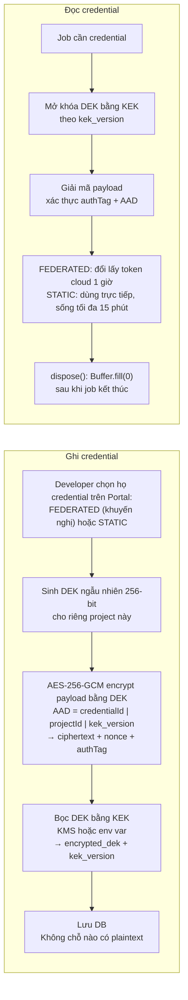

| Khía cạnh | Thiết kế |
| --------- | -------- |
| Thuật toán | AES-256-GCM (có xác thực — phát hiện ciphertext bị sửa), nonce 96-bit **sinh mới mỗi lần ghi**, **AAD = `credentialId \| projectId \| kek_version`** [v4] — không có AAD, ciphertext hợp lệ của bản ghi A có thể bị hoán đổi sang bản ghi B mà GCM không phát hiện |
| DEK | Một Data Encryption Key **riêng cho mỗi project**. Lộ một DEK không làm lộ project khác. `dek_version` cho phép xoay DEK (re-encrypt payload của một project) [v4] |
| KEK | Lấy từ AWS KMS / GCP KMS / Azure Key Vault ở môi trường thật; từ biến môi trường `UDP_KEK` ở môi trường lab. `kek_version` cho phép **rotate KEK mà không cần giải mã lại toàn bộ dữ liệu** — chỉ bọc lại DEK |
| Rotation | Job `rotate-kek` đọc từng bản ghi, unwrap DEK bằng KEK cũ, wrap bằng KEK mới, tăng `kek_version`. Chạy được trong lúc hệ thống đang phục vụ |
| Vòng đời plaintext | Chỉ tồn tại trong RAM của worker đang chạy job, dưới dạng `Buffer`, tối đa 15 phút với STATIC (`ResolvedCredential.expiresAt`), không ghi ra đĩa, không vào log, không vào error message trả về FE. **Giới hạn thật:** `Buffer.fill(0)` xóa được, nhưng bất kỳ `toString()` trung gian nào đều để lại bản sao cho GC — adapter bị cấm chuyển secret sang string (lint rule) [v4] |
| So sánh không giải mã | `fingerprint` = SHA-256 của định danh public (roleArn / accessKeyId / serviceAccountEmail / clientId) — dùng để trả lời "credential này có phải cái tôi đã nhập lần trước không" mà không cần mở khóa |
| Ghi vết | Mọi thao tác tạo/đổi/xóa credential ghi `AuditLog` với `before`/`after` **chỉ chứa fingerprint và metadata**, không chứa giá trị |

**Federation — UDP không giữ bí mật dài hạn của khách [v4]:**

| Cloud | Cơ chế | Khách làm gì (Portal hiển thị sẵn, có nút copy) | UDP làm gì lúc chạy |
| ----- | ------ | ----------------------------------------------- | -------------------- |
| AWS | **Cross-account IAM role + ExternalId** (khuyến nghị chính thức của AWS cho bên thứ ba) | Tạo role với trust policy tin `arn:aws:iam::<UDP-account>:role/udp-controlplane` và điều kiện `sts:ExternalId = <externalId theo project>`; gắn policy tối thiểu (dưới) | `sts:AssumeRole` → credential 1 giờ; thu hồi = khách xóa trust policy |
| GCP | **Workload Identity Federation** | Tạo pool + provider tin OIDC issuer của UDP (`https://udp.example/oidc`, hoặc SA của UDP nếu chạy trên GKE); cấp `roles/iam.workloadIdentityUser` cho SA của khách | Đổi ID token của UDP lấy access token của SA khách (1 giờ) |
| Azure | **Federated identity credential** trên app registration của khách | Tạo app registration, thêm federated credential tin issuer của UDP với subject `project:<id>`; gán role trên **resource group do khách tạo trước** | Đổi ID token lấy AAD token (1 giờ) |
| Dự phòng | Khóa tĩnh (`aws-key`, `gcp-key`, `azure-secret`) | Nhập khóa | Dùng trực tiếp; Portal hiển thị cảnh báo thường trực "credential dài hạn" và đề nghị chuyển sang federation |

> **Vì sao Azure yêu cầu khách tạo resource group trước:** v3 nói "Contributor giới hạn trong một Resource Group do UDP tạo" — vòng luẩn quẩn, vì để tạo RG thì UDP đã phải có quyền ở mức subscription. v4: khách tạo RG, cấp quyền trên RG đó, UDP không bao giờ có quyền subscription.

**Quyền tối thiểu khuyến nghị cho BYOC** — hiển thị ngay trên Portal ở bước nhập credential, kèm nút copy:

| Cloud | Phạm vi tối thiểu |
| ----- | ----------------- |
| AWS | Policy tùy chỉnh giới hạn `eks:*`, `ec2:*Vpc*`, `ec2:*Subnet*`, `ec2:*SecurityGroup*`, `ec2:*NatGateway*`, `ec2:*Address*`, `ec2:*RouteTable*`, `ec2:*InternetGateway*`, `iam:CreateRole` / `iam:PassRole` / `iam:CreateOpenIDConnectProvider` **có điều kiện `aws:RequestTag/udp.project`**, `tag:GetResources`, cộng `iam:SimulatePrincipalPolicy` + `iam:GetContextKeysForPrincipalPolicy` nếu muốn preflight `exact` |
| GCP | Service Account với `container.admin`, `compute.networkAdmin`, `compute.securityAdmin`, `iam.serviceAccountUser`, `resourcemanager.projects.get`, giới hạn trong đúng 1 GCP project |
| Azure | Role `Contributor` **trên đúng một Resource Group do khách tạo**, cộng `Microsoft.Authorization/*/read` để preflight liệt kê được quyền |

**`preflightPermissions()` — ba cloud, ba cách, không giả vờ đồng nhất [v4]:**

| Cloud | Cách kiểm | `confidence` | Lưu ý |
| ----- | --------- | ------------ | ----- |
| AWS | `iam:SimulatePrincipalPolicy` với `ContextEntries` cho `aws:RequestTag/udp.project` | `exact` nếu credential có quyền gọi API mô phỏng; nếu không, `heuristic` bằng cách gọi các API `Describe*`/`DryRun` | API mô phỏng **yêu cầu chính credential đó** có `iam:SimulatePrincipalPolicy` — phải nằm trong policy mẫu |
| GCP | `projects.testIamPermissions` với danh sách permission cần | `exact` | Không cần quyền đặc biệt để gọi |
| Azure | `Permissions - List For Resource Group` trả về action có wildcard; UDP match từng action cần với wildcard phía client | `heuristic` | Azure không có simulator; deny assignments có thể không được phản ánh |

### 4.4 Bảo vệ chi phí [vá B14; v4: TTL không được tự xóa tài sản của khách]

Trong mô hình BYOC, một lỗi lập trình của UDP tiêu tiền thật trong tài khoản của developer. Bốn lớp bảo vệ:

| Lớp | Cơ chế | Chặn được gì |
| --- | ------ | ------------ |
| **1. Quota** | `Project.resource_quota` được truyền vào mọi adapter call; adapter reject nếu vượt; **`maxLoadBalancers`** [v4] đếm cả Service `LoadBalancer` do domain adapter/app tạo (admission webhook trong cluster) | Vòng lặp provisioning, người dùng nhập nhầm `nodeCount = 1000`, mỗi domain tạo một LB |
| **2. Ước tính trước** | `estimateCost()` hiển thị ở bước Preview; provision production yêu cầu người dùng xác nhận con số; bản đã xác nhận lưu vào `ProvisioningJob.estimated_cost` để đối chiếu với OpenCost sau này. **Bắt buộc liệt kê** control plane (EKS/GKE ≈ 0,10 USD/giờ; AKS free tier không SLA), NAT gateway (≈ 32 USD/tháng + data), load balancer; bảng giá tĩnh có `pricingAsOf` [v4] | Bất ngờ về hóa đơn — ba mục trên là nguyên nhân số một |
| **3. TTL** | `Project.expires_at` + `expiry_action`. **`WARN`** (mặc định BYOC): cảnh báo owner ở 72h / 24h / 1h, đánh dấu project `EXPIRED` trên Portal, **không** đụng tài nguyên. **`TEARDOWN`** (mặc định MANAGED, hoặc BYOC do owner tự chọn **và** không có environment `is_production` đã deploy): cảnh báo như trên rồi tự dọn; ghi `AuditLog(actor_type = SYSTEM)` **trước** khi xóa [v4] | Cluster demo bị quên, chạy cả tháng — mà **không** tạo rủi ro xóa nhầm production của khách. v3 để cron tự xóa mọi project quá hạn: xóa nhầm cluster production trong tài khoản người khác là rủi ro pháp lý, không phải bug |
| **4. Sổ tài nguyên + tag + quét** | `ProvisionedResource` ghi trước khi tạo; tag `udp.*` trên mọi tài nguyên; `orphan-scan.job` mỗi 10 phút gọi `listTaggedResources()` để phát hiện K8S_MANAGED và `ORPHAN_SUSPECTED`; `GET /admin/orphan-resources` | Tài nguyên còn sót sau khi job chết, ELB/EBS do K8s tạo mà sổ chưa biết |

> Cost Management (OpenCost/Kubecost) vẫn là domain Tier 3 dành cho *hiển thị chi phí*. Bốn lớp trên là *guardrail*, thuộc phần lõi và phải có ngay từ đầu — khác nhau về mục đích, không thay thế nhau.

### 4.5 Ngữ nghĩa thất bại của `ResourceStep` — hợp đồng thật của adapter [NEW v4 — lõi kỹ thuật của C3]

ADR-08 quyết định nguồn sự thật nằm ở tag trên tài nguyên. Mục này biến quyết định đó thành một hợp đồng kiểm được: **máy trạng thái của một `ResourceStep`, và hành vi khôi phục xác định tại từng cạnh**. Đây cũng chính là lưới mà **E15** chạy, nên thiết kế và phép đo khớp nhau từng ô.

#### Máy trạng thái

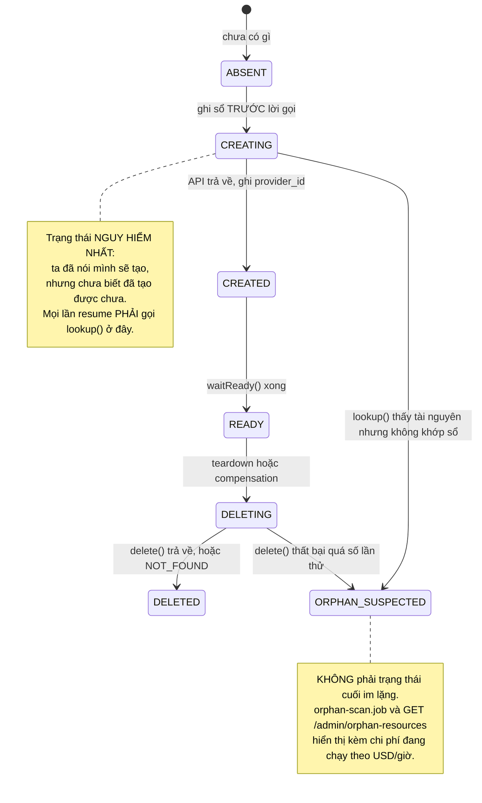

#### Bảng khôi phục theo từng điểm crash

Đây là hợp đồng mà mọi Cloud Adapter phải thỏa, và là **lưới ô của E15**. Với mỗi điểm, cột cuối là điều Terraform hoặc Pulumi làm khác — đó là chỗ đối chứng có ý nghĩa.

| # | Crash xảy ra ở đâu | Trạng thái trong sổ | Resume làm gì | Kết quả bắt buộc | Terraform / Pulumi làm gì |
| - | ------------------- | ------------------- | ------------- | ---------------- | -------------------------- |
| **K1** | Trước khi ghi sổ | Không có hàng | Chạy `lookup()`; không thấy thì `create()` bình thường | Không tạo trùng | Giống nhau, an toàn |
| **K2** | **Sau khi ghi sổ, trước khi gọi API** | `CREATING`, `provider_id = NULL` | `lookup()` theo tag; không thấy thì `create()` | Không tạo trùng | State chưa ghi gì; refresh không thấy; an toàn |
| **K3** | **Sau khi API trả về, trước khi ghi `provider_id`** | `CREATING`, `provider_id = NULL` | `lookup()` **thấy** tài nguyên, gắn `provider_id` vào hàng đã có, chuyển `CREATED` | **Không tạo trùng** | **Đây là ô Terraform thua:** tài nguyên tồn tại nhưng không có trong state. `apply` kế tiếp tạo **tài nguyên thứ hai**, hoặc lỗi `AlreadyExists` phải `import` bằng tay |
| **K4** | Giữa `create()` và `waitReady()` | `CREATED` | `lookup()` xác nhận còn, gọi lại `waitReady()` | Idempotent | Tương đương |
| **K5** | Giữa các step | Các hàng trước là `READY` | Tiếp từ step kế tiếp | Không làm lại việc đã xong | Tương đương |
| **K6** | Giữa compensation | Một số `DELETED`, một số `READY` | Tiếp tục theo thứ tự ngược từ hàng chưa `DELETED` | Không xóa nhầm thứ đã xóa (`NOT_FOUND` là thành công) | `destroy` chạy lại được, nhưng nếu state lệch thì bỏ sót |
| **K7** | Khách **xóa tài nguyên ngoài luồng** giữa chừng | `READY` nhưng cloud không còn | `lookup()` trả `null` khi teardown ⇒ coi như `DELETED`; khi resume tạo ⇒ tạo lại | Hội tụ về trạng thái mong muốn | `refresh` phát hiện được, nhưng cần một lần chạy riêng |
| **K8** | Khách **xóa tag `udp.key`** | `READY`, `provider_id` đã có | `lookup()` theo tag trả `null`, **nhưng** `provider_id` trong sổ vẫn dùng được để tra trực tiếp | Không tạo trùng, nhờ đường dự phòng theo id | Không áp dụng (Terraform không dựa vào tag) |
| **K9** | Worker mất kết nối DB nhưng **vẫn gọi được cloud** | Lease đã hết hạn, worker khác đã nhận | Worker cũ bị **fencing** chặn ở lần ghi kế tiếp vì `version` đã đổi | Chỉ một worker tác động lên cloud | Lock của Terraform chặn worker thứ hai, nhưng lock kẹt nếu tiến trình chết mà không nhả |
| **K10** | **Mất sạch sổ** giữa chừng (database khôi phục từ backup cũ, hoặc bảng bị xóa) | Không còn hàng nào | `rebuildLedgerFromCloud()` quét theo tag `udp.project`, đọc `udp.key` của từng tài nguyên để dựng lại hàng, rồi tiếp tục | **Hội tụ đúng**, không tạo trùng, không mồ côi | **Đây là ô quyết định của C3:** mất state file thì Terraform **mù hoàn toàn** — `plan` coi như chưa có gì và sẽ tạo lại tất cả, hoặc lỗi `AlreadyExists` hàng loạt phải `import` từng tài nguyên bằng tay |

> **Vì sao K3 là ô quan trọng nhất:** đó là cửa sổ giữa "cloud đã tạo xong" và "ta đã biết điều đó". Cửa sổ này tồn tại trong **mọi** hệ thống ghi state sau khi hành động, và nó là lý do `terraform import` tồn tại. UDP đóng nó bằng hai thứ: ghi sổ **trước** (quy tắc 1 của ADR-08) nên ta biết mình *đã định* tạo gì, và `lookup()` theo tag (quy tắc 2) nên ta tìm lại được thứ đã tạo mà không cần biết id. **E15 đo đúng ô này** trên cả ba hiện thực.

#### Lược đồ tag là hợp đồng hạng nhất

Vì tag **là** nguồn sự thật (ADR-08), nó phải được đặc tả chặt như một schema, không phải như metadata trang trí.

| Tag | Bắt buộc | Nội dung | Ai đọc |
| --- | -------- | -------- | ------ |
| `udp.project` | Có | UUID của project | `orphan-scan.job`, `GET /admin/orphan-resources`, script dọn thủ công |
| `udp.key` | Có | `idempotencyKey` của step: `{projectId}:{step}:{kind}:{name}` | `lookup()` — **đây là tag mà tính đúng đắn phụ thuộc vào** |
| `udp.owner` | Có | Email chủ project | Truy vết khi cần liên hệ |
| `udp.ttl` | Nếu project có `expires_at` | ISO timestamp | `project-ttl.job` |
| `udp.managed` | Có | `"true"` | Phân biệt tài nguyên của UDP với tài nguyên khách tự tạo trong cùng tài khoản |

**Ba quy tắc bắt buộc về tag:**

| # | Quy tắc | Lý do |
| - | ------- | ----- |
| 1 | Tag phải được gắn **trong cùng lời gọi tạo tài nguyên**, không phải bằng một lời gọi `TagResource` riêng sau đó | Một lời gọi tag riêng tạo ra cửa sổ crash mới: tài nguyên tồn tại nhưng không có tag, tức là `lookup()` không tìm thấy và ta tạo trùng. Đây chính là ô K3 xuất hiện lần thứ hai |
| 2 | API **không cho gắn tag lúc tạo** phải dùng **tên tất định** thay thế: tên tài nguyên tự nó chứa `idempotencyKey` đã băm, và `lookup()` tra theo tên | Không phải API nào cũng cho tag khi tạo. Adapter phải khai báo mình dùng đường nào; contract test kiểm điều đó |
| 3 | `provider_id` trong sổ là **đường dự phòng thứ hai** cho `lookup()` khi tra theo tag không ra | Đây là câu trả lời cho ô K8: khách xóa tag thì ta vẫn còn id. Hai đường độc lập, hỏng một vẫn còn một |

> **Giới hạn trung thực:** nếu khách xóa tag **và** sổ mất `provider_id` (crash đúng ở K3 rồi khách xóa tag trước khi ta resume), `lookup()` không tìm thấy và adapter sẽ tạo trùng. Đây là kịch bản còn lại duy nhất chưa xử lý được, ghi ở §16. Terraform ở kịch bản tương đương cũng tạo trùng hoặc báo lỗi phải sửa tay.

#### Tài nguyên do Kubernetes sinh ra — chỗ mọi state file đều mù

Một `Service` kiểu `LoadBalancer` làm cloud-controller-manager tạo **ELB và ENI**; một `PersistentVolumeClaim` tạo **EBS**. Adapter không gọi API nào để tạo chúng, nên:

- **Không state file nào biết chúng tồn tại.** Terraform quản lý cluster nhưng không quản lý thứ mà workload chạy trong cluster sinh ra.
- Chúng **giữ tham chiếu tới VPC và subnet**, nên `DeleteVpc` thất bại với lỗi `DependencyViolation` — và thất bại **vĩnh viễn**, vì không có gì tự dọn chúng sau khi cluster bị xóa.
- Hậu quả trong mô hình BYOC: NAT gateway và load balancer tiếp tục tính tiền trong tài khoản của khách sau khi họ tưởng đã xóa project.

UDP xử lý bằng ba bước, và đây là ví dụ cụ thể nhất cho luận điểm *"state file không biết đủ"*:

1. `listTaggedResources()` quét theo tag của cluster để **phát hiện** ELB, ENI, EBS mang tag do Kubernetes gắn (`kubernetes.io/cluster/<name>`), ghi vào sổ với `managedByK8s = true` và `kind` tương ứng
2. Teardown xóa **workload trước** (Service, PVC), rồi **chờ** ELB, ENI, EBS thực sự biến mất khỏi cloud, rồi mới xóa network
3. Thứ không biến mất sau timeout được đánh `ORPHAN_SUSPECTED` kèm chi phí ước tính, hiển thị ở `GET /admin/orphan-resources` — **không im lặng bỏ qua**

### 4.6 `ClusterAccess` — đường duy nhất chạm vào cluster của tenant [NEW v4 — hiện thực ADR-06]

ADR-06 quyết định *cách* control plane vào cluster; mục này là interface mà cả ba bên đi qua. Trước v4 nó chỉ tồn tại dưới dạng một dòng phác trong cây thư mục §3.1, trong khi §7.3, §8.1 và §8.3 đều phụ thuộc vào nó.

**Nguyên tắc:** không code nghiệp vụ nào được tự dựng kubeconfig, tự gọi `TokenRequest`, hay tự biết cluster ở chế độ `direct` hay `agent`. Mọi thứ đi qua interface này, nên đổi chế độ không chạm vào luồng nghiệp vụ.

```typescript
type ClusterAccessMode = "direct" | "agent";

/** Danh tính bên gọi — quyết định SA nào được cấp (§12.2). KHÔNG do bên gọi tự khai */
type ControlPlaneIdentity = "workload" | "traffic" | "tooling";

interface ClusterAccess {
  readonly mode: ClusterAccessMode;
  readonly clusterId: string;

  /**
   * Client Kubernetes đã xác thực bằng bound SA token 1 giờ của ĐÚNG identity.
   * Token được cache trong bộ nhớ và xin lại trước hạn; KHÔNG BAO GIỜ ghi xuống
   * database hay đĩa (I24). Với mode = "agent", client này gửi lệnh qua gRPC stream.
   */
  getClient(as: ControlPlaneIdentity): Promise<KubernetesClient>;

  /**
   * Gọi một Service trong cluster mà KHÔNG phơi nó ra Internet, qua API-server
   * service proxy: /api/v1/namespaces/{ns}/services/{scheme}:{name}:{port}/proxy/{path}
   * Đây là cách Service 3 truy vấn Prometheus nội bộ (ADR-06). RBAC chỉ mở
   * `services/proxy` trên đúng service của nguồn metrics, không phải mọi service.
   */
  proxyService(target: {
    namespace: string; service: string; port: number; scheme: "http" | "https";
  }, path: string, init?: RequestInit): Promise<Response>;

  /** Kiểm nhanh trước khi chạy luồng dài: endpoint có tới được, token có cấp được */
  probe(): Promise<AdapterResult<{ reachable: boolean; serverVersion?: string }>>;
}
```

**Ba ràng buộc mà interface này cưỡng chế, không phải khuyến nghị:**

| Ràng buộc | Vì sao nó nằm ở đây chứ không ở tài liệu hướng dẫn |
| --------- | --------------------------------------------------- |
| `getClient(as)` **bắt buộc** khai identity | Không có tham số này thì ba ServiceAccount của §12.2 vô nghĩa: mọi bên sẽ dùng chung token mạnh nhất và bất biến I25 quay về chỗ chỉ được bảo đảm bằng kỷ luật lập trình |
| Service 3 **không** có đường lấy `ResolvedCredential` | Nó nhận `ClusterAccess` đã dựng sẵn từ `POST /internal/clusters/:id/token` của Service 1. Interface không phơi credential nên Service 3 **không thể** giải mã credential của tenant kể cả khi muốn (ADR-06) |
| `proxyService` là **cách duy nhất** gọi service trong cluster | Nếu adapter tự `fetch` tới một ClusterIP, nó sẽ không chạy khi control plane nằm ngoài VPC, và sẽ vòng qua egress guard của T11. Lint chặn `fetch` trực tiếp trong thư mục adapter (§13.2) |

> **Vì sao `probe()` tồn tại:** §8.1 và §8.3 là những luồng dài. Phát hiện "không vào được cluster" ở phút thứ 12 sau khi đã tạo nửa hạ tầng là đúng cái ADR-02 và preflight của §4.2 sinh ra để tránh. `probe()` là phiên bản tương ứng cho tầng cluster.

---

## 5. Domain Adapter

### 5.1 Phân loại Adapter

```mermaid
graph TD
    ROOT["Domain Adapter Layer\nPluggable — mỗi domain bật tắt độc lập\nMỗi tool trong domain là 1 adapter riêng"]

    ROOT --> HEAVY["HEAVY Adapter — 9 domain\nLogic hoàn toàn riêng biệt mỗi tool\nAPI khác nhau — không dùng chung chuẩn mở"]
    ROOT --> LIGHT["LIGHT Adapter — 7 domain\nChung giao thức tiêu thụ\nProvisioning va auth van rieng tung tool"]
    ROOT --> NOTADAPTER["KHONG phai Domain Adapter\nContainer Runtime va K8s cluster: do Cloud Adapter provision\nFeature Flag: service built-in cua UDP"]

    HEAVY --> H1["CI/CD\nGitHub Actions · GitLab CI\nJenkins · CircleCI · Tekton · Drone"]
    HEAVY --> H2["Infrastructure IaC\nCrossplane · ACK · Config Connector\nTerraform · Pulumi"]
    HEAVY --> H3["GitOps\nArgo CD · Flux CD"]
    HEAVY --> H4["Security Scanning\nTrivy · Snyk · Aqua Security\nOWASP ZAP · Checkov · Falco · Grype"]
    HEAVY --> H5["Service Mesh\nIstio · Linkerd · Consul Connect · Kuma\ncung cap mesh.traffic-split"]
    HEAVY --> H6["Ingress — NEW v4\nNGINX Ingress · Traefik\ncung cap ingress.traffic-split"]
    HEAVY --> H7["Progressive Delivery\nFlagger · Argo Rollouts · Spinnaker\ncung cap traffic.control — EXCLUSIVE"]
    HEAVY --> H8["Database Operators\nCloudNativePG · MongoDB Operator\nMySQL Operator · Redis Operator"]
    HEAVY --> H9["Policy and Governance\nOPA Gatekeeper · Kyverno"]

    LIGHT --> L0["Secrets Management\nVault · Sealed Secrets · External Secrets\nAWS SM · GCP SM · Azure KV\nChuan tieu thu: CSI Driver / ESO"]
    LIGHT --> L1["Container Registry\nECR · GAR · ACR · Docker Hub\nGHCR · Harbor\nChuan: OCI"]
    LIGHT --> L2["Monitoring\nPrometheus+Grafana · VictoriaMetrics\nDatadog · New Relic · Dynatrace\nChuan: OpenTelemetry / PromQL"]
    LIGHT --> L3["Logging\nLoki · ELK · OpenSearch\nSplunk · Datadog Logs\nChuan: Fluent Bit / OTLP"]
    LIGHT --> L4["Tracing\nJaeger · Tempo · Zipkin\nChuan: OpenTelemetry"]
    LIGHT --> L5["Cost Management\nOpenCost · Kubecost\nChuan: doc tu metrics.query"]
    LIGHT --> L6["Artifact and Package Registry\nArtifactory · Nexus · GitHub Packages\nChuan: OCI"]
```

> **Ba điểm sửa so với v3 [v4]:** (1) **Progressive Delivery** bị thiếu hẳn trong sơ đồ v3 dù nó là một trong hai đóng góp chính; (2) **Cost Management** bị xếp Heavy trong sơ đồ nhưng Light trong bảng ngay bên dưới — thống nhất là Light, vì cả OpenCost lẫn Kubecost đều tiêu thụ `metrics.query`; (3) **Container Orchestration** không còn nằm dưới nhánh Domain Adapter, vì nó do Cloud Adapter provision chứ không phải một adapter cắm được. Tổng: **9 Heavy + 7 Light = 16 Domain Adapter**, khớp danh mục §5.5 và bảng `DomainCatalog` §2.2.

| Loại               | Đặc điểm                                                                                                                                            | Domain                                                                                                                                   |
| ------------------ | --------------------------------------------------------------------------------------------------------------------------------------------------- | ---------------------------------------------------------------------------------------------------------------------------------------- |
| **Heavy**          | Logic hoàn toàn riêng biệt giữa các tool, API khác nhau, không dùng chung chuẩn mở nào, mỗi tool cần 1 adapter viết từ đầu                          **9 domain:** CI/CD · Infrastructure IaC · GitOps · Security Scanning · Service Mesh · **Ingress** · Progressive Delivery · Database Operators · Policy & Governance |
| **Light**          | **Chung giao thức tiêu thụ** (OCI, OTLP/Prometheus remote-write, Fluent Bit, CSI/ESO) nên phần *app dùng nó* giống nhau; nhưng phần *provisioning và xác thực* vẫn riêng từng tool (ECR cần refresh token IAM 12 giờ, GHCR dùng PAT, Harbor dùng robot account; Vault và AWS Secrets Manager khác hẳn cách auth). v3 nói "1 implementation phục vụ nhiều tool" là quá lời — v4: một `SaaSAdapter`/`HelmBasedAdapter` base + phần auth riêng **7 domain:** Container Registry · Monitoring · Logging · Tracing · Secrets Management · Cost Management · Artifact Registry |
| **Built-in**       | Không phải adapter — là service tự xây tích hợp sẵn trong UDP, không thể thay thế bằng tool ngoài                                                   | Feature Flag Service (OpenFeature standard)                                                                                              |
| **Infrastructure** | Không phải Domain Adapter — là Cloud Adapter provision trực tiếp, làm nền tảng cho toàn bộ domain khác hoạt động                                    | Container Runtime (containerd) · Kubernetes Cluster (EKS / GKE / AKS) · Docker (build only trong CI)                                     |

### 5.2 DomainAdapter Interface [v4: scope, day-2, rebind, base class]

```typescript
type DomainType =
  | "CICD"
  | "CONTAINER_REGISTRY"
  | "INFRA"
  | "GITOPS"
  | "MONITORING"
  | "LOGGING"
  | "TRACING"
  | "SERVICE_MESH"
  | "INGRESS"               // [v4] tách khỏi mesh: nginx/traefik cung cấp ingress.traffic-split
  | "SECRETS"
  | "SECURITY"
  | "POLICY"
  | "DATABASE"
  | "PROGRESSIVE_DELIVERY"
  | "COST"
  | "ARTIFACT_REGISTRY";
// 16 giá trị. Đây là kiểu TypeScript suy ra từ registry, KHÔNG phải enum trong DDL:
// database cưỡng chế cùng danh sách này bằng khóa ngoại tới bảng `DomainCatalog`
// được đồng bộ lúc khởi động (§2.2). Xem §5.3 để biết vì sao khác biệt đó là
// điều kiện cần của chỉ số "0 file" ở C2.

interface DomainToolConfig {
  [key: string]: unknown; // validated by Zod before passing to adapter
}

/** Bối cảnh đầy đủ mà adapter cần — thay cho việc chỉ truyền ClusterInfo */
interface DomainAdapterContext {
  cluster: ClusterInfo;
  /** [v4 — ADR-06] Client K8s đã xác thực bằng bound SA token; adapter KHÔNG tự lấy kubeconfig */
  k8s: ClusterAccess;
  /** Với adapter scope = "namespace": environment đích. Với scope = "cluster": undefined */
  environment?: { id: string; name: string; k8sNamespace: string; isProduction: boolean };
  /** Namespace hệ thống cho tooling cluster-scoped: "udp-system" */
  systemNamespace: string;
  quota: ResourceQuota;
  /** Giá trị mà các adapter khác đã cung cấp — đọc từ bảng CapabilityBinding, không phải bộ nhớ worker */
  resolved: Record<CapabilityId, CapabilityBinding>;
  tags: Record<string, string>;
  /** Ghi log tiến trình để Portal stream về cho người dùng */
  progress: (message: string) => void;
  /** [v4] Egress guard: mọi HTTP ra ngoài của adapter (SaaS API, webhook) đi qua đây — chống SSRF (§12 T11) */
  fetch: typeof fetch;
}

interface DomainAdapter {
  readonly domainType: DomainType;
  readonly toolId: string; // vd: "github-actions", "prometheus-grafana"
  /** [v4] Phiên bản adapter (và chart/operator nó cài) — ghi vào DomainConfig.adapter_version */
  readonly version: string;

  /**
   * [v4] Istio control plane, operator CNPG/Gatekeeper/Kyverno, Argo Rollouts controller đều
   * cluster-scoped: cài MỘT lần vào udp-system. Chỉ CR (VirtualService, Cluster, Policy...)
   * mới theo namespace của environment. v3 bắt mọi adapter "deploy vào namespace env" —
   * không thực hiện được cho nửa số domain.
   */
  readonly scope: "cluster" | "namespace";

  /** Khai báo tĩnh dùng cho validator ở §5.3 */
  readonly capabilities: CapabilityDeclaration;

  /** Zod schema của tool_config — registry tự dùng để validate; trường .describe("secret") được mã hóa khi lưu */
  readonly configSchema: ZodSchema;

  deploy(ctx: DomainAdapterContext, config: DomainToolConfig): Promise<AdapterResult<CapabilityBinding[]>>;
  configure(ctx: DomainAdapterContext, config: DomainToolConfig): Promise<AdapterResult<CapabilityBinding[]>>;

  /** [v4] Day-2: nâng cấp chart/operator lên adapter.version mới mà không teardown */
  upgrade(ctx: DomainAdapterContext, config: DomainToolConfig, fromVersion: string): Promise<AdapterResult<CapabilityBinding[]>>;

  /** [v4] Day-2: so trạng thái thật trên cluster với cấu hình mong muốn (helm diff, CR spec) */
  detectDrift(ctx: DomainAdapterContext, config: DomainToolConfig): Promise<AdapterResult<{ drifted: boolean; details?: string }>>;

  /**
   * [v4] Được gọi khi provider của một capability mà adapter này `requires` đổi
   * (đổi Prometheus sang Datadog ⇒ Flagger phải trỏ metric server mới).
   * v3 không có hook này nên consumer giữ endpoint cũ vĩnh viễn sau khi swap.
   */
  onDependencyChanged(ctx: DomainAdapterContext, config: DomainToolConfig, changed: CapabilityBinding): Promise<AdapterResult<void>>;

  healthcheck(ctx: DomainAdapterContext): Promise<AdapterResult<{ healthy: boolean; details?: string }>>;

  /** reason cho phép adapter giữ lại dữ liệu (PVC) khi chỉ đổi tool, và dọn sạch khi tắt domain */
  teardown(ctx: DomainAdapterContext, reason: "disable" | "switch" | "project-teardown"): Promise<AdapterResult<void>>;
}

/** [v4] CI/CD adapter mở rộng thêm phần webhook — v3 nhắc ở §8.3 nhưng không có trong interface */
interface CicdDomainAdapter extends DomainAdapter {
  verifySignature(headers: Record<string, string>, rawBody: Buffer, secret: Buffer): boolean;   // so sánh hằng thời gian
  parsePayload(rawBody: Buffer): WebhookDeployEvent;
  /** Sinh file pipeline mẫu cho Golden Path (§11) */
  renderPipelineTemplate(params: PipelineTemplateParams): string;
}
```

**Hai base class để C3 đo được phần "đặc thù" thật [v4]:**

| Base class | Dùng cho | Adapter con chỉ phải viết |
| ---------- | -------- | ------------------------- |
| `HelmBasedAdapter` | Hầu hết heavy adapter và light adapter self-hosted: Prometheus, Loki, Istio, Argo CD, Flux, Gatekeeper, CNPG, Harbor, Vault… | Tên chart + repo + values từ `tool_config`, danh sách CRD phải chờ, các CR cần tạo sau khi chart sẵn sàng, cách tính `CapabilityBinding`. `deploy/upgrade/detectDrift/teardown` là `helm upgrade --install` / `helm diff` / `helm uninstall` có sẵn |
| `SaaSAdapter` | Datadog, New Relic, Snyk, GHCR, ECR, GitHub Actions…: **không deploy gì vào cluster**, chỉ cấu hình phía SaaS (API key, webhook, secret trong namespace) | `configure()` gọi API SaaS qua `ctx.fetch`, tạo `Secret`/`ConfigMap` trong namespace env, trả binding |

> Đây cũng là "adapter không vừa khung" mà E1 cần: nếu `SaaSAdapter` viết được mà không sửa interface, khung không gò ép; nếu phải sửa, số lần sửa là số liệu.

**Ba hàm day-2 là ADR-08 áp cho trục Domain Adapter [v4 — nửa thứ hai của C3]:** `upgrade()`, `detectDrift()` và `onDependencyChanged()` trông như ba tính năng rời rạc, nhưng chúng là **cùng một nguyên tắc** với `lookup()` của Cloud Adapter: *đừng tin sổ sách của mình, đối chiếu với sự thật bên ngoài*.

| | Cloud Adapter | Domain Adapter |
| - | ------------- | -------------- |
| Sự thật nằm ở đâu | Tag trên tài nguyên trong tài khoản cloud | Helm release, spec của CR, kết quả `healthcheck()` trên cluster |
| Hàm đối chiếu | `lookup(tags)` trước mọi `create()` | `detectDrift()` định kỳ, so cấu hình mong muốn với trạng thái thật |
| Sổ sách của UDP | `ProvisionedResource` — gợi ý thứ tự cho compensation | `DomainConfig.adapter_version` và `CapabilityBinding` — cache **dựng lại được** |
| Khi sổ lệch với sự thật | Sự thật thắng: `lookup()` quyết định tạo hay dùng lại | Sự thật thắng: hiển thị drift lên Portal, **không tự ghi đè** (§8.6) |
| Cái tương đương ở công cụ khác | State file của Terraform | Release Secret của Helm, cache trạng thái của Argo CD |
| Chỗ công cụ khác mù | Tài nguyên do Kubernetes sinh ra (ELB, ENI, EBS) | Sửa tay bằng `kubectl edit` giữa hai lần `diff`; và **capability binding** khi provider đổi endpoint |

**Một khác biệt có chủ đích giữa hai trục:** Cloud Adapter **tự hội tụ** khi phát hiện lệch (tạo lại thứ khách đã xóa, dùng lại thứ đã tồn tại), còn Domain Adapter **chỉ báo cáo** drift và để người quyết định. Lý do ở §8.6: trôi cấu hình tooling thường là người vận hành cố ý vá nóng lúc sự cố, còn một VPC biến mất giữa lúc provisioning thì không có cách đọc nào khác ngoài "cần tạo lại". Khác biệt này phải nói rõ khi bảo vệ, vì nếu không nó trông như thiếu nhất quán.

**Bất biến tương ứng:** I31 kiểm ma trận khôi phục của Cloud Adapter (§4.5), I32 kiểm phát hiện drift của Domain Adapter. Hai phép đo đối chứng là **E15** và **E16** (§14.1).

> **Vì sao thêm `environment` vào context:** nếu adapter *namespace-scoped* deploy Loki/Postgres vào một namespace chung cho cả project thì `dev` và `prod` dùng chung hạ tầng — mâu thuẫn với ADR-04. Adapter namespace-scoped nhận namespace của environment và mọi tài nguyên nó tạo đều nằm trong đó; adapter cluster-scoped cài control plane vào `udp-system` và tạo CR theo environment.

### 5.3 Capability Model — ràng buộc giữa các domain [vá B11 — đóng góp C2; v4: anyOf, recommends, exclusive, version, rebind]

Thiết kế v2 rải rác các câu ghi chú kiểu *"Registry cần bật cùng CI/CD"*, *"Flagger cần Service Mesh"* — không có cấu trúc dữ liệu nào biểu diễn chúng. v3 đưa vào `provides / requires / conflicts`. v4 sửa bốn lỗi ngữ nghĩa của v3 và đặt mô hình vào đúng chỗ của nó trong lịch sử: đây là **ngữ nghĩa phụ thuộc của package manager** (Debian `Depends / Recommends / Conflicts / Provides / alternatives`, RPM `Requires / Provides / Conflicts`) và của **OAM `conflictsWith`**, áp dụng cho tổ hợp tooling của IDP.

| Lỗi của v3 | Hậu quả | v4 |
| ---------- | ------- | -- |
| Mọi `requires.optional` gom thành **một nhóm any-of duy nhất** | Tool có hai optional độc lập (`logs.sink` và `traces.sink` đều "có thì tốt") bị chặn sai | `requires: (CapabilityId \| { anyOf: CapabilityId[] })[]` cho ràng buộc cứng; `recommends: CapabilityId[]` cho optional thật (chỉ cảnh báo) |
| `conflicts` theo `toolId`, **một chiều**, ma trận N×N | Thêm tool mới quên khai đối xứng; 60 tool không bảo trì được | **Conflict theo capability độc quyền**: `provides: [{ id: "traffic.control", exclusive: true }]`; hai adapter cùng provide capability exclusive ⇒ xung đột, tự đối xứng. `conflicts` tool-level chỉ còn là ngoại lệ |
| Không có **version** của capability | `metrics.query` của Prometheus (PromQL) và Datadog (DQL) khác ngôn ngữ; consumer không biết binding có tương thích | `provides: [{ id, version: "2.0.0" }]`, `requires: [{ id, constraint: "^2" }]` (semver) |
| `AMBIGUOUS_PROVIDER` giải bằng dropdown nhưng **không có chỗ lưu** lựa chọn; `ctx.resolved` chỉ giữ một binding trong bộ nhớ | Worker restart mất lựa chọn; consumer không rebind khi provider đổi | Bảng `CapabilityPreference`; binding persist trong `CapabilityBinding`; `onDependencyChanged()` được gọi cho mọi consumer sau swap |

```typescript
type CapabilityId =
  | "registry.oci"            // nơi push/pull image
  | "metrics.query"           // nguồn truy vấn metrics cho canary analysis (đi kèm MetricsProvider)
  | "metrics.scrape"          // nơi app expose metrics tới
  | "logs.sink"
  | "traces.sink"
  | "mesh.traffic-split"      // chia traffic theo trọng số ở tầng mesh (mịn)
  | "ingress.traffic-split"   // chia traffic mức ingress (kém mịn hơn)
  | "traffic.control"         // [v4] EXCLUSIVE: ai là bên điều khiển traffic (Flagger | Argo Rollouts) — chỉ một
  | "secrets.store"
  | "gitops.sync"             // [v4] EXCLUSIVE: một cluster một GitOps controller
  | "policy.admission"
  | "pipeline.trigger"        // CI có thể được kích hoạt và gửi webhook về
  | "db.instance"
  | "cost.query";

interface CapabilityDeclaration {
  /** Adapter này cung cấp gì. exclusive = chỉ được có MỘT provider trong cluster */
  provides: { id: CapabilityId; version: string; exclusive?: boolean }[];
  /** Ràng buộc cứng: từng phần tử phải được thỏa; phần tử anyOf cần ít nhất một */
  requires: (
    | { id: CapabilityId; constraint?: string }
    | { anyOf: { id: CapabilityId; constraint?: string }[] }
  )[];
  /** Optional thật: thiếu chỉ cảnh báo, không chặn */
  recommends?: CapabilityId[];
  /** Ngoại lệ tool-level, hiếm dùng — ưu tiên exclusive capability */
  conflicts?: string[];
  /** Gợi ý hiển thị khi thiếu — dùng cho thông báo lỗi có ích */
  hint?: Partial<Record<CapabilityId, string>>;
}

/** Giá trị thực tế sau khi adapter deploy xong — persist trong bảng CapabilityBinding */
interface CapabilityBinding {
  id: CapabilityId;
  version: string;
  providedBy: string;                 // "monitoring:prometheus-grafana"
  environmentId?: string;             // undefined = cluster-scoped
  endpoint?: string;                  // "http://prometheus-server.udp-system:9090"
  attributes?: Record<string, string>;
}
```

**Ví dụ khai báo:**

```typescript
export const flaggerAdapter: DomainAdapter = {
  domainType: "PROGRESSIVE_DELIVERY",
  toolId: "flagger",
  version: "1.38.0",
  scope: "cluster",
  capabilities: {
    provides: [{ id: "traffic.control", version: "1.0.0", exclusive: true }],
    requires: [
      { anyOf: [{ id: "mesh.traffic-split" }, { id: "ingress.traffic-split" }] },
      { id: "metrics.query", constraint: "^2" },   // PromQL-compatible
    ],
    recommends: ["traces.sink"],
    hint: {
      "mesh.traffic-split":
        "Flagger cần Istio/Linkerd (mesh) hoặc NGINX/Traefik (ingress). Bật domain Service Mesh hoặc Ingress.",
    },
  },
  // ...
};

export const argoRolloutsAdapter: DomainAdapter = {
  domainType: "PROGRESSIVE_DELIVERY",
  toolId: "argo-rollouts",
  version: "1.8.0",
  scope: "cluster",
  capabilities: {
    provides: [{ id: "traffic.control", version: "1.0.0", exclusive: true }],   // ⇒ tự xung đột với Flagger
    requires: [
      { id: "metrics.query", constraint: ">=1" },   // Argo hỗ trợ cả Prometheus lẫn Datadog
      { anyOf: [{ id: "mesh.traffic-split" }, { id: "ingress.traffic-split" }] },
    ],
  },
  // ...
};

export const prometheusAdapter: DomainAdapter = {
  domainType: "MONITORING",
  toolId: "prometheus-grafana",
  version: "27.0.0",
  scope: "cluster",
  capabilities: {
    provides: [
      { id: "metrics.query", version: "2.0.0" },   // PromQL
      { id: "metrics.scrape", version: "1.0.0" },
    ],
    requires: [],
  },
  // ...
};

export const datadogAdapter: DomainAdapter = {
  domainType: "MONITORING",
  toolId: "datadog",
  version: "3.0.0",
  scope: "cluster",
  capabilities: {
    provides: [
      { id: "metrics.query", version: "1.0.0" },   // DQL — KHÔNG thỏa constraint "^2" của Flagger ⇒ validator báo rõ
      { id: "metrics.scrape", version: "1.0.0" },
      { id: "logs.sink", version: "1.0.0" },
    ],
    requires: [],
  },
  // ...
};

export const githubActionsAdapter: CicdDomainAdapter = {
  domainType: "CICD",
  toolId: "github-actions",
  version: "1.0.0",
  scope: "namespace",
  capabilities: {
    provides: [{ id: "pipeline.trigger", version: "1.0.0" }],
    requires: [{ id: "registry.oci" }],   // CI build image thì phải có chỗ push
    recommends: ["gitops.sync"],
  },
  // ...
};
```

**Thuật toán validate + sắp thứ tự deploy:**

```typescript
function validateAndOrder(
  selected: { domainType: DomainType; toolId: string }[],
  prefs: CapabilityPreference[],
): ValidationResult {
  const adapters = selected.map((s) => registry.get(s.domainType, s.toolId));
  const key = (a: DomainAdapter) => `${a.domainType}:${a.toolId}`;

  // 1. Provider map
  const provided = new Map<CapabilityId, { by: string; version: string; exclusive: boolean }[]>();
  for (const a of adapters)
    for (const p of a.capabilities.provides)
      provided.set(p.id, [...(provided.get(p.id) ?? []), { by: key(a), version: p.version, exclusive: !!p.exclusive }]);

  // 2. Exclusive capability ⇒ tối đa MỘT provider (thay cho conflicts hai chiều của v3)
  for (const [cap, ps] of provided)
    if (ps.length > 1 && ps.some((p) => p.exclusive))
      return err("CONFLICT", cap, ps.map((p) => p.by));

  // 2b. Ngoại lệ tool-level, kiểm CẢ HAI CHIỀU
  const ids = new Set(adapters.map(key));
  for (const a of adapters)
    for (const c of a.capabilities.conflicts ?? [])
      if (ids.has(c)) return err("CONFLICT", key(a), [c]);

  // 3. Requires: từng phần tử; anyOf cần ít nhất một; constraint semver phải khớp version của provider
  for (const a of adapters)
    for (const r of a.capabilities.requires) {
      const alts = "anyOf" in r ? r.anyOf : [r];
      const ok = alts.some((x) => (provided.get(x.id) ?? []).some((p) => satisfies(p.version, x.constraint ?? "*")));
      if (!ok)
        return "anyOf" in r
          ? err("MISSING_ANY_OF", key(a), alts.map((x) => x.id), a.capabilities.hint)
          : err(provided.has(r.id) ? "VERSION_MISMATCH" : "MISSING_CAPABILITY", key(a), r.id, a.capabilities.hint?.[r.id]);
    }

  // 4. Recommends: chỉ cảnh báo
  const warnings = adapters.flatMap((a) =>
    (a.capabilities.recommends ?? []).filter((c) => !provided.has(c)).map((c) => warn("RECOMMENDED_MISSING", key(a), c)));

  // 5. Nhập nhằng: nhiều provider không-exclusive cho cùng capability ⇒ cần CapabilityPreference
  const chosen = new Map<CapabilityId, string>();
  for (const [cap, ps] of provided) {
    if (ps.length === 1) { chosen.set(cap, ps[0].by); continue; }
    const pref = prefs.find((p) => p.capabilityId === cap && ps.some((x) => x.by === p.providerToolId));
    if (!pref) return err("AMBIGUOUS_PROVIDER", cap, ps.map((p) => p.by));
    chosen.set(cap, pref.providerToolId);
  }

  // 6. Topological sort — nhà cung cấp deploy trước bên tiêu thụ; cluster-scoped trước namespace-scoped cùng bậc.
  //    Chu trình ⇒ lỗi cấu hình, không phải deadlock lúc chạy.
  const order = topoSort(adapters, chosen);
  if (!order) return err("CYCLIC_DEPENDENCY");

  return ok(order, warnings); // các adapter cùng bậc được deploy song song
}
```

**Kết quả validator trả về cho Portal** — thông báo có hành động cụ thể, không phải chuỗi lỗi chung chung:

| Mã lỗi | Ví dụ hiển thị trên UI |
| ------ | ---------------------- |
| `MISSING_CAPABILITY` | "Argo Rollouts cần `metrics.query`. Bật domain Monitoring." + nút **Bật Prometheus** |
| `MISSING_ANY_OF` | "Flagger cần một trong: Service Mesh (Istio, Linkerd) **hoặc** Ingress (NGINX, Traefik)." + hai nút |
| `VERSION_MISMATCH` | "Flagger cần `metrics.query` tương thích PromQL (^2). Datadog cung cấp 1.0.0. Chọn Prometheus/VictoriaMetrics cho canary, hoặc chuyển sang Argo Rollouts (hỗ trợ Datadog)." |
| `CONFLICT` | "Không thể bật đồng thời Flagger và Argo Rollouts — cả hai cùng cung cấp `traffic.control` (độc quyền)." |
| `AMBIGUOUS_PROVIDER` | "Cả Prometheus và VictoriaMetrics đều cung cấp `metrics.query`. Chọn nguồn dùng cho canary analysis." + dropdown (lưu vào `CapabilityPreference`) |
| `RECOMMENDED_MISSING` (warning) | "Flagger hoạt động tốt hơn khi có Tracing. Không bắt buộc." |
| `CYCLIC_DEPENDENCY` | Chỉ xảy ra khi khai báo adapter sai — hiện ở log dev, có test riêng chặn từ CI (I13) |

**Rebind khi provider đổi [v4]:** `domain-config.diff.ts` tính, cho mỗi capability mà provider đổi (swap tool hoặc đổi `CapabilityPreference`), tập **consumer** = adapter đang bật có `requires` capability đó. Job `DOMAIN_APPLY` sau khi provider mới `healthcheck` OK sẽ gọi `onDependencyChanged()` của từng consumer theo topo order với binding mới, rồi mới teardown provider cũ (§8.2 CASE 3). Không có bước này, đổi Prometheus sang VictoriaMetrics để Flagger trỏ vào endpoint đã chết.

**Lợi ích kép:** cùng một đồ thị vừa dùng để **chặn cấu hình sai**, vừa dùng để **sắp thứ tự deploy** (Prometheus trước Flagger; Registry trước CI/CD), **thứ tự teardown** (đảo ngược), và **tập consumer cần rebind**. Trong v2, thứ tự này nằm ngầm trong code orchestrator — thêm domain mới là phải sửa orchestrator, đúng thứ mà kiến trúc pluggable muốn tránh.

#### Chỉ số "0 file" — bằng chứng định lượng của C2 [v4 viết lại]

Tuyên bố "kiến trúc pluggable" là thứ ai cũng nói được, nên C2 gắn nó với một con số đo bằng `git diff --stat`: **thêm một domain hoặc một tool mới phải sửa bao nhiêu file nằm ngoài thư mục của adapter đó?** Kỳ vọng là **0**. Muốn con số đó đúng *và* trung thực, phải trả lời được từng đường mà một adapter mới có thể rò rỉ ra ngoài thư mục của nó:

| Chỗ lõi thường phải biết về adapter mới | Cách UDP tránh |
| ---------------------------------------- | -------------- |
| File registry đăng ký adapter | **Auto-discovery lúc khởi động**: `fs.readdir` trên `modules/domain-adapter/*/*/` rồi `import()` động từng thư mục, kiểm bằng type guard là module có export đúng hình dạng `DomainAdapter`. Không dùng `import.meta.glob` vì đó là API của Vite, không có trong Node ESM |
| Orchestrator biết thứ tự deploy | Thứ tự sinh ra từ topological sort trên đồ thị capability (§5.3), không có danh sách cứng ở đâu |
| Validator biết ràng buộc của tool | Đọc `capabilities` khai ngay trong adapter |
| Zod schema của `tool_config` | `configSchema` là thuộc tính của adapter |
| Dropdown và catalog trên UI | UI dựng từ `GET /domains/catalog`, endpoint này trả về nội dung registry |
| **Enum `DomainType` trong DDL** | **[v4] Đây là đường rò cuối cùng và là lý do v3 không thể đạt 0.** Thêm domain mới vào enum Postgres là một migration, tức một file ngoài thư mục adapter. v4 thay enum bằng **bảng tham chiếu `domain_catalog`** với khóa ngoại từ `domain_configs.domain_type`, và bảng này được **đồng bộ từ registry lúc service khởi động** |
| Contract test | `tests/contract/*.ts` duyệt registry, adapter mới tự được nhận vào bộ test |
| Seed và fixture | Adapter tự mang fixture của nó trong cùng thư mục |

**Vì sao bảng tham chiếu không phải là nới lỏng ràng buộc:** khóa ngoại chặn giá trị lạ đúng như enum, sai chính tả `domain_type` vẫn bị database từ chối. Khác biệt là ràng buộc được đặt đúng chỗ. Enum trong DDL là **bản sao thứ hai** của một danh sách mà registry vốn đã sở hữu, và là bản sao bắt con người nhớ đồng bộ tay. Với `domain_catalog`, registry là nguồn sự thật duy nhất còn database chỉ cưỡng chế nó. Lựa chọn thay thế là đổi `domain_type` sang `VARCHAR` trần: con số cũng ra 0 nhưng **mất toàn vẹn ở tầng dữ liệu để lấy một con số đẹp**, và đó là thứ phản biện sẽ chỉ ra ngay.

**Từ một phép đo thành một bảo đảm [v4]:** báo cáo "chúng tôi thêm adapter và đo được 0" là khẳng định về *một lần thí nghiệm*. v4 nâng nó thành **bất biến I28 (§13.3) cưỡng chế bằng CI**: một job đọc `git diff --name-only` của commit thêm adapter và **fail build** nếu có file thay đổi nằm ngoài `modules/domain-adapter/<domain>/<tool>/`. Khác biệt là giữa *"tôi chạy một lần và ra 0"* và *"kiến trúc không thể thoái hóa quá 0"*. Bất biến này cũng trả lời trước phản biện "bạn ra 0 vì bạn biết mẹo": mẹo gì thì CI vẫn chặn, và adapter thứ ba của E1 do người ngoài nhóm viết chỉ từ tài liệu phải qua đúng cổng đó.

> Phát biểu cuối cùng của C2 vì vậy là: **thêm bất kỳ domain hoặc tool nào vào UDP không đòi hỏi sửa một dòng nào ngoài thư mục của adapter đó, và điều này được CI cưỡng chế chứ không phải được đo một lần.** Chỉ số báo cáo ở §14 E1.

### 5.4 MetricsProvider — trừu tượng hóa nguồn metrics [NEW: vá B10]

v2 ghi nhận vấn đề (*"Nếu developer chọn Datadog/New Relic thì UDP cần bridge layer"*) nhưng không thiết kế lời giải, trong khi Service 3 lại hardcode PromQL. Đây đúng là chỗ adapter pattern có giá trị nhất: **auto-rollback không được phép chỉ hoạt động khi người dùng chọn Prometheus.**

```typescript
interface MetricTarget {
  namespace: string;
  workloadName: string;
  /** SERVICE_LEVEL: so sánh theo version của pod */
  version?: string;
  /** FLAG_LEVEL: so sánh theo nhánh feature flag — nền tảng của C1 */
  flagKey?: string;
  variantKey?: string;
}

interface MetricSample {
  value: number;
  /** Truy vấn thực tế đã chạy — ghi vào RolloutEvent.metric_snapshot để tái lập được */
  query: string;
  windowSeconds: number;
  /** false khi nguồn metrics không trả đủ dữ liệu — KHÔNG được coi là 0 */
  hasData: boolean;
}

interface MetricsProvider {
  readonly providerId: string; // "prometheus", "datadog", "victoria-metrics"
  /** [v4] Version của capability metrics.query mà provider này thỏa (PromQL = 2.x, DQL = 1.x) */
  readonly capabilityVersion: string;

  errorRate(t: MetricTarget, windowSec: number): Promise<MetricSample>;
  latencyP99(t: MetricTarget, windowSec: number): Promise<MetricSample>;
  requestCount(t: MetricTarget, windowSec: number): Promise<MetricSample>;
  /** [v4] Số request lỗi tuyệt đối — cần cho minErrors và z-test (§7.4) */
  errorCount(t: MetricTarget, windowSec: number): Promise<MetricSample>;

  /** Business metric tùy biến — mở đường cho phần mở rộng ở §17 */
  custom(query: string, t: MetricTarget, windowSec: number): Promise<MetricSample>;

  /**
   * Kiểm tra nguồn metrics có sống và có dữ liệu cho target này không.
   * [v4] Với FLAG_LEVEL, probe kiểm theo flagKey (không theo variant — variant mới chưa có traffic).
   * Trả về scrapeIntervalSec để validator ép metric_window ≥ 4 × scrape.
   */
  probe(t: MetricTarget): Promise<AdapterResult<{ reachable: boolean; hasSeries: boolean; scrapeIntervalSec?: number }>>;
}

/** [v4] Package @udp/metrics-provider dùng chung: Service 1 gọi probe() khi tạo rollout, Service 3 gọi phần còn lại.
 *  Kết nối tới Prometheus trong cluster tenant đi qua API-server service proxy (ADR-06). */
```

| Quy tắc | Lý do |
| ------- | ----- |
| `hasData = false` **không bao giờ** được quy đổi thành `errorRate = 0` | Nếu Prometheus chết hoặc app ngừng expose metrics, coi như "không có lỗi" sẽ khiến canary tự promote lên 100% trong lúc hệ thống đang hỏng — đây là chế độ hỏng nguy hiểm nhất của canary tự động. Thiếu dữ liệu ⇒ `HOLD`, và `HOLD` liên tiếp quá `max_duration_seconds` ⇒ `FAILED` |
| `probe()` chạy **trước khi** bắt đầu rollout | Fail sớm: nếu app chưa expose metrics đúng nhãn, báo ngay ở màn hình tạo rollout thay vì kẹt ở `HOLD` mãi mãi |
| Truy vấn thực tế được lưu vào `RolloutEvent.metric_snapshot.query` | Người vận hành tái lập được đúng con số đã dẫn tới quyết định rollback |
| Adapter Monitoring `provides: ["metrics.query"]` **phải** đăng ký kèm một `MetricsProvider` có `capabilityVersion` khớp | Ràng buộc kiểm tra ở lúc khởi động registry, không phải lúc chạy rollout |
| [v4] `probe()` cho FLAG_LEVEL kiểm theo **flagKey**, không theo variant | Variant mới chưa có traffic; probe theo variant sẽ luôn thất bại với flag mới |

### 5.5 Danh mục Domain và Tool — Đầy đủ theo CNCF Landscape

> **Ghi chú phân loại:**
>
> - **Tier 1 — Core:** Bắt buộc để hệ thống hoạt động. Tự động enable khi provision.
> - **Tier 2 — Standard:** Phổ biến trong hầu hết production stack. Developer bật theo nhu cầu.
> - **Tier 3 — Advanced:** Dùng cho scale lớn hoặc compliance đặc biệt.

---

#### Container Runtime & Orchestration — Tier 1 Core

| Tool                     | Loại  | Chuẩn mở         | Ghi chú                                                          |
| ------------------------ | ----- | ---------------- | ---------------------------------------------------------------- |
| Kubernetes (EKS/GKE/AKS) | Heavy | —                | Provisioned bởi Cloud Adapter — không phải Domain Adapter        |
| containerd               | Light | OCI Runtime Spec | Container runtime mặc định của Kubernetes                        |
| Docker (build only)      | Light | OCI Image Spec   | Chỉ dùng để build image trong CI pipeline — không run production |

> **Lưu ý thiết kế:** Kubernetes và containerd là **infrastructure layer** được Cloud Adapter provision, không phải Domain Adapter bật/tắt. Domain Adapter build trên nền K8s đã có sẵn.

---

#### CI/CD — Tier 1 Core

| Tool           | Loại  | Chuẩn mở | Ghi chú                                            |
| -------------- | ----- | -------- | -------------------------------------------------- |
| GitHub Actions | Heavy | —        | Webhook-based, matrix build, marketplace ecosystem |
| GitLab CI      | Heavy | —        | Built-in registry, merge request pipeline          |
| Jenkins        | Heavy | —        | Self-hosted, plugin ecosystem rộng nhất            |
| CircleCI       | Heavy | —        | Cloud-native, orbs reusable config                 |
| Tekton         | Heavy | —        | K8s-native pipeline, CNCF graduated                |
| Drone CI       | Heavy | —        | Lightweight, container-based steps                 |

---

#### Container Registry — Tier 1 Core

| Tool                             | Loại  | Chuẩn mở     | Ghi chú                                                |
| -------------------------------- | ----- | ------------ | ------------------------------------------------------ |
| AWS ECR                          | Light | OCI Standard | Native AWS integration, IAM auth                       |
| GCP Artifact Registry            | Light | OCI Standard | Native GCP integration, vulnerability scanning         |
| Azure Container Registry         | Light | OCI Standard | Native Azure integration, geo-replication              |
| Docker Hub                       | Light | OCI Standard | Default public registry                                |
| GitHub Container Registry (GHCR) | Light | OCI Standard | Native GitHub Actions integration                      |
| Harbor                           | Light | OCI Standard | Self-hosted, CNCF graduated, RBAC + vulnerability scan |

> **Lưu ý thiết kế:** Container Registry là **prerequisite của CI/CD** — CI build image rồi push vào registry, K8s pull từ registry. Cần bật cùng CI/CD.

---

#### Infrastructure IaC — Tier 1 Core

| Tool       | Loại  | Chuẩn mở | Ghi chú                                           |
| ---------- | ----- | -------- | ------------------------------------------------- |
| Terraform  | Heavy | —        | Declarative HCL, provider ecosystem lớn nhất      |
| Pulumi     | Heavy | —        | Dùng ngôn ngữ lập trình thật (TypeScript, Python) |
| Crossplane | Heavy | —        | K8s-native IaC, CNCF incubating                   |
| Ansible    | Heavy | —        | Agentless config management, procedural           |
| AWS ACK / GCP Config Connector / Azure Service Operator | Heavy | — | [v4] Operator cloud-native trong cluster, tương tự Crossplane nhưng theo từng cloud |

> **Lưu ý thiết kế (v4):** domain này gồm hai họ adapter khác bản chất. **Operator trong cluster** (Crossplane, ACK, Config Connector, ASO) là `HelmBasedAdapter` scope `cluster`, cung cấp capability `infra.provision` cho app tự khai báo tài nguyên cloud bằng CR. **Terraform / Pulumi / Ansible** không phải thứ "bật" trong cluster: adapter của chúng là `SaaSAdapter`-kiểu, sinh **bước pipeline** (`terraform plan/apply` với state backend do UDP cấu hình) cho CI/CD adapter đang bật, và cung cấp `infra.provision` theo cách khác. Helm không phải IaC — nó là cơ chế nội bộ của `HelmBasedAdapter`, bỏ khỏi danh mục.

---

#### GitOps — Tier 2 Standard

| Tool    | Loại  | Chuẩn mở | Ghi chú                                             |
| ------- | ----- | -------- | --------------------------------------------------- |
| Argo CD | Heavy | —        | CNCF graduated, UI đẹp, Application CRD             |
| Flux CD | Heavy | —        | CNCF graduated, GitOps toolkit, Flagger integration |

> **Quan hệ với Progressive Delivery:** Flux CD tích hợp tự nhiên với Flagger. Argo CD tích hợp với Argo Rollouts. Khi bật GitOps + Progressive Delivery, UDP chọn cặp phù hợp tự động.

---

#### Monitoring — Tier 2 Standard

| Tool                 | Loại  | Chuẩn mở      | Ghi chú                                                                      |
| -------------------- | ----- | ------------- | ---------------------------------------------------------------------------- |
| Prometheus + Grafana | Light | OpenTelemetry | CNCF graduated, self-hosted, `metrics.query@2` (PromQL) qua `PrometheusMetricsProvider` |
| Datadog              | Light | OpenTelemetry | SaaS, APM tích hợp, traces + metrics + logs                                  |
| New Relic            | Light | OpenTelemetry | SaaS, full-stack observability                                               |
| Dynatrace            | Light | OpenTelemetry | SaaS, AI-powered anomaly detection                                           |
| Grafana Cloud        | Light | OpenTelemetry | Managed Grafana + Mimir + Loki + Tempo                                       |
| Victoria Metrics     | Light | OpenTelemetry | High-performance Prometheus-compatible                                       |

> **Lưu ý thiết kế (v4):** không tool nào là "bắt buộc" cho auto-rollback. Mỗi adapter Monitoring `provides: metrics.query` **phải** đăng ký kèm một `MetricsProvider` (§5.4); Service 3 truy vấn qua interface đó. Prometheus/VictoriaMetrics/Grafana Cloud (Mimir) thỏa `metrics.query@2` (PromQL); Datadog/New Relic/Dynatrace thỏa `metrics.query@1` (ngôn ngữ riêng). Tool progressive delivery khai `constraint` để validator báo rõ khi không tương thích (ví dụ Flagger + Datadog).

---

#### Logging — Tier 2 Standard

| Tool                                          | Loại  | Chuẩn mở                  | Ghi chú                                                        |
| --------------------------------------------- | ----- | ------------------------- | -------------------------------------------------------------- |
| Loki + Grafana                                | Light | Fluentbit / OpenTelemetry | Tích hợp tự nhiên với Grafana stack                            |
| ELK Stack (Elasticsearch + Logstash + Kibana) | Light | Fluentbit                 | Full-featured search và analytics                              |
| OpenSearch                                    | Light | Fluentbit                 | Open-source fork của Elasticsearch                             |
| Splunk                                        | Light | Fluentbit / OpenTelemetry | Enterprise-grade, SIEM capable                                 |
| Datadog Logs                                  | Light | Fluentbit / OpenTelemetry | Unified với Datadog metrics và traces                          |
| Fluentd / Fluentbit                           | Light | —                         | Log forwarder/collector — component chung cho mọi logging tool |

---

#### Tracing — Tier 2 Standard

| Tool            | Loại  | Chuẩn mở      | Ghi chú                                    |
| --------------- | ----- | ------------- | ------------------------------------------ |
| Jaeger          | Light | OpenTelemetry | CNCF graduated, distributed tracing        |
| Tempo (Grafana) | Light | OpenTelemetry | Tích hợp tự nhiên với Grafana + Loki stack |
| Zipkin          | Light | OpenTelemetry | Lightweight, Twitter-originated            |

> **Lưu ý thiết kế:** Tracing tách thành domain riêng (không gộp vào Monitoring) vì lifecycle khác nhau — traces cần instrumentation trong app code, metrics không cần.

---

#### Service Mesh — Tier 2 Standard

| Tool           | Loại  | Chuẩn mở | Ghi chú                                             |
| -------------- | ----- | -------- | --------------------------------------------------- |
| Istio          | Heavy | —        | Feature-rich, Envoy-based, mTLS, traffic management |
| Linkerd        | Heavy | —        | Lightweight, CNCF graduated, Rust data plane        |
| Consul Connect | Heavy | —        | HashiCorp, service discovery tích hợp               |
| Kuma           | Heavy | —        | CNCF incubating, Envoy-based, multi-zone            |

> **Quan hệ với Progressive Delivery:** mesh cung cấp `mesh.traffic-split`, là một trong hai cách thỏa `anyOf` của Flagger và Argo Rollouts (§5.3). Cách còn lại là domain Ingress ngay dưới đây. Bật một trong hai là đủ.

---

#### Ingress — Tier 2 Standard [NEW v4: tách khỏi Service Mesh]

| Tool          | Loại  | Chuẩn mở        | Ghi chú                                                          |
| ------------- | ----- | --------------- | ---------------------------------------------------------------- |
| NGINX Ingress | Heavy | Ingress API     | Canary bằng annotation `nginx.ingress.kubernetes.io/canary-weight` |
| Traefik       | Heavy | Ingress + IngressRoute CRD | Weighted service qua `TraefikService`                   |

> **Vì sao tách khỏi Service Mesh [v4]:** hai domain này cung cấp hai capability **khác nhau về độ mịn** — `mesh.traffic-split` chia được tới từng phần trăm ở tầng L7 giữa các pod, còn `ingress.traffic-split` chỉ chia ở mép cluster và thô hơn. Gộp chung thì không biểu diễn được ràng buộc thật của Flagger và Argo Rollouts, vốn chấp nhận **một trong hai** (`anyOf`, §5.3). Gộp cũng buộc người dùng cài cả một service mesh chỉ để chạy canary, trong khi một ingress controller là đủ. Đây là lý do `INGRESS` là domain thứ 16.

> **Loại trừ lẫn nhau trên đường traffic:** bật cả mesh lẫn ingress là hợp lệ (chúng phục vụ hai tầng khác nhau), nhưng chỉ **một** bên được chọn làm nguồn `traffic.control` cho một rollout. Khi cả hai cùng có mặt, validator trả `AMBIGUOUS_PROVIDER` và người dùng chọn, lưu vào `CapabilityPreference` (§5.3).

---

#### Secrets Management — Tier 2 Standard

| Tool                                | Loại  | Chuẩn mở       | Ghi chú                                          |
| ----------------------------------- | ----- | -------------- | ------------------------------------------------ |
| HashiCorp Vault                     | Light | K8s CSI Driver | Self-hosted, dynamic secrets, lease-based        |
| K8s Native Secrets + Sealed Secrets | Light | Native (controller) | Đơn giản nhất, phù hợp với GitOps. **Không** phải CSI driver (v3 ghi sai) |
| AWS Secrets Manager                 | Light | K8s CSI Driver | Native AWS, auto-rotation                        |
| GCP Secret Manager                  | Light | K8s CSI Driver | Native GCP, IAM integration                      |
| Azure Key Vault                     | Light | K8s CSI Driver | Native Azure, certificate management             |
| External Secrets Operator           | Light | K8s CSI Driver | K8s operator sync secrets từ bất kỳ provider nào |

---

#### Security Scanning — Tier 2 Standard

| Tool          | Loại  | Chuẩn mở | Ghi chú                                        |
| ------------- | ----- | -------- | ---------------------------------------------- |
| Trivy         | Heavy | —        | CNCF, all-in-one: container + IaC + SBOM + K8s |
| Snyk          | Heavy | —        | Developer-first, auto-fix PRs, SaaS            |
| Aqua Security | Heavy | —        | Enterprise runtime security + scanning         |
| Falco         | Heavy | —        | CNCF graduated, runtime threat detection       |
| Checkov       | Heavy | —        | IaC security scanning (Terraform, Helm, K8s)   |
| OWASP ZAP     | Heavy | —        | DAST — dynamic application security testing    |
| Grype         | Heavy | —        | Open-source vulnerability scanner (Anchore)    |

---

#### Policy & Governance — Tier 2 Standard

| Tool           | Loại  | Chuẩn mở | Ghi chú                                                     |
| -------------- | ----- | -------- | ----------------------------------------------------------- |
| OPA Gatekeeper | Heavy | —        | CNCF graduated, K8s admission control, Rego policy language |
| Kyverno        | Heavy | —        | CNCF incubating, K8s-native policy, YAML-based              |

> **Mục đích trong UDP:** Enforce policy tự động khi provision — ví dụ: "không deploy container chạy root", "tất cả image phải scan Trivy trước". Bổ sung cho Security Scanning domain.

---

#### Database Operators — Tier 2 Standard

| Tool                                | Loại  | Chuẩn mở | Ghi chú                                            |
| ----------------------------------- | ----- | -------- | -------------------------------------------------- |
| CloudNativePG (PostgreSQL Operator) | Heavy | —        | CNCF sandbox, production-grade PostgreSQL trên K8s |
| MongoDB Operator                    | Heavy | —        | Official MongoDB operator, replica set tự động     |
| MySQL Operator                      | Heavy | —        | Oracle official operator                           |
| Redis Operator                      | Heavy | —        | Redis Cluster trên K8s                             |
| Cassandra Operator (K8ssandra)      | Heavy | —        | Apache Cassandra trên K8s                          |
| Minio Operator                      | Heavy | —        | S3-compatible object storage trên K8s              |

---

#### Progressive Delivery — Tier 2 Standard

| Tool          | Loại  | Chuẩn mở | Ghi chú                                      |
| ------------- | ----- | -------- | -------------------------------------------- |
| Flagger       | Heavy | —        | CNCF, tích hợp Istio/Linkerd, metrics-driven |
| Argo Rollouts | Heavy | —        | K8s controller, step-based, tích hợp Argo CD |
| Spinnaker     | Heavy | —        | Netflix-originated, multi-cloud CD           |

---

#### Cost Management — Tier 3 Advanced

| Tool     | Loại  | Chuẩn mở      | Ghi chú                                               |
| -------- | ----- | ------------- | ----------------------------------------------------- |
| OpenCost | Light | OpenCost Spec | CNCF sandbox, real-time K8s cost breakdown            |
| Kubecost | Light | OpenCost Spec | Built on OpenCost, enterprise features, multi-cluster |

> **Mục đích trong UDP:** Hiển thị estimated cost per project trong Portal. Developer thấy resource consumption của mình. Align với hướng phát triển tương lai "Cost estimation".

---

#### Artifact & Package Registry — Tier 3 Advanced

| Tool              | Loại  | Chuẩn mở     | Ghi chú                                                 |
| ----------------- | ----- | ------------ | ------------------------------------------------------- |
| JFrog Artifactory | Light | OCI Standard | Universal artifact management: npm, Maven, Docker, Helm |
| Nexus Repository  | Light | OCI Standard | Self-hosted, multi-format                               |
| GitHub Packages   | Light | OCI Standard | Native GitHub integration                               |

---

#### Feature Flag — Built-in — Tier 1 Core

| Tool                              | Loại | Chuẩn mở         | Ghi chú                                           |
| --------------------------------- | ---- | ---------------- | ------------------------------------------------- |
| UDP Feature Flag Service (tự xây) | —    | OpenFeature CNCF | Core contribution của đề tài — không phải adapter |

---

### Tổng hợp domain theo Tier

| Domain                               | Tier     | Loại Adapter  | Scope trong khóa luận      |
| ------------------------------------ | -------- | ------------- | -------------------------- |
| Container Runtime (K8s + containerd) | Core     | Cloud Adapter | Provisioned tự động        |
| Container Registry                   | Core     | Light         | Bắt buộc implement         |
| CI/CD                                | Core     | Heavy         | Bắt buộc implement         |
| Infrastructure IaC                   | Core     | Heavy         | Bắt buộc implement         |
| Feature Flag                         | Core     | Built-in      | Đóng góp chính             |
| Progressive Delivery                 | Standard | Heavy         | Đóng góp chính             |
| Monitoring                           | Standard | Light         | Bắt buộc implement         |
| Logging                              | Standard | Light         | Bắt buộc implement         |
| Tracing                              | Standard | Light         | Bắt buộc implement         |
| GitOps                               | Standard | Heavy         | Bắt buộc implement         |
| Service Mesh                         | Standard | Heavy         | Bắt buộc implement         |
| Ingress                              | Standard | Heavy         | Bắt buộc implement         |
| Secrets Management                   | Standard | Light         | Bắt buộc implement         |
| Security Scanning                    | Standard | Heavy         | Bắt buộc implement         |
| Policy & Governance                  | Standard | Heavy         | Bắt buộc implement         |
| Database Operators                   | Standard | Heavy         | Bắt buộc implement         |
| Cost Management                      | Advanced | Light         | Hướng phát triển tương lai |
| Artifact Registry                    | Advanced | Light         | Hướng phát triển tương lai |

> **Đếm cho đúng, một lần, để mọi chỗ khác trích dẫn [v4]:** bảng trên có 18 dòng, trong đó **Container Runtime** do Cloud Adapter provision (không phải Domain Adapter) và **Feature Flag** là service built-in không thể thay thế. Vậy số **Domain Adapter là 16**, đúng bằng số giá trị của `DomainType` (§5.2) và số hàng trong `DomainCatalog` (§2.2). Mọi con số domain ở §1.1, §2.1, §2.2 và §3.1 phải trích từ đây; v3 từng ghi ba con số khác nhau ở ba chỗ.

---

## 6. Feature Flag Service Design

### 6.1 OpenFeature Provider Pattern

```typescript
// App của developer — khởi tạo 1 lần khi app start
import { OpenFeature } from "@openfeature/server-sdk";
import { UDPFeatureFlagProvider } from "@udp/openfeature-provider";

OpenFeature.setProvider(
  new UDPFeatureFlagProvider({
    host: "https://flags.udp.local",
    // [NEW] SDK key thay cho projectId — key đã mang sẵn project + environment
    sdkKey: process.env.UDP_SDK_KEY, // "udp_sk_live_a1b2c3..."
  }),
);

// Hook chính thức của OpenFeature cho span/counter + hook của UDP gắn nhãn variant vào metric HTTP — nền tảng của C1 (§6.6)
OpenFeature.addHooks(new TracingHook(), new MetricsHook(), new UDPRequestLabelHook(provider));

const client = OpenFeature.getClient();

// Cách gọi thông thường — latency < 1ms (local evaluation)
const isDarkMode = await client.getBooleanValue("dark-mode", false, {
  targetingKey: "user-123", // chuẩn OpenFeature
  plan: "premium",
  country: "VN",
});

// Khi cần biết vì sao — dùng cho debug và cho Portal "Test evaluation"
const details = await client.getBooleanDetails("dark-mode", false, ctx);
// → { value: true, variant: "on", reason: "TARGETING_MATCH",
//     flagMetadata: { ruleId: "...", rolloutId: "..." } }
```

**Tuân thủ `ResolutionDetails` [vá B7]:** v2 trả về giá trị thô. OpenFeature quy định provider phải trả `{ value, variant, reason, errorCode?, flagMetadata? }`. Ba lý do đây không phải chi tiết hình thức:

| Trường | Vì sao bắt buộc |
| ------ | --------------- |
| `variant` | Không có nó thì **không gắn nhãn metrics theo nhánh flag được** ⇒ không làm được auto-rollback ở tầng flag (C1) |
| `reason` | Người vận hành phải trả lời được "vì sao user này thấy tính năng": `TARGETING_MATCH` / `SPLIT` / `DEFAULT` / `DISABLED` / `STALE` / `ERROR` |
| `errorCode` | Phân biệt "flag không tồn tại" (`FLAG_NOT_FOUND`) với "sai kiểu" (`TYPE_MISMATCH`) với "provider chưa sẵn sàng" (`PROVIDER_NOT_READY`) — cả ba đều trả default value nhưng ý nghĩa vận hành hoàn toàn khác |

**Union của `reason` — chốt một lần cho toàn tài liệu [v4]:**

Trước v4, `reason` được liệt kê ở **ba chỗ với ba tập giá trị khác nhau**: bảng trên có `STALE`, thuật toán §6.5 không có `STALE` mà cũng không có `STATIC`, còn `OfrepBulkEvaluateResponse` ở §9 lại có `STATIC`. Bất biến **I26** đòi local evaluation và OFREP trả `ResolutionDetails` *"giống hệt từng trường, gồm cả `reason`"* — nhưng không có định nghĩa nào để so, nên I26 không viết được thành test.

Chốt theo **đúng union của chuẩn OpenFeature**, vì đó là thứ mọi client SDK đã hiểu sẵn:

```typescript
type ResolutionReason =
  | "STATIC"            // Flag bật, không rule nào khớp, trả default variant của env
  | "DEFAULT"           // Trả default variant của flag (env chưa cấu hình riêng)
  | "TARGETING_MATCH"   // Một rule khớp và phục vụ MỘT variant
  | "SPLIT"             // Một rule khớp và phục vụ theo PHÂN PHỐI (§6.4)
  | "CACHED"            // Lấy từ cache mà không đánh giá lại
  | "DISABLED"          // Flag tắt ở environment này, hoặc đã ARCHIVED
  | "STALE"             // Cache quá hạn nhưng vẫn dùng (fail-static)
  | "ERROR";            // Kèm errorCode
```

**UDP phát ra tập con nào:** evaluator ở §6.5 chỉ dùng `TARGETING_MATCH`, `SPLIT`, `DEFAULT`, `DISABLED`, `ERROR`. Ba giá trị còn lại thuộc về SDK chứ không phải evaluator — `STATIC` và `CACHED` dành cho tầng cache của provider (§6.8), `STALE` dành cho trạng thái `STALE` của máy trạng thái provider.

**Vì sao khai cả tám thay vì chỉ năm:** kiểu phải tương thích với `ResolutionDetails` của `@openfeature/server-sdk`, nếu không `UDPFeatureFlagProvider` không cài được interface của SDK. Khai hẹp hơn chuẩn là tự tạo ra một lần ép kiểu ở ranh giới.

> **Lưu ý về `STALE`:** §6.5 cố ý **không** phát `reason: "STALE"` mà đặt `flagMetadata.stale = true` và giữ nguyên `reason` thật của lần đánh giá. Lý do: người vận hành cần biết *vì sao user thấy tính năng* **và** *dữ liệu có cũ không* — gộp hai câu hỏi vào một trường thì mất một câu. Đây là sai lệch có chủ ý so với cách dùng thông thường, và I26 phải kiểm đúng hành vi này.

**Vòng đời provider theo spec OpenFeature [v4]** — v3 chỉ nói tới `ResolutionDetails`; spec còn yêu cầu:

| Yêu cầu spec | UDP provider làm gì |
| ------------ | ------------------- |
| `initialize(context)` (Req 2.4) | Tải snapshot đầu tiên; `OpenFeature.setProviderAndWait()` chờ tới khi có snapshot. Trước đó mọi eval trả `PROVIDER_NOT_READY` |
| `shutdown()` (Req 2.5) | Đóng SSE, flush `POST /sdk/stats` lần cuối |
| Event `PROVIDER_READY` / `PROVIDER_ERROR` / `PROVIDER_CONFIGURATION_CHANGED` (Req 5.1.1) | Phát sau snapshot đầu; khi 3 lần reconnect SSE thất bại; sau mỗi delta áp thành công (kèm `flagsChanged`) |
| Event `PROVIDER_STALE` | Phát khi mất SSE **và** polling fallback cũng thất bại quá `staleAfterSeconds` (mặc định 300). Eval vẫn trả cache cuối cùng nhưng `flagMetadata.stale = true` (fail-static) |
| Kiểu `object` | `JSON` của UDP ánh xạ sang `resolveObjectValue`; `NUMBER` phục vụ cả `resolveNumberValue` (int và float) |
| Provider web (CLIENT key) | Là **OFREP provider** chuẩn của OpenFeature (`@openfeature/ofrep-web-provider` cấu hình `baseUrl` + header key) — UDP không cần viết SDK trình duyệt riêng |

### 6.2 Xác thực SDK và hai chế độ đánh giá [vá B1 — ADR-03; v4: OFREP cho CLIENT key]

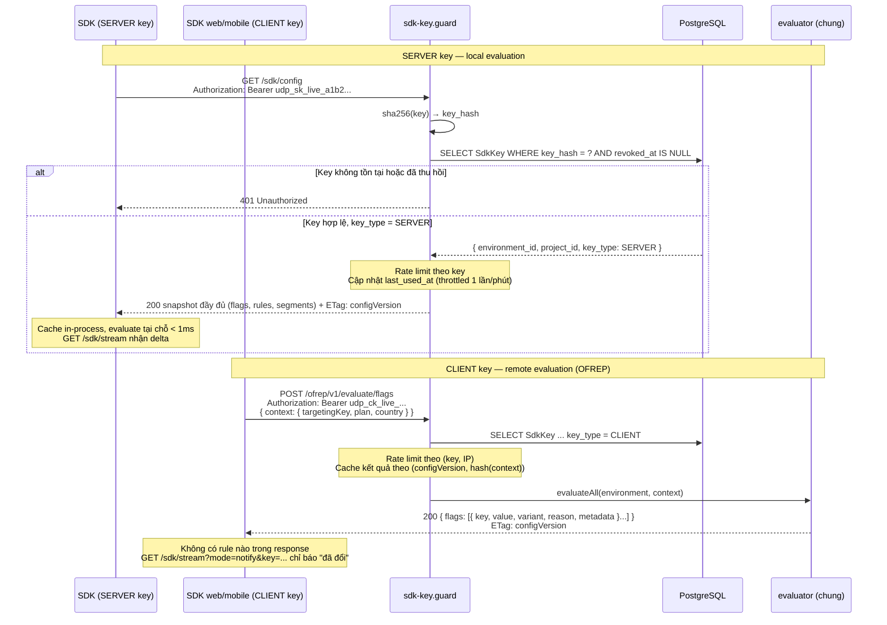

**Nguyên tắc bất biến:** `projectId` **không bao giờ** là tham số quyết định quyền truy cập. Environment và project được suy ra **từ key**, không từ tham số do client gửi lên. Nhờ vậy không tồn tại lỗ hổng "đổi projectId trong query string để đọc dữ liệu project khác".

**Vì sao CLIENT key không nhận rule nữa (v4):** v3 gửi rule "đã lược PII" (hash userId, bỏ rule `sensitive`). Bốn lý do cách đó không đứng vững — xem ADR-03: salt public nên hash bị dictionary attack; segment không được lược; delta SSE không được lược; và bỏ rule làm **đổi rule nào khớp tiếp theo**, tức là sai kết quả chứ không chỉ "có thể khác". Cách của mọi hệ tham chiếu (LaunchDarkly, Unleash Edge, flagd web) là evaluate phía server cho client SDK. UDP làm theo, bằng chuẩn **OFREP** của chính OpenFeature nên client dùng được provider có sẵn.

**Một evaluator, hai đường vào:**

| | SERVER (local) | CLIENT (OFREP) |
| - | -------------- | -------------- |
| Ai chạy `evaluateFlag()` (§6.5) | SDK trong app | Service 2 |
| Dữ liệu vào | Snapshot + delta (SSE) | Evaluation context của một người dùng |
| Đầu ra | `ResolutionDetails` | `ResolutionDetails` **giống hệt** cho cùng context — cùng code, cùng hash, cùng salt |
| Độ trễ | < 1ms | 1 RTT (cache hit ≈ 5ms) — có thể bulk-evaluate mọi flag một lần lúc tải trang |
| Khi mất kết nối | Fail-static: dùng cache cuối | OFREP provider giữ kết quả cuối; `PROVIDER_STALE` |
| Thu hồi key | Request kế tiếp 401; stream SSE đang mở không nhận thêm dữ liệu (khoá được kiểm trước mỗi lần đẩy) và bị đóng trong ≤ 5 giây [v4.1] | Request kế tiếp 401 |

> **Đánh đổi được ghi nhận:** CLIENT key có thêm một RTT lúc khởi động và phụ thuộc Service 2 sống để đánh giá lại khi context đổi. Đây là đánh đổi mà mọi hệ feature flag đều chọn cho trình duyệt, vì cái giá ngược lại là rò dữ liệu cá nhân của người dùng cuối.

### 6.3 Local Evaluation với SSE Push — có bảo đảm tin cậy [vá B9]

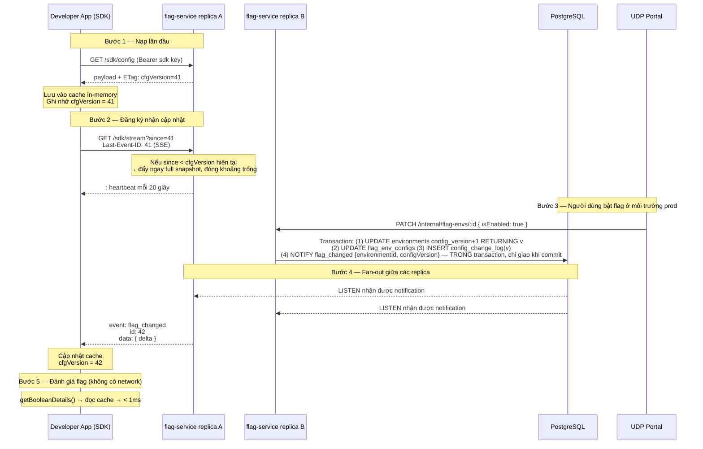

**Kiến trúc lan truyền — polling là nền, `NOTIFY` là bộ tăng tốc [ADR-05]:**

```
Tầng 1 — SỰ THẬT   poll Environment.config_version mỗi 500ms
                    lệch ⇒ lấy snapshot đầy đủ (có cache + ETag)
                    → luôn đúng, không phụ thuộc gì khác

Tầng 2 — NHANH     delta từ ConfigChangeLog, con trỏ theo config_version
                    yêu cầu LIÊN TỤC (n+1); hổng hoặc config_hash lệch
                    → tự rơi về tầng 1

Tầng 3 — ĐÁNH THỨC NOTIFY gọi vòng poll dậy sớm  → độ trễ ~150ms (đo trên Supabase)
                    không có ⇒ chờ hết chu kỳ    → độ trễ ≤ 500ms

→ Mất tầng 3 (pooler transaction mode, serverless autosuspend): CHẬM HƠN.
→ Tầng 2 có bug bất kỳ:                                          TỰ SỬA.
→ Không nhánh nào dẫn tới trạng thái SAI.
```

**Ba biện pháp bắt buộc** (thiếu là hỏng ở tải thật, không hỏng ở test):

| Biện pháp | Vì sao |
| --------- | ------ |
| Cache snapshot theo `(environmentId, keyType)`, xóa khi version tăng | 500 SDK cùng phát hiện thay đổi ⇒ **một** truy vấn DB thay vì 500 |
| Jitter 0–200ms vào chu kỳ poll | Các instance không đồng pha |
| `UPDATE environments ... RETURNING config_version` là thao tác **đầu tiên** của mọi transaction đổi flag; outbox ghi **cuối cùng** | Hàng này là điểm tuần tự hóa duy nhất ⇒ không deadlock, và thứ tự version = thứ tự commit (ADR-05) |

**Năm cơ chế tin cậy — thiếu bất kỳ cái nào thì SSE không dùng được ở production:**

| Vấn đề | Cơ chế | Chi tiết |
| ------ | ------ | -------- |
| **Nhiều replica** — Portal PATCH trúng replica B, app đang cắm SSE ở replica A ⇒ không nhận được event | Outbox `ConfigChangeLog` + poll; `NOTIFY` để tăng tốc | Mọi replica poll `WHERE config_version > $last ORDER BY config_version` mỗi 500ms — **hoạt động kể cả sau connection pooler**. Nếu `LISTEN/NOTIFY` khả dụng thì replica được đánh thức ngay thay vì chờ hết chu kỳ. Payload delta nằm trong bảng nên không vướng giới hạn 8000 byte của `NOTIFY` |
| **Mất event** — mạng chập chờn, proxy cắt kết nối, replica restart | `config_version` đơn điệu tăng + `Last-Event-ID` = version | Mỗi thay đổi tăng version của environment. SDK gửi `since`; nếu server thấy `since` cách xa version hiện tại, nó đẩy **full snapshot** thay vì delta. Replica restart thì đọc tiếp từ con trỏ đã lưu — **replay được**, điều mà Redis Pub/Sub không có |
| **Race lúc khởi động** — event xảy ra giữa lúc GET config và lúc SSE kết nối xong | `ETag` của lần GET đầu chính là `since` của SSE | Khoảng trống được server phát hiện và bù bằng snapshot ở ngay lần kết nối đầu tiên |
| **Proxy đóng kết nối idle** (nginx, ALB thường 60s) | Heartbeat `:\n\n` mỗi 20 giây | Đồng thời cho SDK biết kết nối còn sống để không reconnect thừa |
| **Proxy đệm SSE** (nginx ingress, một số CDN) | Response header `X-Accel-Buffering: no`, `Cache-Control: no-cache, no-transform`, `Content-Type: text/event-stream` [v4] | Không có `X-Accel-Buffering: no`, nginx gom event lại tới khi đầy buffer — SDK nhận muộn hàng chục giây mà không có lỗi nào |
| **Môi trường chặn SSE** (một số corporate proxy, serverless runtime) | Polling fallback | SDK tự chuyển sang `GET /sdk/config` kèm `If-None-Match` mỗi 30s sau 3 lần SSE thất bại liên tiếp. `304 Not Modified` khi không đổi ⇒ chi phí gần bằng 0 |

**Hợp đồng của `GET /sdk/stream` [v4.1]** — thứ provider §6.8 dựa vào, nên chốt từng câu:

| Câu hỏi | Luật |
| ------- | ---- |
| Con trỏ lấy ở đâu | `Last-Event-ID` THẮNG `?since=`: `EventSource` tự gửi `Last-Event-ID` khi nối lại, còn URL vẫn giữ `since` của lần đầu. Nhận ba dạng `41`, `"41"`, `W/"41"` — `since` chép nguyên từ ETag vẫn dùng được. Sai dạng ⇒ 400 |
| Không có con trỏ | Đẩy `snapshot` ngay |
| Con trỏ < version của replica | Đẩy `snapshot` |
| Con trỏ = version | Chỉ gửi header, ngay lập tức — SDK biết đã nối mà không phải chờ nhịp tim |
| Con trỏ > version của replica | Replica này đang tụt (SDK lấy cấu hình ở replica khác). Đối chiếu version THẬT trong database: ≥ con trỏ ⇒ đánh thức watcher, KHÔNG gửi gì cho tới khi cache đuổi kịp; < con trỏ ⇒ environment bị restore ⇒ `snapshot`. Không bao giờ kéo SDK lùi về cấu hình cũ chỉ vì nối nhầm replica |
| `event: snapshot` | `id` = `configVersion`; `data` đúng bằng body của `GET /sdk/config` |
| `event: flag_changed` | `id` = `toVersion`; `data: { fromVersion, toVersion, configHash, changes: [{ configVersion, kind: "flag", flag }] }`. Chỉ gửi khi stream đang ở đúng `(version, hash)` của `fromVersion`, ngược lại gửi `snapshot`. `configHash` là hash TẠI `toVersion` — áp xong phải khớp (I15c). `kind` dành chỗ cho `segment` và `trackedFlags`; `changes` được phép rỗng. Không mang trường kiểm toán nào (như `rolloutSessionId`) |
| `CHANGEFEED_MODE=snapshot` | Mọi thay đổi xuống dạng `snapshot` — đúng thứ E4 muốn đo băng thông |
| `retry:` | Gửi ở đầu stream và trước khi đóng lúc tắt máy, giá trị ngẫu nhiên 1–10 giây — N tiến trình mất kết nối cùng lúc không nối lại cùng một mili-giây |
| Thu hồi khoá | Khoá được kiểm trước MỖI lần đẩy — không dữ liệu mới nào tới khoá đã thu hồi; stream rỗi bị đóng trong ≤ 5 giây |
| Hạn mức | Limiter riêng cho việc mở stream (1 000 lần/phút/khoá) và tối đa 1 000 stream đồng thời/khoá/replica; vượt ⇒ 429 kèm `Retry-After`. Replica đang tắt ⇒ 503 kèm `Retry-After` |
| Client chậm | Backlog của một stream vượt 1 MiB ⇒ huỷ stream; client nối lại bằng `Last-Event-ID` và nhận `snapshot` mới. Tổng backlog mọi stream có trần 64 MiB mỗi tiến trình |

**Vì sao SSE chứ không phải WebSocket:** chỉ cần đẩy một chiều server → SDK; SSE có sẵn cơ chế reconnect và `Last-Event-ID` trong chuẩn HTML, đi qua được HTTP/2 và mọi proxy hiểu HTTP thường.

**SSE ở trình duyệt [v4]:** `EventSource` **không gửi được header `Authorization`** và trình duyệt giới hạn 6 kết nối/domain trên HTTP/1.1. Với CLIENT key (vốn public), `GET /sdk/stream?mode=notify&key=…` chấp nhận key trong query string (chỉ báo "đã đổi", không mang cấu hình), Service 2 phục vụ qua HTTP/2, và OFREP provider gọi lại `POST /ofrep/v1/evaluate/flags` khi nhận thông báo.

**Vì sao Local Evaluation:** remote evaluation ~50–200ms/lần gọi và tạo phụ thuộc runtime cứng — flag service chết thì app của developer chết theo. Local evaluation cho latency < 1ms và **fail-static**: mất kết nối thì SDK tiếp tục dùng cache cuối cùng, ứng dụng vẫn chạy đúng.

### 6.4 Consistent Hashing và phân phối theo trọng số [vá B8; v4: distribution]

```typescript
import murmur from "murmurhash3js";

const TOTAL_BUCKETS = 100_000; // đơn vị 0,001% — hỗ trợ ngưỡng 0.5%

interface BucketInput {
  /** Giá trị của thuộc tính stickiness — mặc định targetingKey */
  stickyValue: string | undefined;
  flagKey: string;
  /** Salt cố định sinh khi tạo rule — hai rule phân phối khác nhau chọn hai nhóm khác nhau */
  bucketSalt: string;
}

/**
 * [v4.1] Bam tren BYTE UTF-8, khong bam tren chuoi JS.
 *
 * `murmurhash3js` doc khoa bang `charCodeAt(i) & 0xff`, tuc cat moi ky tu con
 * byte thap cua UTF-16. Da do: `hash("Nguyen" co dau) === hash("NguyAn")`, va
 * 95/95 cap ky tu `C` vs `C+0x100` deu va cham. Ba hau qua, ca ba deu im lang:
 *
 *   1. Hai tenant ten khac nhau roi dung cung bucket — canary 10% boc trung
 *      hoac truot ca cum thay vi lay mau ngau nhien.
 *   2. Cung mot nguoi dung tren iOS (NFD) va Android (NFC) nhan HAI variant
 *      khac nhau. Bat bien I2 (sticky theo user) vo ma khong ai thay.
 *   3. SDK ngon ngu khac dung murmur3 chuan tren byte UTF-8 se ra bucket khac
 *      cho MOI chuoi co dau. Bat bien I26 (local == OFREP) vo.
 *
 * Khong test tieng Anh nao lo ra duoc ba dieu tren.
 *
 * Cach vá: chuan hoa NFC roi ma hoa UTF-8, doc lai bang `latin1` de moi code
 * unit dung bang mot byte. Da do: voi ASCII ket qua KHONG DOI (2000/2000), nen
 * tuong thich nguoc va khop murmur3 chuan; voi tieng Viet het va cham; NFD va
 * NFC cho cung hash; phan bo van deu (9.91% roi vao 10% dau tren 20 000 user).
 */
const utf8Bytes = (value: string): string =>
  Buffer.from(value.normalize("NFC"), "utf8").toString("latin1");

function bucketOf({ stickyValue, flagKey, bucketSalt }: BucketInput): number {
  return murmur.x86.hash32(utf8Bytes(`${bucketSalt}:${flagKey}:${stickyValue}`)) % TOTAL_BUCKETS;
}

type Pick =
  | { kind: "variant"; variantId: string }
  | { kind: "distribution"; variantId: string }
  | { kind: "no-sticky" };

/** Chọn variant từ rule.serve. Với distribution, bucket rơi vào khoảng tích lũy nào thì lấy variant đó. */
function pickVariant(rule: FlagTargetingRule, input: BucketInput): Pick {
  if (rule.serve.kind === "variant") return { kind: "variant", variantId: rule.serve.variantId };

  // [FIX] v2 hash thẳng context.userId. Nếu undefined (người dùng ẩn danh) thì mọi người dùng
  // ẩn danh hash ra CÙNG MỘT chuỗi → tất cả rơi vào cùng một bucket → hoặc tất cả thấy, hoặc không ai thấy.
  if (input.stickyValue == null || input.stickyValue === "") return { kind: "no-sticky" };

  const b = bucketOf(input);
  let acc = 0;
  for (const w of rule.serve.weights) {        // thứ tự weights cố định theo variantId — không sort lúc chạy
    acc += w.weight;
    if (b < acc) return { kind: "distribution", variantId: w.variantId };
  }
  return { kind: "distribution", variantId: rule.serve.weights.at(-1)!.variantId }; // tổng = 100 000 nên không tới đây
}
```

| Sửa so với v2/v3 | Vấn đề | Cách sửa |
| ---------------- | ------ | -------- |
| **Người dùng ẩn danh** | `undefined` userId ⇒ toàn bộ traffic ẩn danh vào cùng một bucket ⇒ canary 10% có thể thành 0% hoặc 100% thực tế | Trả `no-sticky`, rule bị bỏ qua, evaluator đi tiếp (reason `DEFAULT` nếu không rule nào khớp); SDK cho phép cấu hình `anonymousFallback: "sticky-session"` để tự sinh và lưu một sessionId ổn định. **Khác Unleash** (Unleash chọn ngẫu nhiên khi thiếu định danh) — UDP không giả vờ đã phân nhóm |
| **Thuộc tính stickiness cứng** | Chỉ hash `userId`; không rollout theo `accountId` (B2B: cả công ty cùng thấy hoặc cùng không) được | `FeatureFlag.stickiness_attribute` cấu hình được, mặc định `targetingKey` theo chuẩn OpenFeature |
| **Thiếu salt theo rule** | Hai rule 10% trên cùng flag chọn **đúng cùng nhóm người** — sai lệch thống kê nghiêm trọng khi so sánh hai nhánh | `bucket_salt` sinh 1 lần khi tạo rule, không đổi về sau (đổi = xáo lại nhóm người dùng) |
| **Chỉ hỗ trợ số nguyên** | `% 100` không biểu diễn được 0.5% — nhu cầu thật khi canary trên traffic lớn | 100 000 bucket — **độ phân giải như LaunchDarkly** (Unleash chỉ chuẩn hóa về 1..100 và đã từ chối hỗ trợ dưới 1%; v3 ghi "cùng lựa chọn với Unleash" là sai) |
| **Percentage rồi fall-through (v3)** | Chia 3 variant bằng chuỗi rule 33% → 33% → default cho ra 33/22/45; không làm được "10% người dùng ở VN" | Rule = điều kiện (ai) + `serve` (phục vụ gì: một variant hoặc phân phối tổng 100 000). Cùng mô hình với LaunchDarkly, Unleash variants, flagd `fractional` |
| **MD5** | Chậm hơn và mang hàm ý mật mã không cần thiết | MurmurHash3 — cùng hàm hash với Unleash và flagd; đây không phải bài toán bảo mật mà là bài toán phân phối đều |

> **Bất biến quan trọng, và phạm vi đúng của nó:** `bucket_salt` **không được đổi** khi người dùng chỉnh trọng số. Tăng `on` từ 10% → 20% phải là *mở rộng* nhóm cũ (ai đang thấy vẫn tiếp tục thấy), không phải bốc lại nhóm mới. Thứ tự `weights` cố định theo `variantId` nên khoảng tích lũy chỉ **dịch**, không đảo.
>
> **Nhưng "chỉ dịch" không có nghĩa là mọi variant đều sticky.** Với ba variant trở lên, tăng trọng số của variant **đứng trước** làm dịch khoảng của **mọi variant sau nó**: người dùng ở cuối khoảng của variant B có thể rơi sang C dù không ai đụng tới B hay C. Vì vậy I1 được phát biểu chính xác là: *tập người dùng của **variant đang được ramp** ở trọng số nhỏ là tập con của chính nó ở trọng số lớn hơn* — không phải "mọi variant đều giữ nguyên nhóm". Đây là hành vi chung của mô hình khoảng tích lũy (LaunchDarkly cũng vậy) và **chấp nhận được với canary**, vốn luôn là hai nhánh; nó chỉ thành vấn đề với thử nghiệm nhiều nhánh chạy dài. Ghi ở §16. Test I1 kiểm đúng phát biểu đã thu hẹp này, không kiểm một mệnh đề mạnh hơn thứ hệ thống bảo đảm.

### 6.5 Flag Evaluation Algorithm [v4: một evaluator cho local và OFREP]

```typescript
function evaluateFlag(
  flagKey: string,
  expectedType: FlagType,
  codeDefault: unknown,
  context: EvaluationContext,
  cache: FlagCache, // cache của ĐÚNG environment gắn với SDK key (local) hoặc snapshot in-memory của Service 2 (OFREP)
): ResolutionDetails {
  if (!cache.ready)
    return { value: codeDefault, reason: "ERROR", errorCode: "PROVIDER_NOT_READY" };

  const flag = cache.getFlag(flagKey);
  if (!flag)
    return { value: codeDefault, reason: "ERROR", errorCode: "FLAG_NOT_FOUND" };

  // [v4] Flag ARCHIVED vẫn có mặt trong snapshot dưới dạng tombstone { key, archived: true }.
  // v3 bỏ flag archived khỏi payload nên SDK trả FLAG_NOT_FOUND thay vì DISABLED như §6.7 hứa.
  if (flag.archived)
    return { value: codeDefault, reason: "DISABLED", flagMetadata: { archived: true } };

  if (flag.flagType !== expectedType)
    return { value: codeDefault, reason: "ERROR", errorCode: "TYPE_MISMATCH" };

  const envConfig = flag.envConfig; // đã là của đúng environment
  if (!envConfig.isEnabled)
    return { value: codeDefault, reason: "DISABLED" };

  const meta = { envId: envConfig.environmentId, stale: cache.stale };
  const stickyValue = context[flag.stickinessAttribute] ?? context.targetingKey;

  for (const rule of envConfig.rules) {
    // rules đã được sắp theo priority tăng dần lúc dựng cache — không sort mỗi lần gọi
    if (!matches(rule, context, cache)) continue;

    const pick = pickVariant(rule, { stickyValue, flagKey, bucketSalt: rule.bucketSalt });
    if (pick.kind === "no-sticky") continue;   // distribution nhưng không có định danh ổn định → bỏ qua rule này

    const variant = flag.variantsById[pick.variantId];
    if (!variant)   // [v4] không throw — v3 truy cập flag.variants[key].value và có thể crash app khách
      return { value: codeDefault, reason: "ERROR", errorCode: "GENERAL", errorMessage: "orphan variant" };

    return {
      value: variant.value,
      variant: variant.key,
      reason: pick.kind === "distribution" ? "SPLIT" : "TARGETING_MATCH",
      flagMetadata: { ...meta, ruleId: rule.id },
    };
  }

  const defId = envConfig.defaultVariantId ?? flag.defaultVariantId;
  const def = flag.variantsById[defId];
  if (!def)
    return { value: codeDefault, reason: "ERROR", errorCode: "GENERAL", errorMessage: "orphan default variant" };
  return { value: def.value, variant: def.key, reason: "DEFAULT", flagMetadata: meta };
}

/** "Ai khớp" — tách khỏi "phục vụ gì" (pickVariant ở §6.4) */
function matches(rule: FlagTargetingRule, ctx: EvaluationContext, cache: FlagCache): boolean {
  switch (rule.ruleType) {
    case "ALL":
      return true;
    case "USER_BASED":
      // Set thay vì Array.includes — O(1) thay vì O(n) với danh sách 10 000 user
      return rule.userIdSet.has(String(ctx.targetingKey));
    case "ATTRIBUTE_BASED":
      return rule.condition.all.every((c) => evaluateAttributeCondition(c, ctx));
    case "SEGMENT": {
      const seg = cache.getSegment(rule.condition.segmentId);
      if (!seg) return false;   // segment đã xóa → rule không khớp; validator chặn xóa segment còn tham chiếu
      return (seg.userIdSet?.has(String(ctx.targetingKey)) ?? false)
          || seg.conditions.all.every((c) => evaluateAttributeCondition(c, ctx));
    }
    default:
      return false;
  }
}
```

**Ba tối ưu ở tầng dựng cache** (chạy 1 lần khi nhận payload, không phải mỗi lần đánh giá):

| Tối ưu | Trước | Sau |
| ------ | ----- | --- |
| Sắp rule theo `priority` | `.sort()` mỗi lần gọi — O(n log n) trên đường nóng | Sắp sẵn khi dựng cache |
| `userIds` | `Array.includes()` — O(n) | `Set` — O(1) |
| Tra variant | Duyệt mảng | `Record<variantId, variant>` |

> **Cùng một hàm ở hai nơi:** package `@udp/flag-evaluator` được SDK server (local) và Service 2 (OFREP, `/internal/flags/:id/evaluate`, Flag Evaluation Tester trên Portal) dùng chung. Bất biến I26: property-based test sinh context ngẫu nhiên, khẳng định local và OFREP cho cùng `ResolutionDetails`.

### 6.6 Telemetry — gắn nhãn variant vào metric HTTP, nền tảng của đóng góp C1 [vá B6; v4 viết lại]

Đây là mảnh ghép làm cho auto-rollback ở tầng feature flag khả thi. Không có nó, không có cách nào biết một request đã chạy nhánh nào của flag. v3 mô tả sai ở ba chỗ, v4 sửa cả ba:

| Vấn đề của v3 | Vì sao sai | v4 |
| ------------- | ---------- | -- |
| `FlagBaggage.set(otelContext.active(), …)` trong hook | OpenTelemetry context và baggage **bất biến**: `propagation.setBaggage()` trả về context *mới*, middleware HTTP đang chạy không nhìn thấy. Code như viết không hoạt động | Request-scoped store bằng **`AsyncLocalStorage`** do middleware tạo *trước* handler; hook ghi vào store đó |
| Tự viết span attribute `feature_flag.variant` và counter `udp_flag_evaluation_total` | `feature_flag.variant` đã **deprecated** trong OTel semconv (nay là `feature_flag.result.variant`, `feature_flag.provider.name`, `feature_flag.result.reason`); OpenFeature đã có `@openfeature/open-telemetry-hooks` (TracingHook, MetricsHook) làm đúng việc này | Dùng hook chính thức cho span và counter; phần **riêng của UDP** chỉ là gắn nhãn variant vào metric HTTP |
| Hai lược đồ nhãn mâu thuẫn: `feature_flag_dark_mode="on"` (§6.6) và `feature_flag_key`/`feature_flag_variant` (§7.4); không nói gì về request đánh giá **nhiều** flag | Với cặp key/variant, một request đánh giá 20 flag không biểu diễn được bằng một series; với **tên nhãn** theo flag (`ff_<key>`), series nhân theo tích số variant ⇒ nổ cardinality, và prom-client không cho thêm tên nhãn sau khi histogram đã tạo | **Chỉ gắn nhãn cho flag đang có rollout** (`trackedFlags`, ≤ 3 mỗi environment), dùng **một tên nhãn cố định `ff`** mang giá trị ghép `"<flagKey>=<variant>"`, cộng thêm chứ không nhân chéo; chi phí đo ở E14 |

```typescript
import { OpenFeature } from "@openfeature/server-sdk";
import { TracingHook, MetricsHook } from "@openfeature/open-telemetry-hooks";   // chính thức
import { AsyncLocalStorage } from "node:async_hooks";
import { Histogram, Counter } from "prom-client";

// ---- 1. Hook chính thức: span attributes + counter theo semconv, không viết lại ----
OpenFeature.addHooks(new TracingHook(), new MetricsHook());
//   feature_flag.key, feature_flag.provider.name, feature_flag.result.variant, feature_flag.result.reason

// ---- 2. Phần riêng của UDP: request-scoped store ----
interface RequestFlagStore { picks: Map<string, string> }   // flagKey → variantKey, chỉ tracked flags
const store = new AsyncLocalStorage<RequestFlagStore>();

/**
 * trackedFlags: tập flag đang có RolloutSession FLAG_LEVEL active ở environment này.
 * Service 2 đẩy tập này xuống SDK qua stream (§6.3 — phần tử `kind: "trackedFlags"` của `flag_changed`, hoặc `snapshot`), nên developer không phải cấu hình.
 * Giới hạn mặc định 3 flag/environment (RolloutSession bị từ chối nếu vượt) — cardinality có trần.
 */
export class UDPRequestLabelHook implements Hook {
  constructor(private provider: UDPFeatureFlagProvider) {}
  after(hookCtx: HookContext, details: EvaluationDetails<unknown>) {
    const s = store.getStore();
    if (!s) return;                                             // ngoài HTTP request (job nền) → chỉ có counter của MetricsHook
    if (!this.provider.trackedFlags.has(hookCtx.flagKey)) return;
    if (!details.variant) return;                               // DISABLED / ERROR → không gắn nhãn
    s.picks.set(hookCtx.flagKey, details.variant);              // lần đánh giá cuối trong request thắng
  }
}

// ---- 3. Middleware: mở store, đo request, ghi metric có nhãn ----
const duration = new Histogram({
  name: "http_server_request_duration_seconds",          // theo OTel semconv http.server.request.duration
  help: "HTTP server request duration",
  labelNames: ["service_name", "service_version", "http_route", "http_request_method",
               "http_response_status_code", "ff"],       // "ff" = nhãn tổng hợp, xem dưới
  buckets: [0.005, 0.01, 0.025, 0.05, 0.1, 0.25, 0.5, 1, 2.5, 5],
});

export function udpMetricsMiddleware(): RequestHandler {
  return (req, res, next) => {
    const start = process.hrtime.bigint();
    store.run({ picks: new Map() }, () => {
      res.on("finish", () => {
        const s = store.getStore()!;
        const sec = Number(process.hrtime.bigint() - start) / 1e9;
        // Một series KHÔNG nhãn flag (tổng), cộng một series cho MỖI tracked flag đã đánh giá.
        // Không nhân chéo các flag với nhau ⇒ số series = (1 + Σ variants của tracked flags), không phải tích.
        duration.observe(labels(req, res, ""), sec);
        for (const [flagKey, variant] of s.picks)
          duration.observe(labels(req, res, `${sanitize(flagKey)}=${variant}`), sec);
      });
      next();
    });
  };
}
```

**Lược đồ nhãn (thống nhất cho §6.6, §7.4, §11):** một nhãn `ff` có giá trị `"<flagKey>=<variant>"` (ví dụ `ff="checkout_v2=on"`), hoặc rỗng cho series tổng. Lý do dùng một nhãn giá trị ghép thay vì nhãn theo tên flag: tên nhãn Prometheus phải cố định khi tạo histogram (prom-client), còn flag được tạo động; giá trị nhãn thì tự do. Truy vấn của Service 3 lọc `ff="checkout_v2=on"` và so với `ff="checkout_v2=off"`.

**Chi phí cardinality (E14):** với `T` tracked flags có `V` variant mỗi flag, `R` route, `S` status, `B` bucket: số series histogram = `R × S × (B + 2) × (1 + T × V)`. Với T = 3, V = 2 thì hệ số là 7 — cộng thêm, không nhân chéo. Đây là lý do `trackedFlags` bắt buộc: gắn nhãn cho *mọi* flag (v3) với 50 flag là hệ số 101, và nếu nhân chéo là 2^50.

**Ngữ nghĩa attribution — phải nói rõ khi bảo vệ:**

| Tình huống | Ý nghĩa của error rate theo variant |
| ---------- | ------------------------------------ |
| Chiến lược **Canary theo hash** (distribution ngẫu nhiên) | Hai nhóm `on`/`off` là hai mẫu ngẫu nhiên của cùng quần thể ⇒ chênh lệch error rate quy được cho nhánh flag. Đây là trường hợp duy nhất auto-rollback được phép chạy |
| **Attribute Split** (theo quốc gia, gói…) | Hai nhóm khác nhau về bản chất ⇒ confounded hoàn toàn. Chỉ hiển thị, **không** auto-rollback (§7.2) |
| Nhiều flag cùng rollout trong một service | Giả định các flag độc lập; tương tác giữa flag không tách được bằng nhãn cộng. Ghi ở §16, giới hạn 3 flag đồng thời |
| Request có lỗi do code không liên quan tới flag | Lỗi rơi đều vào cả hai nhóm (ngẫu nhiên) ⇒ không tạo chênh lệch; ngưỡng tương đối so với baseline (§7.4) lọc được nền lỗi sẵn có |
| Flag được đánh giá **sau** khi response đã gửi, hoặc trong job nền | Không có store ⇒ không gắn nhãn; chỉ có counter của MetricsHook. Ghi ở §16 |

```promql
# Error rate của nhánh "on" so với nhánh "off" của CÙNG MỘT deployment, cùng service_version
sum(rate(http_server_request_duration_seconds_count{
  service_name="checkout", ff="checkout_v2=on", http_response_status_code=~"5.."
}[1m]))
/
sum(rate(http_server_request_duration_seconds_count{
  service_name="checkout", ff="checkout_v2=on"
}[1m]))
```

| So sánh | Flagger / Argo Rollouts | LaunchDarkly Guarded Rollouts, GrowthBook, Statsig | UDP flag-level (C1) |
| ------- | ----------------------- | --------------------------------------------------- | ------------------- |
| Đơn vị so sánh | Pod version cũ vs mới | Variation của flag | Nhánh flag `on` vs `off`, **cùng một pod, cùng một binary** |
| Nguồn tín hiệu | Prometheus/Datadog của hạ tầng | Event do SDK gửi về nền tảng của vendor, hoặc metric import | **Prometheus/Datadog của hạ tầng** qua nhãn `ff` — app không gửi event đi đâu |
| Rollback | Đổi trọng số traffic, chờ pod ổn định | Đổi targeting của flag | Đổi `serve.weights` → SSE đẩy xuống SDK, **có hiệu lực trong vài trăm ms** |
| Cùng control loop với canary mức service | Chỉ mức service | Chỉ mức flag | **Cả hai**, cùng `RolloutSession`, cùng intent/audit |
| Mã nguồn mở, self-hosted | Có | Không (trừ Bucketeer, dùng goal event) | Có |

> **Giới hạn trung thực:** cách này yêu cầu app dùng `udpMetricsMiddleware()` (hoặc tự gắn nhãn `ff` từ store) và cài hook — Golden Path template đã tích hợp sẵn; với `Import Existing Repo`, Portal phát hiện thiếu và hướng dẫn thêm. Nếu app không gắn nhãn, `MetricsProvider.probe()` báo `hasSeries = false` ngay ở màn hình tạo rollout, và flag-level rollout bị chặn với thông báo rõ lý do — không bao giờ chạy mù. Ngôn ngữ khác Node.js cần port middleware + store (Python: `contextvars`); §11 và §17.

### 6.7 Flag Lifecycle

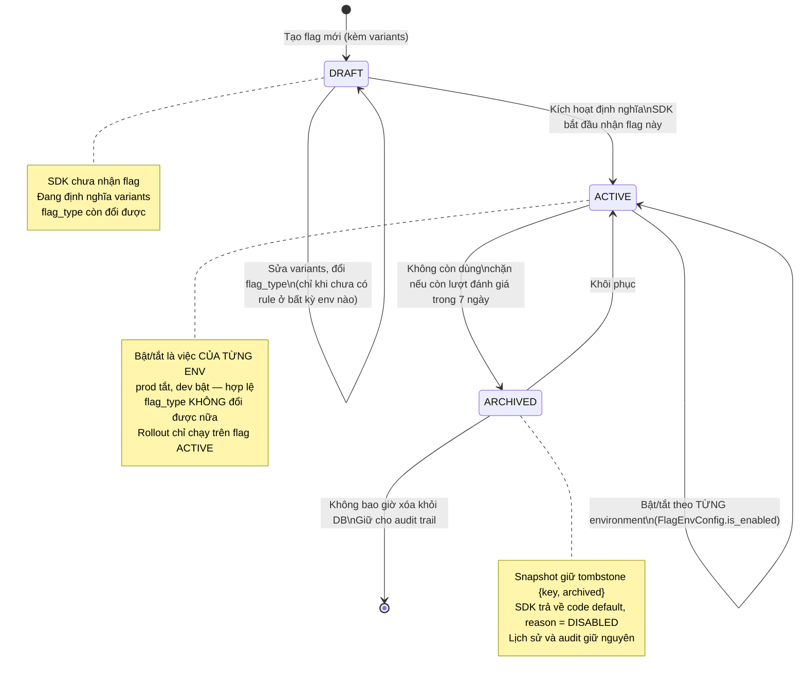

**Phát hiện và dọn flag chết [vá B15]** — dựa trên `FlagEvaluationStat`:

| Cảnh báo | Điều kiện | Đề xuất trên Portal |
| -------- | --------- | ------------------- |
| `UNUSED` | `ACTIVE`, không `permanent`, 0 lượt đánh giá trong 30 ngày | "Code có thể đã bỏ flag này. Archive?" |
| `SETTLED` | 100% lượt đánh giá rơi vào cùng 1 variant suốt 14 ngày, ở mọi env | "Flag đã ổn định ở nhánh `on`. Xóa nhánh điều kiện trong code rồi archive." |
| `STALE_DRAFT` | `DRAFT` quá 30 ngày, chưa từng ACTIVE | "Flag bỏ dở?" |
| `ORPHAN_RULE` | Rule hoặc default trỏ tới variant không tồn tại, hoặc trỏ sang variant của flag KHÁC | Lỗi cấu hình ở nội dung request — 422, không retryable. Sửa `serve` hoặc `default_variant_id` |
| `VARIANT_IN_USE` | Xoá variant còn được rule/default tham chiếu | Request đúng, trạng thái xung đột — 409, **retryable**: gỡ rule đang trỏ tới nó rồi thử lại. Chiều thứ hai của §6.7, v3 chỉ có chiều thứ nhất |

> Đây chính là bước **cleanup** trong vòng đời feature flag mà đề cương đã liệt kê nhưng thiết kế v2 chưa hiện thực. Nợ kỹ thuật do flag chết là vấn đề được ghi nhận rộng rãi trong thực tiễn; cơ chế trên biến nó thành thứ đo được và hành động được.

### 6.8 `@udp/openfeature-provider` — package chạy trong ứng dụng của khách [NEW v4]

Mọi thành phần lớn của UDP đều có mục đặc tả riêng, trừ đúng cái mang đóng góp **C1** vào ứng dụng của developer. Trước v4, package này chỉ xuất hiện dưới dạng một dòng trong cây thư mục §3.1 và vài lần `import` trong code mẫu §6.1, §6.6 và §11 — tức là thứ khó nhất phải viết lại không có thiết kế. Mục này lấp chỗ đó.

**Vì sao nó xứng đáng có mục riêng:** đây là phần **duy nhất** của hệ thống chạy trong tiến trình của người khác. Một bug ở đây làm sập ứng dụng của khách, không phải control plane của UDP. Nó cũng là nơi ba yêu cầu mâu thuẫn nhau gặp nhau: đánh giá dưới 1ms, luôn có câu trả lời kể cả khi mất mạng, và không bao giờ trả sai giá trị.

#### Bốn thành phần

| Thành phần | Trách nhiệm | Dùng ở đâu |
| ---------- | ----------- | ---------- |
| `UDPFeatureFlagProvider` | Provider theo spec OpenFeature cho **SERVER key**: tải snapshot, giữ cache, nhận delta qua SSE, đánh giá tại chỗ bằng `@udp/flag-evaluator` | Backend Node.js của developer |
| Provider web | **Không tự viết.** Là `@openfeature/ofrep-web-provider` chuẩn, chỉ cấu hình `baseUrl` và header key (§6.1) | Trình duyệt, mobile |
| `UDPRequestLabelHook` | Ghi `flagKey → variant` của **tracked flag** vào request store | Bắt buộc cho C1 |
| `udpMetricsMiddleware` | Mở request store bằng `AsyncLocalStorage`, phát metric có nhãn `ff` khi response kết thúc | Bắt buộc cho C1 |

#### Máy trạng thái của cache — nguồn của mọi event OpenFeature

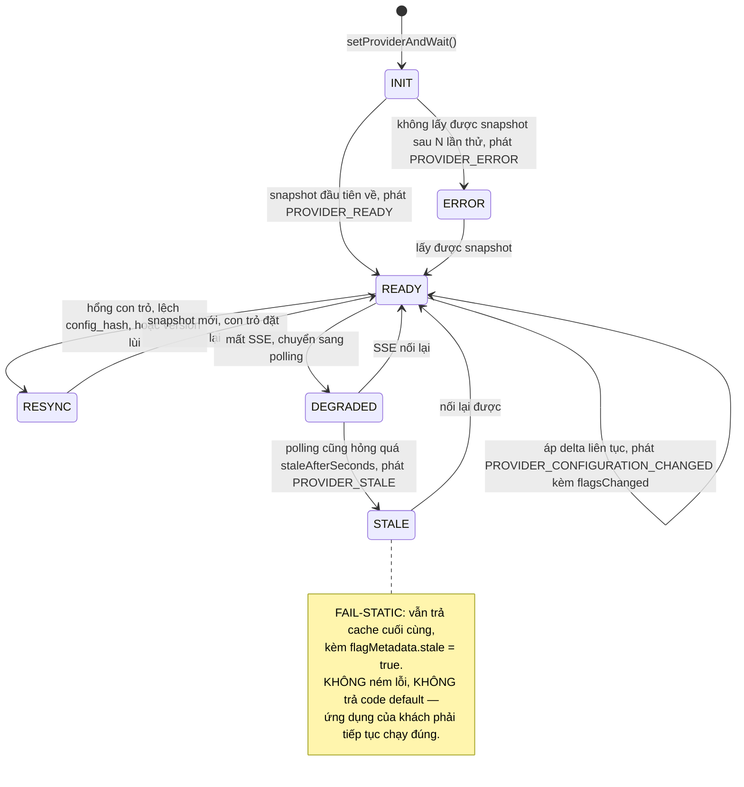

**Nguyên tắc chi phối toàn bộ máy trạng thái:** trạng thái xấu nhất là **cũ**, không bao giờ là **sai** và không bao giờ là **sập**. Đây là ADR-05 áp cho phía client: đúng nhờ cache bền vững, nhanh nhờ SSE.

**Luật phía provider khi đọc stream [v4.1]** — thiếu chúng thì máy trạng thái trên không hiện thực được chỉ từ tài liệu:

- **RESYNC** = `GET /sdk/config` **không** kèm `If-None-Match`, hoặc mở stream mới **không** con trỏ. ETag là số đếm chứ không phải checksum, nên RESYNC kèm `If-None-Match` sẽ nhận 304 "xác nhận" đúng cái cache đang hỏng.
- `configHash` rỗng nghĩa là environment **chưa có mốc** (chưa từng bị ghi) — không phải lệch; coi nó là lệch thì RESYNC vô tận.
- `flag_changed` có `toVersion ≤ con trỏ` ⇒ bỏ qua (đến trễ hoặc trùng); `fromVersion ≠ con trỏ` ⇒ RESYNC.
- `snapshot` luôn thay cache, **kể cả khi version thấp hơn con trỏ** — đó là environment bị restore, và server đã đối chiếu với database trước khi gửi.
- Event lạ, hoặc phần tử `changes[]` có `kind` lạ ⇒ RESYNC, không bỏ qua im lặng.
- `PROVIDER_CONFIGURATION_CHANGED.flagsChanged`: với `flag_changed` là tập `flag.key` trong `changes`; với `snapshot` là provider tự so cache cũ và mới.
- Hash tính theo luật chuẩn hoá ở `SdkConfigResponse` (§9), không phải băm nguyên văn chuỗi nhận được.
- Tôn trọng `retry:` của server khi nối lại.

#### Cấu hình, và giá trị mặc định phải an toàn

```typescript
interface UDPProviderOptions {
  host: string;
  /** Suy ra project và environment. KHÔNG có tham số projectId (ADR-03) */
  sdkKey: string;

  /** Thuộc tính dùng để hash khi flag không chỉ định. Mặc định theo chuẩn OpenFeature */
  stickinessFallback?: string;              // mặc định "targetingKey"
  /**
   * Người dùng ẩn danh (§6.4). "skip" = bỏ qua rule distribution, đi tiếp — mặc định,
   * vì nó TRUNG THỰC: hệ thống không giả vờ đã phân nhóm.
   * "sticky-session" = tự sinh và lưu một sessionId ổn định.
   * KHÔNG có lựa chọn "random": nó làm canary 10% thành 0% hoặc 100% thực tế.
   */
  anonymousFallback?: "skip" | "sticky-session";   // mặc định "skip"

  /** Bao lâu không cập nhật được thì phát PROVIDER_STALE. Mặc định 300s (§6.1) */
  staleAfterSeconds?: number;
  /** Chu kỳ polling khi SSE hỏng. Mặc định 30s (SSE.pollingFallbackMs) */
  pollingIntervalMs?: number;
  /** Số lần SSE hỏng liên tiếp trước khi chuyển polling. Mặc định 3 */
  sseFailuresBeforeFallback?: number;

  /** Gộp và gửi eval count mỗi 60s. Tắt được vì một số môi trường cấm gọi ra ngoài */
  reportStats?: boolean;                    // mặc định true
}
```

> **Vì sao không có tùy chọn "fail-closed":** một số hệ feature flag cho phép ném lỗi khi mất kết nối. UDP cố tình **không** cho, vì flag thường bọc đường đi chính của ứng dụng; fail-closed biến một sự cố của UDP thành một sự cố của khách. Đây là quyết định, không phải thiếu sót, và ghi ở §16.

#### `trackedFlags` lan truyền thế nào

Đây là mắt xích mà §6.6 và §7.7 đều dựa vào nhưng chưa mục nào mô tả đầy đủ:

1. Service 1 tạo `RolloutSession` scope `FLAG_LEVEL` → gọi `POST /internal/rollouts/:id/track` của Service 2 (§9)
2. Service 2 thêm `flagKey` vào tập tracked của environment, **tăng `config_version` trong cùng transaction** như mọi thay đổi khác (ADR-05), rồi đẩy xuống SDK qua stream (§6.3: phần tử `kind: "trackedFlags"` trong `flag_changed`, hoặc `snapshot`)
3. Provider nhận event, cập nhật `provider.trackedFlags` — một `Set` trong bộ nhớ
4. `UDPRequestLabelHook` đọc `Set` đó ở mỗi lần đánh giá; flag không nằm trong đó thì **không gắn nhãn**, nên cardinality có trần cứng
5. Rollout kết thúc → `untrack` → nhãn ngừng được sinh

**Ba tính chất bắt buộc:** (a) tập này nằm trong **cùng đường lan truyền** với cấu hình flag, nên nó thừa hưởng mọi bảo đảm của ADR-05 thay vì là một kênh thứ hai phải tự kiểm; (b) developer **không phải cấu hình gì** — nếu phải khai tay thì họ sẽ quên, và C1 mất dữ liệu đúng lúc cần nhất; (c) provider ở trạng thái `STALE` giữ tập tracked cuối cùng, vì ngừng gắn nhãn giữa một rollout còn tệ hơn gắn nhãn thừa.

#### Ranh giới với gói dùng chung

`@udp/flag-evaluator` (§6.5) được **cả** provider này lẫn Service 2 import. Đây là điều kiện của bất biến **I26**: local evaluation và OFREP phải cho cùng `ResolutionDetails`. Nếu provider tự viết lại hàm đánh giá, I26 không thể đúng bằng cấu trúc mà chỉ đúng nhờ may mắn.

#### Bản Python

Cùng bốn thành phần, khác đúng một thứ: cơ chế mang ngữ cảnh theo request là `contextvars` thay vì `AsyncLocalStorage` (§11). Máy trạng thái, tùy chọn cấu hình, giá trị mặc định và ngữ nghĩa fail-static **giống hệt** — đây là điều kiện để §16 nói được rằng "Golden Path phủ Node.js và Python" mà không phải kèm chú thích về khác biệt hành vi.

#### Bất biến của package

Hai bất biến riêng của package được định nghĩa đầy đủ ở **§13.3** cùng mọi bất biến khác, để không có hai nguồn sự thật cho cùng một mệnh đề:

- **I33** — đánh giá không bao giờ ném lỗi ra ứng dụng của khách
- **I34** — fail-static giữ đúng giá trị cuối và hội tụ sau khi hồi phục

Ngoài ra package chịu chung **I26** (local evaluation và OFREP cho cùng kết quả), cùng **I15a**, **I15c** và **I18** (áp delta và quy tắc rơi tầng), vì nó là một trong hai bên hiện thực đường lan truyền của ADR-05.

---

## 7. Progressive Delivery Design

> Toàn bộ mục này tuân theo **ADR-01**: với mỗi rollout chỉ tồn tại **đúng một control loop** và **đúng một bên ghi vào Kubernetes**.

### 7.1 Reconciliation Loop (Service 3) — lease, fencing và phân tích tách khỏi dwell [vá B5, ADR-05; v4 viết lại]

**Bốn lỗi của v3 được sửa ở đây:**

| Lỗi v3 | Hậu quả | v4 |
| ------ | ------- | -- |
| SQL claim chỉ lấy `PENDING, IN_PROGRESS` trong khi `findReconcilable` gồm cả `PAUSED` | Session PAUSED **không bao giờ được claim** ⇒ intent RESUME/ROLLBACK trên session đang PAUSED không bao giờ chạy | Claim gồm `PAUSED` |
| `if (secondsSinceLastStep < stepIntervalSeconds) return;` đứng **trước** `decide()` | Sau mỗi promote không có phép đo nào trong 5 phút; với `maxConsecutiveBreaches = 2`, MTTD tối thiểu 10 phút — tự phá lập luận "rollback trong một vòng SSE" và làm E5 vô nghĩa | `analysis_interval_seconds` (30s) tách khỏi `step_interval_seconds` (dwell trước khi promote). Breach kiểm mỗi vòng phân tích; promote chỉ khi đủ dwell |
| Side effect (PATCH S2, promote Argo) chạy **trước** `updateIfVersion` | Worker tỉnh muộn sau GC pause bật lại 30% cho tính năng vừa bị rollback rồi mới bị DB từ chối | Fence kiểm lease **trước** side effect; side effect mang `expectedVersion` (`If-Match` sang S2; đọc `status.currentStepIndex` trước khi promote Argo) |
| `renewLease` thất bại bị bỏ qua | Worker mất lease vẫn tiếp tục apply | `renewLease` 0 row ⇒ `fence.abort()` ⇒ mọi bước sau ném lỗi |

```typescript
const LOOP_INTERVAL_MS = 5_000;   // vòng lặp quét mỗi 5s; mỗi session tự quyết theo analysis_interval_seconds của nó

async function reconcileTick() {
  const candidates = await rolloutSessionRepo.findReconcilable();
  // WHERE status IN ('PENDING','IN_PROGRESS','PAUSED') AND (claimed_until IS NULL OR claimed_until < now())
  await Promise.allSettled(candidates.map(reconcileOne));
}

async function reconcileOne(sessionId: string) {
  // Giành quyền bằng LEASE (ADR-05). Replica khác đang giữ thì bỏ qua ngay, không chờ.
  const session = await rolloutSessionRepo.claim(sessionId, { workerId: WORKER_ID, leaseSeconds: 60 });
  if (!session) return;

  // Fence: mọi side effect phải qua fence.assert(); renew thất bại ⇒ abort
  const fence = new Fence(session.id, session.version, WORKER_ID);
  const renew = setInterval(async () => {
    const ok = await rolloutSessionRepo.renewLease(session.id, WORKER_ID, 60);
    // UPDATE ... WHERE id = $1 AND claimed_by = $me AND claimed_until > now()  → 0 row = đã mất lease
    if (!ok) fence.abort("lease lost");
  }, 20_000);

  try {
    // 1. Ý định của người dùng luôn được xử lý TRƯỚC phân tích metrics — kể cả khi PAUSED
    const intent = await rolloutEventRepo.findUnprocessedIntent(session.id);
    if (intent) return applyIntent(session, intent, fence);
    if (session.status === "PAUSED") return;
    if (session.status === "PENDING") return start(session, fence);   // ghi baseline, áp bậc đầu

    // 2. Hết hạn tổng thể — không để rollout treo vô thời hạn; EXPIRED cũng revert về baseline
    if (age(session) > session.maxDurationSeconds)
      return finish(session, fence, "FAILED", "EXPIRED", "Vượt quá thời gian tối đa cho phép", { revert: true });

    // 3. Nhịp phân tích — ĐỘC LẬP với dwell time của bậc
    if (secondsSince(session.lastDecision?.at) < session.analysisIntervalSeconds) return;

    // 4. Phân tích metrics ở MỌI vòng — breach được phát hiện sau ≤ analysis_interval, không phải sau step_interval
    const decision = await decide(session, metricsProviderFor(session));
    await rolloutSessionRepo.setLastDecision(session.id, fence, decision);   // cột JSONB, không phải RolloutEvent
    if (decision.kind === "ROLLBACK") return rollback(session, fence, decision.reason, decision.metrics);
    if (decision.kind === "HOLD") return;

    // 5. PROMOTE chỉ khi đã ở bậc hiện tại đủ lâu
    if (secondsSince(session.lastStepAt) < session.stepIntervalSeconds) return;
    return promote(session, fence, decision.metrics);
  } finally {
    clearInterval(renew);
    await rolloutSessionRepo.releaseLease(session.id, WORKER_ID);
  }
}
```

**Phân tích metrics và ra quyết định** (dùng chung cho `flag-level` và `service-level-udp`; chi tiết thống kê ở §7.4):

```typescript
async function decide(session: RolloutSession, provider: MetricsProvider): Promise<Decision> {
  const win = session.metricWindowSeconds;                    // ≥ 4 × scrape interval (validator ép)
  const canary = targetOf(session);                            // {ff: "key=on"} hoặc {version: new}
  const baseline = baselineOf(session);                        // {ff: "key=off"} hoặc {version: old}

  // [v4] Không đo cho tới khi cửa sổ nằm TRỌN sau bậc mới + độ trễ scrape.
  // Nếu không, phép đo đầu tiên lẫn dữ liệu của bậc trước (SSE ~1s + scrape 15–60s).
  if (now() < session.lastStepAt + win + provider.scrapeLagSeconds)
    return hold("Chờ cửa sổ metric ổn định sau bậc mới");

  const [cReq, cErr, cP99, bReq, bErr] = await Promise.all([
    provider.requestCount(canary, win), provider.errorCount(canary, win), provider.latencyP99(canary, win),
    provider.requestCount(baseline, win), provider.errorCount(baseline, win),
  ]);

  // [QUAN TRỌNG] Không có dữ liệu KHÔNG PHẢI là "không có lỗi".
  if (!cReq.hasData || !cErr.hasData) return hold("Nguồn metrics không trả dữ liệu");

  // Warm-up: quá ít request thì 1 lỗi cũng thành error rate rất cao
  if (cReq.value < session.warmUpRequests)
    return hold(`Mới ${cReq.value}/${session.warmUpRequests} request`);

  const t = session.thresholds;
  const canaryRate = cErr.value / cReq.value;

  // (a) Ngưỡng tuyệt đối — kèm số lỗi tối thiểu, vì ở 100 request độ phân giải là 1%
  let breached = canaryRate > t.errorRate && cErr.value >= (t.minErrors ?? 5);

  // (b) Ngưỡng tương đối so với baseline + kiểm định hai tỉ lệ (§7.4) — lọc nền lỗi sẵn có
  if (t.relativeErrorRate && bReq.hasData && bErr.hasData && bReq.value >= session.warmUpRequests) {
    const baseRate = bErr.value / bReq.value;
    const z = twoProportionZ(cErr.value, cReq.value, bErr.value, bReq.value);
    breached ||= canaryRate > t.relativeErrorRate * baseRate && z > 1.645;   // one-sided, α = 0.05
  }

  // (c) Latency — chỉ khi có dữ liệu
  breached ||= cP99.hasData && cP99.value > t.latencyP99Ms;

  const metrics = snapshot({ cReq, cErr, cP99, bReq, bErr, queries });
  if (!breached) return promoteOk(metrics);                    // streak reset

  // Không rollback ngay ở lần vượt ngưỡng đầu tiên — một spike thoáng qua không nên hủy cả rollout.
  // Chỉ đếm là "liên tiếp" khi hai phép đo cách nhau ≥ một cửa sổ (không chồng lấn).
  const prev = session.lastDecision;
  const streak = prev?.kind === "HOLD" && prev.breach && now() - prev.at >= win ? prev.breachStreak + 1 : 1;
  if (streak >= t.maxConsecutiveBreaches)
    return rollbackDecision(`errorRate ${canaryRate.toFixed(4)} > ngưỡng trong ${streak} lần đo liên tiếp`, metrics);
  return hold(`Vượt ngưỡng lần ${streak}/${t.maxConsecutiveBreaches}, chờ xác nhận`, { breach: true, breachStreak: streak, metrics });
}
```

**Ghi kết quả — fence trước side effect, side effect mang version, DB sau:**

```typescript
async function promote(session: RolloutSession, fence: Fence, metrics: MetricSnapshot) {
  const next = Math.min(session.currentTrafficPercentage + session.stepPercent, 100);
  const done = next >= 100;

  // (1) Fence: vẫn còn lease? Nếu không thì dừng TRƯỚC khi chạm cluster/S2.
  fence.assert();

  // (2) Side effect mang expectedVersion — bên nhận từ chối nếu đã có phiên bản mới hơn:
  //     - S2: PATCH /internal/rules/:id với If-Match: "<sessionId>:<version>"; S2 so với RolloutSession.version [v4.1]
  //     - Argo: đọc status.currentStepIndex, chỉ promote nếu == chỉ số mong đợi; patch mang resourceVersion
  const applied = await executor.applyTraffic(session, next, { expectedVersion: session.version });
  if (applied.status === "PRECONDITION_FAILED") return;      // bên khác đã đổi; vòng sau đọc trạng thái quan sát được
  if (applied.status !== "SUCCESS") return holdAndRecord(session, fence, `Không áp dụng được: ${applied.message}`);

  // (3) DB sau cùng, có optimistic lock. Thứ tự này vẫn giữ nguyên tắc v3:
  //     "cluster trước, DB sau" — DB nói 50% trong khi cluster 30% là trạng thái sai nguy hiểm hơn.
  const updated = await rolloutSessionRepo.updateIfVersion(session.id, session.version, {
    currentTrafficPercentage: next,
    status: done ? "DONE" : "IN_PROGRESS",
    lastStepAt: now(),
    version: session.version + 1,
  });
  if (!updated) {
    // Không thể xảy ra nếu (1)(2) đúng — nhưng nếu xảy ra thì cluster và DB đã lệch: alert, vòng sau tự hội tụ từ trạng thái quan sát được
    metrics.fencingViolationTotal.inc();
    return;
  }
  await rolloutEventRepo.create({
    sessionId: session.id, action: done ? "COMPLETE" : "PROMOTE", isIntent: false,
    trafficPercentage: next, metricSnapshot: metrics, triggeredBy: "AUTO",
  });
}

async function rollback(session, fence, reason, metrics) {
  fence.assert();
  // [v4] Về BASELINE, không phải về 0: flag đã ổn định ở 30% thì rollback không được tắt luôn 30% đó
  const target = session.rolloutScope === "FLAG_LEVEL" ? session.baselinePercentage : 0;
  const applied = await executor.applyTraffic(session, target, { expectedVersion: session.version });
  if (applied.status === "PRECONDITION_FAILED") return;
  if (applied.status !== "SUCCESS") return dependencyDown(session, fence, applied);   // xem §7.6
  await rolloutSessionRepo.updateIfVersion(session.id, session.version, {
    currentTrafficPercentage: target, status: "FAILED", failReason: "AUTO_ROLLBACK", version: session.version + 1,
  });
  await rolloutEventRepo.create({ sessionId: session.id, action: "ROLLBACK", isIntent: false,
    trafficPercentage: target, metricSnapshot: metrics, reason, triggeredBy: "AUTO" });
  await deploymentEventRepo.insert({ eventType: "ROLLBACK", rolloutSessionId: session.id, triggeredBy: "AUTO", ... });
}
```

**Truy vấn giành quyền** — đây là toàn bộ cơ chế điều phối, không cần khóa phân tán bên ngoài:

```sql
UPDATE rollout_sessions
SET claimed_by    = $workerId,
    claimed_until = now() + interval '60 seconds',
    version       = version + 1
WHERE id = (
  SELECT id FROM rollout_sessions
  WHERE id = $sessionId
    AND status IN ('PENDING','IN_PROGRESS','PAUSED')          -- [v4] gồm PAUSED
    AND (claimed_until IS NULL OR claimed_until < now())
  FOR UPDATE SKIP LOCKED
  LIMIT 1
)
RETURNING *;
```

**State-based Reconciliation — theo đúng mô hình controller của Kubernetes:**

- Service 3 đọc DB để biết trạng thái mong muốn — không cần message queue, không có message bị mất
- `RolloutSession` là *desired state* (+ `last_decision` là trạng thái quan sát gần nhất), `RolloutEvent` là *nhật ký chuyển trạng thái* (không ghi mỗi tick)
- Vòng lặp **idempotent**: chạy lại một tick không gây tác dụng phụ khác, vì side effect mang `expectedVersion`
- Bốn lớp chống chạy trùng: **lease** theo session, **fence** trước side effect, **optimistic lock** qua `version` (kể cả ở bên nhận side effect), và unique partial index chống hai session cùng nhắm một target

> **Vì sao lease chứ không phải advisory lock (ADR-05):** advisory lock gắn với session của database nên vỡ khi đi qua pooler ở chế độ transaction; nó cũng vô hình với người vận hành và chỉ được nhả khi kết nối TCP thật sự đóng — với kết nối treo, điều đó có thể mất vài phút. Lease hiển thị được (`claimed_by`), hết hạn theo lịch định trước, và không giữ transaction mở trong lúc gọi Prometheus hay Kubernetes.

> **Đánh đổi phải chấp nhận:** khi worker chết đột ngột, phải chờ hết lease (60 giây) mới có worker khác nhận — advisory lock nhả nhanh hơn. Worker bị GC pause quá lease có thể tỉnh dậy: fence + `expectedVersion` ở bên nhận chặn nó **trước** khi chạm cluster (bất biến I17, I23).

### 7.2 Ba chiến lược — và một tên gọi được sửa

| Chiến lược | Mục đích | Cách routing | Rollback | Auto-rollback? |
| ---------- | -------- | ------------ | -------- | -------------- |
| **Canary Release** | Giảm rủi ro, tăng dần phơi nhiễm | % theo consistent hash (bucket ổn định) — hai nhóm là **mẫu ngẫu nhiên** của cùng quần thể | Đưa % về baseline ngay lập tức | **Có** — chiến lược duy nhất mà so sánh error rate giữa hai nhánh có ý nghĩa nhân quả |
| **Attribute Split** *(v2 gọi là "A/B Testing")* | Định tuyến theo thuộc tính: quốc gia, gói dịch vụ, phiên bản app | Rule `ATTRIBUTE_BASED` / `SEGMENT` | Chuyển toàn bộ về nhánh cũ | **Không** — hai nhóm khác nhau về bản chất, error rate cao hơn ở nhóm VN có thể do mạng ở VN. Chỉ hiển thị metric và cho phép manual rollback (§6.6 ngữ nghĩa attribution) |
| **Blue/Green** | Rollback nhanh nhất, không downtime | Chuyển 100% một lần sau khi kiểm thử xong | Chuyển ngược lại tức thì | **Không** tự động — không có giai đoạn "một phần traffic" để so sánh; có thể bật *post-switch guard*: sau khi chuyển 100%, theo dõi N phút so với cửa sổ trước khi chuyển, vượt ngưỡng ⇒ chuyển ngược |

**Ma trận chiến lược × scope [v4]** — v3 không định nghĩa nên `BLUE_GREEN` cho `FLAG_LEVEL` không rõ nghĩa:

| | `FLAG_LEVEL` | `SERVICE_LEVEL` udp-driven | `SERVICE_LEVEL` tool-driven |
| - | ------------ | -------------------------- | --------------------------- |
| `CANARY` | Ramp `serve.weights` của một rule | Rollout CR `setWeight` + `pause: {}` | Flagger `Canary` / Argo `Rollout` có `analysis` |
| `ATTRIBUTE_SPLIT` | Rule `ATTRIBUTE_BASED`/`SEGMENT` serve variant mới; promote = đổi default variant | Istio `VirtualService` match theo header/cookie | Flagger A/B (`match` headers) |
| `BLUE_GREEN` | Không áp dụng — flag đổi default variant là "chuyển 100%" rồi; dùng `CANARY` với `step_percent = 100` | Rollout CR `blueGreen` strategy | Argo `Rollout` blueGreen |

> **Vì sao đổi tên `AB_TESTING` → `ATTRIBUTE_SPLIT` [vá B15]:** A/B testing đúng nghĩa đòi hỏi thiết kế thực nghiệm — phân nhóm ngẫu nhiên, tính cỡ mẫu, kiểm định ý nghĩa thống kê, kiểm soát peeking. Thiết kế này **chỉ làm phần định tuyến**, không làm phần suy luận thống kê. Gọi đúng tên chức năng vừa trung thực về mặt khoa học, vừa tránh bị phản biện "đâu là p-value của bạn". Phân tích thống kê được ghi ở §17 như hướng mở rộng, cùng với business metrics.

### 7.3 Traffic Routing — ai điều khiển cái gì

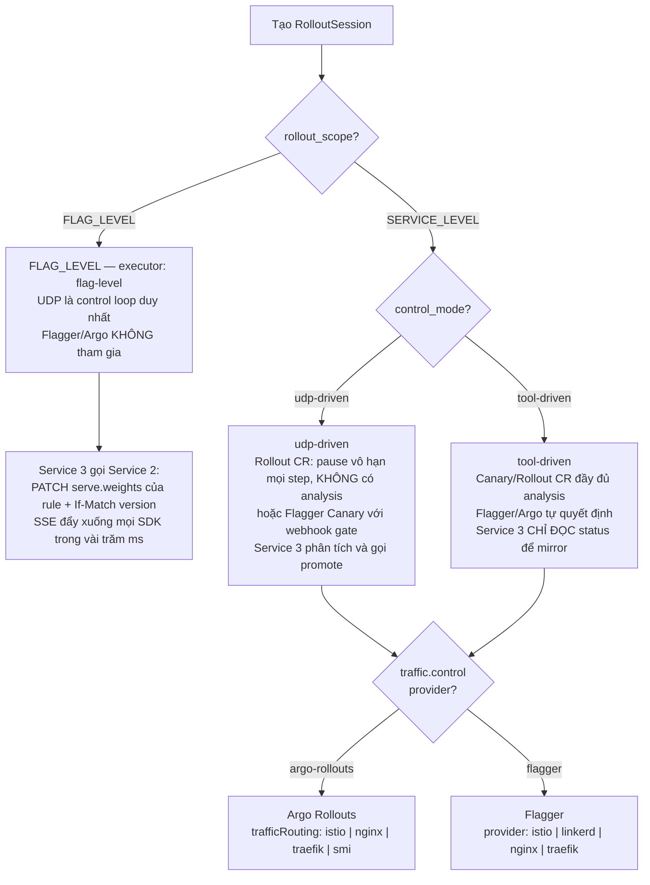

**`SERVICE_LEVEL` + `udp-driven` qua Argo Rollouts — Rollout CR không có `analysis`, có `trafficRouting`:**

```yaml
apiVersion: argoproj.io/v1alpha1
kind: Rollout
metadata:
  name: my-app
  namespace: udp-myproj-prod
  annotations:
    udp.io/session-id: "8f3a..."
    udp.io/control-mode: "udp-driven"
spec:
  strategy:
    canary:
      # [v4] BẮT BUỘC có trafficRouting. Không có nó, setWeight chỉ xấp xỉ bằng SỐ REPLICA
      # (10% = 1/10 pod), không phải trọng số traffic — sai lệch lớn ở replica thấp.
      canaryService: my-app-canary
      stableService: my-app-stable
      trafficRouting:
        istio:
          virtualService: { name: my-app, routes: [primary] }
      # KHÔNG có khối `analysis:` — nếu có, Argo Rollouts sẽ tự promote/abort
      # và tranh chấp với Service 3. Đây là bất biến của ADR-01, có test kiểm tra (I4).
      steps:
        - setWeight: 10
        - pause: {} # dừng vô hạn, chỉ Service 3 gọi promote mới đi tiếp
        - setWeight: 30
        - pause: {}
        - setWeight: 60
        - pause: {}
```

**Cách Service 3 "gọi promote" — Argo Rollouts không có REST API [v4]:** Service 3 tái hiện đúng patch của `kubectl argo rollouts`:

| Lệnh | Patch lên `Rollout` | Điều kiện trước khi patch |
| ---- | ------------------- | ------------------------- |
| `promote` | `status.pauseConditions = []`, xóa `spec.paused` | Đọc `status.currentStepIndex`; chỉ patch nếu bằng chỉ số bậc mà session đang ở (**observed state = expected**), gửi `metadata.resourceVersion` để API server từ chối nếu CR đã đổi |
| `promote --full` | `status.promoteFull = true` | Chỉ từ intent `PROMOTE` của người dùng |
| `abort` | `status.abort = true` | **Phải `promote` (unpause) trước nếu đang ở `pause: {}`** — abort trên Rollout đang paused từng gây vòng lặp vô hạn (argo-rollouts #3756) |
| `retry` | `status.abort = false` | Sau khi người dùng chọn thử lại |

Vì `promote` không idempotent như "đặt weight = 30" (mỗi lần gọi đi thêm một bậc), kiểm `currentStepIndex` trước khi patch là bắt buộc — crash giữa promote và ghi DB rồi tick sau promote thêm bậc nữa là lỗi thật của v3.

**`SERVICE_LEVEL` + `udp-driven` qua Flagger — dùng webhook gate [v4]:** v3 chỉ cho phép Flagger ở chế độ tool-driven. Thực ra Flagger gate thủ công được: `Canary.spec.analysis.webhooks` với `type: confirm-traffic-increase` và `confirm-promotion` gọi vào Service 3; Service 3 trả 200 khi quyết định là PROMOTE, 403 để giữ bậc. Flagger vẫn là bên ghi routing, Service 3 là bên quyết định — đúng bất biến ADR-01. Cách này cho phép so sánh udp-driven trên **cả hai** tool ở E5.

**`SERVICE_LEVEL` + `tool-driven` — công cụ tự chạy, Service 3 chỉ soi gương:**

```yaml
apiVersion: flagger.app/v1beta1
kind: Canary
metadata:
  name: my-app
  annotations: { udp.io/session-id: "8f3a...", udp.io/control-mode: "tool-driven" }
spec:
  analysis:
    interval: 30s        # [v4] cân bằng với analysis_interval của UDP khi đo E5
    threshold: 2         # = maxConsecutiveBreaches
    maxWeight: 50
    stepWeight: 10
    metrics:
      - name: request-success-rate
        thresholdRange: { min: 99 }
```

Ở chế độ này Service 3 **không gọi bất kỳ API ghi nào** lên CR ngoài `promote`/`abort` do người dùng bấm; nó đọc `status.phase`, `status.canaryWeight` (Flagger) hoặc `status.currentStepIndex`, `status.phase` (Argo) và mirror sang `RolloutSession` để Portal hiển thị nhất quán cho cả hai chế độ.

**`FLAG_LEVEL` — không có YAML nào cả:**

```typescript
// Service 3 → Service 2. Không chạm vào Kubernetes.
await flagService.patch(`/internal/rules/${session.targetingRuleId}`, {
  weights: [{ variantId: session.targetVariantId, weight: nextPercent * 1000 },
            { variantId: otherVariantId,          weight: 100_000 - nextPercent * 1000 }],
  reason: `rollout:${session.id} step`,
}, { headers: { "If-Match": `"${session.id}:${session.version}"` } });
// Service 2 [v4.1]: đọc RolloutSession theo sessionId — lease còn hạn, đúng rule, status đang hoạt động,
// và version BẰNG đúng giá trị trong If-Match; khác ⇒ 412 Precondition Failed.
// Thành công ⇒ transaction ADR-05 (khóa env → đổi rule → outbox), NOTIFY, SSE đẩy tới mọi SDK.
// Rollback = đặt weight về baseline_percentage → có hiệu lực gần như tức thì,
// không cần rolling update, không chờ pod khởi động lại.
```

### 7.4 Metrics Analysis — qua `MetricsProvider`, có baseline và kiểm định [vá B10; v4]

v2 viết thẳng `http_requests_total{app, version}` vào Service 3. v3 dùng truy vấn mẫu theo OpenTelemetry semantic conventions nhưng (a) lược đồ nhãn không khớp §6.6, (b) `decide()` chỉ dùng ngưỡng tuyệt đối dù văn bản hứa có baseline, (c) không có kiểm định thống kê nên ở 100 request ngưỡng 1% vô nghĩa. v4 sửa cả ba; lược đồ nhãn thống nhất với §6.6 và §11.

```promql
# --- SERVICE_LEVEL: so sánh theo version ---
# Error rate (canary); baseline thay $version bằng version_old
sum(rate(http_server_request_duration_seconds_count{
  service_name="$service", namespace="$ns",
  service_version="$version", http_response_status_code=~"5.."
}[$window]))
/
sum(rate(http_server_request_duration_seconds_count{
  service_name="$service", namespace="$ns", service_version="$version"
}[$window]))

# Latency P99
histogram_quantile(0.99, sum by (le) (rate(
  http_server_request_duration_seconds_bucket{
    service_name="$service", namespace="$ns", service_version="$version"
  }[$window])))

# Request count và error count (tuyệt đối) — cho warm-up, minErrors và z-test
sum(increase(http_server_request_duration_seconds_count{
  service_name="$service", namespace="$ns", service_version="$version"
}[$window]))

# --- FLAG_LEVEL (C1): so sánh theo nhánh flag, CÙNG một version, nhãn ff="<flagKey>=<variant>" ---
sum(rate(http_server_request_duration_seconds_count{
  service_name="$service", namespace="$ns",
  ff="$flagKey=$variant", http_response_status_code=~"5.."
}[$window]))
/
sum(rate(http_server_request_duration_seconds_count{
  service_name="$service", namespace="$ns", ff="$flagKey=$variant"
}[$window]))
# baseline: ff="$flagKey=$baselineVariant"
```

| Cơ chế | Mô tả |
| ------ | ----- |
| Truy vấn mẫu | Theo OTel semconv (`http.server.request.duration`), nhãn `ff` theo §6.6, khớp với Golden Path template |
| Override | `RolloutSession.metric_queries` cho app dùng tên metric riêng (vd app cũ dùng `http_requests_total`) |
| Kiểm tra trước | `probe()` chạy lúc tạo rollout: nếu không có series khớp **flagKey** (không phải variant) thì **chặn tạo rollout** kèm hướng dẫn, thay vì để kẹt `HOLD` mãi; probe trả `scrapeIntervalSec` để validator ép `metric_window ≥ 4 × scrape` |
| **Ngưỡng tuyệt đối + `minErrors`** [v4] | `errorRate > threshold` **và** `errorCount ≥ minErrors` (mặc định 5). Ở 100 request, 1 lỗi = 1%; không có `minErrors`, ngưỡng 1% rollback vì một request |
| **Ngưỡng tương đối + kiểm định hai tỉ lệ** [v4] | `errorRate(canary) > k × errorRate(baseline)` (mặc định k = 1.5) **và** z-test một phía `z > 1.645` (α = 0.05). Tránh rollback nhầm khi hệ thống vốn có nền lỗi, và tránh coi chênh lệch trong nhiễu là tín hiệu. **Đây không phải sequential testing** (LaunchDarkly/GrowthBook dùng để kiểm soát peeking qua nhiều lần đo) — ghi ở §16 là giới hạn, §17 là hướng mở |
| Cửa sổ và độ trễ | Chỉ đo khi `now ≥ last_step_at + window + scrape_lag`; hai breach chỉ tính "liên tiếp" nếu cách nhau ≥ một cửa sổ (không chồng lấn) |
| Ghi vết | Chuỗi truy vấn thật + cửa sổ thời gian được lưu vào `last_decision.metricSnapshot` và vào `RolloutEvent.metric_snapshot` khi chuyển trạng thái |

```typescript
/** Kiểm định hai tỉ lệ (pooled), một phía: H1 = canary có tỉ lệ lỗi cao hơn baseline */
function twoProportionZ(e1: number, n1: number, e2: number, n2: number): number {
  const p1 = e1 / n1, p2 = e2 / n2, p = (e1 + e2) / (n1 + n2);
  const se = Math.sqrt(p * (1 - p) * (1 / n1 + 1 / n2));
  return se === 0 ? 0 : (p1 - p2) / se;
}
```

### 7.5 Warm-up và chống rollback nhầm

```
Vấn đề 1 — Ít dữ liệu:
    Ngay sau khi bắt đầu (traffic 10%), chỉ vài request đi vào nhánh mới.
    1 request lỗi trên 2 request = error rate 50% → rollback oan.
Giải pháp: chỉ đánh giá sau khi nhánh mới nhận >= warm_up_requests (mặc định 100).

Vấn đề 2 — Spike thoáng qua:
    Một lần GC pause hay một lần restart dependency đẩy p99 vọt lên trong 30 giây.
Giải pháp: chỉ rollback khi vượt ngưỡng ở maxConsecutiveBreaches lần đo LIÊN TIẾP
           (mặc định 2) trên các cửa sổ KHÔNG chồng lấn. Một lần vượt đơn lẻ chỉ tạo HOLD.

Vấn đề 3 — Nguồn metrics chết:
    Prometheus không trả dữ liệu. Nếu quy ước "không dữ liệu = không lỗi"
    thì canary tự promote lên 100% đúng lúc hệ thống đang hỏng nặng nhất.
Giải pháp: hasData = false ⇒ HOLD, không bao giờ ⇒ PROMOTE.
           HOLD kéo dài quá max_duration_seconds ⇒ FAILED (fail_reason = EXPIRED).

Vấn đề 4 — Traffic quá thấp, không bao giờ đủ warm-up:
    Môi trường lab hoặc dịch vụ ít dùng có thể không bao giờ đạt 100 request.
Giải pháp: max_duration_seconds kết thúc rollout thay vì treo mãi (và revert về baseline);
           Portal hiển thị rõ "đang chờ đủ dữ liệu: 34/100" kèm thời gian còn lại.

Vấn đề 5 — Độ phân giải kém ở traffic thấp [v4]:
    100 request, 1 lỗi = 1%. Ngưỡng 1% rollback vì một request.
Giải pháp: minErrors (mặc định 5) — một breach cần cả tỉ lệ lẫn số lỗi tuyệt đối;
           ngưỡng tương đối dùng z-test nên tự tính tới cỡ mẫu.

Vấn đề 6 — Đo lẫn dữ liệu bậc trước [v4]:
    Sau khi PATCH, SDK cập nhật ~1s, Prometheus scrape 15–60s; rate()[30s] ngay sau đó
    nhìn thấy hỗn hợp của 10% và 20%.
Giải pháp: chỉ đo khi now ≥ last_step_at + window + scrape_lag; window ≥ 4 × scrape;
           hai breach chỉ "liên tiếp" nếu cách nhau ≥ một cửa sổ.
```


### 7.6 Manual Override — qua cơ chế intent [vá B3, B5]

Portal **không bao giờ** gọi thẳng Kubernetes. Nó ghi *ý định*; Service 3 thực thi. Đây là điều giữ cho hệ thống chỉ có một bên ghi vào cluster.

| Action | Portal (Service 1) làm gì | Service 3 làm gì ở vòng kế tiếp |
| ------ | ------------------------- | ------------------------------- |
| `PAUSE` | Ghi `RolloutEvent(PAUSE, is_intent=true)` | Đặt `status = PAUSED`, ghi event thực thi. Không đổi traffic |
| `RESUME` | Ghi intent `RESUME` | Đặt `status = IN_PROGRESS`, tiếp tục đánh giá |
| `PROMOTE` | Ghi intent `PROMOTE(100)` | Áp dụng 100% lên cluster (hoặc gọi `argo rollouts promote --full`), rồi `status = DONE` |
| `ROLLBACK` | Ghi intent `ROLLBACK` | Đưa traffic về 0 (SERVICE_LEVEL) hoặc về `baseline_percentage` (FLAG_LEVEL), `status = FAILED`, `fail_reason = MANUAL` |

**Khi hành động an toàn phụ thuộc vào service khác [v4]:** rollback FLAG_LEVEL là `PATCH` sang Service 2; nếu Service 2 chết thì v3 không có nhánh xử lý — hành động an toàn phụ thuộc vào availability của service khác. v4: executor retry với backoff trong tối đa `rollbackRetrySeconds` (mặc định 120); hết hạn ⇒ `status = FAILED`, `fail_reason = DEPENDENCY_DOWN`, ghi `RolloutEvent(DEPENDENCY_DOWN)`, phát alert `udp_rollback_blocked_total` (P1). Ngoài ra Service 3 giữ **kill-switch trực tiếp**: với quyền column-level chỉ trên `flag_targeting_rules.serve` và transaction đúng kỷ luật ADR-05 (khóa `Environment` → đổi `serve` → ghi outbox), Service 3 được phép ghi thẳng DB **chỉ trong nhánh DEPENDENCY_DOWN** — outbox + poll của các replica Service 2 còn sống (hoặc khi hồi phục) vẫn lan truyền đúng. Đây là ngoại lệ có chủ đích của quy tắc writer, ghi ở §1.2 và có test **I30** — bao gồm cả chiều ngược lại: khi Service 2 còn sống, `GRANT` mức cột phải chặn S3 sửa bất cứ thứ gì ngoài `serve`. **[v4.1] Hai việc kill-switch phải tự làm**, vì nó là writer DUY NHẤT đi vòng qua Service 2 — mà Service 2 làm hai việc này cho mọi đường ghi khác: (1) sắp `weights` theo `variantId` (§6.4 — sai thứ tự là đảo nhóm người dùng, vỡ I1); (2) ghi `change_type = 'rule.ramped'`, không phải một giá trị ngoài từ vựng §2.2. Ngày dựng kill-switch, trigger `trg_rule_serve_variants` phải thêm phép kiểm thứ tự — hôm nay chưa có writer nào đi vòng qua Service 2 nên chưa có gì để chặn.

**Độ trễ và cách xử lý:** intent được xử lý ở vòng quét kế tiếp (≤ 5 giây, `LOOP_INTERVAL_MS`). Service 1 còn phát `NOTIFY rollout_intent` **trong chính transaction ghi intent**, qua kết nối pooled thường của nó — `NOTIFY` đi qua pooler transaction mode được, chỉ `LISTEN` là không (đã đo, ADR-05); Service 3 `LISTEN` bằng role của chính nó (`DATABASE_URL_S3_DIRECT`, cùng khuôn với S2) và đánh thức vòng lặp tức thì. Kênh polling vẫn giữ nguyên làm phương án dự phòng — nếu notification bị mất, hệ thống vẫn đúng, chỉ chậm hơn.

**Cưỡng chế quyền:** `PROMOTE` và `ROLLBACK` trên environment có `is_production = true` yêu cầu role `OWNER`/`MAINTAINER` (§2.2) và luôn được ghi `AuditLog` kèm `actor_user_id`.

### 7.7 Vòng đời một flag-level rollout — minh họa đóng góp C1

```mermaid
sequenceDiagram
    participant DEV as Developer
    participant S1 as core-backend
    participant S3 as pd-controller
    participant S2 as flag-service
    participant APP as App (SDK + Hook + Middleware)
    participant PROM as Prometheus (trong cluster)

    DEV->>S1: Tạo rollout FLAG_LEVEL<br/>flag=checkout-v2, variant=on, step=10%, analysis=30s, dwell=300s
    S1->>PROM: probe() qua @udp/metrics-provider + API-server proxy (ADR-06)
    PROM-->>S1: có series ff=~"checkout_v2=.*"? scrapeInterval=15s
    alt Không có series
        S1-->>DEV: 422 — app chưa cài UDPRequestLabelHook/udpMetricsMiddleware, kèm hướng dẫn
    else Có series
        S1->>S1: RolloutSession PENDING (S1 chỉ tạo hàng)
        S1->>S2: POST /internal/rollouts/:id/track — thêm checkout-v2 vào trackedFlags của env
        S2->>APP: SSE flag_changed (kind trackedFlags)
        S1-->>DEV: 201 {sessionId}

        S3->>S3: claim lease; PENDING → start(): lưu baseline_percentage = 0, PATCH weights on=10% (If-Match)
        S3->>S3: status = IN_PROGRESS (S3 là writer duy nhất của status)
        S2->>APP: SSE flag_changed
        Note over APP: 10% người dùng thấy nhánh mới<br/>metric HTTP mang nhãn ff="checkout_v2=on"

        loop Mỗi 30 giây (analysis_interval), độc lập với dwell 300s
            S3->>PROM: errorCount/requestCount cho ff=on VÀ ff=off, cửa sổ 60s, sau last_step_at + 60 + 15
            PROM-->>S3: on: 0.4% (12/3000) so với off: 0.3% (81/27000)
            S3->>S3: Không breach: tuyệt đối OK, tương đối z = 0.9 < 1.645 → last_decision = PROMOTE-OK
            opt Đã ở bậc này ≥ 300s
                S3->>S2: PATCH weights on=20% + If-Match
                S2->>APP: SSE flag_changed
            end
        end

        Note over PROM: Nhánh "on" bắt đầu lỗi
        S3->>PROM: đo lại
        PROM-->>S3: on: 7% (210/3000), off: 0.3%
        S3->>S3: Breach lần 1 (z = 25) → HOLD, last_decision.breachStreak = 1
        S3->>PROM: đo lại sau ≥ 60s (cửa sổ mới, không chồng lấn)
        PROM-->>S3: vẫn 7%
        S3->>S3: Breach lần 2 → ROLLBACK
        S3->>S2: PATCH weights on=baseline (0%) + If-Match
        S2->>APP: SSE flag_changed
        Note over APP: Tính năng tắt cho mọi người<br/>KHÔNG redeploy, KHÔNG restart pod
        S3->>S3: status = FAILED, fail_reason = AUTO_ROLLBACK; RolloutEvent + DeploymentEvent(ROLLBACK)
        S3->>S2: POST /internal/rollouts/:id/untrack
        S1-->>DEV: Portal hiển thị lý do, metric snapshot và truy vấn đã dùng
    end
```

> **Điểm mấu chốt để bảo vệ trước hội đồng:** ở kịch bản trên, thời gian từ lúc lỗi xuất hiện tới lúc **phát hiện** (MTTD) bị chi phối bởi scrape interval + cửa sổ + `analysis_interval` + `maxConsecutiveBreaches` — và **các tham số này giống nhau** cho cả ba cơ chế ở E5 (§14), nên MTTD phải tương đương. Khác biệt thật của C1 nằm ở **MTTR**: từ quyết định rollback tới lúc người dùng hết bị ảnh hưởng chỉ mất **một vòng SSE (dưới một giây)** và **không có thao tác deploy nào**; với Flagger/Argo Rollouts, cùng kịch bản đòi hỏi dịch chuyển traffic ở tầng pod và chờ trạng thái ổn định (giây), với redeploy là phút. Đây là con số được đo và so sánh trực tiếp ở §14 E5.

---

## 8. Business Logic — 6 Luồng nghiệp vụ

### 8.1 Luồng 1 — Tạo Project mới (job bền vững) [vá B4 — ADR-02]

```mermaid
sequenceDiagram
    participant FE as FE Portal
    participant BE as udp-core-backend
    participant CM as Credential Module
    participant CV as Capability Validator
    participant JOB as pg-boss worker
    participant CA as Cloud Adapter
    participant DA as Domain Adapter
    participant AUD as Audit + Event Store
    participant Cloud as AWS / GCP / Azure

    Note over FE,BE: GIAI ĐOẠN 1 — CẤU HÌNH (đồng bộ)

    FE->>BE: POST /projects {name, mode, runtime, quota}
    BE->>BE: Project DRAFT + ProjectMember(OWNER)
    BE->>BE: Tạo Environment dev/staging/prod
    BE->>AUD: AuditLog project.create
    BE-->>FE: 201 {projectId, environments}

    FE->>BE: PUT /projects/:id/cloud {provider, mode, credential}
    BE->>CM: Sinh DEK, AES-256-GCM, bọc DEK bằng KEK
    CM->>Cloud: validateCredential (STS / IAM / AAD)
    CM->>Cloud: preflightPermissions — liệt kê quyền còn thiếu
    alt Thiếu quyền
        CM-->>FE: 422 {missingPermissions, docUrl}
    else Đủ quyền
        CM->>BE: Lưu ciphertext + fingerprint, is_active = true
        BE->>AUD: AuditLog credential.create (chỉ fingerprint)
        BE-->>FE: 200 OK
    end

    FE->>BE: PUT /projects/:id/domains {domains[]}
    BE->>CV: validateAndOrder(selected)
    alt Cấu hình không hợp lệ
        CV-->>FE: 422 {code, message, hint, suggestedAction}
    else Hợp lệ
        CV-->>BE: Thứ tự deploy (đồ thị phân bậc)
        BE->>BE: Zod validate từng tool_config, lưu PENDING
        BE-->>FE: 200 OK
    end

    FE->>BE: GET /projects/:id/preview
    BE->>CA: estimateCost()
    BE-->>FE: 200 {domains, deployOrder, estimatedCost, estimatedTime}

    Note over FE,JOB: GIAI ĐOẠN 2 — PROVISIONING (job bền vững)

    FE->>BE: POST /projects/:id/provision (Idempotency-Key)
    BE->>BE: ProvisioningJob state=QUEUED, version=0, payload đầy đủ
    BE->>JOB: boss.send() trong CÙNG transaction qua fromPrisma(tx) — ADR-02
    BE-->>FE: 202 {jobId}

    Note over JOB: Giành việc: claim lease trên ProvisioningJob<br/>UPDATE ... SET claimed_by, claimed_until = now()+5m, version=version+1<br/>WHERE version = $expected. MỌI ghi sau đó đều kiểm version (fencing)
    JOB->>JOB: touch() mỗi 30s — heartbeat CỦA pg-boss, không phải reaper tự viết

    JOB->>JOB: state = NETWORK
    loop Từng ResourceStep có thứ tự (ADR-07)
        JOB->>JOB: 1. lookup(tags + idempotency_key) — đã tồn tại thì dùng lại, KHÔNG tạo mới
        JOB->>JOB: 2. Nếu chưa có: INSERT ProvisionedResource status=CREATING<br/>TRƯỚC khi gọi cloud
        JOB->>CA: 3. create() → VPC / subnet / IGW / NAT / route table / SG
        CA->>Cloud: SDK call (có clientRequestToken nếu API hỗ trợ)
        JOB->>JOB: 4. UPDATE ProvisionedResource provider_id, status=CREATED
        JOB->>CA: 5. waitReady()
    end

    JOB->>JOB: state = CLUSTER (cùng vòng ResourceStep)
    JOB->>CA: IAM role → cluster → OIDC provider → nodegroup → add-on
    CA->>Cloud: Tạo EKS / GKE / AKS, giới hạn publicAccessCidrs về egress của UDP
    Note over CA,Cloud: ADR-06 — bước cuối của Cloud Adapter: tạo namespace udp-system<br/>và BA ServiceAccount có ClusterRole rời nhau (§12.2):<br/>udp-workload, udp-traffic, udp-tooling.<br/>KHÔNG sinh kubeconfig dài hạn
    JOB->>BE: Project.cluster_access = {clusterId, apiEndpoint, caData, controlPlaneSA}

    JOB->>JOB: state = DOMAINS
    loop Theo từng bậc của đồ thị capability (§5.3)
        par Các adapter cùng bậc chạy song song
            JOB->>DA: deploy(ctx, config) — ctx.k8s là ClusterAccess đã xác thực<br/>bằng bound SA token 1h, adapter không tự lấy kubeconfig
            DA-->>JOB: CapabilityBinding[]
        end
        JOB->>JOB: PERSIST binding vào bảng CapabilityBinding<br/>(không giữ trong bộ nhớ worker — worker chết là mất)
        JOB->>JOB: Nạp lại ctx.resolved TỪ BẢNG cho bậc kế tiếp
    end

    JOB->>JOB: state = DONE, Project.status = ACTIVE
    JOB->>AUD: DeploymentEvent DEPLOY_SUCCESS

    Note over JOB,Cloud: NẾU BẤT KỲ BƯỚC NÀO THẤT BẠI
    JOB->>JOB: pg-boss retry theo retryLimit + backoff lũy thừa<br/>(ProvisioningJob.attempt chỉ để hiển thị, KHÔNG dùng làm điều kiện dừng)
    JOB->>JOB: Hết lượt retry ⇒ state = COMPENSATING
    JOB->>CA: delete() từng ResourceStep theo THỨ TỰ NGƯỢC, đọc từ ProvisionedResource
    JOB->>JOB: Mỗi tài nguyên: status CREATED → DELETING → DELETED
    Note right of JOB: Tài nguyên xóa không được (đang bị tham chiếu, API lỗi)<br/>đánh ORPHAN_SUSPECTED để orphan-scan.job và<br/>GET /admin/orphan-resources xử lý, KHÔNG im lặng bỏ qua
    JOB->>JOB: state = FAILED, Project.status = ERROR
    JOB->>AUD: DeploymentEvent DEPLOY_FAILURE + last_error đã redact

    Note over JOB: NẾU WORKER CHẾT GIỮA CHỪNG
    Note over JOB: Không có reaper tự viết (ADR-02 đk 2). Lease hết hạn,<br/>pg-boss giao lại job; worker mới đọc state + ProvisionedResource<br/>và gọi lookup() nên KHÔNG tạo lại tài nguyên đã có.<br/>Worker cũ tỉnh dậy bị chặn bởi fencing: version đã đổi

    FE->>BE: GET /projects/:id/jobs/:jobId/stream (SSE)
    BE-->>FE: {state, currentStep, resources[], progressLog[]}
```

**Năm cơ chế và sự cố thật mà mỗi cơ chế chặn:**

| Sự cố | v2 | v3 | **v4** |
| ----- | -- | -- | ------ |
| Backend restart lúc đang tạo cluster | Job biến mất; project kẹt `PROVISIONING` vĩnh viễn; VPC + cluster đã tạo thành tài nguyên mồ côi **tiếp tục tính tiền** | pg-boss giữ job; reaper tự viết nhận lại sau ≤ 5 phút | pg-boss giữ job; **heartbeat của pg-boss** giao lại. Reaper tự viết bị **bỏ**: hai reaper cạnh tranh có thể tạo hai job pg-boss cho cùng một `ProvisioningJob` |
| Worker mất kết nối DB nhưng **vẫn gọi được cloud** | Không xét | Không xét | **Lease + fencing token**: worker cũ tỉnh dậy thấy `version` đã đổi, mọi UPDATE bị từ chối trước khi kịp gọi cloud lần nữa |
| Cloud API thành công nhưng process chết **trước khi ghi sổ** | Mất dấu tài nguyên | Vẫn mất dấu: v3 ghi sổ **sau** khi gọi | **`ProvisionedResource` ghi TRƯỚC lời gọi** với `idempotency_key UNIQUE`, `status = CREATING`. Resume đọc sổ, `lookup()` theo tag `udp.*` rồi mới quyết định tạo hay dùng lại |
| API cloud không có idempotency token (`CreateVpc`, `CreateSubnet`) | Tạo trùng | Tạo trùng | `lookup(tags)` bắt buộc chạy trước `create()` trong mọi `ResourceStep` |
| Provision fail ở bước 3 | "Cleanup created resources" nhưng không có nơi nào ghi *đã tạo những gì* | Mảng JSONB `created_resources` bị ghi đè khi hai worker cùng chạy | Bảng riêng, mỗi tài nguyên một hàng có trạng thái; compensation chạy `delete()` theo thứ tự ngược và **đánh dấu `ORPHAN_SUSPECTED`** thay vì nuốt lỗi |
| Người dùng bấm provision hai lần | Có thể tạo hai cluster | Unique partial index `idx_one_active_job_per_project` | Thêm header `Idempotency-Key` ở tầng HTTP (§9), nên bấm hai lần trả về **cùng một** `jobId` thay vì 409 |
| Deploy domain sai thứ tự | Thứ tự nằm ngầm trong code orchestrator | Topological sort từ đồ thị capability (§5.3) | Như v3, thêm: binding **persist xuống bảng** sau mỗi bậc, nên bậc sau đọc endpoint thật từ database chứ không từ bộ nhớ worker |

> **Đối soát bắt buộc (ADR-02 đk 4):** `pgboss-reconcile.job` chạy định kỳ so `pgboss.job` với `ProvisioningJob`. Trường hợp thật cần bắt: pg-boss đánh dấu `failed` sau khi hết retry trong khi `ProvisioningJob.state` vẫn là `CLUSTER`, khiến Portal hiển thị "đang tạo cluster" vĩnh viễn. Quy ước: **`ProvisioningJob` là nguồn sự thật nghiệp vụ**, pg-boss chỉ là cơ chế thực thi.

### 8.2 Luồng 2 — Cấu hình Domain (sau khi ACTIVE)

```mermaid
sequenceDiagram
    participant FE as FE Portal
    participant BE as udp-core-backend
    participant CV as Capability Validator
    participant DC as Domain Config Module
    participant JOB as pg-boss worker
    participant DA as Domain Adapter

    FE->>BE: PUT /projects/:id/domains {domains[]}
    BE->>CV: validateAndOrder(cấu hình MỚI, đầy đủ)
    Note over CV: Kiểm tra trạng thái ĐÍCH, không phải phần thay đổi:<br/>tắt Prometheus trong khi Flagger đang bật = MISSING_CAPABILITY
    alt Không hợp lệ
        CV-->>FE: 422 {code, hint, suggestedAction}
    end

    Note over CV: Nhiều provider không-exclusive cho cùng capability<br/>(Prometheus và VictoriaMetrics cùng cho metrics.query)
    alt AMBIGUOUS_PROVIDER
        CV-->>FE: 422 {code, capability, candidates[]}
        FE->>BE: PUT /projects/:id/capability-preferences {capabilityId, providerToolId}
        BE->>DC: Lưu CapabilityPreference — worker restart KHÔNG mất lựa chọn
    end

    BE->>DC: diff(hiện tại, mới) → enable / disable / switch / reconfigure
    BE->>DC: Tính thêm tập CONSUMER cần rebind: adapter đang bật có requires<br/>capability mà provider vừa đổi
    BE->>DC: Zod validate từng tool_config mới
    BE->>DC: Lưu, domain_status = DEPLOYING
    BE->>JOB: enqueue DOMAIN_APPLY
    BE-->>FE: 202 {jobId}

    Note over JOB,DA: JOB — theo bậc của đồ thị; trong cùng bậc,<br/>adapter scope=cluster chạy trước scope=namespace

    Note over JOB,DA: CASE 1 — Bật domain mới (song song trong cùng bậc)
    par
        JOB->>DA: adapter.deploy(ctx, config)
        JOB->>DC: domain_status = ACTIVE, PERSIST CapabilityBinding
    end

    Note over JOB,DA: CASE 3 — Đổi tool (tuần tự, không gián đoạn, CÓ REBIND)
    JOB->>DA: 1. VictoriaMetricsAdapter.deploy(ctx, config)
    JOB->>DA: 2. VictoriaMetricsAdapter.healthcheck(ctx)
    alt healthy = false
        JOB->>DA: VictoriaMetricsAdapter.teardown(ctx, "switch") — hoàn tác
        JOB->>DC: domain_status = ERROR, GIỮ NGUYÊN tool cũ
        Note right of JOB: Prometheus chưa hề bị đụng tới,<br/>consumer vẫn trỏ endpoint cũ đang sống
    else healthy = true
        JOB->>DC: 3. Cập nhật CapabilityBinding của metrics.query sang endpoint mới
        loop 4. REBIND từng consumer theo topo order
            JOB->>DA: FlaggerAdapter.onDependencyChanged(ctx, config, bindingMới)
            Note right of DA: Flagger được cấu hình lại để trỏ<br/>metric server mới. KHÔNG có bước này,<br/>Flagger giữ endpoint đã chết vĩnh viễn
        end
        JOB->>DA: 5. PrometheusAdapter.teardown(ctx, "switch") — CHỈ SAU KHI rebind xong
        JOB->>DC: domain_status = ACTIVE, selected_tool = victoria-metrics
    end

    Note over JOB,DA: CASE 2 — Tắt domain
    JOB->>CV: Còn adapter nào đang cần capability nó cung cấp không?
    alt Còn bên phụ thuộc
        JOB->>DC: Từ chối, domain_status giữ nguyên, báo lỗi lên Portal
    else Không còn
        JOB->>DA: adapter.teardown(ctx)
        JOB->>DC: is_enabled = false, domain_status = PENDING
    end

    Note over JOB,DA: CASE 4 — Đổi cấu hình cùng tool
    JOB->>DA: adapter.configure(ctx, config)
    JOB->>DC: domain_status = ACTIVE

    Note over JOB,DC: Nếu một domain lỗi
    JOB->>DC: domain_status = ERROR cho RIÊNG domain đó
    Note right of JOB: Các domain khác không bị ảnh hưởng<br/>trừ những domain phụ thuộc vào nó — bị đánh dấu BLOCKED
```

**Thứ tự năm bước của CASE 3 — mỗi bước chặn một trạng thái sai cụ thể:**

```
SAI (v2):  Teardown Prometheus → Deploy VictoriaMetrics
           → Có khoảng thời gian KHÔNG có nguồn metrics (gián đoạn)

SAI (v3):  Deploy mới → healthcheck → Teardown cũ
           → Không gián đoạn nguồn metrics, NHƯNG Flagger vẫn được cấu hình
             trỏ vào endpoint của Prometheus vừa bị xóa. Canary analysis đọc
             một địa chỉ đã chết, MetricsProvider trả hasData = false, và theo
             §7.1 điều đó nghĩa là HOLD vĩnh viễn cho tới khi EXPIRED.
             Hỏng âm thầm, đúng loại lỗi khó phát hiện nhất.

ĐÚNG (v4): 1. Deploy VictoriaMetrics
           2. healthcheck OK
           3. Cập nhật CapabilityBinding sang endpoint mới
           4. onDependencyChanged() cho TỪNG consumer theo topo order
           5. Teardown Prometheus
           → Không thời điểm nào mất nguồn metrics
           → Không consumer nào giữ endpoint chết
           → "Blue/Green ở tầng Domain Adapter"

Nhánh hỏng: healthcheck thất bại ⇒ teardown chính cái vừa deploy, giữ nguyên
            tool cũ, KHÔNG chạy bước 3 và 4. Consumer chưa hề bị đụng tới.
```

**CASE 5 — Đổi `CapabilityPreference` mà không đổi tool nào [NEW v4]:** người dùng đang bật cả Prometheus lẫn VictoriaMetrics, và chuyển lựa chọn nguồn cho canary analysis từ cái này sang cái kia. Không có adapter nào được deploy hay teardown, nhưng tập consumer vẫn phải rebind. Luồng rút gọn còn bước 3 và 4. v3 không có case này vì v3 không có chỗ lưu lựa chọn.

> **Vì sao rebind phải đứng trước teardown chứ không phải sau:** nếu teardown trước, tồn tại một cửa sổ trong đó consumer trỏ vào endpoint đã chết. Cửa sổ đó dài bằng thời gian chạy `onDependencyChanged()` của mọi consumer, và nếu một consumer rebind thất bại thì cửa sổ là vĩnh viễn. Đảo thứ tự lại thì trạng thái xấu nhất chỉ là "hai provider cùng tồn tại một lúc", tốn tiền chứ không sai.

### 8.3 Luồng 3 — Deploy (CI/CD Webhook)

```mermaid
sequenceDiagram
    participant Dev as Developer
    participant CI as GitHub / GitLab / Jenkins
    participant BE as udp-core-backend
    participant VER as webhook.verifier
    participant ADP as CI/CD Adapter
    participant ES as Event Store
    participant K8S as K8s Cluster

    Dev->>CI: git push lên nhánh main
    CI->>CI: checkout → test → build image → push registry

    CI->>BE: POST /webhooks/cicd/:provider
    BE->>VER: verify(providerId, headers, rawBody)
    VER->>ADP: adapter.verifySignature(...)
    Note over ADP: GitHub: HMAC X-Hub-Signature-256<br/>GitLab: X-Gitlab-Token so sánh hằng thời gian<br/>Jenkins: chữ ký riêng
    alt Chữ ký sai
        VER-->>CI: 401 Unauthorized
        BE->>ES: Ghi nhận lần verify thất bại (phát hiện dò quét)
    else Chữ ký đúng
        BE->>ADP: adapter.parsePayload(rawBody) → {projectId, env, status, imageTag, commitSha, pipelineId}
        BE->>ES: Đã xử lý pipelineId này chưa?
        alt Đã xử lý
            BE-->>CI: 200 OK — bỏ qua trùng lặp
        else Chưa
            BE->>BE: Sinh deployment_id — gom START/SUCCESS/FAILURE của MỘT lần deploy
            alt Pipeline thành công
                BE->>ES: DEPLOY_START {deployment_id, commit_sha, commit_timestamp, workload_name}
                Note over BE,K8S: ADR-06 — S1 lấy bound SA token 1h qua ClusterAccess.<br/>Không đọc kubeconfig từ đĩa, không lưu token xuống DB (I24)
                BE->>K8S: Apply workload manifest (Deployment hoặc Rollout)<br/>vào namespace của ĐÚNG environment
                Note right of BE: ADR-01 — S1 CHỈ ghi image tag, replicas, env var.<br/>KHÔNG bao giờ sửa spec.strategy hay trạng thái rollout;<br/>đó là vùng của Service 3 (I25)
                BE->>K8S: Theo dõi rollout status (có timeout)
                alt Rollout timeout hoặc CrashLoopBackOff
                    BE->>K8S: rollout undo
                    BE->>ES: DEPLOY_FAILURE {deployment_id} + lý do
                    BE->>ES: ROLLBACK {restores_deployment_id = deployment_id, triggered_by = AUTO}
                else Thành công
                    BE->>ES: DEPLOY_SUCCESS {deployment_id}
                    Note right of BE: Version mới ĐANG CHẠY<br/>Feature flag vẫn TẮT<br/>deploy ≠ release
                end
            else Pipeline thất bại
                BE->>ES: DEPLOY_FAILURE {deployment_id}
                Note right of BE: Version cũ vẫn chạy bình thường
            end
            BE-->>CI: 200 OK
        end
    end
```

**Ba điểm sửa so với v2:**

| Vấn đề v2 | Sửa ở v3 |
| --------- | -------- |
| Hardcode `X-Hub-Signature-256` — chỉ đúng với GitHub; GitLab dùng `X-Gitlab-Token`, Jenkins khác nữa | Việc verify thuộc về **CI/CD adapter**: `verifySignature()` + `parsePayload()` nằm trong `DomainAdapter` của từng tool. Thêm CI mới không phải sửa Webhook module — nhất quán với nguyên tắc pluggable |
| Không nói webhook secret được sinh và xoay vòng thế nào | Secret sinh khi bật domain CI/CD, lưu **đã mã hóa** cùng cơ chế §4.3, hiển thị một lần, có nút xoay vòng ghi `AuditLog` |
| Deploy xong không xử lý trường hợp pod không lên được | Theo dõi rollout có timeout; `CrashLoopBackOff` hoặc quá hạn ⇒ `rollout undo` tự động + ghi `DEPLOY_FAILURE` |

> Webhook luôn mang `environment`; deploy vào `prod` yêu cầu environment đó được đánh dấu cho phép deploy tự động, nếu không thì chỉ tạo bản ghi chờ và cần người có quyền bấm duyệt trên Portal.

**Vì sao `deployment_id` là bắt buộc chứ không phải trang trí [v4]:** cả năm chỉ số DORA đều tính từ `DeploymentEvent`, và bốn trong năm cần biết **những sự kiện nào thuộc cùng một lần deploy**:

| Chỉ số DORA | Cột cần có | Thiếu thì sao |
| ----------- | ---------- | ------------- |
| Deployment Frequency | `deployment_id` DISTINCT theo `environment_id` + `occurred_at` | Đếm cả START lẫn SUCCESS thành hai lần deploy, con số gấp đôi |
| Lead Time for Changes | `commit_timestamp` và `occurred_at` của SUCCESS | Không có `commit_timestamp` thì không tính được, và nó **không** suy ra được từ `commit_sha` nếu không gọi lại API của Git provider |
| Change Failure Rate | `deployment_id` + có tồn tại `DEPLOY_FAILURE` hoặc `ROLLBACK` trỏ về nó | Không gom được nhóm thì mẫu số sai |
| MTTR (thời gian khôi phục) | `restores_deployment_id` nối lần rollback với lần deploy hỏng | Không biết rollback nào sửa deploy nào, chỉ đo được thời gian giữa hai sự kiện bất kỳ |
| MTTR cho auto-rollback của C1 | `rollout_session_id` | Không phân biệt được rollback do người bấm với rollback do reconciler quyết định, tức là **E5 không đo được** |

Đây là lý do §2.2 thêm năm cột này vào `DeploymentEvent`, và là điều kiện để **E10** (§14.1) tính được DORA từ chính dữ liệu vận hành của UDP mà không cần người dùng bên ngoài.

### 8.4 Luồng 4 — Feature Flag Management

```mermaid
sequenceDiagram
    participant FE as FE Portal
    participant BE as udp-core-backend
    participant FS as udp-feature-flag-service
    participant DB as PostgreSQL
    participant AUD as AuditLog
    participant APP as App SDK

    FE->>BE: POST /projects/:id/flags {key, type, variants[], defaultVariantKey}
    BE->>BE: requireProjectRole(DEVELOPER trở lên)
    BE->>FS: POST /internal/flags
    FS->>DB: INSERT FeatureFlag (DRAFT) + FlagVariant[]<br/>+ FlagEnvConfig cho MỌI environment (is_enabled = false)
    FS-->>BE: 201 {flagId}
    BE->>AUD: flag.create
    BE-->>FE: 201 {flagId}

    Note over FE,FS: Sửa rule — theo TỪNG environment

    FE->>BE: PUT /projects/:id/flags/:flagId/envs/:envId/rules<br/>{rules[], lastKnownUpdatedAt}
    BE->>BE: env.is_production ? requireProjectRole(MAINTAINER) : DEVELOPER
    BE->>FS: PUT /internal/flag-envs/:id/rules
    FS->>DB: So sánh FlagEnvConfig.updated_at với lastKnownUpdatedAt
    alt Xung đột — người khác vừa lưu
        FS-->>FE: 409 Conflict + bản mới nhất để hiển thị diff
    else Không xung đột
        FS->>DB: Validate: variant trong serve thuộc đúng flag;<br/>nếu serve là distribution thì tổng weight = 100000
        FS->>DB: Sinh bucket_salt cho rule MỚI
        Note over FS: Rule cũ GIỮ NGUYÊN bucket_salt<br/>→ đổi trọng số không xáo lại nhóm người dùng (I1)
        Note over FS,DB: THỨ TỰ TRANSACTION BẮT BUỘC (ADR-05):<br/>1. UPDATE environments SET config_version = config_version + 1 ... RETURNING → v<br/>2. Thay đổi thật (xóa rule cũ, chèn rule mới)<br/>3. Cập nhật config_hash = sha256(snapshot chuẩn hóa)<br/>4. INSERT config_change_log mang ĐÚNG v — ghi CUỐI CÙNG
        FS->>DB: NOTIFY flag_changed — TRONG transaction, chỉ ĐÁNH THỨC, không mang dữ liệu [v4.1]
        FS->>DB: COMMIT — notification chỉ được giao lúc này
        FS-->>BE: 200 OK
        BE->>AUD: flag.rule.update (before/after đã redact)
        BE-->>FE: 200 OK
    end

    Note over FE,APP: Bật flag ở một environment

    FE->>BE: PATCH /projects/:id/flags/:flagId/envs/:envId {isEnabled: true}
    BE->>BE: env.is_production ⇒ cần MAINTAINER + xác nhận hai bước
    BE->>FS: PATCH /internal/flag-envs/:id
    FS->>DB: Cùng thứ tự transaction như trên, NOTIFY nằm trong transaction
    alt SDK dùng SERVER key — local evaluation
        FS->>APP: SSE flag_changed mang DELTA (chỉ tới SDK có key của ĐÚNG env này)
        Note over APP: Áp delta, kiểm con trỏ liên tục;<br/>hổng hoặc lệch config_hash ⇒ tự lấy snapshot (ADR-05)
    else SDK dùng CLIENT key — remote evaluation OFREP
        FS->>APP: SSE mode=notify — CHỈ báo "cấu hình đã đổi"
        APP->>FS: POST /ofrep/v1/evaluate/flags {context}
        FS-->>APP: ResolutionDetails đã đánh giá
        Note over FS,APP: KHÔNG rule nào rời server (ADR-03).<br/>Cùng một evaluator với SERVER nên kết quả giống hệt (I26)
    end
    BE->>AUD: flag.enable {env: prod}
    BE-->>FE: 200 OK

    Note over APP,FS: Telemetry ngược chiều

    APP->>FS: POST /sdk/stats (mỗi 60s, tổng hợp)
    FS->>DB: UPSERT FlagEvaluationStat
    Note over FS: Nền tảng cho cảnh báo stale flag (§6.7)
```

> **Bật flag ở `dev` không ảnh hưởng `prod`** — đây là khác biệt cốt lõi so với v2, nơi flag chỉ có một trạng thái duy nhất cho cả project.

**Vì sao thứ tự bốn bước trong transaction là bắt buộc [v4]:**

| Nếu làm sai thứ tự | Hậu quả |
| ------------------ | -------- |
| Khóa hàng `Environment` **không** phải thao tác đầu tiên | Hai transaction sửa hai flag khác nhau của cùng environment có thể khóa chéo nhau qua các hàng rule ⇒ deadlock. Khóa hàng `Environment` trước biến nó thành **điểm tuần tự hóa duy nhất** |
| Ghi outbox **trước** khi biết `config_version` mới | Dòng outbox mang version cũ; replica áp delta rồi thấy con trỏ không khớp và rơi về snapshot mỗi lần đổi flag, tầng 2 trở thành vô dụng |
| Cấp `config_version` **ngoài** row-lock | Mất bảo đảm "thứ tự version = thứ tự commit", tức là mất chính lý do v4 chọn `config_version` thay `xid8` (ADR-05) |
| Quên cập nhật `config_hash` | Replica áp delta sai nội dung nhưng đúng số vẫn qua được kiểm tra, hỏng âm thầm. `config_version` là số đếm, chỉ `config_hash` mới là checksum nội dung |

### 8.5 Luồng 5 — Progressive Rollout

```mermaid
sequenceDiagram
    participant Dev as Developer Portal
    participant BE as udp-core-backend
    participant S3 as pd-controller
    participant MP as MetricsProvider
    participant S2 as flag-service
    participant APP as App (SDK + hook)
    participant K8S as K8s Cluster

    Dev->>BE: POST /projects/:id/rollouts {scope, envId, strategy, thresholds,<br/>stepPercent, stepIntervalSeconds, analysisIntervalSeconds}
    BE->>BE: requireProjectRole; kiểm tra unique index target
    BE->>MP: probe() qua @udp/metrics-provider — có series cho target này không?
    alt hasSeries = false
        BE-->>Dev: 422 — app chưa gắn nhãn ff (thiếu hook/middleware),<br/>kèm đúng đoạn code cần thêm. KHÔNG BAO GIỜ chạy mù
    else Sẵn sàng
        BE->>BE: Validator ép metricWindowSeconds >= 4 x scrapeInterval đo được
        BE->>BE: RolloutSession PENDING (S1 CHỈ tạo hàng, không ghi status)
        opt scope = FLAG_LEVEL
            BE->>S2: POST /internal/rollouts/:id/track — thêm flag vào trackedFlags
            S2->>S2: Từ chối nếu env đã có 3 flag đang track (trần cardinality §6.6)
            S2-->>APP: SSE flag_changed (kind trackedFlags) — SDK bắt đầu gắn nhãn ff cho flag này
        end
        BE-->>Dev: 201 {sessionId}
    end

    loop Vòng quét mỗi 5 giây (LOOP_INTERVAL_MS), hoặc khi nhận NOTIFY rollout_intent
        S3->>S3: claim lease — FOR UPDATE SKIP LOCKED, gồm cả PAUSED;<br/>không lấy được thì bỏ qua ngay, không chờ
        S3->>S3: Mở fence; renew lease mỗi 20s, renew thất bại ⇒ fence.abort()

        S3->>S3: 1. Có intent chưa xử lý? → thực thi rồi kết thúc vòng
        S3->>S3: 2. PAUSED → dừng. PENDING → start(): ghi baseline_percentage, áp bậc đầu
        S3->>S3: 3. Quá max_duration → FAILED/EXPIRED, CÓ revert về baseline
        S3->>S3: 4. Chưa tới analysis_interval kể từ lần đo trước → dừng vòng

        Note over S3,MP: PHÂN TÍCH CHẠY MỖI analysis_interval (30s),<br/>ĐỘC LẬP với step_interval (300s).<br/>v3 để dwell chặn trước phân tích nên sau mỗi promote<br/>không có phép đo nào trong 5 phút — MTTD tối thiểu 10 phút
        S3->>MP: Đo canary VÀ baseline trong cùng cửa sổ<br/>FLAG_LEVEL: ff="key=on" so với ff="key=off", CÙNG service_version<br/>SERVICE_LEVEL: version mới so với version cũ
        Note over MP: Chỉ đo khi cửa sổ nằm TRỌN sau last_step_at + window + scrapeLag,<br/>nếu không phép đo đầu tiên lẫn dữ liệu của bậc trước

        alt hasData = false
            S3->>S3: HOLD — KHÔNG BAO GIỜ coi là 0 lỗi (I7)
        else requestCount < warm_up_requests
            S3->>S3: HOLD — hiển thị "34/100 request" lên Portal
        else Không vượt ngưỡng
            S3->>S3: last_decision = PROMOTE-OK, breachStreak reset
            opt Đã ở bậc hiện tại >= step_interval
                S3->>S3: fence.assert() TRƯỚC mọi side effect
                alt scope = FLAG_LEVEL
                    S3->>S2: PATCH /internal/rules/:id + If-Match "<sessionId>:<version>"
                    S2->>S2: Từ chối nếu version cũ; nếu OK thì transaction 4 bước, SSE
                else scope = SERVICE_LEVEL udp-driven
                    S3->>K8S: Đọc status.currentStepIndex rồi mới promote đúng một bậc
                else scope = SERVICE_LEVEL tool-driven
                    S3->>K8S: CHỈ đọc status để mirror — không ghi gì (I5)
                end
                S3->>S3: updateIfVersion(...) SAU side effect, rồi ghi RolloutEvent(PROMOTE, AUTO)
            end
        else Vượt ngưỡng
            S3->>S3: Chỉ đếm liên tiếp khi hai phép đo cách nhau >= 1 cửa sổ (không chồng lấn)
            S3->>S3: Lần 1 → HOLD, last_decision.breachStreak = 1
            S3->>S3: Đủ maxConsecutiveBreaches → ROLLBACK
            S3->>S2: Về BASELINE_PERCENTAGE, không phải về 0<br/>(flag đã ổn định ở 30% thì rollback không được tắt luôn 30% đó)
            S3->>S3: status = FAILED, fail_reason = AUTO_ROLLBACK
            S3->>S3: RolloutEvent(ROLLBACK) + DeploymentEvent(ROLLBACK, rollout_session_id)
            S3->>S2: POST /internal/rollouts/:id/untrack — gỡ nhãn, trả lại trần cardinality
        end
    end

    Note over Dev,S3: Manual Override — qua intent, không gọi thẳng K8s

    Dev->>BE: POST /rollouts/:id/actions {action: ROLLBACK}
    BE->>BE: Ghi RolloutEvent(ROLLBACK, is_intent = true, actor_user_id)
    BE->>BE: NOTIFY rollout_intent — đánh thức S3 ngay
    BE-->>Dev: 202 Accepted — "đang thực hiện"
    S3->>S3: Đọc intent, thực thi trên cluster/flag
    S3->>BE: Ghi event thực thi, status = FAILED, fail_reason = MANUAL
    Dev->>BE: Portal cập nhật trạng thái qua polling/SSE
```

> **`202 Accepted` chứ không phải `200 OK`:** Portal không tự apply, nên không thể khẳng định "đã xong" tại thời điểm trả về. UI hiển thị trạng thái *đang thực hiện* cho tới khi thấy event thực thi tương ứng — trung thực với những gì hệ thống thật sự bảo đảm.

### 8.6 Luồng 6 — Day-2: nâng cấp và phát hiện trôi cấu hình [NEW v4]

§5.2 định nghĩa `upgrade()` và `detectDrift()` nhưng v3 không có luồng nào gọi chúng, nên trên thực tế một domain sau khi `ACTIVE` là **đóng băng vĩnh viễn**: không nâng được chart, không biết ai đã `kubectl edit` vào tooling của mình. Với một nền tảng tự nhận là quản lý vòng đời DevOps, đó là lỗ hổng lớn hơn nó trông có vẻ.

```mermaid
sequenceDiagram
    participant CRON as Cron trong pg-boss
    participant FE as FE Portal
    participant BE as udp-core-backend
    participant JOB as pg-boss worker
    participant DA as Domain Adapter
    participant K8S as K8s Cluster

    Note over CRON,K8S: A — PHÁT HIỆN TRÔI (chạy nền, mỗi 6 giờ)

    CRON->>JOB: enqueue DRIFT_SCAN cho từng project ACTIVE
    loop Mỗi DomainConfig có domain_status = ACTIVE
        JOB->>DA: detectDrift(ctx, config)
        DA->>K8S: helm diff / so spec của CR với cấu hình mong muốn
        alt drifted = true
            JOB->>BE: Ghi DomainConfig.last_error = {drift: details}
            BE->>FE: Badge "Đã trôi cấu hình" + nút xem diff
            Note right of BE: KHÔNG tự sửa. Trôi có thể là người vận hành<br/>cố ý vá nóng; tự ghi đè là phá việc của họ
        end
    end

    Note over FE,K8S: B — NÂNG CẤP (do người dùng bấm)

    FE->>BE: POST /projects/:id/domains/:domainId/upgrade {toVersion}
    BE->>BE: requireProjectRole(MAINTAINER); env production cần xác nhận hai bước
    BE->>BE: Adapter mới có đổi capability provides/requires không?
    alt Có đổi
        BE->>BE: Chạy lại validateAndOrder với khai báo MỚI
        alt Tổ hợp không còn hợp lệ
            BE-->>FE: 422 {code, hint} — chặn TRƯỚC khi chạm cluster
        end
    end
    BE->>JOB: enqueue DOMAIN_APPLY {op: upgrade}
    BE-->>FE: 202 {jobId}

    JOB->>BE: domain_status = DEPLOYING
    JOB->>DA: upgrade(ctx, config, fromVersion)
    DA->>K8S: helm upgrade --install, chờ CRD mới sẵn sàng
    JOB->>DA: healthcheck(ctx)
    alt healthy = false
        JOB->>DA: upgrade(ctx, config, toVersion) ngược về fromVersion
        JOB->>BE: domain_status = ERROR, adapter_version GIỮ NGUYÊN bản cũ
    else healthy = true
        JOB->>BE: Cập nhật adapter_version, PERSIST CapabilityBinding mới
        opt Endpoint hoặc version của capability đã đổi
            loop Từng consumer theo topo order
                JOB->>DA: onDependencyChanged(ctx, config, bindingMới)
            end
        end
        JOB->>BE: domain_status = ACTIVE
    end
```

**Bốn quy tắc của luồng này:**

| Quy tắc | Lý do |
| ------- | ----- |
| **Phát hiện trôi không bao giờ tự sửa** | Trôi thường là người vận hành cố ý vá nóng lúc sự cố. Tự ghi đè lúc 3 giờ sáng là biến một sự cố thành hai. Portal hiển thị diff và để người quyết định |
| **Nâng cấp chạy lại validator trước khi chạm cluster** | Adapter phiên bản mới có thể đổi `provides`/`requires`. Ví dụ thật: nâng Prometheus lên bản đổi `metrics.query` từ `2.0.0` lên `3.0.0` sẽ phá `constraint: "^2"` của Flagger. Bắt ở validator thì người dùng thấy thông báo; không bắt thì canary analysis hỏng sau khi đã nâng xong |
| **Nâng cấp thất bại thì hạ về bản cũ, không để trạng thái lửng lơ** | `adapter_version` chỉ đổi **sau khi** healthcheck xanh. Cột này là thứ `detectDrift()` so sánh, sai nó thì mọi lần quét sau đều báo trôi giả |
| **Rebind sau nâng cấp dùng lại đúng cơ chế của CASE 3 (§8.2)** | Không viết đường thứ hai cho cùng một việc. Nâng cấp và đổi tool đều dẫn tới "binding đổi ⇒ consumer phải biết", nên chung một hàm |

> **Quan hệ với rollout đang chạy:** nâng cấp một domain cung cấp `metrics.query` hoặc `traffic.control` trong khi có `RolloutSession` đang `IN_PROGRESS` ở project đó bị **từ chối** với 409. Nâng cấp nguồn metrics giữa chừng làm cửa sổ so sánh của §7.4 không còn cùng một hệ quy chiếu, và một quyết định rollback dựa trên hai nguồn khác nhau là quyết định không có ý nghĩa.

---

## 9. API Endpoints tổng hợp

### Service 1 — udp-core-backend

```
Auth
────────────────────────────────────────────────────────────────
POST   /api/v1/auth/register
POST   /api/v1/auth/login
POST   /api/v1/auth/logout
GET    /api/v1/auth/me                    hydrate authStore khi refresh trang
POST   /api/v1/auth/refresh               cấp udp_access mới từ cookie udp_refresh

Project — Configuration Phase
────────────────────────────────────────────────────────────────
POST   /api/v1/projects                   tạo project + 3 environment mặc định
PUT    /api/v1/projects/:id/cloud
POST   /api/v1/projects/:id/cloud/validate
POST   /api/v1/projects/:id/cloud/preflight    [NEW] liệt kê quyền IAM còn thiếu
PUT    /api/v1/projects/:id/domains
POST   /api/v1/projects/:id/domains/validate   [NEW] chạy capability validator, không lưu
GET    /api/v1/projects/:id/preview            gồm estimatedCost + deployOrder

Project — Provisioning Phase
────────────────────────────────────────────────────────────────
POST   /api/v1/projects/:id/provision          → 202 {jobId}
GET    /api/v1/projects/:id/jobs               [NEW] lịch sử job
GET    /api/v1/projects/:id/jobs/:jobId        [NEW] state + sổ ProvisionedResource + tiến trình
GET    /api/v1/projects/:id/jobs/:jobId/stream [NEW] SSE log tiến trình provisioning
POST   /api/v1/projects/:id/jobs/:jobId/retry  [NEW] chạy lại job FAILED từ bước dang dở
POST   /api/v1/projects/:id/jobs/:jobId/cancel [NEW] hủy + chạy compensation

Project — General
────────────────────────────────────────────────────────────────
GET    /api/v1/projects
GET    /api/v1/projects/:id
PATCH  /api/v1/projects/:id/quota              [NEW] OWNER chỉnh trần tài nguyên
PATCH  /api/v1/projects/:id/ttl                [NEW] gia hạn expires_at
DELETE /api/v1/projects/:id                    soft-delete + enqueue teardown

Environment                                                   [NEW]
────────────────────────────────────────────────────────────────
GET    /api/v1/projects/:id/environments
POST   /api/v1/projects/:id/environments
PATCH  /api/v1/projects/:id/environments/:envId
DELETE /api/v1/projects/:id/environments/:envId    chặn nếu còn flag đang bật

SDK Key                                                       [NEW]
────────────────────────────────────────────────────────────────
GET    /api/v1/projects/:id/environments/:envId/keys      chỉ prefix + last_used_at
POST   /api/v1/projects/:id/environments/:envId/keys      trả plaintext ĐÚNG MỘT LẦN
DELETE /api/v1/projects/:id/environments/:envId/keys/:keyId   thu hồi (revoked_at)

Members                                                       [NEW]
────────────────────────────────────────────────────────────────
GET    /api/v1/projects/:id/members
POST   /api/v1/projects/:id/members            mời theo email
PATCH  /api/v1/projects/:id/members/:userId    đổi project_role
DELETE /api/v1/projects/:id/members/:userId
POST   /api/v1/projects/:id/transfer-ownership

Domain
────────────────────────────────────────────────────────────────
GET    /api/v1/projects/:id/domains
GET    /api/v1/projects/:id/domains/:type
POST   /api/v1/projects/:id/domains/:type/retry

Domain — Catalog                                              [v4: bỏ scope project]
────────────────────────────────────────────────────────────────
GET    /api/v1/domains/catalog                 Danh mục 16 domain + tool + capability,
                                               dựng TỪ adapter registry chứ không phải danh sách cứng.
                                               Đây là thứ khiến "thêm adapter = 0 file UI" đúng (§5.3).
                                               Route TĨNH, phải đăng ký TRƯỚC route động (§3.1).
                                               v3 để nó dưới /projects/:id/ nên vừa thừa scope,
                                               vừa đụng route /domains/:type

Domain — Day-2 (§8.6)                                         [NEW v4]
────────────────────────────────────────────────────────────────
GET    /api/v1/projects/:id/domains/:type/drift        kết quả quét gần nhất + diff
POST   /api/v1/projects/:id/domains/:type/drift        chạy detectDrift() ngay, không chờ cron
GET    /api/v1/projects/:id/domains/:type/versions     các bản adapter/chart nâng được
POST   /api/v1/projects/:id/domains/:type/upgrade      → 202 {jobId}; chạy lại validator TRƯỚC;
                                                       409 nếu project đang có rollout IN_PROGRESS

Capability preference (§5.3)                                  [NEW v4]
────────────────────────────────────────────────────────────────
GET    /api/v1/projects/:id/capability-preferences
PUT    /api/v1/projects/:id/capability-preferences     giải AMBIGUOUS_PROVIDER; đổi lựa chọn
                                                       kích hoạt rebind consumer (§8.2 CASE 5)

Feature Flag (proxy sang Service 2)
────────────────────────────────────────────────────────────────
POST   /api/v1/projects/:id/flags                          {key, type, variants[]}
GET    /api/v1/projects/:id/flags?envId=&limit=&offset=&search=&status=
GET    /api/v1/projects/:id/flags/:flagId
PATCH  /api/v1/projects/:id/flags/:flagId                  sửa định nghĩa, lifecycle_status
DELETE /api/v1/projects/:id/flags/:flagId                  chặn nếu còn lượt đánh giá 7 ngày
GET    /api/v1/projects/:id/flags/:flagId/variants         [NEW]
PUT    /api/v1/projects/:id/flags/:flagId/variants         [NEW] bulk replace
GET    /api/v1/projects/:id/flags/:flagId/envs             [NEW] trạng thái ở mọi env
PATCH  /api/v1/projects/:id/flags/:flagId/envs/:envId      [NEW] bật/tắt, default variant
PUT    /api/v1/projects/:id/flags/:flagId/envs/:envId/rules [NEW] bulk + optimistic lock
POST   /api/v1/projects/:id/flags/:flagId/evaluate         [NEW] thử đánh giá với context giả
GET    /api/v1/projects/:id/flags/:flagId/stats            [NEW] eval count theo variant
GET    /api/v1/projects/:id/flags/stale                    [NEW] danh sách flag cần cleanup
POST   /api/v1/projects/:id/flags/:flagId/promote          [NEW] sao chép cấu hình dev → staging

Segments                                                      [NEW]
────────────────────────────────────────────────────────────────
GET    /api/v1/projects/:id/segments
POST   /api/v1/projects/:id/segments
PUT    /api/v1/projects/:id/segments/:segmentId
DELETE /api/v1/projects/:id/segments/:segmentId

Progressive Delivery
────────────────────────────────────────────────────────────────
POST   /api/v1/projects/:id/rollouts                  {scope, envId, strategy, ...}
POST   /api/v1/projects/:id/rollouts/probe            [NEW] kiểm tra metrics trước khi tạo
GET    /api/v1/projects/:id/rollouts?envId=&status=
GET    /api/v1/projects/:id/rollouts/:rolloutId
GET    /api/v1/projects/:id/rollouts/:rolloutId/events [NEW] nhật ký đầy đủ
POST   /api/v1/projects/:id/rollouts/:rolloutId/actions  → 202, ghi intent

Deployments
────────────────────────────────────────────────────────────────
GET    /api/v1/projects/:id/deployments?envId=
GET    /api/v1/projects/:id/deployments/latest?envId=
GET    /api/v1/projects/:id/deployments/:deploymentId/logs
GET    /api/v1/projects/:id/metrics/dora              [v4] 5 chỉ số DORA từ Event Store:
                                                      deployment frequency, lead time for changes,
                                                      change failure rate, failed deployment
                                                      recovery time, và MTTR tách riêng cho
                                                      auto-rollback của C1 (rollout_session_id)

Audit                                                         [NEW]
────────────────────────────────────────────────────────────────
GET    /api/v1/projects/:id/audit?action=&actor=&from=&to=&limit=

Webhooks
────────────────────────────────────────────────────────────────
POST   /api/v1/webhooks/cicd/:provider     [UPDATED] verify ủy quyền cho CI/CD adapter

Internal — chỉ Service 2 và Service 3 gọi                      [NEW v4]
       Xác thực: SA token + TokenReview (§12), KHÔNG phơi ra Internet,
       NetworkPolicy chỉ cho phép pod của S2/S3
────────────────────────────────────────────────────────────────
POST   /internal/clusters/:clusterId/token     ADR-06. Body {serviceAccount: workload |
                                               traffic | tooling}. Trả {apiEndpoint, caData,
                                               token, expiresAt} sống 1 giờ.
                                               S1 xác định danh tính bên gọi bằng TokenReview
                                               và TỪ CHỐI nếu xin SA không thuộc về mình —
                                               Service 3 chỉ lấy được `traffic` (§12.2, T12).
                                               Nhờ endpoint này Service 3 KHÔNG cần và KHÔNG
                                               được giải mã CloudCredential. Token không bao
                                               giờ ghi xuống DB hay đĩa (I24)

Admin (platform_role = PLATFORM_ADMIN)
────────────────────────────────────────────────────────────────
GET    /api/v1/admin/users
PATCH  /api/v1/admin/users/:id/platform-role
GET    /api/v1/admin/projects
GET    /api/v1/admin/credentials              chỉ metadata + fingerprint, không giải mã
GET    /api/v1/admin/jobs?state=FAILED        [NEW] job hỏng toàn hệ thống
GET    /api/v1/admin/orphan-resources         [NEW] quét theo tag udp.project
GET    /api/v1/admin/system/health
```

### Service 2 — udp-feature-flag-service

```
SDK — app của developer gọi trực tiếp
       BẮT BUỘC header: Authorization: Bearer <sdk_key>
       project và environment được suy ra TỪ KEY, không từ query param
────────────────────────────────────────────────────────────────
GET    /sdk/config                     [UPDATED] thay cho /sdk/flags?projectId=
                                       Hỗ trợ If-None-Match → 304, trả ETag = config_version
                                       [v4.1] ETag PHẢI có ngoặc kép: `ETag: "47"`. Thiếu
                                       ngoặc thì client đúng chuẩn vẫn tự thêm vào
                                       `If-None-Match`, nên 304 không bao giờ khớp và
                                       polling fallback 30s tải full snapshot vĩnh viễn.
                                       Kèm `Cache-Control: private, no-cache` và
                                       `Vary: Authorization` — một URL DUY NHẤT phục vụ mọi
                                       environment (env suy từ key), nên cache dùng chung có
                                       thể trả cấu hình của env khác: đó là I14. Dùng
                                       `no-cache` chứ không `no-store`, vì `no-store` cấm
                                       luôn việc lưu — mà lưu chính là thứ làm 304 có nghĩa.
GET    /sdk/stream?since=<version>     [UPDATED] SSE; Last-Event-ID; heartbeat 20s;
                                       tự đẩy full snapshot nếu since đã lỗi thời
                                       [v4.1] CHỈ SERVER key (CLIENT `mode=notify` chờ
                                       OFREP). Hợp đồng event và luật con trỏ ở §6.3.
                                       400 con trỏ sai dạng; 429 + Retry-After khi vượt
                                       hạn mức mở stream hoặc trần stream/khoá; 503 +
                                       Retry-After khi replica đang tắt
POST   /sdk/stats                      [NEW] SDK báo cáo eval count tổng hợp mỗi 60s

Internal — chỉ Core Backend và PD Controller gọi (mTLS hoặc shared secret)
────────────────────────────────────────────────────────────────
POST   /internal/flags
PATCH  /internal/flags/:id
PUT    /internal/flags/:id/variants                [NEW]
PATCH  /internal/flag-envs/:id                     [NEW] bật/tắt theo env
PUT    /internal/flag-envs/:id/rules               [NEW] bulk + optimistic lock
PATCH  /internal/rules/:ruleId                     [v4] PD Controller ramp serve.weights (C1).
                                                   BẮT BUỘC header If-Match: "<sessionId>:<version>";
                                                   S2 so với RolloutSession.version [v4.1] và trả 412
                                                   Precondition Failed nếu version đã cũ —
                                                   đây là chốt chặn worker tỉnh muộn (I17, I23)
POST   /internal/rollouts/:sessionId/track         [NEW v4] S1 gọi khi tạo rollout FLAG_LEVEL:
                                                   thêm flag vào trackedFlags của environment,
                                                   đẩy xuống SDK qua stream (§6.3). 409 nếu env
                                                   đã đủ 3 flag (trần cardinality §6.6)
POST   /internal/rollouts/:sessionId/untrack       [NEW v4] Gỡ nhãn khi rollout kết thúc, dù
                                                   thành công hay thất bại. Không gỡ thì trần
                                                   cardinality bị chiếm vĩnh viễn
POST   /internal/flags/:id/evaluate                [NEW] đánh giá thử với context giả
GET    /internal/flags/:id/stats                   [NEW]
GET    /internal/stale-flags?projectId=            [NEW]
```

> **`/internal/*` không được phơi ra Internet.** Trong cluster: NetworkPolicy chỉ cho phép Service 1 và Service 3 gọi; ngoài ra vẫn yêu cầu shared secret ở header để phòng trường hợp NetworkPolicy bị cấu hình sai.

### Service 3 — udp-progressive-delivery-controller

```
Không phơi HTTP API nghiệp vụ. Chỉ có 2 endpoint vận hành:
GET    /healthz     liveness
GET    /metrics     Prometheus scrape — số session đang xử lý, độ trễ vòng lặp,
                    số lần lock thất bại, số quyết định theo loại

Đọc:      RolloutSession, DomainConfig, Project (Prisma, 30s hoặc khi nhận NOTIFY)
Ghi:      RolloutEvent (triggered_by = AUTO), cập nhật RolloutSession có optimistic lock
Gọi:      Kubernetes API (chỉ khi scope = SERVICE_LEVEL)
          Service 2 PATCH /internal/rules/:id (chỉ khi scope = FLAG_LEVEL)
Truy vấn: MetricsProvider — Prometheus HTTP API hoặc Datadog API
Khóa:     Lease trên RolloutSession (claimed_by / claimed_until)
          giành bằng FOR UPDATE SKIP LOCKED — chạy được qua mọi pooler (ADR-05)
```

### Quy ước chung cho mọi endpoint [NEW v4]

**Lỗi theo RFC 9457 `application/problem+json`.** v3 để mỗi endpoint tự chọn hình dạng lỗi, nên Portal phải đoán. v4 dùng một kiểu duy nhất, và các mã lỗi nghiệp vụ của validator (§5.3) đi vào trường mở rộng chứ không nhét vào `detail`:

```typescript
interface ProblemDetails {
  /** URI định danh loại lỗi, vd "https://udp.dev/problems/capability-conflict" */
  type: string;
  /** Tóm tắt ngắn, KHÔNG đổi theo từng lần xảy ra — dùng làm khóa i18n */
  title: string;
  status: number;
  /** Chi tiết của đúng lần này */
  detail?: string;
  instance?: string;
  /** Mở rộng của UDP */
  code?: string;                 // MISSING_CAPABILITY | VERSION_MISMATCH | ...
  errors?: FieldError[];         // lỗi Zod theo từng trường
  suggestedAction?: SuggestedAction;
  /** [v4.1] CHỈ với OPTIMISTIC_LOCK: bản mới nhất của resource để hiển thị diff (§8.4) */
  current?: unknown;
  traceId: string;               // luôn có, để đối chiếu với log
}
```

**Danh mục mã lỗi — một nguồn sự thật, ba nơi dẫn xuất [NEW v4].** Trước v4 các giá trị `code` nằm rải ở §5.3, §9 và §12, nên backend và frontend chắc chắn sẽ lệch nhau theo thời gian. v4 đặt chúng vào **một object trong `@udp/shared-types`**, và ba thứ được sinh ra từ đó: union type của backend, danh sách khóa i18n của frontend, và bảng tài liệu này.

```typescript
interface ErrorCodeSpec {
  httpStatus: number;
  /** Client có nên thử lại không — thay vì để client đoán theo status */
  retryable: boolean;
  /**
   * AI sửa được lỗi này. Đây là trường quyết định HÀNH VI UI:
   *   "user"   → hiện nút hành động cụ thể (bật domain, chọn provider, sửa config)
   *   "admin"  → chỉ platform admin thấy chi tiết; người dùng thường thấy thông báo chung
   *   "nobody" → đây là bug: hiện traceId và nút báo lỗi, KHÔNG bảo người dùng "thử lại"
   */
  fixableBy: "user" | "admin" | "nobody";
  /**
   * [v4] Nhan ngắn, ỔN ĐỊNH, tiếng Anh — đi thẳng vào `ProblemDetails.title` và
   * đồng thời là KHÓA i18n của frontend.
   *
   * Vì sao nằm ở đây chứ không ở một map riêng: §9 nói `title` "KHÔNG đổi theo
   * từng lần xảy ra — dùng làm khóa i18n". Nếu để nó ở một bảng thứ hai thì
   * catalog và bảng đó sẽ lệch nhau, đúng thứ mà việc gom về một nguồn sự thật
   * sinh ra để tránh. Chuỗi hiển thị tiếng Việt thuộc về frontend, tra theo khóa này.
   */
  title: string;
  /** Mục nào của thiết kế định nghĩa nó — để tra ngược khi tranh luận hành vi */
  docSection: string;
}
```

| `code` | HTTP | Retry | `fixableBy` | Ý nghĩa | Mục |
| ------ | :--: | :---: | ----------- | ------- | --- |
| `MISSING_CAPABILITY` | 422 | — | `user` | Adapter cần một capability chưa ai cung cấp | §5.3 |
| `MISSING_ANY_OF` | 422 | — | `user` | Cần **một trong** nhóm capability | §5.3 |
| `VERSION_MISMATCH` | 422 | — | `user` | Provider có mặt nhưng sai semver | §5.3 |
| `CONFLICT` | 422 | — | `user` | Hai adapter cùng cung cấp capability độc quyền | §5.3 |
| `AMBIGUOUS_PROVIDER` | 422 | — | `user` | Nhiều provider, cần chọn — kèm `candidates` | §5.3 |
| `RECOMMENDED_MISSING` | 200 | — | `user` | Cảnh báo, **không chặn lưu** | §5.3 |
| `CYCLIC_DEPENDENCY` | 500 | — | `nobody` | Khai báo adapter sai — lỗi lập trình, I13 lẽ ra đã chặn ở CI | §5.3 |
| `ORPHAN_RULE` | 422 | — | `user` | Rule hoặc default trỏ tới variant không tồn tại hoặc thuộc flag khác. **[v4]** Trước đây §6.7 dùng mã này để chặn lưu nhưng nó không có trong danh mục, trái I36 | §6.7 |
| `VARIANT_IN_USE` | 409 | ✓ | `user` | Xoá variant còn được rule tham chiếu. **[v4]** Tách khỏi `ORPHAN_RULE`: khác `retryable`, nên khác `suggestedAction` mà Portal hiển thị. Trigger ném SQLSTATE `UDP02` | §6.7 |
| `INSUFFICIENT_PERMISSIONS` | 422 | — | `user` | Preflight thấy thiếu quyền IAM — kèm policy mẫu | §4.2 |
| `QUOTA_EXCEEDED` | 422 | — | `user` | Vượt `resource_quota` của project | §4.4 |
| `METRICS_NOT_AVAILABLE` | 422 | ✓ | `user` | `probe()` không thấy series — app chưa gắn nhãn `ff` | §6.6, §8.5 |
| `TRACKED_FLAG_LIMIT` | 409 | — | `user` | Environment đã đủ 3 flag đang track | §6.6 |
| `ROLLOUT_IN_PROGRESS` | 409 | ✓ | `user` | Đang có rollout, không cho nâng cấp domain | §8.6 |
| `DUPLICATE_RESOURCE` | 409 | — | `user` | Vi phạm ràng buộc UNIQUE bất kỳ — tên project trùng, key flag trùng, email đã đăng ký. **[v4]** Không gộp vào `CONFLICT` (mã đó dành cho capability độc quyền §5.3, và mang 422) cũng không gộp vào `OPTIMISTIC_LOCK` (cái đó retryable vì refetch rồi gửi lại là xong; ở đây gửi lại y nguyên vẫn trùng) | §2.2 |
| `OPTIMISTIC_LOCK` | 409 | ✓ | `user` | Người khác vừa sửa — hiện diff | §2.2 |
| `PRECONDITION_FAILED` | 412 | — | `nobody` | `If-Match` mang version cũ — fencing đã chặn | §7.1, I23 |
| `IDEMPOTENCY_KEY_REUSED` | 422 | — | `nobody` | Cùng key khác body — lỗi lập trình của client | §9 |
| `PROVIDER_UNAVAILABLE` | 503 | ✓ | `admin` | Service phụ thuộc không phản hồi | §7.6 |
| `CLUSTER_UNREACHABLE` | 503 | ✓ | `admin` | `ClusterAccess.probe()` thất bại | §4.6 |
| `EGRESS_BLOCKED` | 422 | — | `user` | Cấu hình trỏ tới địa chỉ nội bộ — chặn bởi egress guard | §12 T11 |

**Hai bất biến giữ cho catalog không phân rã:**

- **I36** — mọi `code` phát ra từ backend phải có trong catalog. Cưỡng chế bằng **type system**: `ProblemDetails.code` là `keyof typeof ERROR_CATALOG`, nên gõ sai không biên dịch được
- **I37** — mọi mã trong catalog phải có thông điệp tiếng Việt ở frontend. Test duyệt catalog và fail nếu thiếu, nên thêm mã mới mà quên dịch là **fail build** chứ không phải hiện chuỗi mã trần cho người dùng cuối

> **Vì sao `fixableBy` quan trọng hơn nó trông có vẻ:** không có nó, UI phải đoán nên hiện gì. Đoán sai theo hướng nào cũng tệ: bảo người dùng "thử lại" trước một bug thì họ thử mãi; hiện chi tiết lỗi hạ tầng cho người dùng thường thì vừa vô ích vừa rò thông tin. Trường này biến quyết định đó thành dữ liệu.

**Idempotency-Key.** Mọi `POST` **tạo tài nguyên tốn tiền hoặc không đảo ngược được** đều nhận header `Idempotency-Key` (UUID do client sinh):

| Endpoint | Vì sao cần |
| -------- | ---------- |
| `POST /projects/:id/provision` | Bấm hai lần tạo hai cluster trên tài khoản BYOC của developer |
| `POST /projects/:id/rollouts` | Hai session cùng nhắm một target |
| `POST /projects/:id/domains/:type/upgrade` | Hai lần `helm upgrade` chồng nhau |
| `POST /projects/:id/members` | Gửi hai lời mời |

Ngữ nghĩa: key được lưu cùng `(project_id, user_id, endpoint, hash(body))` trong **24 giờ** — `user_id` nằm trong khoá vì `Idempotency-Key` do client tự sinh, nên hai thành viên cùng project vô tình trùng UUID sẽ khiến người thứ hai nhận response của người thứ nhất và tưởng thao tác của mình đã chạy. Gọi lại với **cùng key và cùng body** trả về **đúng response cũ** kèm `Idempotency-Replayed: true`, chứ không phải 409 — người dùng bấm hai lần do mạng chậm không đáng bị báo lỗi. Cùng key nhưng **khác body** trả `422`, vì đó là lỗi lập trình của client. Unique partial index ở tầng database (§2) là lớp chặn thứ hai, phòng khi key hết hạn hoặc client quên gửi.

> Header này khác với `idempotencyKey` truyền xuống Cloud Adapter (§4.1): cái sau là khóa **nghiệp vụ** dùng để `lookup()` tài nguyên đã tạo trên cloud và sống suốt vòng đời tài nguyên, cái này là khóa **giao thức HTTP** sống 24 giờ. Đặt trùng tên trong code là một cái bẫy nên §3.1 gọi chúng là `httpIdempotencyKey` và `resourceIdempotencyKey`.

### Response Types quan trọng

```typescript
interface RolloutDetailResponse {
  id: string;
  projectId: string;
  environment: { id: string; name: string; isProduction: boolean };
  scope: "FLAG_LEVEL" | "SERVICE_LEVEL";
  controlMode: "udp-driven" | "tool-driven";
  strategy: "CANARY" | "ATTRIBUTE_SPLIT" | "BLUE_GREEN";
  status: "PENDING" | "IN_PROGRESS" | "PAUSED" | "DONE" | "FAILED";
  currentTrafficPercentage: number;
  /** [v4] Mốc rollback. FLAG_LEVEL rollback về ĐÂY, không về 0 */
  baselinePercentage: number;
  flag?: { id: string; key: string; targetVariant: string; targetingRuleId: string };
  versionNew?: string;
  versionOld?: string;
  thresholds: {
    errorRate: number;
    /** [v4] Ngưỡng tương đối so với baseline — lọc nền lỗi sẵn có */
    relativeErrorRate?: number;
    latencyP99Ms: number;
    /** [v4] Số lỗi tối thiểu; ở 100 request độ phân giải error rate là 1% */
    minErrors: number;
    maxConsecutiveBreaches: number;
  };
  stepPercent: number;
  /** Thời gian tối thiểu ở một bậc TRƯỚC khi promote */
  stepIntervalSeconds: number;
  /** [v4] Nhịp phân tích metrics, ĐỘC LẬP với dwell ở trên. Đây là thứ quyết định MTTD */
  analysisIntervalSeconds: number;
  warmUpRequests: number;
  metricWindowSeconds: number;
  maxDurationSeconds: number;
  failReason?: "AUTO_ROLLBACK" | "MANUAL" | "EXPIRED" | "DEPENDENCY_DOWN";
  /** Trạng thái vòng lặp gần nhất — để UI giải thích vì sao đang đứng yên */
  lastDecision?: {
    decision: "PROMOTE" | "HOLD" | "ROLLBACK";
    reason: string; // "Mới 34/100 request" | "errorRate 0.08 > 0.05, lần 2/2"
    /** [v4] Đếm số lần vượt ngưỡng liên tiếp — UI hiện "2/2, sắp rollback" */
    breachStreak?: number;
    at: string;
  };
  latestMetricSnapshot?: {
    canary: { errorRate: number; latencyP99Ms: number; requestCount: number; hasData: boolean };
    /** [v4] Không có nhánh đối chứng thì con số của canary không nói lên điều gì */
    baseline: { errorRate: number; requestCount: number; hasData: boolean };
    /** [v4] Kết quả kiểm định hai tỉ lệ, one-sided α = 0.05 */
    zScore?: number;
    /** Truy vấn thật đã chạy — người dùng phải kiểm chứng được quyết định của hệ thống */
    queries: { canary: string; baseline: string };
    windowSeconds: number;
    at: string;
  };
  /** Intent do người dùng ghi nhưng controller chưa xử lý xong */
  pendingIntent?: { action: string; at: string; byUser: string };
  events: RolloutEvent[];
  createdAt: string;
  updatedAt: string;
}

/** Trả về từ POST /domains/validate — FE dùng để hiện lỗi kèm nút khắc phục */
interface DomainValidationResponse {
  valid: boolean;
  errors: {
    code:
      | "MISSING_CAPABILITY" | "MISSING_ANY_OF" | "CONFLICT"
      | "VERSION_MISMATCH"                       // [v4] provider có capability nhưng sai semver
      | "AMBIGUOUS_PROVIDER" | "CYCLIC_DEPENDENCY";
    domainType: string;
    toolId: string;
    capabilityId?: string;
    message: string;
    hint?: string;
    /** [v4] AMBIGUOUS_PROVIDER: các provider để người dùng chọn, lưu vào CapabilityPreference */
    candidates?: { domainType: string; toolId: string; version: string }[];
    suggestedAction?: {
      type: "ENABLE_DOMAIN" | "SWITCH_TOOL" | "CHOOSE_PROVIDER";
      domainType: string;
      toolId?: string;
      capabilityId?: string;
    };
  }[];
  /** Thiếu recommends chỉ cảnh báo, không chặn lưu */
  warnings: { code: "RECOMMENDED_MISSING"; domainType: string; toolId: string; capabilityId: string }[];
  /** [v4] Consumer sẽ được gọi onDependencyChanged nếu áp cấu hình này — UI cảnh báo trước */
  rebindPlan: { capabilityId: string; from: string; to: string; consumers: string[] }[];
  deployOrder: { tier: number; adapters: string[] }[];
}

/**
 * GET /sdk/config — payload SDK nhận được.
 * CHỈ cấp cho SERVER key. CLIENT key không bao giờ chạm endpoint này (ADR-03):
 * không còn khái niệm "payload đã redact" như v3.
 */
interface SdkConfigResponse {
  configVersion: number;  // = ETag, con trỏ đọc của change feed (ADR-05)
  /**
   * [v4] Checksum NỘI DUNG — `config_version` chỉ là số đếm.
   *
   * [v4.1] Định nghĩa chính xác, vì I15c đòi Service 2 và SDK cho ra CÙNG TỪNG BIT:
   *
   *     configHash = sha256(canonicalJson({ flags, segments, trackedFlags }))
   *
   * `canonicalJson` [v4.1] là một phần của hợp đồng, vì SDK ở ngôn ngữ khác phải
   * dựng lại đúng nó: khoá object sắp theo mã đơn vị UTF-16 (không `localeCompare`),
   * chuỗi chuẩn hoá NFC, số tuần tự theo RFC 8785 (JCS) — tức thuật toán Number→String
   * của ECMAScript. NaN, Infinity và bigint bị từ chối.
   *
   * Tức là băm CHÍNH payload này (sau khi chuẩn hoá theo luật ngay dưới interface), trừ ba trường — không phải băm một "snapshot nội
   * bộ" nào khác. SDK chỉ có thứ nó nhận trên dây; bắt nó dựng lại một hình dạng
   * khác rồi mong hai bên khớp là mong may mắn. Băm đúng thứ đã gửi thì khớp bằng
   * cấu trúc.
   *
   * Vì sao loại đúng ba trường: `configVersion` và `configHash` tự tham chiếu; còn
   * `environment` (tên) do Service 1 sở hữu, mà S1 KHÔNG có quyền ghi `config_hash`
   * (§1.2 cấp `UPDATE` mọi cột TRỪ `config_version` và `config_hash`). Để tên env
   * vào hash là tạo ra một trường mà một writer đổi được nhưng không cập nhật được
   * checksum — lệch vĩnh viễn, và không writer nào sửa được.
   */
  configHash: string;
  environment: string;
  /** [v4] Flag đang có rollout: SDK gắn nhãn ff cho đúng những flag này (§6.6) */
  trackedFlags: string[];
  flags: {
    key: string;
    type: "BOOLEAN" | "STRING" | "NUMBER" | "JSON";
    /** [v4] Flag ARCHIVED vẫn có mặt dưới dạng tombstone để SDK trả DISABLED, không phải FLAG_NOT_FOUND */
    archived?: true;
    isEnabled: boolean;
    stickinessAttribute: string;
    variants: Record<string, unknown>;
    defaultVariantKey: string;
    rules: {
      id: string;
      /** [v4] AI KHỚP. Bỏ "PERCENTAGE": phần trăm giờ nằm ở `serve`, không phải ở điều kiện khớp */
      type: "ALL" | "USER_BASED" | "ATTRIBUTE_BASED" | "SEGMENT";
      condition: unknown;
      /**
       * [v4] PHỤC VỤ GÌ — tách khỏi "ai khớp".
       * v3 chỉ có `variantKey` nên không biểu diễn được "10% người dùng ở VN",
       * và chia 3 variant bằng chuỗi rule cho ra 33/22/45 thay vì 33/33/34.
       * Đây cũng là trường mà C1 ramp: rollout FLAG_LEVEL đổi `weights`.
       *
       * [v4.1] `weights` là MẢNG, không phải `Record`. Thứ tự mang NGỮ NGHĨA:
       * evaluator cộng dồn theo thứ tự để chia bucket, nên `[{A,10000},{B,90000}]`
       * và `[{B,90000},{A,10000}]` gán mọi người dùng sang hai variant khác nhau.
       * `Record` không mang được thứ tự đó; khóa dạng số còn bị mọi engine JS sắp
       * lại theo số bất kể thứ tự chèn; và `canonicalJson` sắp khóa object. Ba thứ
       * đó cộng lại làm hai cấu hình KHÁC hành vi ra CÙNG `config_hash` — đúng chỗ
       * I15a sinh ra để bắt.
       */
      serve:
        | { kind: "variant"; variantKey: string }
        | { kind: "distribution"; weights: { variantKey: string; weight: number }[] };
                                                    // tổng weight = 100000
      bucketSalt: string;
      priority: number;
    }[];
  }[];
  segments: { id: string; conditions: unknown[] }[];
}

/**
 * [v4.1] Luật CHUẨN HOÁ trước khi băm `configHash` — SDK ở ngôn ngữ khác phải làm
 * đúng như vậy, nên chúng là một phần của hợp đồng:
 *   - `flags` sắp theo `key`; `rules` trong mỗi flag sắp theo `(priority, id)`;
 *     `segments` sắp theo `id`; `trackedFlags` sắp tăng dần.
 *   - So chuỗi theo mã đơn vị UTF-16 (không `localeCompare`), rồi mới `canonicalJson`.
 *   - `weights` KHÔNG sắp lại lúc băm — thứ tự đã được ép ở tầng ghi (§6.4) và mang
 *     ngữ nghĩa.
 */

/** [v4.1] GET /sdk/stream — `event: snapshot`: `id` = configVersion, `data` = body của /sdk/config */
type SdkStreamSnapshotEvent = SdkConfigResponse;

/** [v4.1] GET /sdk/stream — `event: flag_changed`; luật dùng ở §6.3 và §6.8 */
interface SdkStreamDeltaEvent {
  fromVersion: number;   // stream PHẢI đang ở đây, nếu không server gửi snapshot
  toVersion: number;     // = id của event
  configHash: string;    // hash TẠI toVersion — áp xong phải khớp (I15c)
  changes: {             // được phép rỗng
    configVersion: number;
    kind: "flag";        // dành chỗ cho "segment", "trackedFlags"; kind lạ ⇒ RESYNC
    flag: SdkConfigResponse["flags"][number];
  }[];
}

/**
 * POST /ofrep/v1/evaluate/flags — payload CLIENT key nhận được [NEW v4].
 * Không có `rules`, không có `condition`, không có `bucketSalt`: chỉ kết quả đã đánh giá.
 * Hình dạng theo chuẩn OFREP của OpenFeature nên client dùng được provider có sẵn.
 */
interface OfrepBulkEvaluateResponse {
  flags: {
    key: string;
    value: unknown;
    variant?: string;
    /** Union đầy đủ chốt ở §6.1 — 8 giá trị theo chuẩn OpenFeature */
    reason: ResolutionReason;
    errorCode?: "FLAG_NOT_FOUND" | "TYPE_MISMATCH" | "PROVIDER_NOT_READY" | "GENERAL";
    metadata?: { envId: string };
  }[];
}
```

---

## 10. Frontend Design

### 10.1 Tech Stack Frontend

| Layer         | Công nghệ                | Lý do                                         |
| ------------- | ------------------------ | --------------------------------------------- |
| Framework     | React 18 + TypeScript    | Type-safe, share types với BE                 |
| Router        | TanStack Router          | Type-safe 100%, file-based, beforeLoad guard  |
| Server State  | TanStack Query v5        | Polling tự dừng, staleTime tuning, cache      |
| Client State  | Zustand                  | Singleton store, không cần Provider           |
| UI            | shadcn/ui + Tailwind CSS | No vendor lock-in, full control               |
| Form          | React Hook Form + Zod    | Share Zod schema với BE                       |
| HTTP          | Axios                    | Interceptor refresh token + CSRF              |
| Drag and Drop | dnd-kit                  | Flag rule reorder — lightweight, accessible   |
| Toast         | sonner                   | Tích hợp tốt nhất với shadcn/ui               |
| Date          | date-fns                 | Relative time: "2 giờ trước"                  |
| Build         | Vite                     | Dev server nhanh, proxy config cho CORS local |

### 10.2 Folder Structure

```
udp-portal/
├── src/
│   ├── routes/
│   │   ├── __root.tsx                    ← Root: QueryClientProvider, Toaster, useAuthInit
│   │   ├── login.tsx
│   │   ├── register.tsx
│   │   ├── app/
│   │   │   ├── _layout.tsx               ← AppShell (sidebar + topbar) — guard: USER
│   │   │   └── projects/
│   │   │       ├── index.tsx             → /app/projects
│   │   │       ├── new.tsx               → /app/projects/new wizard
│   │   │       └── $projectId/
│   │   │           ├── _layout.tsx       ← Project shell (header + tabs)
│   │   │           ├── index.tsx         → /app/projects/:id overview
│   │   │           ├── domains.tsx       → /app/projects/:id/domains
│   │   │           ├── flags/
│   │   │           │   ├── index.tsx     → /app/projects/:id/flags
│   │   │           │   └── $flagId.tsx
│   │   │           └── rollouts/
│   │   │               ├── index.tsx     → /app/projects/:id/rollouts
│   │   │               └── $rolloutId.tsx
│   │   └── admin/
│   │       ├── _layout.tsx               ← Admin shell — guard: PLATFORM_ADMIN
│   │       ├── users.tsx
│   │       ├── projects.tsx
│   │       ├── credentials.tsx
│   │       └── system.tsx
│   │
│   ├── features/
│   │   ├── auth/
│   │   │   ├── components/               ← LoginForm, RegisterForm
│   │   │   ├── hooks/                    ← useAuthInit, useLogin, useRegister
│   │   │   ├── stores/authStore.ts       ← Zustand: user, isAuthenticated, isInitializing
│   │   │   ├── api/auth.api.ts
│   │   │   └── types.ts
│   │   ├── project/
│   │   │   ├── components/
│   │   │   │   ├── wizard/               ← ProjectWizard, WizardStepper, steps/
│   │   │   │   └── dashboard/            ← ProjectHeader, ProjectTabs, overview/
│   │   │   ├── hooks/
│   │   │   │   ├── useProjects.ts
│   │   │   │   ├── useProject.ts         ← polling auto-stop when ACTIVE
│   │   │   │   └── useResumeDraftProject.ts
│   │   │   ├── stores/wizardStore.ts     ← Zustand: multi-step draft — NO persist middleware
│   │   │   ├── api/project.api.ts
│   │   │   └── types.ts
│   │   ├── domain-config/
│   │   │   ├── hooks/                    ← useDomainConfigs, useDomainSave
│   │   │   ├── api/domain.api.ts
│   │   │   └── types.ts
│   │   ├── feature-flag/
│   │   │   ├── components/               ← FlagList, FlagDetail, RuleList, RuleCard
│   │   │   ├── hooks/                    ← useFlags, useFlag, useFlagRules
│   │   │   ├── api/flag.api.ts
│   │   │   └── types.ts
│   │   ├── rollout/
│   │   │   ├── components/               ← RolloutList, RolloutDetail, strategies/
│   │   │   ├── hooks/
│   │   │   │   ├── useRollout.ts         ← polling by status
│   │   │   │   └── useGlobalRolloutWatcher.ts
│   │   │   ├── api/rollout.api.ts
│   │   │   └── types.ts
│   │   └── admin/
│   │       ├── components/
│   │       ├── hooks/
│   │       ├── api/admin.api.ts
│   │       └── types.ts
│   │
│   ├── components/
│   │   ├── ui/                           ← shadcn/ui generated components
│   │   ├── layout/                       ← Sidebar, Topbar, PageHeader
│   │   ├── common/
│   │   │   ├── StatusBadge.tsx
│   │   │   ├── LoadingSpinner.tsx
│   │   │   ├── EmptyState.tsx
│   │   │   ├── ConfirmDialog.tsx
│   │   │   ├── CopyButton.tsx
│   │   │   └── RelativeTime.tsx
│   │   └── domain-config/               ← Shared between Wizard Step3 and Domain Config Page
│   │       ├── DomainConfigPanel.tsx
│   │       ├── DomainRow.tsx
│   │       ├── DomainInlineConfig.tsx
│   │       ├── DomainDependencyWarning.tsx
│   │       ├── ToolSwitchConfirmDialog.tsx
│   │       └── tool-forms/
│   │           ├── CicdGithubForm.tsx
│   │           ├── CicdGitlabForm.tsx
│   │           ├── MonitoringPrometheusForm.tsx
│   │           ├── MonitoringDatadogForm.tsx
│   │           └── ...
│   │
│   ├── lib/
│   │   ├── api-client.ts                ← Axios instance, token refresh interceptor, CSRF
│   │   ├── query-client.ts              ← React Query global config
│   │   └── utils.ts                     ← extractErrorMessage, getCookie
│   │
│   └── types/
│       └── api.types.ts                 ← Shared response types
│
├── .env.development
├── .env.production
├── vite.config.ts
└── package.json
```

### 10.3 Routing và Route Guard

**URL structure:**

```
/                              → redirect to /app/projects
/login
/register
/app/projects                  → Project list
/app/projects/new              → Creation wizard
/app/projects/:id              → Dashboard overview tab
/app/projects/:id/domains      → Domain Config tab
/app/projects/:id/flags        → Feature Flag tab
/app/projects/:id/flags/:flagId
/app/projects/:id/rollouts     → Rollout tab
/app/projects/:id/rollouts/:rolloutId
/admin/users
/admin/projects
/admin/credentials
/admin/system
```

**Route Guard — đọc thẳng Zustand store, không qua router context:**

```typescript
// CORRECT — always reads the latest state, avoids stale context bug
// routes/app/_layout.tsx
export const Route = createFileRoute("/app/_layout")({
  beforeLoad: () => {
    const { isAuthenticated, isInitializing } = useAuthStore.getState();
    if (isInitializing) return; // Root component renders spinner — do nothing yet
    if (!isAuthenticated) {
      throw redirect({
        to: "/login",
        search: { redirectTo: location.pathname },
      });
    }
  },
});

// routes/admin/_layout.tsx
export const Route = createFileRoute("/admin/_layout")({
  beforeLoad: () => {
    const { isAuthenticated, user } = useAuthStore.getState();
    if (!isAuthenticated) throw redirect({ to: "/login" });
    // v3: platform_role tach khoi ProjectMember.project_role (xem 2.2)
    if (user?.platformRole !== "PLATFORM_ADMIN")
      throw redirect({ to: "/app/projects" });
  },
});
```

**Root component — loading gate:**

```typescript
// routes/__root.tsx
function RootComponent() {
  const { isInitializing } = useAuthStore()
  useAuthInit()  // calls GET /auth/me once on mount

  // Block ALL rendering until auth state is known
  // This prevents beforeLoad from running with stale state
  if (isInitializing) return <FullPageSpinner />

  return (
    <>
      <Outlet />
      <Toaster />
    </>
  )
}
```

### 10.4 Auth Flow

**authStore (Zustand):**

```typescript
interface AuthState {
  user: {
    id: string;
    name: string;
    email: string;
    role: "USER" | "ADMIN";
  } | null;
  isInitializing: boolean;
  isAuthenticated: boolean;
  setUser: (user: AuthState["user"]) => void;
  clearUser: () => void;
  setInitializing: (v: boolean) => void;
}
// NO persist middleware — never store user data or tokens in localStorage
```

**useAuthInit hook:**

```typescript
function useAuthInit() {
  const { setUser, clearUser, setInitializing } = useAuthStore();

  useEffect(() => {
    setInitializing(true);
    api
      .get("/auth/me")
      .then((res) => setUser(res.data))
      .catch(() => clearUser())
      .finally(() => setInitializing(false));
  }, []);
}
```

**Token refresh (Axios interceptor):**

```typescript
let isRefreshing = false;
let queue: Array<{ resolve: () => void; reject: (e: unknown) => void }> = [];

api.interceptors.response.use(
  (response) => response,
  async (error: AxiosError) => {
    const original = error.config as AxiosRequestConfig & { _retry?: boolean };

    if (error.response?.status === 401 && !original._retry) {
      if (isRefreshing) {
        return new Promise((resolve, reject) =>
          queue.push({ resolve, reject }),
        ).then(() => api(original));
      }

      original._retry = true;
      isRefreshing = true;

      try {
        await api.post("/auth/refresh");
        queue.forEach(({ resolve }) => resolve());
        queue = [];
        return api(original);
      } catch {
        queue.forEach(({ reject }) => reject(error));
        queue = [];
        useAuthStore.getState().clearUser();
        queryClient.clear(); // clear all React Query cache on logout
        window.location.href = "/login";
      } finally {
        isRefreshing = false;
      }
    }

    return Promise.reject(error);
  },
);
```

**CSRF Protection:**

```typescript
// BE dat BA cookie khi dang nhap. Ten co tien to `udp_` — cookie dung chung
// namespace theo domain, nen `access_token` / `csrf_token` tran la hai ten de
// dung hang nhat khi UDP dung canh mot ung dung khac tren cung subdomain.
// 1. udp_access  — httpOnly, JS khong doc duoc
// 2. udp_refresh — httpOnly, chi gui toi /auth/refresh
// 3. udp_csrf    — KHONG httpOnly, JS doc roi gui lai o header X-CSRF-Token

api.interceptors.request.use((config) => {
  config.headers["X-Request-ID"] = crypto.randomUUID();
  const csrfToken = getCookie("udp_csrf");
  if (csrfToken) config.headers["X-CSRF-Token"] = csrfToken;
  return config;
});
// BE middleware verifies X-CSRF-Token for all POST PUT PATCH DELETE requests
```

### 10.5 Project Creation Wizard

**wizardStore:**

```typescript
interface WizardState {
  name: string;
  creationMode: "CREATE_NEW" | "IMPORT_EXISTING";
  repoUrl: string | null;
  languageRuntime: string;
  cloudProvider: "AWS" | "GCP" | "AZURE" | null;
  credentialMode: "BYOC" | "MANAGED";
  credentialPayload: Record<string, string>; // plaintext — never persist
  credentialValidated: boolean;
  domains: DomainDraft[];
  currentStep: 1 | 2 | 3 | 4 | 5;
  projectId: string | null;
  setStep1: (data: Step1Data) => void;
  setStep2Cloud: (data: Step2CloudData) => void;
  setDomainEnabled: (domain: DomainType, enabled: boolean) => void;
  setDomainTool: (domain: DomainType, tool: string) => void;
  setDomainToolConfig: (
    domain: DomainType,
    config: Record<string, unknown>,
  ) => void;
  setCredentialValidated: (v: boolean) => void;
  setProjectId: (id: string) => void;
  goToStep: (step: 1 | 2 | 3 | 4 | 5) => void;
  reset: () => void;
}
// NO persist middleware — credentialPayload contains secrets
```

**API calls theo từng step:**

```
Step 1 done → Next:
  POST /projects {name, mode, runtime}
  → receive projectId → store in wizardStore

Step 2 done → Validate (BYOC only):
  PUT /projects/:id/cloud {provider, credentialMode, payload}
  POST /projects/:id/cloud/validate
  → {valid: true/false, reason?: string}
  → credentialValidated = true → allow Next

Step 2 done → Next (MANAGED):
  PUT /projects/:id/cloud {provider, credentialMode: MANAGED}
  → no validation needed

Step 3 done → Next:
  PUT /projects/:id/domains {domains: array}

Step 4 (Preview) → Provision:
  POST /projects/:id/provision → 202

Step 5 (Provisioning):
  poll GET /projects/:id every 5s
  ACTIVE → redirect /app/projects/:id
  ERROR → show failed domains + Retry button
```

**Resume draft project:**

```typescript
function determineResumeStep(project: Project): 1 | 2 | 3 | 4 {
  if (!project.cloudCredential) return 2;
  if (!project.domainConfigs?.length) return 3;
  return 4; // Preview
}
// Show banner on /app/projects if DRAFT project exists:
// "You have an incomplete project setup. Continue?"
```

### 10.6 Project Dashboard

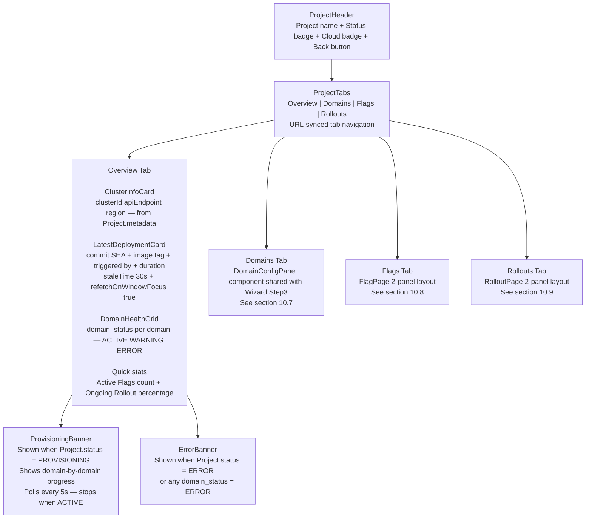

**useProject hook:**

```typescript
function useProject(projectId: string) {
  return useQuery({
    queryKey: ["project", projectId],
    queryFn: () => api.get(`/projects/${projectId}`),
    // Only poll when provisioning — auto-stop when done
    refetchInterval: (data) =>
      data?.status === "PROVISIONING" ? 5_000 : false,
    refetchOnWindowFocus: (query) => query.state.data?.status !== "ACTIVE",
  });
}
```

**staleTime tuning per data type:**

```typescript
staleTime: 60_000; // domain configs — rarely change
staleTime: 10_000; // feature flags — change more often
staleTime: 30_000; // latest deployment — refetchOnWindowFocus: true
staleTime: 0; // active rollout — always fresh
```

### 10.7 Domain Config UI

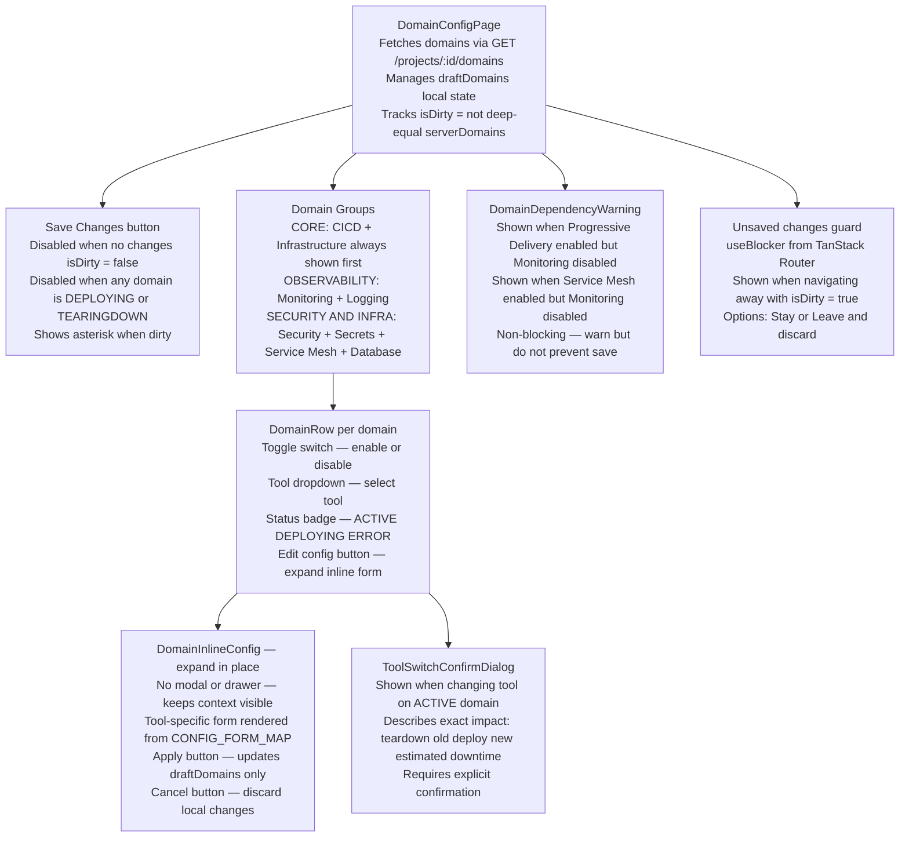

**CONFIG_FORM_MAP — shared between Wizard and Domain Config Page:**

```typescript
const CONFIG_FORM_MAP = {
  CICD: {
    "github-actions": CicdGithubForm,
    "gitlab-ci": CicdGitlabForm,
  },
  MONITORING: {
    "prometheus-grafana": MonitoringPrometheusForm,
    datadog: MonitoringDatadogForm,
  },
  LOGGING: {
    loki: LoggingLokiForm,
    elk: LoggingElkForm,
  },
  SECRETS: {
    vault: SecretsVaultForm,
    "k8s-csi": SecretsK8sCsiForm,
  },
  SECURITY: {
    trivy: SecurityTrivyForm,
    snyk: SecuritySnykForm,
  },
  SERVICE_MESH: {
    istio: ServiceMeshIstioForm,
    linkerd: ServiceMeshLinkerdForm,
  },
  DATABASE: {
    "postgres-operator": DatabasePostgresForm,
    "mongodb-operator": DatabaseMongoForm,
  },
};

const DOMAIN_DEPENDENCIES: Record<DomainType, DomainType[]> = {
  PROGRESSIVE_DELIVERY: ["MONITORING"],
  SERVICE_MESH: ["MONITORING"],
  DATABASE: [],
  CICD: [],
  MONITORING: [],
  LOGGING: [],
  SECRETS: [],
  SECURITY: [],
  INFRA: [],
};
```

### 10.8 Feature Flag Management

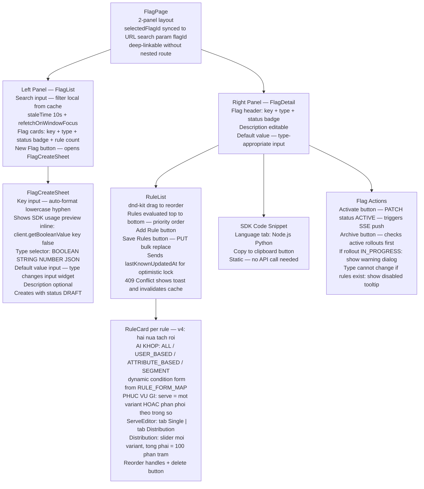

**RULE_FORM_MAP — [v4] tách "ai khớp" khỏi "phục vụ gì":**

```typescript
// Nửa thứ nhất: AI KHỚP (condition)
const RULE_FORM_MAP = {
  ALL: null,                                // không có form — khớp mọi người
  USER_BASED: UserBasedRuleForm,            // userIds tag input
  ATTRIBUTE_BASED: AttributeBasedRuleForm,  // attribute + operator + value
  SEGMENT: SegmentPickerForm,               // chọn Segment đã định nghĩa
};

// Nửa thứ hai: PHỤC VỤ GÌ (serve) — dùng chung cho MỌI loại rule ở trên
const SERVE_FORM_MAP = {
  variant: SingleVariantSelect,             // chọn 1 variant
  distribution: WeightedDistributionForm,   // slider mỗi variant, chặn lưu nếu tổng ≠ 100%
};
```

> **Vì sao `PercentageRuleForm` của v3 bị bỏ:** nó gộp hai khái niệm vào một, nên "10% người dùng ở VN" không diễn đạt được (phải chọn *hoặc* phần trăm *hoặc* thuộc tính), và chia ba variant bằng chuỗi rule cho ra 33/22/45 thay vì 33/33/34 vì rule thứ hai chỉ nhận phần còn lại. Tách ra thì `ATTRIBUTE_BASED` + `distribution` giải quyết cả hai, và **`distribution` chính là thứ mà rollout FLAG_LEVEL ramp** (§7.7) — không tách thì C1 không có chỗ để tác động.

```typescript

const VALUE_INPUT_MAP = {
  BOOLEAN: BooleanToggleInput,
  STRING: TextInput,
  NUMBER: NumberInput,
  JSON: JsonTextareaInput,
};
```

### 10.9 Rollout Dashboard

```mermaid
flowchart TD
    PAGE["RolloutPage\n2-panel layout\nselectedRolloutId synced to URL search param"]

    LEFT["Left Panel — RolloutList\nStatus icons: IN_PROGRESS PAUSED DONE FAILED\nStrategy label: Canary A-B Blue-Green\nCurrent traffic percentage for IN_PROGRESS\nNew Rollout button — opens RolloutCreateSheet"]

    CREATE["RolloutCreateSheet — v4\nBuoc 1 SCOPE: FLAG_LEVEL hay SERVICE_LEVEL\n  FLAG_LEVEL: chon flag + variant + rule se ramp\n  SERVICE_LEVEL: chon workload + image tag moi\nBuoc 2 CONTROL MODE — chi hien khi SERVICE_LEVEL\n  tool-driven mac dinh | udp-driven\n  BLUE_GREEN bi vo hieu hoa khi scope = FLAG_LEVEL\nBuoc 3 PROBE: goi POST /rollouts/probe truoc khi cho Next\n  hasSeries = false thi CHAN, hien MetricsSetupGuide\nBuoc 4 NHIP: stepPercent, stepInterval (dwell),\n  analysisInterval (nhip do) — hai o TACH ROI, co giai thich\nBuoc 5 NGUONG: errorRate, relativeErrorRate, minErrors,\n  latencyP99, warmUpRequests, maxConsecutiveBreaches\nCalls POST /rollouts + Idempotency-Key"]

    GUIDE["MetricsSetupGuide — man 422 (v4)\nHien khi probe tra hasSeries = false\nNoi ro: app chua gan nhan ff\nCode snippet dung ngon ngu cua project\nNut Kiem tra lai — goi probe lai\nKHONG cho tao rollout chay mu"]

    RIGHT["Right Panel — RolloutDetail\nRoutes to strategy-specific component\nCanaryDetail or BlueGreenDetail or AttributeSplitDetail"]

    CANARY["CanaryDetail\nTrafficSplitBar: canary percent vs stable percent\nStepsTimeline: each step with status check pass fail\nHealthMetricsPanel: error rate + latency + RPS\nPause Resume Rollback Promote buttons per status\nAutoRollbackBanner when fail_reason = AUTO_ROLLBACK"]

    BLUEGREEN["BlueGreenDetail\nBlue panel: current stable version\nGreen panel: new version under test\nSmoke test progress\nSwitch Traffic button — manual promote\nRollback button"]

    ABTEST["AttributeSplitDetail — v4 doi ten\nSo sanh metric KY THUAT giua hai nhanh\nKem canh bao: hai nhom khac nhau ve ban chat\n  nen chenh lech KHONG quy duoc cho nhanh flag\nKHONG hien conversion rate hay p-value:\n  he thong khong lam suy luan thong ke (7.2)\nChi Manual Promote hoac Rollback — khong auto"]

    NOMETA["No metrics source warning\nKhi khong co capability metrics.query\nAuto-rollback se khong hoat dong\nLink bat domain Monitoring"]

    PAGE --> LEFT
    PAGE --> RIGHT
    LEFT --> CREATE
    CREATE --> GUIDE
    RIGHT --> CANARY
    RIGHT --> BLUEGREEN
    RIGHT --> ABTEST
    RIGHT --> NOMETA
```

**useRollout hook — polling by status:**

```typescript
function useRollout(rolloutId: string) {
  return useQuery({
    queryKey: ["rollout", rolloutId],
    queryFn: () => api.get(`/projects/${projectId}/rollouts/${rolloutId}`),
    refetchInterval: (data) => {
      if (data?.status === "IN_PROGRESS") return 5_000;
      if (data?.status === "PAUSED") return 10_000;
      return false; // DONE or FAILED — stop polling
    },
    refetchOnWindowFocus: (query) => {
      const s = query.state.data?.status;
      return s !== "DONE" && s !== "FAILED";
    },
    staleTime: 0,
  });
}
```

**useGlobalRolloutWatcher — notify when auto-rollback happens on other tabs:**

```typescript
function useGlobalRolloutWatcher(projectId: string) {
  const prevRef = useRef<RolloutSession[]>([]);

  useQuery({
    queryKey: ["rollouts-active", projectId],
    queryFn: () =>
      api.get(`/projects/${projectId}/rollouts?status=IN_PROGRESS`),
    refetchInterval: 15_000,
    onSuccess: (data) => {
      const failed = prevRef.current.filter(
        (prev) => !data.find((curr) => curr.id === prev.id),
      );
      failed.forEach((session) => {
        toast.info(`Auto-rollback executed for ${session.versionNew}`, {
          action: {
            label: "View details",
            onClick: () => navigate(`/rollouts/${session.id}`),
          },
        });
      });
      prevRef.current = data;
    },
  });
}
```

### 10.10 Shared / Global

**React Query global config:**

```typescript
export const queryClient = new QueryClient({
  defaultOptions: {
    queries: {
      staleTime: 30_000,
      retry: (failureCount, error) => {
        const status = (error as AxiosError)?.response?.status;
        if (status && status >= 400 && status < 500) return false;
        return failureCount < 2;
      },
      refetchOnWindowFocus: true,
    },
    mutations: {
      onError: (error, _vars, _ctx, mutation) => {
        if (mutation.meta?.suppressGlobalError) return;
        toast.error(extractErrorMessage(error));
      },
    },
  },
});
```

**extractErrorMessage:**

```typescript
function extractErrorMessage(error: unknown): string {
  if (axios.isAxiosError(error)) {
    const data = error.response?.data as { error?: { message?: string } };
    if (data?.error?.message) return data.error.message;
    if (error.response?.status === 403) return "You do not have permission";
    if (error.response?.status === 404) return "Resource not found";
    if (error.code === "ECONNABORTED")
      return "Connection timeout — please retry";
    if (!error.response) return "Network connection lost";
  }
  return "An unexpected error occurred";
}
```

**StatusBadge config:**

```typescript
const STATUS_CONFIG = {
  ACTIVE: { variant: "success", label: "Active" },
  DRAFT: { variant: "secondary", label: "Draft" },
  PROVISIONING: { variant: "info", label: "Provisioning" },
  ERROR: { variant: "destructive", label: "Error" },
  DONE: { variant: "success", label: "Done" },
  FAILED: { variant: "destructive", label: "Failed" },
  IN_PROGRESS: { variant: "info", label: "In Progress" },
  PAUSED: { variant: "warning", label: "Paused" },
  ARCHIVED: { variant: "secondary", label: "Archived" },
} as const;
```

**Error Boundary — 2 levels:**

```typescript
// Level 1: __root.tsx — catches fatal crashes
// Level 2: each tab Outlet — prevents one tab crashing the entire layout
<ErrorBoundary fallback={<TabErrorState onRetry={() => window.location.reload()} />}>
  <Outlet />
</ErrorBoundary>
```

**Vite proxy (CORS local dev):**

```typescript
// vite.config.ts
export default defineConfig({
  server: {
    proxy: {
      "/api": {
        target: "http://localhost:3000",
        changeOrigin: true,
      },
    },
  },
});
// FE localhost:5173/api/* → proxied to BE localhost:3000/api/*
// Same origin → httpOnly cookies work correctly
```

**Toast rules:**

```
Toast notification:   success, info, light warning — no user action needed
Dialog confirmation:  destructive actions — promote, rollback, archive, tool switch
Inline error:         form validation — always near the field, never toast
```

### 10.11 Admin UI

**4 màn hình — dùng shadcn DataTable:**

```
/admin/users
  DataTable: id, email, name, role, created_at
  Action per row: toggle role USER to ADMIN or back
  API: PATCH /admin/users/:id/role

/admin/projects
  DataTable: name, owner email, status, cloud provider, created_at
  Filter by status dropdown

/admin/credentials
  DataTable: project name, provider, mode, is_active, created_at

/admin/system
  Health check cards for each service:
    udp-core-backend, udp-feature-flag-service, udp-pd-controller
  DB connection status
  Auto-refresh every 30s
```

---

### 10.12 Bổ sung v3 — các màn hình phát sinh từ thiết kế mới

| Màn hình / thành phần | Thuộc lỗ hổng | Mô tả |
| --------------------- | ------------- | ----- |
| **Environment Switcher** (thanh trên, luôn hiện) | B2 | Một dropdown `dev / staging / prod` duy nhất, đặt cạnh tên project. **Mọi** màn hình flag, rollout, deployment đều lọc theo lựa chọn này. Environment production hiển thị nền cảnh báo màu khác — người dùng phải luôn biết mình đang đứng ở đâu |
| **Flag Environment Matrix** | B2 | Bảng flag × environment, mỗi ô là công tắc bật/tắt kèm variant đang mặc định. Nhìn một lần thấy ngay "flag này bật ở dev, tắt ở prod" |
| **Nút Promote config dev → staging** | B2 | Sao chép rule giữa hai environment, hiển thị diff trước khi áp dụng |
| **SDK Keys** (trong Settings của environment) | B1 | Danh sách key: prefix, loại (SERVER/CLIENT), lần dùng cuối, nút thu hồi. Key mới hiện plaintext **đúng một lần** trong modal có nút copy, kèm cảnh báo không thể xem lại. Key chưa dùng bao giờ sau 7 ngày được đánh dấu |
| **Members** | B12 | Mời theo email, đổi role, chuyển quyền OWNER (có xác nhận hai bước). Ma trận quyền hiển thị ngay trong UI để người dùng hiểu mỗi role làm được gì |
| **Audit Log** | B12 | Bảng lọc theo hành động / người / khoảng thời gian; mỗi dòng mở ra diff `before` → `after` đã redact |
| **Domain Config — validate trực tiếp** | B11 | Gọi `POST /domains/validate` sau mỗi thay đổi (debounce 400ms). Lỗi hiện ngay tại chỗ kèm **nút hành động**: "Flagger cần Service Mesh → **Bật Istio**". Panel bên phải vẽ thứ tự deploy theo bậc |
| **Provisioning Log Stream** | B4 | Thay vì chỉ một spinner và polling 5s, màn hình provisioning stream log qua SSE: đang ở bước nào, tài nguyên nào đã tạo, còn lại bao lâu. Job `FAILED` có nút **Retry từ bước dang dở** và **Hủy + dọn tài nguyên** |
| **Cost Preview** | B14 | Ở bước Preview của wizard: chi phí ước tính/tháng, bảng phân tách theo hạng mục, và ô nhập TTL cho project |
| **Preflight Permissions** | B13 | Sau khi nhập credential: danh sách quyền còn thiếu kèm policy JSON mẫu có nút copy — không để người dùng đoán từ thông báo lỗi của SDK cloud |
| **Rollout Dashboard — "vì sao đang đứng yên"** | B10 | Hiển thị `lastDecision.reason` nổi bật: *"Đang chờ đủ dữ liệu: 34/100 request"* hoặc *"errorRate 0.08 > 0.05, lần 2/2 → sắp rollback"*. Người dùng không bao giờ phải đoán tại sao thanh tiến trình không nhúc nhích |
| **Rollout — trạng thái intent** | B3 | Sau khi bấm PAUSE/ROLLBACK, nút chuyển sang *"Đang thực hiện…"* cho tới khi nhận được event thực thi, phản ánh đúng ngữ nghĩa `202 Accepted` |
| **Flag Cleanup Center** | B15 | Danh sách flag `UNUSED` / `SETTLED` / `STALE_DRAFT` kèm biểu đồ phân bố variant và nút Archive hàng loạt |
| **Flag Evaluation Tester** | B7 | Nhập context giả (targetingKey, thuộc tính) → hiện `value`, `variant`, `reason`, và **rule nào đã khớp**. Công cụ debug quan trọng nhất của bất kỳ hệ feature flag nào |

**Ảnh hưởng tới routing:** thêm tham số `envId` vào search params của các route flag/rollout/deployment (TanStack Router giữ type-safe), với giá trị mặc định là environment không phải production có `rank` nhỏ nhất — để một cú refresh trang không vô tình đưa người dùng vào ngữ cảnh production.

**Ảnh hưởng tới state:** `Zustand` thêm `environmentStore` (environment đang chọn, danh sách environment của project). `TanStack Query` key của mọi query liên quan flag/rollout phải chứa `envId`, nếu không dữ liệu của `dev` sẽ bị cache lẫn sang `prod` — đây là loại lỗi rất khó phát hiện bằng mắt.

### 10.13 Bổ sung v4 — màn hình phát sinh từ ADR-06, capability rebind và day-2

| Màn hình / thành phần | Nguồn | Mô tả |
| --------------------- | ----- | ----- |
| **Provider Picker** khi `AMBIGUOUS_PROVIDER` | §5.3 | Cả Prometheus và VictoriaMetrics cùng cung cấp `metrics.query`. Dialog liệt kê ứng viên kèm `version` của capability, người dùng chọn, lưu vào `CapabilityPreference` qua `PUT /capability-preferences`. v3 hứa "dropdown" nhưng không có chỗ lưu, nên worker restart là mất lựa chọn |
| **Version Mismatch badge** | §5.3 | Khác `MISSING_CAPABILITY` ở chỗ provider **có mặt** nhưng sai semver. Thông báo phải nói được cả hai vế: "Flagger cần `metrics.query` tương thích PromQL (`^2`); Datadog cung cấp `1.0.0` (DQL)". Hai nút: đổi nguồn metrics, hoặc đổi sang Argo Rollouts |
| **Rebind Preview** trước khi lưu domain | §8.2 | `POST /domains/validate` trả `rebindPlan`. Trước khi người dùng xác nhận đổi tool, hiện danh sách consumer sẽ bị `onDependencyChanged()` và cảnh báo thứ tự "deploy mới → rebind → teardown cũ". Đây là thao tác chạm vào production nên không được im lặng |
| **Drift badge + Diff viewer** | §8.6 | Trên thẻ mỗi domain: "Đã trôi cấu hình, phát hiện 2 giờ trước". Mở ra là `helm diff` dạng hai cột. **Không có nút "tự sửa"** — chỉ có "Áp lại cấu hình mong muốn" kèm xác nhận, vì trôi thường là người vận hành cố ý vá nóng |
| **Upgrade dialog** | §8.6 | Chọn phiên bản đích, hiện changelog, và **kết quả chạy lại validator với khai báo capability mới** trước khi cho bấm. Bị chặn kèm giải thích nếu project đang có rollout `IN_PROGRESS` |
| **MetricsSetupGuide** (màn 422) | §6.6, §8.5 | Chặn tạo rollout khi `probe()` báo `hasSeries = false`. Hiện đúng đoạn code cần thêm theo ngôn ngữ của project (Node.js hoặc Python), nút "Kiểm tra lại". Đây là điều kiện để C1 **không bao giờ chạy mù** |
| **Rollout Detail: baseline + đối chứng** | §7.1, §7.4 | Biểu đồ vẽ **hai** đường: nhánh canary và nhánh baseline, kèm vạch ngang `baselinePercentage` là mốc rollback sẽ về. Hiện `zScore` và cả hai truy vấn PromQL đã chạy, để người dùng kiểm chứng được quyết định của hệ thống thay vì phải tin |
| **Rollout Detail: hai nhịp tách rời** | §7.1 | Hai đồng hồ đếm riêng: "phân tích lại sau 12s" và "đủ dwell để promote sau 3m40s". Người dùng phải thấy được rằng hệ thống **vẫn đang đo** trong lúc chờ dwell, nếu không màn hình đứng yên 5 phút trông như treo |
| **Breach streak indicator** | §7.1 | "Vượt ngưỡng 1/2, sẽ rollback nếu lần đo tới vẫn vượt" — trạng thái quan trọng nhất mà v3 không hiển thị |
| **SDK Keys: giải thích hai chế độ** | ADR-03 | Không chỉ liệt kê `SERVER`/`CLIENT`. Mỗi loại kèm một dòng nói rõ cơ chế và hệ quả: SERVER đánh giá tại chỗ, nhận toàn bộ rule, chỉ dùng ở backend; CLIENT gửi context lên và nhận kết quả, **rule không bao giờ rời server**, dùng được ở trình duyệt. Kèm snippet OFREP tương ứng |
| **Admin: Orphan Resources** | §4.4, §8.1 | Bảng `ProvisionedResource` có `status = ORPHAN_SUSPECTED`, nhóm theo project và region, kèm ước tính chi phí đang chạy và nút dọn từng cái. Đây là màn hình duy nhất nhìn thấy tiền đang bị đốt |
| **Admin: Domain Catalog** | §2.2, §5.3 | Chỉ đọc: 16 domain đồng bộ từ registry, `is_available`, số project đang dùng. Cố tình **không có nút sửa** — bảng này do tiến trình khởi động ghi, một nút sửa trên UI sẽ phá bất biến I29 |

**Ảnh hưởng tới routing:** thêm `/app/projects/:id/domains/:type` (chi tiết một domain: drift, version, binding đang cung cấp) và `/admin/catalog`.

### 10.14 Bản đồ màn hình, endpoint, query key và quy tắc invalidate [NEW v4]

§10.12 đã cảnh báo bằng chữ: *"query key của mọi query liên quan flag/rollout phải chứa `envId`, nếu không dữ liệu của `dev` sẽ bị cache lẫn sang `prod`"*. Một cảnh báo bằng chữ sẽ bị quên ở màn hình thứ mười. Bảng này biến nó thành hợp đồng, và **hai cột cuối mới là phần quan trọng** — đó là nơi bug "bấm xong không thấy gì đổi" và bug lẫn cache giữa environment sinh ra.

| Màn hình | Endpoint chính | Query key | Invalidate khi |
| -------- | -------------- | --------- | -------------- |
| Project List | `GET /projects` | `["projects"]` | Tạo, xóa, đổi tên project |
| Project Dashboard | `GET /projects/:id` | `["project", projectId]` | Job xong, đổi quota hoặc TTL |
| Provisioning Log | `GET /projects/:id/jobs/:jobId/stream` | `["job", projectId, jobId]` | SSE đẩy, hoặc job chuyển trạng thái |
| Domain Config | `GET /projects/:id/domains` | `["domains", projectId]` | `PUT /domains` thành công, job `DOMAIN_APPLY` xong, `PUT /capability-preferences` |
| Domain Catalog | `GET /domains/catalog` | `["catalog"]` | **Không bao giờ** trong một phiên — `staleTime: Infinity`, vì catalog chỉ đổi khi service khởi động lại |
| Domain Detail (day-2) | `GET /projects/:id/domains/:type/drift` | `["drift", projectId, type]` | Chạy `POST /drift`, hoặc `upgrade` xong |
| **Flag List** | `GET /projects/:id/flags?envId=` | `["flags", projectId, **envId**]` | Tạo hoặc archive flag, SSE `flag_changed` |
| **Flag Detail** | `GET /projects/:id/flags/:flagId` | `["flag", projectId, flagId, **envId**]` | Lưu rule, bật/tắt theo env, SSE `flag_changed` |
| **Flag Env Matrix** | `GET /projects/:id/flags/:flagId/envs` | `["flagEnvs", projectId, flagId]` | Bật/tắt ở **bất kỳ** env nào — đây là màn hình duy nhất **cố ý** không scope theo env |
| Flag Cleanup Center | `GET /projects/:id/flags/stale` | `["staleFlags", projectId]` | Archive hàng loạt |
| **Rollout List** | `GET /projects/:id/rollouts?envId=` | `["rollouts", projectId, **envId**]` | Tạo rollout, rollout kết thúc |
| **Rollout Detail** | `GET /projects/:id/rollouts/:rid` | `["rollout", projectId, rid]` | Ghi intent; **polling theo status**: 5s khi `IN_PROGRESS`, dừng hẳn khi `DONE`/`FAILED` |
| **Deployments** | `GET /projects/:id/deployments?envId=` | `["deployments", projectId, **envId**]` | Webhook mới về (qua polling) |
| DORA | `GET /projects/:id/metrics/dora` | `["dora", projectId, envId, range]` | Đổi khoảng thời gian |
| Members | `GET /projects/:id/members` | `["members", projectId]` | Mời, đổi role, chuyển OWNER |
| Audit Log | `GET /projects/:id/audit` | `["audit", projectId, filters]` | Đổi bộ lọc |
| SDK Keys | `GET /.../environments/:envId/keys` | `["sdkKeys", projectId, envId]` | Tạo hoặc thu hồi key |
| Admin Orphan | `GET /admin/orphan-resources` | `["orphans"]` | Dọn một tài nguyên |

**Quy tắc, và cách cưỡng chế:**

| Quy tắc | Cưỡng chế |
| ------- | --------- |
| Mọi hook đọc dữ liệu **thuộc phạm vi environment** phải có `envId` trong query key | **Bất biến I38**: test duyệt toàn bộ hook trong `api/`, đối chiếu với danh sách hook env-scoped khai tường minh; thêm hook mới mà quên `envId` là **fail build** |
| Ngoại lệ phải **khai tường minh**, không phải bỏ sót âm thầm | `Flag Env Matrix` cố ý không scope theo env vì nó hiển thị *mọi* env cùng lúc. Khai vào danh sách miễn trừ, giống cách I10 miễn trừ route |
| Polling phải **tự dừng** | `refetchInterval` là hàm của `status`, trả `false` khi `DONE` hoặc `FAILED`. Không có điều này thì một tab mở quên sẽ poll mãi mãi |
| SSE và React Query không được đá nhau | SSE **chỉ gọi `invalidateQueries`**, không tự ghi vào cache. Ghi thẳng vào cache tạo ra hai nguồn sự thật ở phía client — đúng thứ ADR-05 tránh ở phía server |

**Ảnh hưởng tới state:** `RolloutDetail` phải phân biệt ba trạng thái "đang chờ" mà v3 gộp làm một: chờ đủ dữ liệu (`warmUp`), chờ cửa sổ metric ổn định sau bậc mới (`window`), và chờ đủ dwell (`dwell`). Gộp lại thì mọi thứ đều hiện "đang chờ" và người dùng không biết có nên lo hay không.

---

## 11. Golden Path Template

### 11.1 Create New Service — Cấu trúc template Node.js

```
my-service/
├── src/
│   ├── index.ts               ← Entry point: OpenFeature + Prometheus setup
│   ├── app.ts                 ← Express app setup
│   └── routes/
├── Dockerfile                 ← Multi-stage build
├── .github/
│   └── workflows/
│       └── udp.yml            ← CI/CD pipeline template
├── k8s/
│   ├── deployment.yaml        ← K8s Deployment manifest
│   └── service.yaml           ← K8s Service manifest
├── package.json
└── tsconfig.json
```

**Bắt buộc include trong template [v4 viết lại toàn bộ]:**

> **Vì sao mục này phải viết lại:** template của v3 dùng `UDPTelemetryHook` ghi vào **OpenTelemetry baggage** rồi để middleware đọc ra. Cách đó **không chạy**: context và baggage của OTel là bất biến, `propagation.setBaggage()` trả về một context *mới* mà middleware đang chạy không nhìn thấy. §6.6 đã phân tích đầy đủ. Vì §11 là code mà developer copy thẳng vào ứng dụng của họ, để nguyên nghĩa là phát tán một cơ chế không hoạt động, và **C1 sẽ không có dữ liệu** ở mọi project dựng từ Golden Path.

```typescript
// ─────────────────────────────────────────────────────────────
// src/telemetry.ts — thiết lập MỘT LẦN, trước khi tạo Express app
// ─────────────────────────────────────────────────────────────
import { OpenFeature } from "@openfeature/server-sdk";
// Hook CHÍNH THỨC của OpenFeature: span attribute + counter theo OTel semconv.
// Không tự viết lại — `feature_flag.variant` của v3 đã deprecated, nay là
// feature_flag.result.variant / feature_flag.result.reason / feature_flag.provider.name
import { TracingHook, MetricsHook } from "@openfeature/open-telemetry-hooks";
import {
  UDPFeatureFlagProvider,
  UDPRequestLabelHook,   // [v4] thay UDPTelemetryHook của v3
  udpMetricsMiddleware,
} from "@udp/openfeature-provider";

const provider = new UDPFeatureFlagProvider({
  host: process.env.UDP_FLAG_HOST!,
  // SDK key mang sẵn (project, environment). Không truyền projectId:
  // projectId không phải bí mật (ADR-03)
  sdkKey: process.env.UDP_SDK_KEY!,
});
await OpenFeature.setProviderAndWait(provider);

// Hai hook chính thức lo span và counter chuẩn semconv
OpenFeature.addHooks(new TracingHook(), new MetricsHook());

// BẮT BUỘC cho C1: hook riêng của UDP ghi variant vào request-scoped store.
// Provider tự nhận danh sách trackedFlags qua SSE, developer KHÔNG phải cấu hình.
OpenFeature.addHooks(new UDPRequestLabelHook(provider));
```

```typescript
// ─────────────────────────────────────────────────────────────
// src/app.ts — middleware phải bọc TOÀN BỘ handler
// ─────────────────────────────────────────────────────────────
import express from "express";
import { collectDefaultMetrics, register } from "prom-client";
import { udpMetricsMiddleware } from "@udp/openfeature-provider";

collectDefaultMetrics();
const app = express();

// BẮT BUỘC và phải đăng ký TRƯỚC mọi route.
// Bên trong nó dùng AsyncLocalStorage (KHÔNG phải OTel baggage) để mở một
// store theo từng request; UDPRequestLabelHook ghi variant vào store đó;
// khi response kết thúc, middleware phát metric:
//
//   http_server_request_duration_seconds{
//     service_name, service_version, http_route,
//     http_request_method, http_response_status_code,
//     ff        // "" cho series tổng, hoặc "<flagKey>=<variant>"
//   }
//
// Một series không nhãn + một series cho MỖI tracked flag đã đánh giá.
// Cộng thêm, không nhân chéo (§6.6, chi phí đo ở E14).
app.use(udpMetricsMiddleware());

app.get("/metrics", async (_req, res) => {
  res.set("Content-Type", register.contentType);
  res.end(await register.metrics());
});
```

**Bản Python — cùng ngữ nghĩa, khác cơ chế mang ngữ cảnh:**

```python
# telemetry.py — AsyncLocalStorage của Node tương ứng contextvars của Python
from contextvars import ContextVar
from openfeature import api
from openfeature.contrib.hook.opentelemetry import TracingHook, MetricsHook
from udp_openfeature import UDPFeatureFlagProvider, UDPRequestLabelHook, UDPMetricsMiddleware

_picks: ContextVar[dict[str, str]] = ContextVar("udp_flag_picks")

provider = UDPFeatureFlagProvider(host=UDP_FLAG_HOST, sdk_key=UDP_SDK_KEY)
api.set_provider(provider)
api.add_hooks([TracingHook(), MetricsHook(), UDPRequestLabelHook(provider, _picks)])

# app.py — ASGI/WSGI middleware mở contextvar và phát metric khi response xong
app.add_middleware(UDPMetricsMiddleware, picks=_picks)
```

> `contextvars` được chọn vì nó là cơ chế duy nhất của Python truyền được ngữ cảnh qua `await` mà không phải chuyền tay tham số. Với WSGI đồng bộ, thread-local cũng đủ; thư viện chọn tự động.

**Ba điều kiện để C1 hoạt động, và điều gì xảy ra khi thiếu:**

| Điều kiện | Thiếu thì sao |
| --------- | -------------- |
| `udpMetricsMiddleware()` đăng ký trước mọi route | Không có store ⇒ hook không có chỗ ghi ⇒ metric không có nhãn `ff` ⇒ `probe()` trả `hasSeries = false` và Portal **chặn** tạo rollout FLAG_LEVEL với lý do rõ ràng (§8.5). Không bao giờ chạy mù |
| `UDPRequestLabelHook` được thêm vào OpenFeature | Metric có series tổng nhưng không tách được nhánh flag; cùng hệ quả như trên |
| `service_version` khớp **đúng** image tag đang chạy | Canary `SERVICE_LEVEL` không phân biệt được version cũ và mới. Inject qua env var trong manifest (CI ghi vào lúc render). `probe()` bắt lỗi này ngay lúc tạo rollout |

> **Giới hạn trung thực, phải nói khi bảo vệ:** flag được đánh giá **sau** khi response đã gửi, hoặc trong job nền, sẽ không có store nên không được gắn nhãn — chỉ có counter của `MetricsHook`. Ngôn ngữ ngoài Node.js và Python cần port middleware và cơ chế store tương ứng. Cả hai ghi ở §16.

**Dockerfile (multi-stage build):**

```dockerfile
FROM node:20-alpine AS builder
WORKDIR /app
COPY package*.json ./
RUN npm ci
COPY . .
RUN npm run build

FROM node:20-alpine AS production
WORKDIR /app
COPY --from=builder /app/dist ./dist
COPY --from=builder /app/node_modules ./node_modules
EXPOSE 3000
CMD ["node", "dist/index.js"]
```

**CI/CD pipeline template `.github/workflows/udp.yml`:**

```yaml
name: UDP CI/CD

on:
  push:
    branches: [main]

jobs:
  build-and-deploy:
    runs-on: ubuntu-latest
    steps:
      - uses: actions/checkout@v4

      - name: Run tests
        run: npm test

      - name: Build Docker image
        run: |
          docker build \
            -t ${{ vars.REGISTRY }}/${{ vars.IMAGE_NAME }}:${{ github.sha }} .

      - name: Push to registry
        run: |
          docker push ${{ vars.REGISTRY }}/${{ vars.IMAGE_NAME }}:${{ github.sha }}

      - name: Notify UDP webhook
        env:
          SECRET: ${{ secrets.UDP_WEBHOOK_SECRET }}
        run: |
          # Dựng body TRƯỚC, ký ĐÚNG chuỗi byte sẽ gửi đi.
          # v3 ký trên toJSON(github.event) nhưng gửi một JSON khác — verify
          # luôn thất bại vì HMAC được tính trên nội dung không phải body.
          BODY=$(jq -nc \
            --arg env    "${{ vars.UDP_ENVIRONMENT }}" \
            --arg status "success" \
            --arg sha    "${{ github.sha }}" \
            --arg ts     "${{ github.event.head_commit.timestamp }}" \
            --arg tag    "${{ github.sha }}" \
            --arg wl     "${{ vars.UDP_WORKLOAD_NAME }}" \
            --arg run    "${{ github.run_id }}" \
            '{environment:$env, status:$status, commitSha:$sha,
              commitTimestamp:$ts, imageTag:$tag, workloadName:$wl, pipelineId:$run}')

          SIG=$(printf '%s' "$BODY" \
            | openssl dgst -sha256 -hmac "$SECRET" -binary \
            | xxd -p -c 256)

          curl -sS -X POST "${{ vars.UDP_WEBHOOK_URL }}/github" \
            -H "X-Hub-Signature-256: sha256=$SIG" \
            -H "Content-Type: application/json" \
            -H "Idempotency-Key: ${{ github.run_id }}-${{ github.run_attempt }}" \
            --data-raw "$BODY"
```

**Bốn điểm của template webhook, mỗi điểm chặn một lỗi thật:**

| Điểm | Lỗi nó chặn |
| ---- | ----------- |
| Ký đúng chuỗi byte của body (`printf '%s'`, không phải `echo`) | `echo` thêm ký tự xuống dòng vào cuối, HMAC lệch, verify thất bại. Đây là lỗi kinh điển và rất khó chẩn đoán vì thông báo chỉ nói "chữ ký sai" |
| Không gửi `projectId` trong body | `projectId` không phải bí mật (ADR-03). Project suy ra từ webhook secret, giống cách SDK key suy ra environment. Gửi trong body vừa thừa vừa mời người ta thử đổi |
| Gửi `commitTimestamp` từ `head_commit.timestamp` | Không có nó thì **Lead Time for Changes** của DORA không tính được, và không suy ra được từ `commitSha` nếu không gọi ngược API của Git provider (§8.3) |
| `Idempotency-Key` gồm cả `run_attempt` | Bấm "Re-run job" trên GitHub phải được coi là **lần deploy mới**, không phải bản lặp của lần cũ. Dùng mỗi `run_id` thì lần chạy lại bị nuốt |

### 11.2 Import Existing Repo

```
Cơ chế:
1. Quét repo → nhận diện ngôn ngữ/framework qua package.json, requirements.txt, pom.xml
2. Có Dockerfile chưa → thiếu thì đề xuất Dockerfile phù hợp
3. Có endpoint /metrics chưa → thiếu thì đề xuất thêm Prometheus client
4. Có OpenFeature SDK chưa → thiếu thì đề xuất các bước tích hợp
5. [v4] Có udpMetricsMiddleware và UDPRequestLabelHook chưa
       → thiếu thì đề xuất, VÀ đánh dấu project là "chưa sẵn sàng cho
         flag-level rollout" ngay trên dashboard, không đợi tới lúc
         người dùng tạo rollout mới báo 422
6. [v4] service_version có được inject vào manifest không
       → thiếu thì canary SERVICE_LEVEL không phân biệt được version
7. Sinh file CI/CD pipeline khớp với CI/CD tool đã nhận diện
8. Developer duyệt từng đề xuất một → bắt đầu dùng IDP

Nguyên tắc: CHỈ phát hiện và đề xuất — KHÔNG BAO GIỜ tự sửa code của developer.
            Developer giữ toàn quyền trên repository của mình.
```

> **Vì sao bước 5 và 6 phải nằm ở đây chứ không chỉ ở màn tạo rollout:** `probe()` (§8.5) là lưới an toàn cuối cùng, nhưng nó chỉ chạy khi người dùng đã muốn tạo rollout. Phát hiện ngay lúc import cho họ biết cần làm gì **trước khi** cần tới nó, và biến "C1 không dùng được với repo có sẵn" thành một checklist hai dòng. Đây cũng là chênh lệch trải nghiệm giữa `Create New` và `Import Existing` mà §16 ghi nhận.

---

## 12. Bảo mật và Multi-tenancy

UDP giữ credential cloud của người khác và có quyền thay đổi hạ tầng production của họ. Mục này tập hợp các biện pháp đã rải rác ở trên thành một mô hình đe dọa mạch lạc.

### 12.1 Mô hình đe dọa

| # | Đe dọa | Kịch bản | Biện pháp |
| - | ------ | -------- | --------- |
| T1 | **Rò cấu hình flag và danh sách người dùng** | Kẻ tấn công biết `projectId` (không phải bí mật) và gọi endpoint SDK | Bắt buộc SDK key; project/env suy ra **từ key**, không từ tham số (ADR-03). `CLIENT` key dùng **remote evaluation qua OFREP**: không rule nào rời server, nên không có gì để rò. v3 định "lược PII rồi vẫn gửi rule" — cách đó vừa rò (salt public nên hash `targetingKey` bị dictionary attack, rule `SEGMENT` không được lược, delta qua SSE không được lược) vừa **sai kết quả** (bỏ một rule làm đổi rule nào khớp tiếp theo). Bất biến I11 |
| T2 | **Đánh cắp credential cloud** | Truy cập được DB dump | Envelope encryption AES-256-GCM, DEK riêng từng project, KEK ở KMS ngoài DB (§4.3). DB dump một mình là vô dụng |
| T3 | **Rò credential qua log** | SDK cloud ném lỗi có kèm credential trong `error.config` | `ResolvedCredential` chặn serialize; hàm `redact()` dùng chung ở request logger, `AuditLog`, `ProvisioningJob.last_error` |
| T4 | **Leo thang quyền ngang** | User A đọc/sửa project của User B bằng cách đổi `projectId` trên URL | `requireProjectRole` kiểm tra `ProjectMember` ở **mọi** endpoint có `:projectId`; test tích hợp quét toàn bộ route để bảo đảm không route nào thiếu (§13) |
| T5 | **Leo thang quyền dọc** | DEVELOPER bật flag ở production | Ma trận quyền §2.2 + `env-guard` kiểm tra `Environment.is_production` |
| T6 | **Giả mạo webhook** | Gửi POST giả để kích hoạt deploy image độc hại | Verify chữ ký theo từng nhà cung cấp, so sánh hằng thời gian; secret mã hóa, xoay vòng được; ghi nhận lần verify thất bại để phát hiện dò quét |
| T7 | **Lạm dụng SDK endpoint** | Dùng key hợp lệ để bào tài nguyên | Rate limit theo key (mở stream có limiter và trần riêng); `last_used_at` phát hiện bất thường; thu hồi key: request mới bị từ chối ngay, stream đang mở không nhận thêm dữ liệu và đóng trong ≤ 5 giây |
| T8 | **Tài nguyên mồ côi tiêu tiền** | Job chết giữa chừng | Sổ `ProvisionedResource` ghi **trước** lời gọi cloud + compensation theo thứ tự ngược + tag `udp.project` + `orphan-scan.job` + `GET /admin/orphan-resources` (§4.4, §8.1). Tài nguyên xóa không được đánh `ORPHAN_SUSPECTED` chứ không nuốt lỗi |
| T9 | **CSRF trên Portal** | Trang độc dụ trình duyệt gọi API bằng cookie sẵn có | Cookie `httpOnly` + `SameSite=Lax` + header `X-CSRF-Token` (double-submit) — giữ nguyên từ v2 |
| T10 | **Escape giữa các tenant trên cluster** | Workload của project A đọc secret của project B | Mỗi (project, environment) một namespace riêng + NetworkPolicy mặc định deny + ResourceQuota. **Giới hạn được ghi nhận:** đây là cô lập ở mức namespace, không phải mức kernel — xem §16 |
| **T11** | **SSRF qua cấu hình do người dùng nhập** [NEW v4] | `tool_config` của một SaaS adapter nhận endpoint tùy ý. Người dùng nhập `http://169.254.169.254/latest/meta-data/iam/security-credentials/` (metadata service của EC2) hoặc `http://10.0.0.5:9090`, rồi adapter chạy **bên trong hạ tầng của UDP** gọi hộ và trả kết quả về Portal. Kẻ tấn công đọc được credential của chính control plane hoặc quét mạng nội bộ | **Egress guard** bắt buộc: mọi HTTP ra ngoài của adapter đi qua `ctx.fetch` (§5.2), không dùng `fetch` toàn cục. Guard làm bốn việc: (1) chỉ cho scheme `https`, (2) **resolve DNS trước** rồi kiểm IP đích, chặn private/loopback/link-local/CGNAT và đặc biệt `169.254.0.0/16`, (3) **kiểm lại sau mỗi redirect** vì DNS rebinding có thể đổi kết quả giữa lần kiểm và lần kết nối, (4) chặn redirect tới scheme khác. Lint chặn `import fetch` trong thư mục adapter |
| **T12** | **Lạm dụng endpoint nội bộ** [NEW v4] | Một pod bất kỳ trong cluster gọi `POST /internal/clusters/:id/token` của Service 1 và nhận token vào cluster của tenant khác | NetworkPolicy chỉ cho pod của S2/S3 tới cổng nội bộ, **và** xác thực bằng ServiceAccount token + `TokenReview` ở tầng ứng dụng (không tin mỗi NetworkPolicy, phòng khi nó bị cấu hình sai). Với `PATCH /internal/rules/:id`, S2 còn kiểm `ruleId` có thuộc `RolloutSession` mà bên gọi **đang giữ lease** hay không — chỉ có token hợp lệ là chưa đủ |
| **T13** | **Token vào cluster tenant bị rò hoặc sống quá lâu** [NEW v4] | Kubeconfig dài hạn nằm trong DB hoặc trên đĩa; DB dump là mất cluster | ADR-06: **không lưu kubeconfig**. Mỗi lần cần, S1 dùng credential cloud lấy token cloud ngắn hạn rồi gọi `TokenRequest` lấy **bound SA token sống 1 giờ**, giữ trong bộ nhớ, xin lại trước hạn. Bất biến **I24** kiểm không có token nào sống quá 1 giờ được ghi xuống database hay đĩa |

### 12.2 Bốn tầng cô lập tenant

```
Tầng 1 — Ứng dụng:  ProjectMember + ma trận quyền; mọi truy vấn kèm điều kiện project_id
                    Bất biến I10 quét toàn bộ route để không route nào quên middleware

Tầng 2 — Dữ liệu:   DEK riêng từng project; SDK key gắn cứng (project, environment)
                    Postgres role udp_s1/s2/s3 + GRANT theo bảng, cưỡng chế ma trận
                    writer của §1.2 ở tầng database chứ không phải ở code review (I22)

Tầng 3 — Cluster:   Namespace riêng cho từng (project, environment)
                    + NetworkPolicy default-deny + ResourceQuota + LimitRange
                    [v4] Thêm một namespace hệ thống `udp-system` cho tooling
                    cluster-scoped (Istio control plane, operator, Argo Rollouts).
                    Workload của tenant KHÔNG có quyền đọc namespace này.

Tầng 4 — Cloud:     Với BYOC, mỗi project chạy trên tài khoản cloud RIÊNG của developer
                    → cô lập mạnh nhất, và cũng là lập luận bảo mật của mô hình BYOC
```

**Quyền của control plane trong cluster tenant [NEW v4 — ADR-06]: ba ServiceAccount, không phải một.**

ADR-01 dựa hoàn toàn vào bất biến "ba bên ghi vào cluster nhưng không bao giờ cùng một loại đối tượng" (§1.2, I25). Nếu cả ba dùng chung một ServiceAccount, bất biến đó chỉ được bảo đảm bằng **kỷ luật lập trình**: một dòng code sai là Service 3 sửa được `spec.template` và hai control loop đánh nhau, đúng thứ ADR-01 sinh ra để chặn. Tách thành ba SA thì **API server từ chối**, và audit log của chính API server trở thành bằng chứng kiểm được thay vì một lời hứa.

| ServiceAccount (trong `udp-system`) | Bên dùng | Được phép | **Cố tình không được phép** |
| ----------------------------------- | -------- | --------- | --------------------------- |
| `udp-workload` | Service 1 (§8.3) | `deployments`, `rollouts`, `services`, `configmaps`: get/list/watch/create/update/patch — chỉ trong namespace của environment | **Không** `patch` trên `virtualservices`/`trafficsplits`; **không** subresource `rollouts/promote`. S1 không thể chạm đường traffic |
| `udp-traffic` | Service 3 (§7.3) | `virtualservices`, `trafficsplits`, ingress: create/update/patch; `rollouts`: get + subresource `promote`/`abort`/`retry`; `services/proxy`: get **chỉ trên service của nguồn metrics** | **Không** `patch` trên `deployments`, **không** `patch` trên `rollouts` (chỉ subresource). Nên S3 không thể sửa `spec.template` kể cả khi có bug |
| `udp-tooling` | Domain adapter chạy trong worker của S1 (§8.2, §8.6) | Helm release, CRD, operator CR trong `udp-system`; CR theo namespace env | **Không** đụng `deployments` của workload tenant, **không** đụng đối tượng traffic |

Cả ba đều **không** có: `secrets` ngoài namespace của mình, `escalate`/`bind` (leo thang RBAC), `pods/exec` (vào shell container của tenant — không luồng nào ở §8 cần), và không dùng wildcard `*` ở bất kỳ verb hay resource nào.

> **Hệ quả với ADR-06:** `POST /internal/clusters/:id/token` nhận thêm tham số `audience` để biết cấp token của SA nào. Service 3 chỉ xin được `udp-traffic`; nếu nó xin `udp-workload` thì Service 1 từ chối, vì danh tính bên gọi đã được xác định bằng `TokenReview` (T12).

---

## 13. Testing Strategy

Phần này không có trong v2. Hội đồng gần như chắc chắn sẽ hỏi *"bạn kiểm thử bằng cách nào"*, và nhiều bất biến trong thiết kế trên chỉ có giá trị nếu có test cưỡng chế chúng.

### 13.1 Kim tự tháp kiểm thử

| Tầng | Công cụ | Phạm vi | Chạy ở đâu |
| ---- | ------- | ------- | ---------- |
| **Unit** | Vitest | Thuật toán thuần: `evaluateFlag`, `bucketOf`, `validateAndOrder`, `decide`, `redact` | CI mỗi commit, < 30s |
| **Integration** | Vitest + PostgreSQL thật trên một **database dùng-một-lần** của chính nền tảng đang dùng (sai lệch có chủ đích so với Testcontainers — xem §13.5) | Repository, transaction, optimistic lock, **lease + fencing**, outbox và con trỏ `config_version`, `GRANT` theo Postgres role | CI mỗi commit. Mục tiêu < 5 phút cho phần test; đo 12/09/2026: job 5 phút 20 giây gồm ~1,5 phút cài đặt, migrate và seed, ~3,7 phút test (`flag-service` 220s là đường dài nhất), round trip 71ms từ runner tới database ở cùng vùng — số đo đầy đủ ở §13.5 |
| **Adapter contract** | Vitest + LocalStack + kind | **Hai** bộ test chung: một cho Domain Adapter (deploy, day-2, capability), một cho Cloud Adapter (tra cứu, tag, quota, preflight) — mỗi adapter cùng loại phải qua đúng bộ của loại mình | CI hằng đêm |
| **Crash matrix** | Vitest + LocalStack + kill tiến trình | Lưới K1–K10 (§4.5) chạy tự động cho **mọi** Cloud Adapter: giết worker ở từng điểm, khẳng định không tạo trùng và không kẹt trạng thái. Đây là cổng chặn hồi quy của C3; E15 là phép đo một lần dùng chính lưới này | CI hằng đêm, ~15 phút |
| **End-to-end** | Playwright + kind cluster | Luồng đầy đủ: tạo project → cấu hình domain → deploy → bật flag → rollout → auto-rollback | CI hằng đêm, ~20 phút |
| **Fault injection** | Kịch bản riêng | Bơm lỗi có chủ đích để chứng minh auto-rollback thật sự hoạt động | Thủ công + trước mỗi lần demo |
| **Load / benchmark** | k6, autocannon | Số liệu cho §14 | Khi cần đo |

### 13.2 Bộ test hợp đồng dùng chung cho adapter

Điểm mấu chốt của luận điểm pluggable: **mọi adapter cùng loại phải qua đúng một bộ test**. Nếu một adapter mới qua được bộ test này mà không phải sửa gì bên ngoài, thì kiến trúc pluggable được chứng minh bằng thực nghiệm chứ không phải bằng lời.

```typescript
// tests/contract/domain-adapter.contract.ts
export function runDomainAdapterContract(
  adapter: DomainAdapter,
  fixture: AdapterFixture,
) {
  describe(`${adapter.domainType}:${adapter.toolId}`, () => {
    it("deploy rồi healthcheck phải trả healthy", async () => { /* ... */ });

    it("deploy hai lần với cùng config là idempotent", async () => { /* ... */ });

    it("teardown sau deploy dọn sạch tài nguyên", async () => { /* ... */ });

    it("teardown khi chưa deploy KHÔNG được ném lỗi", async () => { /* ... */ });

    it("configSchema từ chối config không hợp lệ", async () => { /* ... */ });

    it("khai báo capability nhất quán với binding trả về khi deploy", async () => {
      const res = await adapter.deploy(ctx, fixture.validConfig);
      expect(res.data.map((b) => b.id).sort())
        .toEqual([...adapter.capabilities.provides].sort());
    });

    it("chỉ tạo tài nguyên trong namespace của environment", async () => { /* ... */ });

    it("từ chối khi config vượt quota", async () => { /* ... */ });

    it("không ghi credential hay secret ra log", async () => { /* ... */ });

    // ---- [v4] Day-2, bắt buộc vì §5.2 định nghĩa ba hàm này ----

    it("upgrade rồi healthcheck phải trả healthy", async () => { /* ... */ });

    it("upgrade thất bại KHÔNG được đổi adapter_version", async () => {
      // Nếu đổi, detectDrift() sau đó so với bản sai và báo trôi giả mãi mãi
    });

    it("detectDrift trả false ngay sau deploy", async () => {
      // Trôi giả ngay sau khi cài nghĩa là hàm so sánh sai chuẩn hóa,
      // và người dùng sẽ học cách bỏ qua cảnh báo trôi
    });

    it("detectDrift trả true sau khi sửa tay tài nguyên trên cluster", async () => { /* ... */ });

    it("onDependencyChanged cập nhật cấu hình theo binding mới", async () => {
      // Đổi endpoint của capability mà adapter này `requires`,
      // khẳng định cấu hình thật trên cluster trỏ sang endpoint mới
    });

    it("mọi HTTP ra ngoài đi qua ctx.fetch, không dùng fetch toàn cục", async () => {
      // Chặn fetch toàn cục trong test; adapter gọi nó là fail.
      // Đây là cách cưỡng chế egress guard của T11 ở tầng test
    });
  });
}
```

**Bộ hợp đồng thứ hai — cho Cloud Adapter [NEW v4]:** bộ trên là hình dạng của Domain Adapter (deploy, healthcheck, teardown). Cloud Adapter có hợp đồng **khác hẳn**, và vì C3 tuyên bố chính hợp đồng đó nên nó phải được cưỡng chế bằng test dùng chung, không phải bằng lời:

```typescript
// tests/contract/cloud-adapter.contract.ts
export function runCloudAdapterContract(adapter: CloudAdapter, env: LocalStackOrReal) {
  describe(adapter.providerId, () => {

    it("mọi ResourceStep khai lookupBy và đường đó thật sự tìm được tài nguyên", async () => {
      // Tạo tài nguyên, rồi gọi lookup() và khẳng định tìm thấy đúng nó.
      // Adapter khai "tag" mà API không gắn được tag lúc tạo là fail — đây là
      // cách bắt lỗi ADR-08 quy tắc 1 bị vi phạm âm thầm.
    });

    it("lookupById tìm được tài nguyên SAU KHI tag bị xóa", async () => {
      // Tạo, xóa tag udp.key, rồi lookup() phải trả null còn lookupById() phải
      // vẫn tìm thấy. Đây là điểm crash K8 của §4.5.
    });

    it("create() gắn đủ 5 tag bắt buộc TRONG CÙNG lời gọi tạo", async () => {
      // Kiểm bằng cách đọc lại tài nguyên ngay sau create(), trước mọi lời gọi khác.
      // Nếu adapter gắn tag bằng một lời gọi TagResource riêng, test này fail —
      // vì lời gọi riêng đó tạo ra một cửa sổ crash mới (§4.5 quy tắc 1).
    });

    it("delete() với tài nguyên đã biến mất KHÔNG được ném lỗi", async () => {
      // NOT_FOUND = thành công. Compensation chạy lại phải idempotent.
    });

    // ---- Ma trận khôi phục K1 tới K10 (§4.5) — bằng chứng của C3, chạy tự động ----
    describe.each(CRASH_POINTS)("khôi phục tại %s", (point) => {
      it("không tạo trùng và không kẹt ở CREATING", async () => {
        // Chạy runner tới điểm kill, giết tiến trình, khởi động lại, rồi khẳng định:
        //  (a) listTaggedResources() trả về ĐÚNG số tài nguyên mong đợi
        //  (b) mọi hàng trong sổ ở READY hoặc DELETED, không hàng nào kẹt CREATING
        //  (c) không tài nguyên nào mang tag udp.project mà thiếu hàng trong sổ
      });
    });

    it("teardown xóa tài nguyên K8S_MANAGED TRƯỚC network", async () => {
      // Tạo Service LoadBalancer trong cluster, teardown, khẳng định thứ tự lời gọi
      // và khẳng định DeleteVpc chỉ được gọi sau khi ELB/ENI đã biến mất.
      // Không có test này thì lỗi chỉ lộ ra khi hóa đơn về.
    });

    it("adapter reject khi vượt quota TRƯỚC khi gọi SDK cloud", async () => {
      // Vượt quota mà đã gọi cloud rồi mới reject nghĩa là đã tiêu tiền của khách.
    });

    it("preflight khai đúng confidence và không báo ok khi thiếu quyền", async () => {
      // Với credential thiếu quyền có chủ đích, khẳng định ok = false và
      // missingPermissions chứa đúng quyền đã gỡ. Adapter khai "exact" mà thực chất
      // đoán là fail — §4.2 phân biệt exact và heuristic là để trung thực, không phải để trang trí.
    });
  });
}
```

> **Vì sao ma trận K1–K10 phải nằm trong bộ hợp đồng chứ không chỉ trong E15:** E15 là **phép đo một lần** để viết vào luận văn; bộ hợp đồng là **cổng chặn hồi quy** chạy mỗi đêm cho mọi adapter, gồm cả adapter viết sau khi đã đo. Nếu chỉ có E15 thì Cloud Adapter thứ ba có thể vi phạm hợp đồng mà không ai biết, và tuyên bố "khung adapter cưỡng chế ngữ nghĩa thất bại" thành ra chỉ đúng với hai adapter đầu.

**Hai base class cũng phải qua bộ test này [v4]:** `HelmBasedAdapter` và `SaaSAdapter` (§5.2) được chạy contract test với một adapter con tối giản mỗi loại. `SaaSAdapter` là trường hợp đặc biệt quan trọng: nó **không deploy gì vào cluster**, nên các test "chỉ tạo tài nguyên trong namespace của environment" và "teardown dọn sạch tài nguyên" phải **định nghĩa được ý nghĩa** cho nó chứ không phải bỏ qua. Nếu bộ test phải nới lỏng để `SaaSAdapter` lọt, thì khung adapter đã gò ép, và **số lần phải nới lỏng chính là số liệu báo cáo ở E1** (§14) — đây đúng là "adapter cố ý không vừa khung" mà C3 cần.

### 13.3 Các bất biến bắt buộc phải có test

Đây là những tính chất mà nếu vỡ thì hệ thống sai một cách âm thầm — loại lỗi khó phát hiện nhất khi demo.

| # | Bất biến | Cách kiểm |
| - | -------- | --------- |
| I1 | **Bucket ổn định khi tăng %** — nâng 10% → 20% chỉ *mở rộng* nhóm, người đang thấy vẫn tiếp tục thấy | Property-based test với 100 000 userId ngẫu nhiên: tập ở 10% phải là tập con của tập ở 20% |
| I2 | **Sticky theo user** — cùng user + cùng flag + cùng salt luôn ra cùng kết quả | Chạy 1 000 lần, khẳng định kết quả không đổi |
| I3 | **Salt khác nhau ⇒ nhóm khác nhau** — hai rule 10% không chọn cùng một nhóm người | Đo độ chồng lấn giữa hai tập, kỳ vọng ≈ 1% chứ không phải 100% |
| I4 | **`udp-driven` không sinh khối `analysis`** (ADR-01) | Test tích hợp đọc CR đã sinh, khẳng định `spec.strategy.canary.analysis` là `undefined` |
| I5 | **`tool-driven` không bị Service 3 ghi đè** | Chạy reconciler 10 vòng trên CR tool-driven, khẳng định không có API ghi nào ngoài đọc status |
| I6 | **Không hai reconciler cùng promote** | Chạy 3 replica song song trên cùng session, khẳng định đúng một sự kiện PROMOTE mỗi bậc |
| I7 | **`hasData = false` không bao giờ dẫn tới PROMOTE** | Mock MetricsProvider trả `hasData: false`, khẳng định quyết định là HOLD |
| I8 | **Provision resume được** — kill worker giữa chừng rồi khởi động lại | Testcontainers: kill process ở state `CLUSTER`, khởi động lại, khẳng định không tạo lại VPC đã có |
| I9 | **Compensation dọn đúng thứ tự ngược** | Ép fail ở bước cuối, khẳng định thứ tự lời gọi teardown |
| I10 | **Mọi route có `:projectId` đều qua `requireProjectRole`** | Test quét bảng route, so với danh sách route được miễn trừ tường minh — bảo vệ khỏi việc quên middleware khi thêm route mới |
| I11 | **`CLIENT` key không bao giờ nhận userId thô** | Snapshot test payload, khẳng định không chứa chuỗi userId của fixture |
| I12 | **`redact()` che mọi khóa nhạy cảm** | Property-based test trên object lồng nhau sinh ngẫu nhiên |
| I13 | **Khai báo capability không có chu trình** | Test khởi động: chạy `topoSort` trên toàn bộ registry |
| I14 | **`environment` không rò rỉ** — SDK key của `dev` không đọc được cấu hình `prod` | Test tích hợp trực tiếp |
| I15a | **Hệ thống tự hội tụ dù tầng delta sai** (đối chiếu bằng `config_hash`; `config_version` chỉ là số đếm chứ không phải checksum — §1.4, ADR-05) | Chủ động xóa một dòng khỏi `ConfigChangeLog`, hoặc bơm một delta hỏng; khẳng định replica phát hiện **hash lệch** — không chỉ version, vì delta sai nội dung nhưng đúng số vẫn qua được nếu chỉ so version — rồi vứt cache và **hội tụ về đúng cấu hình**. Không cần dàn dựng chạy đua — đây là test dễ viết nhất trong nhóm |
| I15b | **Thứ tự `config_version` trùng thứ tự commit, không có hổng vĩnh viễn** | Mở transaction T1 (khóa hàng `Environment`, nhận version n) nhưng chưa commit; mở T2 cùng environment và khẳng định nó **bị chặn** ở bước khóa hàng cho tới khi T1 commit; sau đó T2 nhận đúng n+1. Chạy vòng poll giữa hai mốc và khẳng định replica không bao giờ thấy n+1 trước n. Đây là toàn bộ lý do v4 bỏ `xid8`: bảo đảm đến từ row-lock giữ tới commit chứ không từ kiểu dữ liệu con trỏ |
| I15c | **Áp N delta cho ra đúng snapshot tại cùng version** | Property-based: sinh chuỗi thao tác ngẫu nhiên trên flag, so trạng thái sau khi áp delta với snapshot đọc trực tiếp — phải bằng nhau từng bit |
| I16 | **Lease hết hạn đúng lúc và session được nhận lại** | Kill worker đang giữ lease; khẳng định sau `leaseSeconds` có worker khác `claim` thành công, và không worker nào claim được trước thời điểm đó |
| I17 | **Fencing chặn được worker tỉnh muộn** | Mô phỏng: worker A claim, tạm dừng; worker B claim sau khi lease hết; A tỉnh dậy và ghi ⇒ khẳng định lời ghi của A **bị từ chối** vì `version` đã đổi |
| I18 | **Con trỏ hết hiệu lực thì fallback về snapshot** | Xóa toàn bộ `ConfigChangeLog` cũ hơn con trỏ của replica; khẳng định replica phát hiện và tự lấy snapshot đầy đủ thay vì im lặng bỏ qua |
| I19 | **Transaction dài không chặn được đường lan truyền** | Mở một transaction dài 60 giây ở bảng khác (pg-boss, provisioning); đổi flag ở một environment; khẳng định thay đổi vẫn tới được SDK trong vòng 1 giây. Đây là tình huống mà con trỏ `xid8` của v3.2 sẽ đứng im vì `pg_snapshot_xmin` bị transaction dài giữ lại, còn con trỏ `config_version` thì không liên quan. **[v4.1]** Test giữ transaction dài MỞ suốt lúc kiểm (tính chất là "trong lúc", không phải "bao lâu"), đo cả đường `NOTIFY` lẫn đường vòng poll |
| I20 | **Thứ tự khóa nhất quán — không deadlock** | Chạy 50 transaction đồng thời sửa flag khác nhau trong cùng một environment; khẳng định không có deadlock và `config_version` tăng đúng 50 |
| I21 | **Cache chặn được bão snapshot** | 200 client đồng thời phát hiện version lệch; khẳng định số truy vấn tới database là **1**, không phải 200 |
| **I22** | **Ma trận writer được cưỡng chế ở tầng database, không phải ở code review** [v4] | Đọc `information_schema.role_table_grants` cho ba role `udp_s1`/`udp_s2`/`udp_s3` và so **từng ô** với bảng ở §1.2, gồm cả `GRANT` mức cột trên `RolloutSession`. Test fail khi có quyền thừa **hoặc** thiếu. Kiểm thêm bằng hành vi: kết nối bằng role `udp_s3` rồi thử `UPDATE feature_flags` và khẳng định database từ chối. **[v4.1]** Phủ cả hàm `SECURITY DEFINER` trong `public`: mọi hàm như vậy phải được khai, `EXECUTE` đúng role đã khai, và `PUBLIC` cùng các role của nền tảng (`anon`, `authenticated`, `service_role` nếu tồn tại) không có |
| **I23** | **Bên nhận side effect từ chối fencing token cũ** [v4] | Worker A claim session (version = 5), tạm dừng; worker B claim sau khi lease hết (version = 6) và promote; A tỉnh dậy gọi `PATCH /internal/rules/:id` với `If-Match: "<id>:5"`. Khẳng định Service 2 trả **412 Precondition Failed** và **không** đổi `serve.weights`. Bất biến này là thứ giữ cho ADR-05 đúng ở phía *bên kia* lời gọi mạng, chỗ mà optimistic lock của database không với tới |
| **I24** | **Không token nào vào cluster sống quá 1 giờ, và không cái nào chạm đĩa** [v4] | (a) Chạy luồng §8.3 rồi `grep` toàn bộ dump database và thư mục làm việc cho phần đầu của token, khẳng định không tìm thấy; (b) mock đồng hồ tiến 61 phút, khẳng định `ClusterAccess` xin token mới thay vì dùng lại; (c) khẳng định `expiresAt` trả về từ `POST /internal/clusters/:id/token` không bao giờ quá 1 giờ kể cả khi bên gọi xin dài hơn |
| **I25** | **Ba bên chạm K8s không bao giờ ghi cùng một loại đối tượng** [v4] | Bật audit log của API server trên cluster `kind`, chạy E2E đầy đủ, rồi phân tích log: nhóm theo `(user, resource, verb)` và khẳng định ba tập rời nhau đúng như §1.2 và §12.2. Kiểm cả chiều ngược: thử cho Service 3 `patch` một `Deployment` và khẳng định **API server** trả 403 — nếu chỉ code chặn thì bất biến này là lời hứa, không phải bảo đảm |
| **I26** | **Local evaluation và OFREP cho cùng một kết quả** [v4] | Property-based: sinh ngẫu nhiên cấu hình flag (variant, rule, segment, distribution) và evaluation context, chạy qua `@udp/flag-evaluator` ở chế độ local và qua `POST /ofrep/v1/evaluate/flags`, khẳng định `ResolutionDetails` **giống hệt** từng trường, gồm cả `reason` và `variant`. Đây là điều kiện để ADR-03 không đánh đổi tính đúng lấy tính riêng tư |
| **I27** | **Manual override luôn thắng và không bao giờ bị bỏ sót** [v4] | Ghi `RolloutEvent(is_intent = true)` trên session đang `PAUSED`, `IN_PROGRESS` và `PENDING`; khẳng định cả ba đều được reconciler nhặt trong ≤ `LOOP_INTERVAL_MS` và intent được xử lý **trước** phân tích metrics. Trường hợp `PAUSED` là bug thật của v3: SQL claim bỏ sót `PAUSED` nên lệnh RESUME/ROLLBACK trên session đang tạm dừng không bao giờ chạy |
| **I28** | **Thêm adapter không chạm file nào ngoài thư mục của nó** [v4 — bằng chứng của C2] | Job CI đọc `git diff --name-only` của commit và, nếu commit có thêm thư mục dưới `modules/domain-adapter/`, khẳng định **mọi** file thay đổi đều nằm trong `modules/domain-adapter/<domain>/<tool>/`. Fail build nếu không. Đây là thứ biến chỉ số "0 file" của §5.3 từ một phép đo thành một bảo đảm. Chạy kèm một test dương tính: thêm một adapter giả `dummy/noop` trong CI và khẳng định nó tự xuất hiện ở `GET /domains/catalog` mà không sửa gì |
| **I29** | **Đồng bộ `DomainCatalog` không bao giờ xóa hàng** [v4] | Khởi động với registry có 16 adapter, tạo `DomainConfig` dùng một domain, gỡ adapter đó khỏi registry rồi khởi động lại: khẳng định hàng vẫn còn với `is_available = false` và khóa ngoại của `DomainConfig` cũ **không** bị phá. Khẳng định thêm rằng không có endpoint HTTP nào ghi được vào bảng này |
| **I30** | **Kill-switch của S3 hoạt động khi S2 chết, và chỉ khi đó** [v4] | (a) Tắt Service 2, kích hoạt rollback FLAG_LEVEL: khẳng định S3 retry tới `rollbackRetrySeconds` rồi ghi thẳng `flag_targeting_rules.serve` theo đúng kỷ luật ADR-05, đặt `fail_reason = DEPENDENCY_DOWN` và tăng `udp_rollback_blocked_total`; bật S2 lại và khẳng định replica của nó hội tụ về đúng giá trị mà S3 đã ghi. (b) Chiều ngược lại quan trọng hơn: khi S2 **còn sống**, kết nối bằng role `udp_s3` và thử `UPDATE flag_targeting_rules SET priority = ...` — khẳng định **database từ chối**, vì `GRANT` chỉ mở đúng cột `serve`. Ngoại lệ writer phải hẹp đúng bằng nhu cầu, và độ hẹp đó do Postgres cưỡng chế chứ không do code |
| **I31** | **Ma trận khôi phục của Cloud Adapter đúng ở cả mười điểm crash** [v4 — bằng chứng của C3] | Chạy tự động toàn bộ lưới K1 tới K10 của §4.5 trên LocalStack: với mỗi step và mỗi điểm kill, giết tiến trình worker, khởi động lại, rồi khẳng định ba điều — (a) `listTaggedResources()` trả về **đúng số tài nguyên mong đợi**, không nhiều hơn, tức là không tạo trùng; (b) trạng thái trong sổ hội tụ về `READY` hoặc `DELETED`, không kẹt ở `CREATING`; (c) không có tài nguyên nào mang tag `udp.project` mà **không** có hàng tương ứng trong sổ. Hai ô bắt buộc phải xanh: **K3** (crash sau khi API trả về, trước khi ghi `provider_id`) và **K10** (mất sạch sổ, phải hội tụ được qua `rebuildLedgerFromCloud()`) — đó là hai chỗ state file thua |
| **I32** | **Drift được phát hiện, và không bao giờ bị tự sửa** [v4 — bằng chứng của C3] | (a) Deploy một domain rồi `kubectl edit` sửa replica của Deployment do Helm tạo; khẳng định `detectDrift()` trả `drifted = true` kèm diff đúng chỗ đã sửa. (b) Deploy xong chạy `detectDrift()` ngay, khẳng định trả `false` — trôi giả ngay sau khi cài nghĩa là hàm chuẩn hóa sai, và người dùng sẽ học cách bỏ qua cảnh báo. (c) **Chiều quan trọng nhất:** để drift tồn tại qua ba chu kỳ quét, khẳng định hệ thống **không** tự ghi đè và không có lời gọi ghi nào lên cluster; chỉ có `DomainConfig.last_error` được cập nhật |
| **I33** | **SDK không bao giờ ném lỗi ra ứng dụng của khách** [v4 — §6.8] | Property-based: bơm cache hỏng, flag thiếu variant, JSON sai kiểu, context rỗng, provider chưa `READY`; khẳng định **mọi** lời gọi trả `ResolutionDetails` hợp lệ với `errorCode` phù hợp và **không ngoại lệ nào thoát ra**. Đây là phần duy nhất của UDP chạy trong tiến trình của người khác, nên một lỗi ở đây làm sập ứng dụng của khách chứ không phải control plane |
| **I34** | **Fail-static giữ đúng giá trị cuối và hội tụ sau khi hồi phục** [v4 — §6.8] | Ngắt mạng 5 phút giữa lúc có traffic; khẳng định mọi lời gọi vẫn trả đúng giá trị của snapshot cuối, `flagMetadata.stale = true`, và sau khi nối lại thì hội tụ về cấu hình mới trong một chu kỳ. Trạng thái xấu nhất phải là **cũ**, không bao giờ là **sai** hay **sập** |
| **I35** | **Oracle của E8 không thể nhìn thấy validator** [v4] | dependency-cruiser (hoặc tương đương) chạy trong CI, khẳng định không file nào dưới `tests/oracle/` import bất cứ thứ gì dưới `modules/domain-adapter/capability/`. Vi phạm là **fail build**. Kèm hai kiểm tra bổ trợ: (a) `git log` xác nhận commit của oracle **đứng trước** commit của validator; (b) trên không gian test, oracle sinh ra **đủ cả 7 mã lỗi** của §5.3 — mã nào không bao giờ xuất hiện thì hoặc oracle sai, hoặc mã đó là code chết |
| **I36** | **Không mã lỗi nào tồn tại ngoài catalog** [v4] | `ProblemDetails.code` khai kiểu là `keyof typeof ERROR_CATALOG`, nên một mã gõ sai hoặc bịa ra **không biên dịch được**. Đây là cưỡng chế bằng type system chứ không phải bằng test, nên không có đường lách. Kèm một test quét mọi lời gọi `throw` trong backend để bắt trường hợp mã được dựng động từ chuỗi |
| **I37** | **Mọi mã lỗi đều có thông điệp tiếng Việt** [v4] | Test duyệt toàn bộ `ERROR_CATALOG`, khẳng định mỗi mã có một khóa i18n tương ứng ở frontend và khóa đó không rỗng. Thêm mã mới mà quên dịch là **fail build**, thay vì hiện chuỗi mã trần cho người dùng cuối. Kiểm thêm chiều ngược: khóa i18n thừa (mã đã bị xóa) cũng fail, để catalog không phình theo thời gian |
| **I38** | **Query key của dữ liệu theo environment luôn chứa `envId`** [v4] | Test duyệt mọi hook trong `api/`, đối chiếu với danh sách hook env-scoped khai **tường minh**; hook nào trong danh sách mà query key thiếu `envId` là fail. Bug mà bất biến này chặn: cấu hình flag của `dev` bị cache lẫn sang `prod` — §10.12 gọi đúng tên nó là "loại lỗi rất khó phát hiện bằng mắt". Ngoại lệ (Flag Env Matrix) phải khai vào danh sách miễn trừ, giống cách I10 miễn trừ route |
| **I39** | **ORPHAN_RULE được cưỡng chế ở tầng database, cả hai chiều** [v4 — §6.7] | SQL chạy thẳng, không qua ORM — vì đường ghi của Service 3 (§1.2) không đi qua Zod nên trigger là hàng rào duy nhất. (a) Lưu rule có `serve` trỏ variant của flag khác — bị chặn. (b) Xóa variant còn được `serve` tham chiếu — bị chặn lúc COMMIT. (c) Đặt `default_variant_id` của flag A bằng variant của flag B — bị chặn; FK chỉ cưỡng chế *tồn tại*, không cưỡng chế *quyền sở hữu*. (d) `serve` sai hình dạng — `kind` lạ, JSON null, thiếu `weights`, `variantId` rỗng hoặc không phải uuid — **đều phải bị chặn**: trả mảng rỗng cho hình dạng không hiểu là im lặng cho qua. (e) Xóa cả FeatureFlag vẫn phải CHẠY TRÓT — constraint trigger hoãn tới COMMIT chính là để không chặn nhầm ca này. Chiều lưu ra `UDP01` → 422 `ORPHAN_RULE`; chiều xoá ra `UDP02` → 409 `VARIANT_IN_USE`. **Hai mã phải KHÁC nhau** — dùng chung một mã là mất `retryable`, và test phải khẳng định đúng mã chứ không chỉ khẳng định "có lỗi" |

### 13.4 Kiểm thử bơm lỗi (fault injection)

Auto-rollback chỉ đáng tin nếu đã được chứng kiến hoạt động dưới lỗi thật. Bộ kịch bản dùng chung cho cả demo và cho phép đo §14:

| Kịch bản | Cách bơm | Kết quả kỳ vọng |
| -------- | -------- | --------------- |
| Lỗi 5xx tăng vọt ở nhánh mới | App mẫu có endpoint `/chaos/error-rate?p=0.3`, chỉ bật khi flag variant = `on` | ROLLBACK sau `maxConsecutiveBreaches` chu kỳ; đo được MTTD và MTTR |
| Latency tăng dần | `/chaos/latency?ms=800` | ROLLBACK theo ngưỡng p99 |
| Spike thoáng qua 10 giây | Bật lỗi rồi tắt ngay | **KHÔNG** rollback — chứng minh cơ chế `maxConsecutiveBreaches` |
| Prometheus chết giữa rollout | Scale Prometheus về 0 replica | HOLD, rồi FAILED với `EXPIRED` — không bao giờ tự promote |
| Traffic quá thấp | Ngừng bơm tải | Giữ HOLD, hiển thị `34/100 request`, kết thúc bằng `EXPIRED` |
| Worker chết khi đang provision | `kill -9` container ở state `CLUSTER` | Lease hết hạn, pg-boss giao lại job; worker mới đọc `ProvisionedResource` và `lookup()` theo tag nên **không tạo trùng** tài nguyên. Không có reaper tự viết nào tham gia (ADR-02 đk 2) |
| Worker bị treo rồi tỉnh dậy sau khi mất lease | `SIGSTOP` worker A quá thời hạn lease, để worker B nhận việc, rồi `SIGCONT` A | A bị chặn ở `fence.assert()` **trước** khi chạm cluster; nếu lọt tới lời gọi mạng thì Service 2 trả 412 vì `If-Match` mang version cũ (I17, I23). Khẳng định cluster chỉ nhận đúng một lệnh promote |
| Đổi nguồn metrics giữa lúc có rollout | Swap Prometheus sang VictoriaMetrics khi có session `IN_PROGRESS` | Bị chặn bằng 409 (§8.6). Nếu bỏ chặn để thử: khẳng định consumer được rebind trước khi provider cũ bị teardown, không có cửa sổ nào `hasData = false` do endpoint chết |
| Adapter cố gọi ra địa chỉ nội bộ | `tool_config` trỏ `http://169.254.169.254/` | Egress guard chặn, adapter nhận lỗi rõ ràng, không có request nào rời tiến trình (T11) |
| Mất kết nối SSE 2 phút | Chặn network của SDK | SDK reconnect, nhận full snapshot, cache đúng với server |
| Hai người sửa cùng một flag | Hai request đồng thời | Một request 409, không mất dữ liệu |

### 13.5 CI Pipeline của chính UDP

```
PR → lint + typecheck + unit + integration (Testcontainers)
   → build image
   → dựng kind cluster, chạy adapter contract test cho adapter bị ảnh hưởng
   → E2E rút gọn (1 cloud giả lập qua LocalStack)

Hằng đêm → toàn bộ adapter contract test
        → E2E đầy đủ
        → benchmark, đẩy số liệu vào bảng theo dõi của §14

Trước bảo vệ → chạy trên cloud thật, 3 nhà cung cấp, ghi lại toàn bộ số đo
```

> **Trạng thái hiện tại, và một sai lệch có chủ đích so với sơ đồ trên.** Đã dựng: `lint` (ESLint + typescript-eslint với luật type-aware), `typecheck`, `format:check`, và **toàn bộ bộ test của mọi package chạy mỗi push và mỗi PR trên một database dùng-một-lần** — `pnpm test:scratch`, đúng lệnh CI chạy; dựng lại toàn bộ chuỗi migration từ database trống là bước đầu của lượt đó (`pnpm db:verify-chain` vẫn là lượt nhanh cục bộ cho người sửa migration, ~2 phút, không cần mật khẩu role). Lượt CI cần chuỗi thật của ba role (`DATABASE_URL_S1`, `DATABASE_URL_S2`, `DATABASE_URL_S2_DIRECT`) vì test của hai service nối bằng role của chính mình theo §1.2 và chốt `current_user` lúc boot; điều này đồng thời đóng một sai lệch cũ — job trước gán chuỗi owner cho `DATABASE_URL_S1/S2`, trái câu "không đưa owner vào runtime của service" của ADR-05. Database ấy nằm trên một **project Supabase riêng cho CI** (dựng một lần bằng `pnpm db:ci-bootstrap`), đặt cùng vùng với runner GitHub: mật khẩu của môi trường dev không rời máy dev, hai ngân sách 60 kết nối tách nhau, và round trip từ runner tới database ngắn hơn hẳn (đo 12/09/2026: 71ms từ runner Azure của GitHub tới `us-east-1`, so với 41–56ms từ máy dev tới Singapore và ~220ms nếu runner phải nói chuyện với Singapore), đủ gần hình học của triển khai thật để các khẳng định "trong vòng 1 giây" của I19 (7–10 round trip trên đường ghi → NOTIFY → nạp snapshot → SSE) chạy thật trên CI — lượt đầu: 3 test của tầng 3 xanh trong 18 giây. Số đo lượt đầu: 591 test, `@udp/db` 41s (108s khi CI còn chạy trên Singapore), `core-backend` 64s, `flag-service` 220s, cả job 5 phút 20 giây. Lượt `schedule` hằng đêm mới chỉ chạy lại bộ test này, và giữ project free của CI không bị tạm dừng sau một tuần không hoạt động. Chưa dựng: build image, `kind` + adapter contract test, E2E rút gọn; cả ba đều đợi Cloud Adapter và Domain Adapter ra đời, vì trước đó chúng không có gì để kiểm.

> Sai lệch: bảng §13.1 và dòng đầu của sơ đồ trên ghi **Testcontainers**, nhưng cả lượt dựng lại chuỗi migration lẫn bộ test đầy đủ đều dùng một **database dùng-một-lần tạo ngay trên chính instance PostgreSQL đang dùng** (`CREATE DATABASE` → `migrate deploy` → seed → test → `DROP DATABASE ... WITH (FORCE)`). Ba lý do, hai trong số đó là thứ Testcontainers không làm được: (1) nó chạy được ở nơi **không có Docker**; (2) nó kiểm trên **đúng phiên bản và đúng nền tảng đang dùng** (PostgreSQL 17.6 sau Supavisor) thay vì một container xấp xỉ; (3) các role riêng của nhà cung cấp (`anon`, `authenticated`, `service_role`) **có tồn tại** ở đó, nên khẳng định "không role NÀO KHÁC được cấp quyền trên schema public" của **I22** vẫn kiểm thật — trên một container sạch, ba role đó không tồn tại và khẳng định ấy xanh vĩnh viễn mà chẳng kiểm gì. Đổi lại, lượt kiểm cần quyền `CREATEDB`.

> Một điều cả hai lượt cố tình **không** làm: chạy `db:service-login`. Role trong PostgreSQL là đối tượng cấp **cluster**, không phải cấp database — đã đo: từ một database vừa tạo, cả ba role `udp_s*` đều nhìn thấy được, `SET ROLE` chạy bình thường, và chuỗi kết nối của `udp_s1`/`udp_s2` nối thẳng vào database ấy qua cả hai pooler (6543 và 5432, kênh LISTEN nhận notification). Cấp lại LOGIN trong lượt kiểm vì thế sẽ xoay mật khẩu của chính role mà môi trường thật đang dùng. Lượt `db:verify-chain` không cần mật khẩu role nào: seed và test của `@udp/db`, `@udp/design-lint` nối bằng `DATABASE_URL_DIRECT` rồi dùng `SET LOCAL ROLE` để kiểm GRANT. Lượt đầy đủ `test:scratch` thì cần chuỗi thật của ba role, và trước khi chạy bước nào nó khẳng định **mọi** chuỗi kết nối trong env con trả về đúng `current_database()` và `current_user`: §1.2 chốt role lúc boot, còn chốt database là việc của lượt kiểm, vì thứ duy nhất đứng giữa bộ test và dữ liệu thật là phép đổi tên database trong chuỗi kết nối. Ba giới hạn đã đo của database dùng-một-lần, ghi ra để không ai tin nó mạnh hơn thực tế: (1) nó kế thừa role của cluster nhưng **không** kế thừa `ALTER DEFAULT PRIVILEGES` của database `postgres`. Điều này có hệ quả thật, đã đo trên hai project: `postgres` của project dev không có default privilege nào cho schema `public`, còn `postgres` của một project Supabase **mới** (`udp-ci`) mặc định cấp toàn quyền trên mọi bảng, sequence và hàm mới trong `public` cho `anon`, `authenticated`, `service_role` — database dùng-một-lần tạo từ `template1` thì không mang dòng nào trong số đó. Vì vậy I22 xanh trên CI là bằng chứng về **migration** (không GRANT thừa), không phải về môi trường; chạy migration của UDP thẳng lên `postgres` của một project mới sẽ làm mọi bảng UDP mở cho ba role nền tảng và I22 đỏ ở đó. Quy trình triển khai lên một project mới vì thế phải thu hồi default privilege ấy (hoặc chạy `pnpm test` trên đúng database đích) trước khi tin I22; (2) ACL của schema `public` khác nhau: ở `postgres` nền tảng đã thu hồi PUBLIC (`{postgres=UC, udp_s1..3=U}`), còn database mới mang mặc định PostgreSQL 15+ (`{pg_database_owner=UC, =U}`, PUBLIC có USAGE) — USAGE không kèm quyền nào trên bảng nên không đổi kết luận của I22; (3) khi job CI bị huỷ giữa chừng, tiến trình bị giết trước khi kịp `DROP`, nên job có một bước `always()` xoá đúng database theo tên tất định `udp_scratch_ci_<run_id>_<run_attempt>`, và các chuỗi kết nối dẫn xuất (đã đổi tên database, GitHub không tự che) được che tường minh bằng `::add-mask::` trước bước đầu tiên.

---

## 14. Kế hoạch đánh giá thực nghiệm

Đề cương ghi *"tùy điều kiện"* cho phần đo DORA và khảo sát Developer Experience — nghĩa là có khả năng luận văn không có đánh giá định lượng nào, đây là điểm dễ bị chất vấn nhất khi bảo vệ. Mục này chia phép đo thành hai nhóm rõ ràng: nhóm **cam kết** (chỉ phụ thuộc vào chính hệ thống, chắc chắn làm được) và nhóm **tùy điều kiện** (cần người dùng thật).

### 14.1 Nhóm cam kết — không phụ thuộc người dùng bên ngoài

| # | Chỉ số | Phương pháp | Chứng minh luận điểm |
| - | ------ | ----------- | -------------------- |
| **E1** | **Effort mở rộng adapter** — LOC, số giờ, **số file phải sửa ngoài thư mục adapter**, số lần phải phá vỡ interface, số lần phải nới lỏng contract test | Ghi nhật ký khi thêm lần lượt: Cloud Adapter thứ 2 (GCP), thứ 3 (Azure), một Domain Adapter mới trong domain đã có, và một **domain mới hoàn toàn**. Bốn biện pháp kiểm soát threat-to-validity: (a) **đóng băng interface bằng git tag** trước khi viết adapter kế tiếp, mọi thay đổi sau đó đếm là một lần phá vỡ; (b) adapter thứ ba do **người ngoài nhóm** viết chỉ dựa trên tài liệu, không hỏi tác giả; (c) một `SaaSAdapter` **cố ý không vừa khung** (không deploy gì vào cluster), đếm số lần bộ contract test phải nới lỏng; (d) `git diff --stat` cho số khách quan | **C2** và **C3**. Chỉ số quyết định là *số file phải sửa ngoài adapter*: kỳ vọng **0** cho cả thêm tool lẫn thêm domain, và con số này **được CI cưỡng chế** bằng I28 chứ không chỉ được đo một lần (§5.3) |
| **E2** | **Provisioning time** theo từng cloud | 3 lần lặp mỗi cloud, cùng cấu hình, báo cáo trung vị và khoảng biến thiên; tách riêng thời gian network / cluster / domain | So sánh ba Cloud Adapter; dữ liệu đầu vào cho phần tối ưu hóa của đề cương |
| **E3** | **Flag evaluation latency** — p50, p99, throughput | k6 trên SDK local evaluation, 1/10/100 flag, 1/10/50 rule/flag. So sánh với remote evaluation làm đối chứng | Khẳng định "< 1ms" bằng số, không bằng lời |
| **E4** | **Flag propagation delay** — từ lúc bấm trên Portal tới lúc SDK đổi giá trị | 100 lần đo cho **mỗi** giá trị của `CHANGEFEED_MODE` (`snapshot` và `delta`), mỗi chế độ chạy có và không có `NOTIFY`. Ghi thêm băng thông và số truy vấn database mỗi lần thay đổi | Giá trị của kiến trúc ba tầng; **xác lập ngưỡng** mà tầng delta bắt đầu đáng giá — biến một lựa chọn kiến trúc thành kết luận có số liệu |
| **E5** | **MTTD và MTTR của auto-rollback** | Kịch bản bơm lỗi §13.4. Đo ba mốc: lỗi bắt đầu → hệ thống ra quyết định rollback → người dùng hết bị ảnh hưởng. **So sánh ba cách:** flag-level (C1), service-level udp-driven, service-level tool-driven (Flagger). **Thiết kế thí nghiệm, năm điểm:** (1) **Đăng ký giả thuyết trước khi chạy** — ghi kỳ vọng và điều gì sẽ bác bỏ nó vào repo, có commit hash, trước lần đo đầu tiên; (2) ≥ 10 lần lặp mỗi cách trên **cùng bộ tham số phân tích** (`scrape_interval`, `metric_window`, `analysis_interval`, `maxConsecutiveBreaches` giống hệt), tải k6 cố định, báo cáo **trung vị và khoảng tứ phân vị** chứ không phải trung bình vì phân bố bị chặn dưới nên lệch phải; (3) **phân rã MTTD** thành `scrape_lag + window_fill + analysis_tick + streak_confirm` và báo cáo từng thành phần; (4) **lưới ba loại lỗi** — 5xx tăng vọt, latency tăng dần, và lỗi cục bộ chỉ ở một phần pod; (5) **một đối chứng âm**: kịch bản mà flag-level *đáng lẽ không được giúp* (bug nằm ở code dùng chung cả hai nhánh) và khẳng định nó đúng là không giúp. Ngoài MTTD và MTTR, đo thêm **blast radius** = số request đã bị phục vụ nhánh lỗi (`MTTR × RPS`) | **C1** — phép đo quan trọng nhất của luận văn. **Kỳ vọng đăng ký trước:** MTTD **tương đương** giữa ba cách vì cùng nguồn tín hiệu và cùng tham số; khác biệt nằm ở **MTTR** và do đó ở blast radius. Phân rã ở điểm (3) chứng minh sự tương đương **bằng cấu trúc** rồi mới dùng số để xác nhận, thay vì hy vọng ba con số tình cờ bằng nhau. Nếu MTTD vẫn lệch đáng kể thì đó là dấu hiệu tham số chưa cân bằng, **không phải** ưu thế của C1, và phải điều tra rồi báo cáo thay vì trình bày như kết quả có lợi. Đối chứng âm ở điểm (5) là thứ thuyết phục hội đồng khó tính hơn mọi con số thắng: nó cho thấy nhóm đã chủ động đi tìm chỗ đóng góp của mình **không** có tác dụng |
| **E6** | **Tỉ lệ rollback nhầm** | Chạy kịch bản spike thoáng qua 20 lần với `maxConsecutiveBreaches` = 1 và = 2 | Chứng minh giá trị của cơ chế chống rollback nhầm |
| **E7** | **Chất lượng phân phối của consistent hashing** | 1 000 000 userId ngẫu nhiên, đo sai lệch so với % mong muốn; kiểm định chi-square | Tính đúng đắn của thuật toán chia nhóm |
| **E8** | **Độ phủ của capability validator, đối chiếu với oracle độc lập** | Differential testing: sinh tập adapter ngẫu nhiên, chạy qua **validator** và qua **oracle**, khẳng định hai bên khớp mọi lần. Sau đó **mutation testing** lên validator; số mutant bị giết là chỉ số báo cáo. Độc lập của oracle được cưỡng chế bằng **năm quy tắc dưới bảng này**, không phải bằng lời hứa | **C2** — validator không bỏ sót tổ hợp sai. Chỉ số: số mutant sống sót (kỳ vọng 0), và số mã lỗi trong 7 mã của §5.3 được oracle sinh ra ít nhất một lần (kỳ vọng 7/7) |
| **E9** | **Tài nguyên tiêu thụ của UDP** | CPU/RAM của 3 service khi rỗi và khi tải (100 rollout đồng thời, 1 000 SDK kết nối SSE) | Tính khả thi vận hành |
| **E10** | **DORA metrics tính từ Event Store** | Tự động tính từ `DeploymentEvent` trên chính dữ liệu vận hành của UDP trong quá trình phát triển | Deployment Frequency, Lead Time, Change Failure Rate, MTTR — **có số kể cả khi không có người dùng ngoài** |
| **E15** | **Ma trận crash — đối chứng trực tiếp với Terraform và Pulumi** [NEW v4 — bằng chứng chính của **C3**] | Cùng một mục tiêu **13 tài nguyên** (VPC, 2 subnet, IGW, NAT, route table, SG, 2 IAM role, cluster, OIDC provider, nodegroup, addon), ba hiện thực: UDP adapter, Terraform, Pulumi. Với **mỗi bước** và **mỗi điểm kill** của lưới K1 tới K10 (§4.5), giết tiến trình rồi chạy lại, đo bốn chỉ số: (1) số tài nguyên **tạo trùng**; (2) tài nguyên **mồ côi** còn lại, quy ra **USD mỗi giờ** chứ không phải số lượng, vì NAT gateway và load balancer là tiền thật; (3) **có cần can thiệp thủ công không** — nhị phân, và đây là ô Terraform thua ở K3 vì phải `import` bằng tay; (4) thời gian hội tụ khi chạy lại. Phần lớn ô chạy trên **LocalStack** nên gần như miễn phí; các ô liên quan tới EKS chạy trên AWS thật, log thô lưu vào repo | **C3.** Đây là kiểm soát threat-to-validity **mạnh hơn hẳn** cách đo effort: nó đo **kết quả quan sát được** trên một lưới sự kiện xác định trước, không đo công sức của chính nhóm và không phụ thuộc thiện chí của ai. **Cam kết trung thực:** công bố **cả những ô UDP thua**. Nếu UDP không thắng ô nào thì đó vẫn là kết quả có giá trị và vẫn xuất bản, kèm kết luận nên chuyển sang engine có sẵn — ADR-07 đã để `ResourceStep` làm sẵn ranh giới thay engine |
| **E16** | **Ma trận drift — đối chứng với Helm và Argo CD** [NEW v4 — bằng chứng của **C3**, trục Domain Adapter] | Deploy cùng một bộ tooling (Prometheus, Istio, cert-manager) bằng ba cách: Domain Adapter của UDP, `helm install` trần, và Argo CD. Với mỗi cách, gây **năm loại sửa đổi ngoài luồng**: đổi replica, đổi image tag, xóa một ConfigMap, thêm nhãn lạ, và xóa hẳn một Deployment. Đo: (1) **có phát hiện được không**; (2) **độ trễ phát hiện**; (3) diff báo cáo có **chỉ đúng chỗ đã sửa** hay chỉ nói "đã trôi"; (4) hành vi mặc định là báo cáo hay tự ghi đè | **C3.** Argo CD tự sync theo mặc định, Helm chỉ biết khi có người chạy `diff`. UDP chọn **phát hiện nhưng không tự sửa** (§8.6); phép đo này biến lựa chọn đó thành một vị trí có số liệu thay vì một sở thích. Đồng thời kiểm chứng I32 |
| **E14** | **Chi phí cardinality của nhãn `ff`** — số series Prometheus tăng thêm, dung lượng TSDB, và độ trễ scrape khi số flag đang rollout tăng | Chạy ứng dụng mẫu với `T` = 0, 1, 2, 3 flag đang track, mỗi flag `V` = 2 và `V` = 4 variant, trên `R` = 10 route. Với mỗi tổ hợp: đếm series thực tế bằng `count({__name__="http_server_request_duration_seconds_bucket"})`, đo dung lượng TSDB sau 1 giờ, và đo thời gian scrape. **Đối chiếu với công thức dự đoán** `R × S × (B + 2) × (1 + T × V)` ở §6.6; sai lệch giữa đo và dự đoán chính là kết quả cần báo cáo. Chạy thêm một mốc đối chứng `T = 50` (gắn nhãn cho *mọi* flag như v3 định làm) để cho thấy trần `trackedFlags ≤ 3` không phải con số tùy tiện | **C1** — đóng góp này đòi ứng dụng phát metric có nhãn theo nhánh flag, nên phải chứng minh cái giá của nó là **cộng thêm chứ không nhân chéo** và nằm trong mức chấp nhận được. Không có E14 thì phản biện "gắn nhãn theo flag sẽ nổ cardinality" không có câu trả lời bằng số |

#### Năm quy tắc cưỡng chế tính độc lập của oracle (E8) [NEW v4]

Một oracle viết bởi cùng người, sau khi đã viết validator, sẽ thừa hưởng đúng những hiểu nhầm của validator và **không kiểm được gì**. Nói "oracle độc lập" là chưa đủ; độc lập phải là thứ máy kiểm được:

| # | Quy tắc | Cưỡng chế bằng gì |
| - | ------- | ----------------- |
| 1 | Oracle là **brute-force duyệt toàn bộ tập con** của không gian adapter, quyết định hợp lệ hay không bằng cách áp thẳng bảng quy tắc ở §5.3. **Không** dựng đồ thị, **không** topological sort, **không** dùng chung một dòng code nào với validator | Review, cộng chính độ dài: oracle phải ngắn tới mức hiển nhiên đúng khi đọc |
| 2 | Oracle nằm ở `tests/oracle/` và **bị cấm import** bất cứ thứ gì dưới `modules/domain-adapter/capability/` | **Bất biến I35**: dependency-cruiser fail build nếu vi phạm — cùng cơ chế với I28 |
| 3 | Oracle được **commit trước** validator | `git log` là bằng chứng kiểm được, không phải lời kể trong luận văn |
| 4 | Oracle phải sinh ra **cả 7 mã lỗi** của §5.3 ít nhất một lần trên không gian test | Test riêng. Mã nào không bao giờ xuất hiện thì hoặc oracle sai, hoặc mã đó là code chết — cả hai đều cần biết |
| 5 | Sau khi hai bên khớp, chạy **mutation testing** lên validator. Mutant sống sót nghĩa là bộ sinh test còn yếu, không phải validator đúng | Số mutant bị giết là số liệu của E8 |

> **Quy tắc 1 kết hợp quy tắc 4 là phần mạnh nhất:** oracle được viết **từ bảng quy tắc trong tài liệu thiết kế**, không phải từ code. Nên nếu tài liệu và validator bất đồng thì test fail. Điều đó đóng vòng lặp giữa đặc tả và hiện thực — thứ mà một khẳng định "chúng tôi có test" thông thường không làm được.

> **Vì sao E14, E15, E16 nằm trong nhóm cam kết dù mang số lớn hơn E11–E13:** đánh số theo **thứ tự được bổ sung**, không theo nhóm. Cả ba đều thêm ở v4 và **không phụ thuộc người dùng bên ngoài** nên thuộc nhóm cam kết; E11–E13 có từ trước và cần người dùng thật. Giữ nguyên số thay vì đánh lại, vì §1.1, §4.5, §5.2 và §6.6 đã trích dẫn chúng đích danh. **Tổng: 13 phép đo cam kết, 3 phép đo tùy điều kiện.**
>
> **Bản đồ phép đo theo đóng góp:** C1 dựa vào **E5, E6, E14**; C2 dựa vào **E1, E8**; C3 dựa vào **E15, E16** và E1 ở vai trò bổ trợ. E2, E3, E4, E7, E9, E10 là số liệu nền cho toàn hệ thống. Mỗi đóng góp có ít nhất hai phép đo độc lập, nên hỏng một phép đo không làm sập một đóng góp.

> **E10 là mấu chốt để gỡ chữ "tùy điều kiện":** DORA metrics không nhất thiết phải đo trên người dùng thật. Chính quá trình nhóm dùng UDP để deploy ứng dụng mẫu đã sinh ra `DeploymentEvent` đủ để tính **cả năm** chỉ số (§8.3 giải thích từng cột cần cho chỉ số nào). Kết quả nên được trình bày như *"DORA metrics của luồng phát triển ứng dụng mẫu trên nền tảng"*, nêu rõ giới hạn về quy mô mẫu — trung thực và vẫn có số liệu.

### 14.2 Nhóm tùy điều kiện — cần người dùng thật

| # | Chỉ số | Phương pháp | Điều kiện |
| - | ------ | ----------- | --------- |
| **E11** | **Developer Experience** — thang đo SUS (System Usability Scale, 10 câu chuẩn hóa) | 10–15 sinh viên cùng khoa, mỗi người thực hiện cùng một bộ nhiệm vụ: import repo, cấu hình 3 domain, tạo flag, chạy rollout | Chỉ cần bạn bè dùng thử, không cần doanh nghiệp — khả thi cao |
| **E12** | **Time-on-task** | Bấm giờ từng nhiệm vụ, so sánh với thời gian tự dựng thủ công cùng stack | Cùng nhóm người dùng ở E11 |
| **E13** | **Tỉ lệ hoàn thành và số lỗi thao tác** | Quan sát trực tiếp, ghi lại điểm nghẽn | Cùng nhóm người dùng ở E11 |

> **SUS được chọn có chủ đích:** đây là thang đo đã chuẩn hóa, có điểm chuẩn tham chiếu công bố rộng rãi, cho ra **một con số 0–100 so sánh được** — thuyết phục hơn nhiều so với bảng khảo sát tự chế. Với n = 10–15, kết quả nên báo cáo kèm khoảng tin cậy và nêu rõ đây là mẫu thuận tiện, không đại diện cho quần thể developer nói chung.

### 14.3 Bảng so sánh với công trình liên quan

Ngoài số đo, luận văn cần một bảng đối chiếu tính năng để định vị đóng góp:

Bảng phải được đọc cùng nguyên tắc phát biểu ở §1.1: **không tuyên bố "đầu tiên"**. Vì vậy dòng cuối không hỏi "ai có auto-rollback ở mức flag" (nhiều nền tảng có) mà hỏi **những thuộc tính cụ thể tạo nên khoảng trống mà UDP lấp**.

**Nhóm (a) — IDP / platform orchestrator:**

| | Backstage | Port | Humanitec | Kratix | KubeVela / OAM | Otomi / Devtron | **UDP** |
| - | :-: | :-: | :-: | :-: | :-: | :-: | :-: |
| Self-service portal | ✓ | ✓ | ✓ | — | — | ✓ | ✓ |
| Chọn tool theo từng domain | Qua plugin | Một phần | ✓ | ✓ | ✓ | Cố định | ✓ |
| Multi-cloud + BYOC | — | — | ✓ | ✓ | Một phần | Một phần | ✓ |
| Ràng buộc liên domain **khai báo được** | — | — | Suy từ resource graph | `requiredPromises` | `conflictsWith` cho trait | — | **✓ (C2)** |
| Cùng một đồ thị vừa chặn cấu hình sai, vừa sinh thứ tự deploy/teardown, vừa **rebind** consumer lúc chạy | — | — | Một phần | Một phần | — | — | **✓ (C2)** |
| Feature flag tích hợp trong portal | Plugin ngoài | Plugin ngoài | — | — | — | Một phần | ✓ |
| Progressive delivery mức service | Plugin ngoài | Plugin ngoài | — | — | Qua addon | ✓ | ✓ |

**Nhóm (b) — nền tảng feature flag có guarded rollout.** Đây là nhóm quyết định cách phát biểu C1, vì **tất cả đều đã đóng vòng lặp metric → rollback ở tầng flag**:

| | LaunchDarkly Guarded Rollouts | GrowthBook Safe Rollouts | Statsig Safeguards | Unleash Safeguards | Bucketeer | Harness FME | flagd + OFREP | Flagger / Argo Rollouts | **UDP** |
| - | :-: | :-: | :-: | :-: | :-: | :-: | :-: | :-: | :-: |
| Auto-rollback theo metric ở **mức flag** | ✓ | ✓ | ✓ | ✓ | ✓ | ✓ | — | — | ✓ |
| Auto-rollback theo metric ở **mức pod version** | — | — | — | — | — | — | — | ✓ | ✓ |
| **Cùng một control loop cho cả hai trục** | — | — | — | — | — | — | — | — | **✓ (C1)** |
| Tín hiệu lấy từ **observability sẵn có của hạ tầng** (Prometheus/OTel) thay vì event SDK gửi về vendor | — | Một phần (data warehouse) | — | — | — (goal event) | — | — | ✓ | **✓ (C1)** |
| Mã nguồn mở, self-hosted được | — | ✓ | — | Một phần | ✓ | — | ✓ | ✓ | ✓ |
| Nằm **trong** control plane của một IDP | — | — | — | — | — | — | — | — | **✓ (C1)** |

**Nhóm (c) — công cụ quản lý hạ tầng và tooling, cho C3.** Câu hỏi ở đây không phải "ai provision được cluster" (tất cả đều được) mà **trạng thái sống ở đâu và chuyện gì xảy ra khi tiến trình chết giữa chừng**:

| | Terraform / OpenTofu | Pulumi | Crossplane | Helm | Argo CD | **UDP** |
| - | :-: | :-: | :-: | :-: | :-: | :-: |
| Provision hạ tầng cloud | ✓ | ✓ | ✓ | — | — | ✓ |
| Trạng thái giữ ở đâu | State file + lock | State backend | CR trong etcd | Secret trong cluster | Cache + Git | **Tag trên chính tài nguyên** |
| Chạy được khi **chưa có** cluster nào | ✓ | ✓ | — (chicken-and-egg) | — | — | ✓ |
| Không cần hiện vật riêng phải bảo vệ cho **mỗi tenant** | — | — | Một phần | — | — | **✓ (C3)** |
| Đúng khi khách **sửa tài nguyên ngoài luồng** | Cần `refresh` riêng | Cần `refresh` riêng | ✓ (reconcile liên tục) | — | ✓ (tự sync) | ✓ |
| Xử lý tài nguyên **do Kubernetes sinh ra** (ELB, ENI, EBS) | — | — | — | — | — | **✓ (C3)** |
| Khôi phục **không cần can thiệp tay** ở điểm crash K3 | — (phải `import`) | — | ✓ | không áp dụng | không áp dụng | **✓ (C3)** |
| Phát hiện drift **mà không tự ghi đè** | không áp dụng | không áp dụng | — (tự sửa) | Chỉ khi chạy `diff` | — (tự sync mặc định) | **✓ (C3)** |

**Cách đọc bảng (c):** UDP **không** hơn về tính năng provisioning — Terraform phủ rộng hơn nhiều lần về số loại tài nguyên. Bốn dòng in đậm là toàn bộ nội dung của C3, và cả bốn đều nói về **hành vi khi hỏng**, không về năng lực khi chạy tốt. Ba dòng đầu trong số đó là hệ quả trực tiếp của việc bỏ state file (ADR-08); dòng cuối là lựa chọn có chủ đích ngược với Argo CD. **E15** đo dòng "khôi phục không cần can thiệp tay", **E16** đo dòng "phát hiện drift mà không tự ghi đè".

**Cách đọc bảng này khi bảo vệ:** ba dòng in đậm là toàn bộ nội dung của C1. Dòng "auto-rollback ở mức flag" **không** phải đóng góp — sáu sản phẩm đã có, và nói ngược lại sẽ bị bác bằng một slide. Đóng góp là ba dòng còn lại, và cả ba đều có phép đo tương ứng: **E5** cho một-loop-hai-trục, **E14** cho cái giá của việc lấy tín hiệu từ hạ tầng, **E1** cho việc nó nằm trong IDP mà vẫn pluggable.

> **Quy trình kiểm chứng bắt buộc:** mỗi ô trong hai bảng trên phải dẫn tới **tài liệu chính thức** của nền tảng đó, và bảng phải ghi **ngày tra cứu** ngay dưới tiêu đề. Các nền tảng thương mại đổi tính năng theo quý: LaunchDarkly Guarded Rollouts ra mắt 05/2024 và nếu v3 của tài liệu này được viết trước đó thì mọi ô của cột đó đã sai. Ô nào không tìm được tài liệu công khai thì ghi "không rõ" chứ **không** ghi dấu gạch — gạch nghĩa là "đã kiểm chứng là không có", và đó là một khẳng định mạnh hơn nhiều so với "tôi không tìm thấy".

---

## 15. Chiến lược hạ tầng và chi phí

Ba cluster EKS/GKE/AKS chạy liên tục kèm Istio, ELK, Vault vượt xa mức miễn phí của cả ba nhà cung cấp. Riêng control plane EKS đã khoảng 0,10 USD/giờ, chưa tính node, NAT gateway và load balancer. Kế hoạch dưới đây giữ chi phí ở mức chấp nhận được cho một khóa luận mà không thu hẹp phạm vi đề tài.

### 15.1 Ba môi trường phát triển

| Môi trường | Hạ tầng | Dùng để | Chi phí |
| ---------- | ------- | ------- | ------- |
| **Local** | `kind` / `k3d` trên máy cá nhân + LocalStack + PostgreSQL trong Docker | Phát triển hằng ngày, unit + integration test, phần lớn adapter contract test | 0 |
| **CI** | `kind` trong GitHub Actions runner | Test tự động mỗi commit và hằng đêm | 0 (trong hạn mức GitHub Actions) |
| **Cloud thật** | EKS + GKE + AKS, **bật theo phiên** | Đo E2 (provisioning time), demo end-to-end, quay video, buổi bảo vệ | Tính theo giờ sử dụng |

### 15.2 Nguyên tắc kiểm soát chi phí

| Nguyên tắc | Thực hiện |
| ---------- | --------- |
| **Không để cluster chạy qua đêm** | Script `make cloud-up` / `make cloud-down`; `Project.expires_at` mặc định 6 giờ ở môi trường đo đạc |
| **Node nhỏ nhất chạy được** | 2 node `t3.medium` / `e2-medium` / `Standard_D2s_v3`; Istio chạy chế độ tối giản (không bật đủ bộ add-on) |
| **Tận dụng credit** | AWS Educate / GCP Free Trial 300 USD / Azure for Students 100 USD — đăng ký **ngay đầu kỳ** vì trial có thời hạn theo lịch, không theo mức sử dụng |
| **Đo một lần, ghi lại đầy đủ** | Mỗi phiên đo E2 ghi log thô vào repo; không phải bật lại cluster mỗi lần cần số liệu |
| **Quét tài nguyên mồ côi** | `GET /admin/orphan-resources` + script quét theo tag `udp.project` chạy sau mỗi phiên |
| **Cảnh báo ngân sách** | Bật AWS Budgets / GCP Budget Alert / Azure Cost Alert ở ngưỡng thấp ngay từ ngày đầu |

### 15.3 Ràng buộc khi chọn nhà cung cấp PostgreSQL

Sau ADR-05, hệ thống **không còn bắt buộc** kết nối trực tiếp — lease và outbox chạy qua mọi pooler. Nhưng nếu muốn giữ `NOTIFY` làm bộ tăng tốc (đo trên Supabase: ~150ms thay vì ≤500ms), cần lưu ý:

| Nhà cung cấp | `LISTEN/NOTIFY` | Ghi chú |
| ------------ | --------------- | ------- |
| PostgreSQL trong Docker / trong cụm K8s | Có | Mặc định của môi trường dev và của bản triển khai demo |
| Supabase cổng **5432** (session pooler) | Có | Dùng cổng này cho kết nối `LISTEN` (bằng role của service) và cho migration. `NOTIFY` thì phát được qua cả 6543 |
| Supabase cổng **6543** (pooler transaction mode) | **Không** | Dùng cho truy vấn CRUD thường; hệ thống vẫn đúng, chỉ mất đường nhanh |
| Neon endpoint pooled | **Không** | Ngoài ra autosuspend cắt kết nối `LISTEN` khi nhàn rỗi |
| Aiven / Railway / RDS | Có | Postgres luôn chạy, không autosuspend |

Cấu hình khuyến nghị khi triển khai: chuỗi **pooled** của từng role cho truy vấn thường (`DATABASE_URL_S1`, `DATABASE_URL_S2`), `DATABASE_URL_DIRECT` (owner, session) cho migration và pg-boss, và chuỗi **session của role** cho kênh `LISTEN` (`DATABASE_URL_S2_DIRECT`). Nếu chỉ có chuỗi qua pooler, đặt `CHANGEFEED_NOTIFY_ENABLED=false`: hệ thống vẫn đúng, độ trễ nền 500ms — để cờ bật mà thiếu chuỗi session thì cấu hình bị từ chối ngay lúc khởi động.

### 15.4 Rủi ro và phương án dự phòng

| Rủi ro | Phương án dự phòng |
| ------ | ------------------ |
| Hết credit trước khi bảo vệ | Toàn bộ demo chạy được trên `kind`; số đo cloud đã ghi lại từ trước và trình bày dưới dạng dữ liệu, không cần chạy trực tiếp |
| Không đăng ký được tài khoản Azure | Ghi rõ trong giới hạn; Azure Adapter vẫn hiện thực và test bằng mock + adapter contract test, chỉ thiếu số đo trên hạ tầng thật |
| Mạng ở hội trường bảo vệ không ổn định | Chuẩn bị video demo end-to-end đã quay sẵn, kèm bản chạy local |

---

## 16. Giới hạn đã biết (Accepted Limitations)

**Liệt kê tài khoản qua `POST /auth/register` [v4].** Endpoint trả **409** khi email đã tồn tại, nên gửi thử một email là biết nó đã đăng ký hay chưa. Đây là ghi nhận có chủ đích, không phải sót.

Không thể vừa không rò rỉ vừa dùng được nếu chưa có hạ tầng gửi mail: "luôn trả 201" sẽ nói dối người dùng thật — họ tưởng đã tạo tài khoản, rồi không đăng nhập được và không hiểu vì sao. Cách đúng là trả **202 kèm xác thực email cho MỌI lần đăng ký**, và với email đã tồn tại thì gửi thư "có người vừa thử đăng ký bằng địa chỉ này" — nhưng nó đòi hạ tầng mail chưa có.

Giảm thiểu hiện tại: rate limit của `/auth/*` đếm theo **cả IP lẫn tài khoản được nhắm tới** (email băm), nên dò hàng loạt tốn kém hơn nhiều so với đếm theo IP đơn thuần. `POST /auth/login` thì **không** rò rỉ: thông báo lỗi hợp nhất và có `dummyVerify` sinh theo đúng `BCRYPT_ROUNDS` để hai nhánh tốn thời gian tương đương.

Địa chỉ khi có mail: chuyển `/auth/register` sang 202 + xác thực email, và gỡ mục này.


| Giới hạn | Lý do chấp nhận | Hướng mở rộng |
| -------- | --------------- | ------------- |
| Adapter phải nằm trong image của UDP — không nạp adapter từ nguồn ngoài lúc chạy | Registry **tự phát hiện** adapter trong thư mục nên thêm adapter không sửa file nào ngoài nó (§5.3, I28), nhưng vẫn cần build lại image. Nạp code lạ lúc chạy là bài toán bảo mật riêng | Marketplace adapter có ký số, kiểm bằng chính bộ contract test §13.2 |
| Cô lập tenant ở mức namespace, không phải mức kernel | Cô lập mạnh hơn cần gVisor/Kata hoặc cluster riêng mỗi tenant — vượt phạm vi. Mô hình BYOC vốn đã tách theo tài khoản cloud | Cluster riêng mỗi tenant, hoặc sandbox runtime |
| KEK đọc từ biến môi trường ở môi trường lab | KMS thật cần tài khoản cloud thường trực; cấu trúc `kek_version` đã sẵn sàng cho KMS | Chuyển sang AWS/GCP/Azure KMS, đổi cấu hình không đổi schema |
| MTTD bị chặn dưới bởi `scrape_interval + metricWindow + analysisInterval` | Vòng quét của Service 3 là 5 giây nên không phải nút thắt, nhưng Prometheus scrape 15–60s và cửa sổ metric phải đủ rộng để tỉ lệ có ý nghĩa. Đây là giới hạn của **nguồn dữ liệu**, không phải của reconciler, và nó áp cho Flagger/Argo y hệt — nên E5 giữ ba cơ chế ở **cùng tham số** để so sánh công bằng | Prometheus alerting webhook đẩy ngược thay vì poll; hoặc exemplar/remote-write độ trễ thấp |
| Warm-up mặc định 100 request có thể không đạt khi traffic thấp | Cấu hình được; `max_duration_seconds` bảo đảm không treo vô hạn | Warm-up động theo mẫu traffic lịch sử |
| `ATTRIBUTE_SPLIT` chỉ định tuyến, không có suy luận thống kê | A/B testing đúng nghĩa cần thiết kế thực nghiệm — là một đề tài riêng | Tính cỡ mẫu, kiểm định ý nghĩa, sequential testing |
| Canary analysis dựa trên technical metrics | Đủ để chứng minh cơ chế auto-rollback; `MetricsProvider.custom()` đã mở sẵn đường | Business metrics qua custom exporter |
| Rollback không xử lý migration cơ sở dữ liệu | Rollback schema là bài toán độc lập; chuẩn expand/contract là trách nhiệm của ứng dụng | Kiểm tra tương thích schema trước khi rollout |
| Không xử lý sticky session ở tầng L7 | Consistent hashing đã cho tính nhất quán ở tầng ứng dụng | Session affinity ở ingress |
| Golden Path chỉ Node.js và Python | Đủ để demo; hook telemetry là phần cần port sang ngôn ngữ khác | Java, Go, .NET |
| Import Existing Repo chỉ phát hiện và đề xuất | Giảm rủi ro tự sửa code của người dùng | Tự tạo PR thêm dependency và hook |
| Cloud Adapter chỉ provision K8s cluster + network cơ bản | Đủ để chứng minh kiến trúc pluggable | Serverless, managed database |
| `CLIENT` key phải gọi mạng cho **mỗi** lần đánh giá, không có local evaluation dưới 1ms | Đánh đổi có chủ đích của ADR-03: rule không rời server là điều kiện để không rò danh sách người dùng. Bù lại bằng bulk evaluate một lần cho mọi flag, cache theo `(configVersion, hash(context))`, và SSE `mode=notify` để chỉ gọi lại khi cấu hình đổi | Edge worker đánh giá gần người dùng, giữ nguyên tính chất "rule không tới trình duyệt" |
| **Khách xóa tag `udp.key` VÀ sổ mất `provider_id` cùng lúc thì adapter tạo trùng** | Đây là kịch bản còn lại duy nhất mà hai đường tra cứu độc lập của §4.5 cùng hỏng: crash đúng ở điểm K3 (trước khi ghi `provider_id`) rồi khách xóa tag trước khi worker resume. Xác suất thấp, và Terraform ở kịch bản tương đương cũng tạo trùng hoặc báo lỗi phải sửa tay | Đường tra cứu thứ ba theo tên tất định cho mọi loại tài nguyên, không chỉ những loại không cho gắn tag lúc tạo |
| **Không có bước xem trước dạng `terraform plan`** | `estimateCost()` và thứ tự `ResourceStep` hiển thị ở bước Preview là một dạng plan thu gọn, không phải diff đầy đủ giữa trạng thái hiện tại và mong muốn. Với luồng "tạo mới" thì đủ; với "sửa hạ tầng đã có" thì không | Sinh diff từ `listTaggedResources()` so với tập `ResourceStep` mong muốn |
| **`lookup()` tốn thêm một lời gọi API cho mỗi step** | Kể cả lần chạy đầu khi chắc chắn chưa có gì. Vài trăm mili-giây trên thao tác 10 tới 20 phút; đo và báo cáo tách riêng ở E2 | Bỏ qua `lookup()` ở lần chạy đầu khi sổ hoàn toàn trống, đổi lấy việc mất an toàn nếu sổ trống vì lý do khác |
| **Domain Adapter phát hiện drift nhưng không tự sửa, khác với Cloud Adapter tự hội tụ** | Khác biệt có chủ đích chứ không phải thiếu nhất quán (§5.2): trôi cấu hình tooling thường là người vận hành cố ý vá nóng, còn VPC biến mất giữa lúc provisioning thì chỉ có một cách đọc. Phải giải thích được điểm này khi bảo vệ | Chế độ tự sửa bật được theo từng domain, kèm cửa sổ thời gian cho phép |
| **Distribution nhiều hơn hai variant không sticky tuyệt đối** | Mô hình khoảng tích lũy: tăng trọng số một variant làm dịch khoảng của mọi variant đứng sau, nên người dùng có thể chuyển giữa hai variant mà không ai đụng tới (§6.4). Chấp nhận được vì canary luôn là hai nhánh, và đây là hành vi chung của LaunchDarkly cùng các hệ tương tự | Cấp cho mỗi variant một không gian hash riêng, đổi lấy việc mất khả năng biểu diễn phân phối tổng bằng 100% |
| **Nhãn `ff` chỉ gắn cho tối đa 3 flag mỗi environment** | Trần cứng để cardinality cộng thêm chứ không bùng nổ (§6.6, đo ở E14). Rollout thứ tư bị từ chối kèm lý do | Nhãn động theo flag đang rollout với TTL, hoặc chuyển sang exemplar |
| **Flag đánh giá sau khi response đã gửi, hoặc trong job nền, không được gắn nhãn** | Không có request store để ghi vào. Chỉ mất phần *attribution theo request*, counter của `MetricsHook` vẫn có. Ảnh hưởng: C1 không phủ được flag chỉ dùng trong worker nền | Store theo job, hoặc đo ở tầng khác cho workload không phải HTTP |
| **C1 yêu cầu ứng dụng cài middleware và hook của UDP** | Không có cách nào biết một request đã chạy nhánh nào của flag mà không có sự hợp tác của ứng dụng. Golden Path tích hợp sẵn; `Import Existing Repo` phát hiện và hướng dẫn; `probe()` chặn tạo rollout nếu thiếu, nên **không bao giờ chạy mù** | Auto-instrumentation qua eBPF hoặc OTel agent |
| **Chỉ Node.js và Python có middleware + store** | Java/Go/.NET cần port `AsyncLocalStorage`/`contextvars` sang cơ chế tương ứng. Đây là phần duy nhất của C1 phụ thuộc ngôn ngữ | SDK và middleware cho Java, Go, .NET (§17) |
| **Chế độ `agent` của ADR-06 được thiết kế nhưng không hiện thực trong phạm vi khóa luận** | `direct` đủ cho EKS/GKE/AKS mặc định và cho toàn bộ phép đo §14. Cả hai chế độ nằm sau cùng một interface `ClusterAccess` nên bổ sung sau không đổi luồng nghiệp vụ | Hiện thực `udp-agent` cho tenant yêu cầu cluster private |
| **Phát hiện trôi cấu hình không tự sửa** | Trôi thường là người vận hành cố ý vá nóng lúc sự cố; tự ghi đè lúc 3 giờ sáng biến một sự cố thành hai (§8.6) | Chế độ tự sửa bật được theo từng domain, kèm cửa sổ thời gian cho phép |
| Chưa hỗ trợ prerequisite flag (flag phụ thuộc flag khác) | Ít dùng trong phạm vi khóa luận; `SEGMENT` đã phủ phần lớn nhu cầu tái sử dụng | Thêm đồ thị phụ thuộc giữa flag |
| Flag list chưa có full-text search ở tầng DB | `limit` + `search` đủ với quy mô hiện tại | PostgreSQL full-text search |
| Đánh giá DX với mẫu thuận tiện n = 10–15 | Không thể tiếp cận nhóm developer chuyên nghiệp quy mô lớn | Khảo sát diện rộng, kiểm định thống kê |
| Độ trễ lan truyền cấu hình 500ms khi không có `NOTIFY` (ADR-05) | Đổi lấy khả năng triển khai ở mọi nhà cung cấp; vẫn dưới ngưỡng người dùng cảm nhận | Rút ngắn chu kỳ poll, hoặc thay `ChangeFeed` bằng Redis Streams khi E9 cho thấy cần |
| **[v4.1]** Thêm một `change_type` (như `rule.ramped`) không tương thích ngược với replica đang chạy | Replica phiên bản cũ gặp giá trị lạ sẽ rơi về snapshot — vẫn đúng, chỉ chậm hơn một vòng poll, đúng lời hứa "tầng 2 không thể làm hỏng trạng thái" của ADR-05; sau 3 lần là ngắt mạch tầng 2 của environment đó 5 phút | Triển khai **replica (bên đọc) trước, writer sau**; mỗi lần thêm `change_type` đều phải theo thứ tự này |
| Chuyển giao chậm tối đa 60 giây khi worker chết (lease) | Đánh đổi cố hữu của lease so với advisory lock | Rút ngắn lease và tăng tần suất gia hạn |
| Polling nền chạy liên tục kể cả khi hệ thống nhàn rỗi | Chi phí truy vấn không đáng kể, nhưng database không bao giờ ngủ | Chu kỳ poll thích ứng: giãn ra khi không có thay đổi |
| `ConfigChangeLog` giữ 7 ngày | Đủ cho mọi kịch bản replica offline hợp lý | Tăng thời gian giữ, hoặc chuyển sang lưu trữ lạnh |
| **[v4.1]** Một SERVER key ở chế độ polling phục vụ tối đa khoảng 50 tiến trình mỗi replica | Hạn mức `/sdk/config` là 100 lần/phút/khoá (§2.2) còn polling fallback gọi mỗi 30 giây; có từ khi dựng `/sdk/config`. Stream SSE không bị giới hạn này vì có limiter riêng | Tách khoá theo nhóm dịch vụ, hoặc nâng hạn mức theo số tiến trình khai báo |
| **[v4.1]** Trần stream và limiter tính theo TỪNG replica | Bộ đếm nằm trong bộ nhớ tiến trình; trần thực tế nhân theo số replica | Kho đếm dùng chung (Redis) khi cần trần toàn cục |
| **[v4.1]** Stream của khoá vừa thu hồi còn mở tối đa 5 giây | Khoá được kiểm trước mỗi lần đẩy nên không dữ liệu mới nào tới nó; chỉ kết nối rỗi còn sống thêm tối đa một chu kỳ kiểm | Đóng tức thì khi có writer của `sdkkey.revoked` (Service 2, gọi từ API SDK key của Service 1) |
| `DELETE /projects/:id` xoá mềm nhưng **chưa** enqueue teardown | §9 mô tả endpoint này là "soft-delete + enqueue teardown", nhưng hạ tầng `jobs/` (pg-boss, §3.1) chưa tồn tại nên chưa có hàng đợi để đẩy việc vào. Ghi nhận thay vì im lặng bỏ qua: tài nguyên cloud của một project đã xoá mềm hiện **không** tự được dọn | Dựng `jobs/boss.ts` và `teardown.job.ts`, enqueue ngay trong lệnh xoá mềm (cùng transaction, đúng ADR-02), rồi gỡ mục này |
| `POST /projects/:id/members` đòi người được mời **đã có tài khoản** | §9 gọi đây là "mời theo email", nhưng cùng lý do với mục đăng ký ở đầu §16: chưa có hạ tầng mail. Một lời mời treo mà không đường nào gửi đi thì tệ hơn một lỗi 404 rõ ràng, và không bảng nào lưu nó | Khi có mail: thêm bảng lời mời, gửi thư kèm token, và cho phép mời địa chỉ chưa đăng ký |

---

## 17. Hướng phát triển tương lai

- **Marketplace adapter:** adapter do cộng đồng đóng góp, nạp được lúc chạy mà không build lại image, có ký số và kiểm chứng bằng chính bộ test hợp đồng ở §13.2. Registry đã tự phát hiện adapter trong thư mục (§5.3) nên phần còn thiếu là mô hình phân phối và tin cậy, không phải cơ chế nạp
- **Hiện thực chế độ `agent` của ADR-06:** `udp-agent` giữ stream gRPC ra ngoài cho tenant không cho phép API server có endpoint public. Interface `ClusterAccess` đã tách sẵn nên luồng nghiệp vụ không đổi
- **BYOC multi-tenant quy mô lớn:** HashiCorp Vault với namespace riêng từng tenant
- **A/B testing đúng nghĩa:** tính cỡ mẫu, kiểm định ý nghĩa thống kê, sequential testing chống peeking, và tự động dừng khi đủ bằng chứng
- **Business metrics trong canary analysis:** exporter cho KPI nghiệp vụ (tỉ lệ chuyển đổi, doanh thu/phiên); `MetricsProvider.custom()` đã sẵn sàng
- **Gợi ý ngưỡng bằng học máy:** đề xuất `errorRate`/`stepPercent` từ dữ liệu rollout lịch sử của chính project
- **DORA metrics dashboard đầy đủ:** hiện đã tính được từ Event Store; bổ sung biểu đồ xu hướng và so sánh giữa các project
- **Prerequisite flags và đồ thị phụ thuộc flag**
- **Scheduled rollout:** hẹn giờ bắt đầu, tự tạm dừng ngoài giờ hành chính
- **Tích hợp GitOps hai chiều:** lưu toàn bộ cấu hình domain và flag vào Git; thay đổi trên Portal tạo PR thay vì ghi thẳng DB
- **Multi-region:** provision cluster ở nhiều region của cùng một cloud
- **Tách Cloud Adapter thành service riêng** nếu tải provisioning cần scale độc lập
- **SDK cho nhiều ngôn ngữ hơn:** Java, Go, .NET — kèm telemetry hook tương ứng
- **Cô lập tenant mạnh hơn:** vCluster hoặc cluster riêng cho mỗi tenant

---

_UDP Technical Design Document v4.0_

**Nguyên tắc bao trùm của v4:** không tuyên bố "đầu tiên" hay "chưa nền tảng nào". Mỗi đóng góp được phát biểu dưới dạng *khoảng trống cụ thể còn lại sau khi trừ đi công trình liên quan*, kèm phép đo chứng minh. Mọi yêu sách mạnh phải có **cơ chế cưỡng chế** đi kèm, không phải chỉ một phép đo.

**Bảy thay đổi kiến trúc:**

| # | Thay đổi | Thay cho gì ở v3 |
| - | -------- | ----------------- |
| 1 | **ADR-06 — kết nối control plane với cluster tenant.** Chế độ `direct` mặc định: bound SA token 1 giờ qua `TokenRequest`, Prometheus truy vấn qua API-server service proxy. **Ba** ServiceAccount có ClusterRole rời nhau (`udp-workload`, `udp-traffic`, `udp-tooling`) để API server cưỡng chế bất biến I25 | v3 không nói S1/S3 lấy quyền vào cluster bằng cách nào, và không nói làm sao gọi được Prometheus vốn chỉ resolve trong cluster. Thiếu điểm này thì §7 và §8 không triển khai được thật |
| 2 | **ADR-07 — giữ SDK cloud trực tiếp, cấu trúc thành `ResourceStep`** có `lookup / create / waitReady / delete`; sổ `ProvisionedResource` ghi **trước** mỗi lời gọi cloud; lease + fencing trên `ProvisioningJob`; **bỏ reaper tự viết** | v3 chọn SDK trực tiếp mà không biện minh, ghi sổ **sau** khi gọi (mất dấu nếu process chết giữa chừng), và chạy reaper riêng song song với heartbeat của pg-boss — hai reaper cạnh tranh tạo hai job cho một `ProvisioningJob` |
| 3 | **ADR-03 viết lại — CLIENT key dùng OFREP remote evaluation**, không rule nào rời server | v3 gửi rule "đã lược PII". Cách đó vừa rò (salt public nên hash bị dictionary attack, rule `SEGMENT` không được lược, delta SSE không được lược) vừa **sai kết quả**: bỏ một rule làm đổi rule nào khớp tiếp theo |
| 4 | **ADR-05 hoàn tất — con trỏ là `config_version` liên tục, bỏ `xid8`** | v3.2 dùng `xid8` + `pg_snapshot_xmin`. Cơ chế đó đúng về mặt PostgreSQL nhưng giải một bài toán không tồn tại ở đây, còn sai thứ tự so với version, và bị transaction dài chặn đường nhanh |
| 5 | **Capability model đủ ngữ nghĩa** — `anyOf`, `recommends`, capability `exclusive` (tự đối xứng, thay ma trận conflict N×N), `version` + semver constraint, bảng `CapabilityPreference`, và **`onDependencyChanged()` rebind consumer** khi provider đổi | v3 gom mọi optional thành một nhóm any-of, conflict một chiều theo `toolId`, không có version nên không phân biệt PromQL với DQL, và không có chỗ lưu lựa chọn provider nên worker restart là mất |
| 6 | **Telemetry của C1 làm lại từ gốc** — `AsyncLocalStorage` thay OTel baggage, hook chính thức `TracingHook`/`MetricsHook`, **một** nhãn `ff` mang giá trị ghép `"<flagKey>=<variant>"`, trần `trackedFlags ≤ 3` | Code của v3 **không chạy**: context và baggage của OTel bất biến nên middleware không thấy giá trị hook ghi vào. v3 còn có hai lược đồ nhãn mâu thuẫn nhau và không xét request đánh giá nhiều flag |
| 7 | **Reconciler tách nhịp phân tích khỏi dwell**, fence trước side effect, side effect mang `expectedVersion` (`If-Match` sang S2), rollback về `baseline_percentage` chứ không về 0, claim gồm cả `PAUSED` | v3 để dwell chặn trước `decide()` nên sau mỗi promote không có phép đo nào trong 5 phút, MTTD tối thiểu 10 phút — tự phá lập luận "rollback trong một vòng SSE" và làm E5 vô nghĩa. Session `PAUSED` không bao giờ được claim nên intent RESUME/ROLLBACK không chạy |

**Đóng góp C3 được phát biểu lại [v4]:** từ *"khung adapter đồng nhất cho hai trục"* — thứ mà chính tài liệu thừa nhận là engineering thông thường — thành **"ngữ nghĩa thất bại làm hợp đồng của adapter"**, dựa trên **ADR-08**: nguồn sự thật nằm bên ngoài (tag trên tài nguyên cloud, trạng thái thật trên cluster), sổ sách của UDP chỉ là gợi ý về thứ tự. Ranh giới với C2 trở nên sắc: **C2 trả lời "cái gì ghép được với cái gì", C3 trả lời "chuyện gì xảy ra khi nó hỏng giữa chừng"**. Kèm theo:

- **§4.5 mới** — máy trạng thái của `ResourceStep` với **bảng khôi phục cho mười điểm crash** (K1–K10), lược đồ tag như hợp đồng hạng nhất, và mục riêng về tài nguyên do Kubernetes sinh ra mà không state file nào biết
- **Hai phép đo đối chứng mới thay cho biện pháp validity mong manh:** **E15** (ma trận crash, đối chứng Terraform và Pulumi trên cùng 13 tài nguyên, đo tạo trùng, mồ côi theo USD/giờ, và có cần can thiệp tay không) và **E16** (ma trận drift, đối chứng Helm và Argo CD). E1 hạ xuống vai trò bổ trợ, nên đóng góp không còn phụ thuộc vào việc tuyển được người ngoài nhóm viết adapter
- **Bất biến I31 và I32**, bảng đối chiếu nhóm (c) ở §14.3, và bốn giới hạn mới ở §16
- **E5 được đặc tả lại** theo năm điểm: đăng ký giả thuyết trước, phân rã MTTD theo thành phần, đo blast radius, lưới ba loại lỗi, và một đối chứng âm

> **Một luận điểm chung cho cả ba đóng góp [v4]:** *hệ thống đúng nhờ trạng thái bền vững nằm ở nơi sự thật vốn đã ở đó, không nhờ một hiện vật điều phối mà ta phải tự duy trì.* C1 lấy tín hiệu từ observability của chính hạ tầng thay vì event gửi về vendor; C2 lấy thứ tự deploy từ khai báo trong chính adapter thay vì danh sách cứng trong orchestrator; C3 lấy trạng thái provisioning từ tag trên chính tài nguyên thay vì state file; ADR-05 lấy tính đúng đắn từ hàng trong bảng thay vì từ `NOTIFY`. Trước v4 đây là bốn quyết định rời rạc; nay là một luận điểm.

**Bốn thay đổi làm cho đóng góp đo được:**

- **C2 chuyển từ phép đo sang bảo đảm:** enum `DomainType` trong DDL thay bằng bảng tham chiếu `DomainCatalog` đồng bộ từ registry, nên thêm domain mới không cần migration; chỉ số "0 file ngoài thư mục adapter" đúng cho **cả tool lẫn domain** và được **CI cưỡng chế** bằng bất biến I28. Registry tự phát hiện adapter bằng `readdir` + `import()` động, không phải `import.meta.glob` vốn là API của Vite
- **Trả đủ các tham chiếu treo:** bất biến **I22–I29** và phép đo **E14** trước đây được viện dẫn ở §1, §3, §5, §6, §7 nhưng không tồn tại trong §13 và §14
- **§14.3 tách làm hai bảng** và bỏ dòng "auto-rollback ở mức feature flag: chỉ UDP có". Sáu nền tảng đã làm điều đó; giữ nguyên là mời phản biện bác bằng một slide. Bảng mới hỏi đúng ba thuộc tính tạo nên khoảng trống của C1
- **Luồng 8.6 Day-2 mới:** `upgrade()` và `detectDrift()` được §5.2 định nghĩa từ v4 nhưng không luồng nào gọi, nên trên thực tế một domain sau khi ACTIVE là đóng băng vĩnh viễn

**Đợt gia cố cuối — biến bốn lời hứa thành bốn cơ chế [v4]:** theo đúng nước đi mà I28 đã dùng (chuyển chỉ số "0 file" từ một phép đo thành một cổng CI), bốn điểm yếu còn lại được xử lý cùng một cách:

| Từ | Thành |
| -- | ----- |
| Lập luận *"sổ của chúng tôi khác state file"* | Một mệnh đề **bác bỏ được** (xóa sạch sổ, hệ thống vẫn hội tụ), một hàm chạy được `rebuildLedgerFromCloud()`, và một ô **K10** trong bảng kết quả E15 |
| Cụm từ *"oracle độc lập"* của E8 | **Năm quy tắc**, trong đó ranh giới import được cưỡng chế bằng build (**I35**) và thứ tự commit kiểm được bằng `git log` |
| Mã lỗi rải rác ở §5.3, §9, §12 | **Danh mục 21 mã** trong `@udp/shared-types` sinh ra type, khóa i18n và tài liệu; trường `fixableBy` điều khiển hành vi UI (**I36**, **I37**) |
| Một dòng cảnh báo về cache lẫn giữa environment | **Bảng 18 màn hình** có query key và quy tắc invalidate, kiểm bằng test (**I38**) |

Cùng đợt này bổ sung **§6.8** (`@udp/openfeature-provider` — package mang C1 vào ứng dụng của khách, trước đó chỉ tồn tại dưới dạng `import` trong code mẫu), **§4.6** (`ClusterAccess` — đường duy nhất chạm cluster tenant, trước đó chỉ có một dòng phác trong cây thư mục §3.1), và **bộ contract test thứ hai dành riêng cho Cloud Adapter** (bộ cũ hoàn toàn mang hình dạng Domain Adapter, trong khi C3 tuyên bố chính hợp đồng của Cloud Adapter). Tổng cuối: **41 bất biến** (thêm I39 — ORPHAN_RULE cưỡng chế ở tầng database), 16 phép đo, 8 ADR.

**Lan xuống toàn bộ tài liệu:** §8 viết lại 5 luồng và thêm luồng thứ 6 · §9 bổ sung endpoint `/internal/clusters/:id/token`, `track`/`untrack`, nhóm day-2, catalog, cùng quy ước `Idempotency-Key` và lỗi RFC 9457 · §10 thêm §10.13 với 12 màn hình mới và sửa rule builder theo mô hình `serve` · §11 viết lại toàn bộ telemetry template và sửa lỗi ký HMAC sai chuỗi byte trong pipeline mẫu · §12 thêm T11 (SSRF), T12 (endpoint nội bộ), T13 (token cluster) và bảng RBAC ba ServiceAccount · §13 thêm test hợp đồng cho day-2 và hai base class · §16 gỡ ba giới hạn đã hết hiệu lực và thêm bảy giới hạn thật của v4.

---

_UDP Technical Design Document v3.2_

_Thay đổi so với v3.1 — hoàn thiện ADR-05 thành **mô hình ba tầng có tự kiểm**:_
_(1) `config_version` được nâng lên vai trò **con trỏ đọc** (v4 nói rõ: nó là số đếm, `config_hash` mới là checksum nội dung) — replica áp delta xong phải tính ra đúng con số này, lệch thì tự vứt cache và lấy snapshot; nhờ đó tầng delta **không thể làm hỏng trạng thái**, chỉ có thể chậm ·_
_(2) con trỏ đọc chuyển từ `BIGSERIAL` sang **`xid8` + `pg_snapshot_xmin`**, loại bỏ triệt để bẫy thứ tự commit thay vì giảm thiểu bằng safety lag ·_
_(3) bổ sung bảng quy tắc rơi tầng, ngắt mạch sau 3 lần fallback, cache snapshot chống bão, jitter, và quy tắc thứ tự khóa chống deadlock ·_
_(4) thêm `CHANGEFEED_MODE` để đo đối chứng hai chế độ ở E4 ·_
_(5) bất biến I15 tách thành I15a/I15b/I15c, thêm I19–I21; ghi nhận thêm 4 nhược điểm mới ở bảng ADR-05._

---

_UDP Technical Design Document v3.1_

_Thay đổi so với v3.0 — **ADR-05: đúng nhờ trạng thái bền vững, nhanh nhờ tín hiệu**._
_Gỡ bỏ phụ thuộc cứng vào hai tính năng đặc thù của PostgreSQL vốn ngừng hoạt động sau connection pooler ở chế độ transaction:_
_(a) `pg_advisory_lock` → **lease** với `FOR UPDATE SKIP LOCKED`, thêm cột `claimed_by` / `claimed_until` vào `RolloutSession` ·_
_(b) `LISTEN/NOTIFY` mang dữ liệu → **outbox `ConfigChangeLog`** + poll theo con trỏ, `NOTIFY` hạ xuống vai trò bộ tăng tốc tùy chọn ·_
_(c) giữ **pg-boss** nhưng bổ sung bốn điều kiện bắt buộc vào ADR-02, trong đó quan trọng nhất là thời hạn thực thi phải dài hơn thời gian provisioning để tránh giao lại job đang chạy và tạo cluster trùng._
_Bổ sung bất biến I15–I18 (§13.3), mục §15.3 về ràng buộc nhà cung cấp, và năm giới hạn mới được ghi nhận ở §16._

---

_UDP Technical Design Document v3.0_

_Thay đổi so với v2.0 — vá 15 lỗ hổng thiết kế đã rà soát:_
_**B1** SDK key thay cho projectId trần, tách SERVER/CLIENT key ·_
_**B2** Environment là công dân hạng nhất (Environment, FlagEnvConfig) ·_
_**B3** ADR-01 giải quyết xung đột control loop giữa Service 3 và Flagger/Argo Rollouts ·_
_**B4** ADR-02 job bền vững qua restart với pg-boss, ProvisioningJob, sổ tài nguyên và compensation ·_
_**B5** Advisory lock + optimistic lock + cơ chế intent chống chạy trùng reconciler ·_
_**B6** OpenFeature Telemetry Hook — nền tảng cho auto-rollback ở mức feature flag (C1) ·_
_**B7** Tuân thủ ResolutionDetails, thêm FlagVariant ·_
_**B8** Sửa consistent hashing: người dùng ẩn danh, stickiness cấu hình được, salt theo rule, 100 000 bucket, MurmurHash3 ·_
_**B9** SSE tin cậy: LISTEN/NOTIFY fan-out, config_version, Last-Event-ID, heartbeat, polling fallback ·_
_**B10** MetricsProvider trừu tượng hóa nguồn metrics, PromQL theo OTel semconv, hasData không đồng nghĩa không lỗi ·_
_**B11** Capability model provides/requires/conflicts + validator + topological sort (C2) ·_
_**B12** ProjectMember, ma trận quyền, AuditLog ·_
_**B13** Envelope encryption, KEK rotation, preflight permissions ·_
_**B14** Bốn lớp bảo vệ chi phí: quota, ước tính, TTL, sổ tài nguyên ·_
_**B15** Đổi tên ATTRIBUTE_SPLIT, phát hiện stale flag, verify webhook theo adapter, làm rõ quyền ghi từng bảng._

_Bổ sung mới: §12 Bảo mật và Multi-tenancy · §13 Testing Strategy · §14 Kế hoạch đánh giá thực nghiệm · §15 Chiến lược hạ tầng và chi phí._
